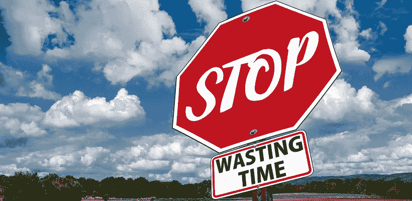
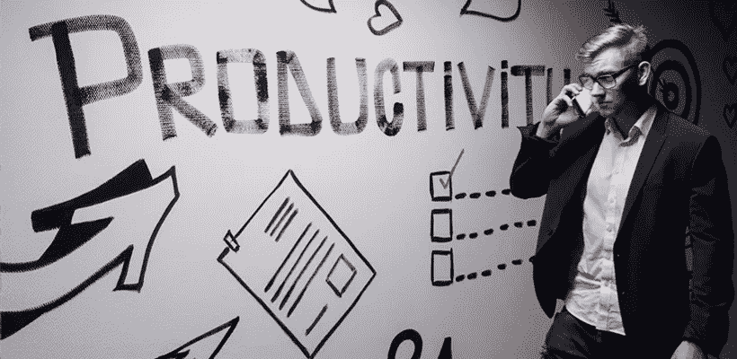

# 2019 年，9 个简单的工作效率提升 10 倍

> 原文：<https://medium.datadriveninvestor.com/9-simple-work-productivity-hacks-to-10x-your-time-management-in-2019-97376fa56c54?source=collection_archive---------22----------------------->

想加强你的时间管理…但不知道如何做？

这里有 9 个简单的工作效率窍门，你可以用它们来提高你的时间管理效率。

准备好了解。让我们开始吧。

# 1.在家工作(是的，提高您的工作效率)

认为在家工作是生产力杀手？

再想想。

斯坦福大学尼古拉斯·布鲁姆教授的一项试验表明，在家工作的员工比在办公室工作的员工更有效率。

事实上，布鲁姆发现在家工作的人生产率提高了 13.5%，休息时间更短，病假更少，休假时间更少。

坏处呢？他们感觉比办公室里的人更孤立。这就是为什么 Bloom 建议员工每周在家工作 1-2 天。

所以，为了提高你的工作效率，开始在家工作吧。

没有在家工作的政策？向你的老板展示这项研究。

毕竟，谁不想要更有生产力的员工呢？

接下来:

找出占用太多时间的任务。

# 2.找出占用太多时间的任务

事情是这样的:

你可能在任务上花费了过多的时间。

你看，工作扩大以填满完成它的时间。

如果你让一项任务花两个小时，它就会花两个小时。即使你实际上只需要一个小时。

所以记录下你的时间，看看每项任务花了多少时间。

您可以手动跟踪每项任务所用的时间。或者，使用在线时间追踪器，比如 [RescueTime](https://www.getminute.com/best-office-productivity-tools/) 。

这样，你就可以知道每项任务花费了多少时间，然后利用这些信息来优化你的日程安排。

怎么会？给每项任务分配更少的时间，看看你是否能更快地完成它们。

这样，你最终可以节省每项任务的时间。

接下来:

以正确的方式安排你的任务。

# 3.安排好你所有的任务(正确的方式)

那么，你如何在日常生活中保持高效呢？

简单:

使用日历来安排你所有的任务。

这样你总是知道下一步该做什么。没有宝贵的时间被用来决定下一个任务。

但是，事情是这样的:

不要把你的时间表看成是一个灵活的计划，而是坚持下去。

所以，如果你为一项任务安排了一个小时，那就用这个小时，不要再多了。

这样，你就能坚持使用你的时间表，并养成习惯。

如果你不确定一项任务要花多少时间，那就安排一些额外的时间，衡量一下你在这项任务上花了多少时间，并为下次做调整。

一旦你有了自己的时间表，并且坚持使用它？

你会对自己完成的工作量感到惊讶。

下一步是什么？最有效的工作效率技巧之一。

让我们开始吧。

# 4.建立一个系统来区分你的任务的优先级

事情是这样的:

当你在做你要做的事情时，你要确保你在做正确的事情。

否则，你会很忙……但你不一定在做能产生结果的事情。

你能做什么？

简单:

建立一个系统来帮助你优先处理正确的任务。

怎么会？

仔细想想——你的哪些任务能给你的时间投资带来最大的回报？

例如:

如果你从事销售工作，你的首要任务是那些直接带来更多销售电话和销售机会的任务。

确定任务优先级的方法是将每项任务标记为:

高优先级和紧急，高优先级和不紧急，低优先级和紧急，低优先级和不紧急。

前两类是优先级。后两个是你在完成其他任务后要做的事情。

看看这是如何不仅对你的生产力，而且对你的结果产生巨大影响的？

没错。

转到黑客#5:

利用你的日常节奏。

# 5.找出你最有效率的时候

你知道吗？

你的生产力取决于你的日常节奏。

所以，你应该根据你的节奏来组织你的一天。

怎么会？

你是早起的人吗？早上早起的人？

早上做你所有的行政工作。下午和晚上休息一下，你会更有创造力。

如果你在早上 7:30-8 点起床，这同样适用于你。但是在这里，你的日常节奏落后了几个小时。

如果你是一个熬夜和睡懒觉的人，你会想在晚上 9 点集中精力工作。你的创造性工作应该发生在早上。

所以想最大限度地提高你每天的工作效率吗？根据你的大脑处理不同任务的能力来计划你的一天。

现在，计划你的一天是一回事…

但是如果你真的想从你的工作中获得最大的收益，你需要记下下一次入侵。

# 6.有一个明确的目标(这样你就知道你要去哪里)

所以:

到目前为止，我们已经讨论了让你的日常工作更有效率的方法。

但是，要通过每天保持动力而真正富有成效，你需要有一个明确的目标。

如果你知道你要去哪里，你的日常任务会感觉容易得多。

设定目标的最佳方式是什么？

当然，你想有一个长期目标。比如每年或 5 年的目标。

但是这不会让你每天都有动力…因为你的目标看起来很遥远。

相反，设立一个 3 个月的目标。

在接下来的三个月里，你想完成什么？

那是你要给自己设立的目标。

有了这个目标，你将很快确定你每天需要完成的关键任务来实现这个目标。

此外，考虑到近期目标，你会更有动力有效地完成工作。

这就是有目标的原因…但是你如何成为一个真正有效率的人呢？

让我们找出答案。

# 7.成为一个高效的人

那么，如何成为一个高效的人呢？一个不需要完全依赖工作效率的人，但是每天都是高效的——无论如何。

好问题。

答案很简单:

训练你的思维变得富有成效。

我这么说是什么意思？

好吧，把最优秀的运动员和其他运动员区分开来的因素有几个。其中之一是他们专注于自己的心态。

例如:

2008 年，迈克尔·菲尔普斯在北京夏季奥运会上创造了一项世界纪录。他用装满水的护目镜做到了这一点。

怎么会？

感谢[可视化](https://www.amazon.com/The-Power-Habit-What-Business/dp/1400069289)的力量。他无情地想象他的表演，所以他不得不盲目游泳的事实对他的表演没有任何影响。

这说明你的情绪和思维在你的表演中起着很大的作用。

为了成为最有效率的自己，培养帮助你实现目标的形象化习惯。

此外，努力变得更有弹性，这样挫折就不会毁了你的一天。

怎么会？训练自己[变得更加专注](http://www.bbc.com/future/story/20140916-how-to-train-a-tougher-mind)。

但是有一个简单的技巧可能会帮你节省时间。

这是什么？

学会说不。

# 8.学会说不(不带坏心情)

现在:

你知道当你的同事用问题或电子邮件打断你时会有多让人分心。

事实上，普通上班族每 11 分钟就被打断一次。

中断后大约需要 25 分钟才能回到正轨。

所以，如果没有这些干扰，你可能会更有效率。

怎么会？

学会用正确的方式说不。

现在，说不是一种你可以培养的技能。

而且你可以用不得罪任何人的方式来做。

方法如下:

*   马上回答，这样对方就可以去别处寻求帮助或资源。
*   解释你为什么说不(简要地)。
*   为了给你的“不”加上最后一笔，加入一些其他的支持。例如，将它们推荐给其他人或发送一篇有用的文章。

这样，你就能确保你的日程没有任何不必要的干扰。

# 9.会议黑客

作为一个会议生产力工具，我们必须包括一个会议黑客，不是吗？

我们有。事实上，会议通常是任何组织中最没有效率的部分之一。

那么我们的会议是什么样的？

这是:

使用两个比萨饼规则。

只邀请你需要的人来分享披萨。

这就是杰夫·贝索斯在亚马逊会议上做的事情。

这也是确保你的会议保持小而有效的好方法。

# 你将如何使用这些工作效率技巧？

好了，这些是我们在工作中最好的工作效率技巧。

现在:

是时候实施你所学到的东西了。

请在下面的评论中告诉我:

你最好的生产力秘诀是什么？

与我们分享你的想法。

*原载于 2019 年 2 月 4 日*[*【www.getminute.com】*](https://www.getminute.com/work-productivity-hacks/)*。*