# 2019 年改变医疗保健的 9 家创业公司

> 原文：<https://medium.datadriveninvestor.com/9-startups-changing-healthcare-in-2019-cb45ec8a51d1?source=collection_archive---------10----------------------->

7 月，[我处理了玛丽·米克尔备受期待的 2019 年互联网趋势报告](https://www.futurehealth.live/blog/2019/6/13/meeker-2019-health-takeaways)中的所有 300 多张幻灯片，触及了一些突出的初创公司，包括 Zocdoc、Oscar 和 solv health——所有这些公司都在改变医疗保健的某些方面，无论是我们如何支付(Oscar)还是我们如何预约(Nurx)。

**以下是报告中提到的所有 9 家与健康相关的初创公司，并附有互联网趋势的幻灯片。**

 [## 大笔资金和尖端技术:人工智能/人工智能投资将如何革新医疗保健…

### 在过去几年人工智能(AI)和机器学习(ML)的显著发展中…

www.datadriveninvestor.com](https://www.datadriveninvestor.com/2018/03/22/big-money-and-cutting-edge-technology-how-investment-in-ai-ml-will-revolutionize-the-healthcare-industry/) 

# 1 —三叶草健康

Clover Health homepage

# 他们做什么:保险

[**Clover Health**](https://www.cloverhealth.com/en/)**(**[**@ Clover Health**](https://twitter.com/Clover_Health)**)**是一家保险科技公司，是一家医疗保险优势提供商，旨在通过收集和分析健康和行为数据来分析其客户的健康和行为数据，从而降低成本，以改善健康结果。

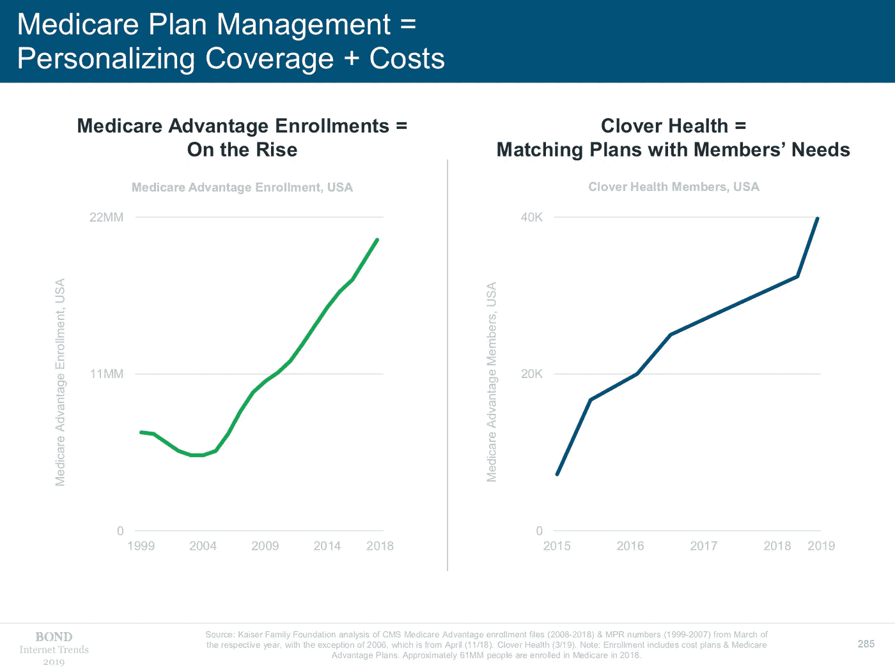

# 商业模式

作为一项医疗保险优势计划，Clover 的客户是美国政府。

# 阅读更多

TechCrunch: [字母表支持的医疗保险优势初创公司 Clover Health 筹集了 5 亿美元](https://techcrunch.com/2019/01/29/alphabet-backed-medicare-advantage-startup-clover-health-raises-500m/) (2019)

美国消费者新闻与商业频道:[字母表支持的 Clover Health 在意识到需要更多医疗专家后，正在削减技术岗位](https://www.cnbc.com/2019/03/27/clover-health-is-cutting-staff-to-make-room-for-more-health-experts.html)

# 2 —集体医疗

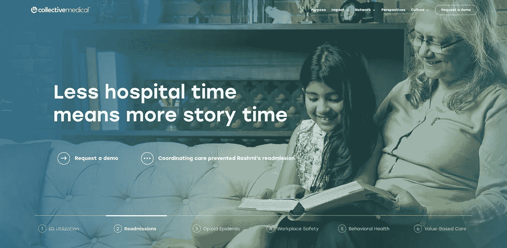

Collective Medical homepage

# 他们做什么:病人协调

[**集体医疗**](https://collectivemedical.com/)**(**[**@ Collective med**](https://twitter.com/collectivemed)**)**，由 Intermountain Health 提供部分资助，使用他们的专有软件为跨提供商的复杂患者提供节省成本的护理协调。

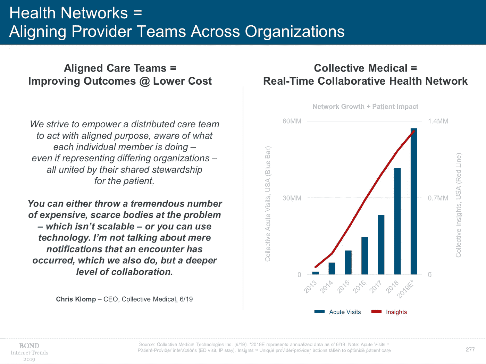

# 商业模式

卖给医院系统和付款人

# 阅读更多

福布斯:[集体医疗技术如何征服急诊室](https://www.forbes.com/sites/zinamoukheiber/2017/11/29/how-collective-medical-technologies-conquered-emergency-rooms-on-a-bootstrap/#195f93e46824) (2017)

# 3-Doximity

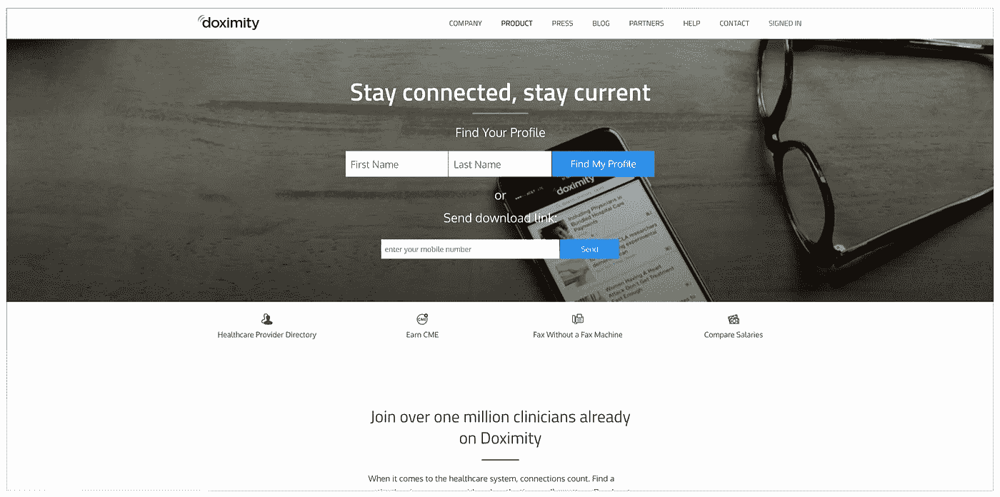

Doximity homepage

# 他们做什么:医生的社交网络

[**Doximity**](http://www.doximity.com/)**(**[**@ Doximity**](https://twitter.com/doximity)**)**是一个面向医生的社交网络，旨在成为医学界的领英。

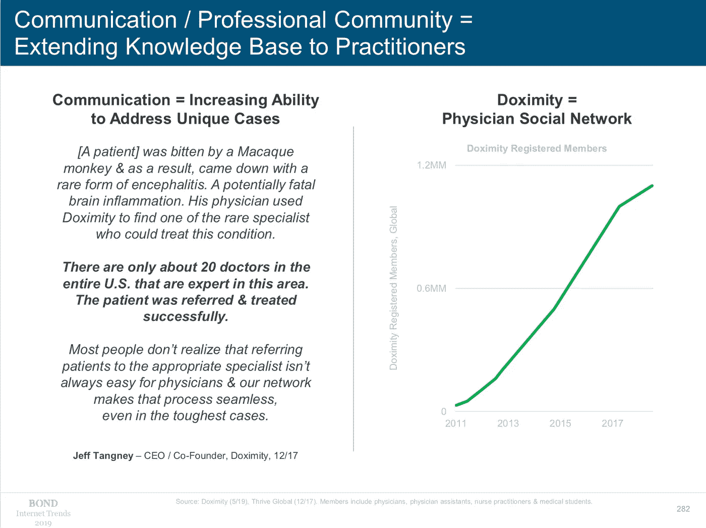

# 商业模式

广告

# 阅读更多

新闻稿: [Doximity 连续第三年入选德勤 2018 年科技 500 强](https://www.prnewswire.com/news-releases/doximity-selected-for-deloittes-2018-technology-fast-500-for-third-consecutive-year-300752041.html) (2018)

# 4-Nurx

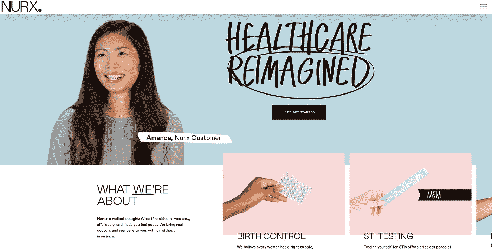

Nurx homepage

# 他们做什么:远程医疗

[**Nurx**](https://www.nurx.com/)**(**[**@ nurxapp**](https://twitter.com/nurxapp)**)**是一个基于 app 的生殖健康处方服务:节育、艾滋病毒准备、人乳头瘤病毒筛查等(这里没有人工智能，只是远程医生审查患者健康并开具处方)。“节育的优步”

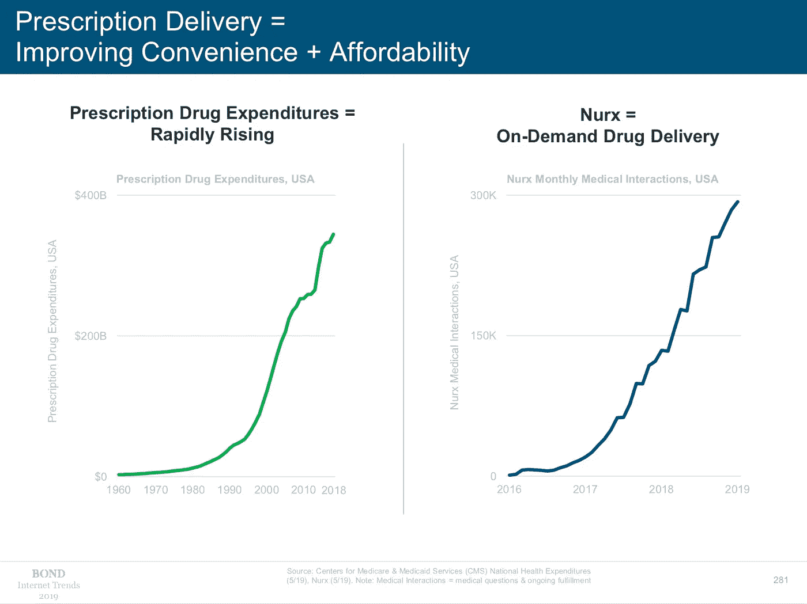

# 商业模式

直接给消费者，保险和病人共付报销。

# 阅读更多

TechCrunch: [按需节育分娩初创公司 Nurx 从联合广场风险投资](https://techcrunch.com/2016/11/03/on-demand-birth-control-delivery-startup-nurx-raises-5-3-million-from-union-square-ventures/) (2017 年)筹集了 530 万英镑

# 5 —奥斯卡

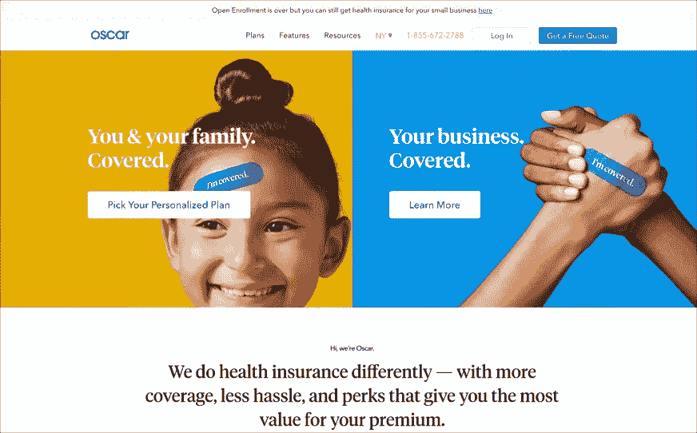

Oscar homepage

# 他们做什么:保险

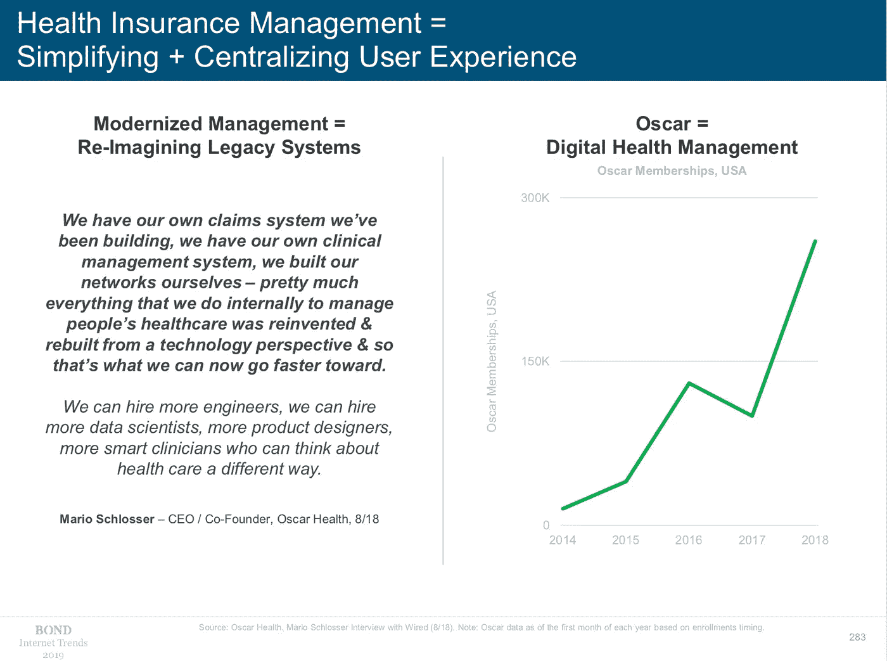

[**Oscar**](https://www.hioscar.com/)**(**[**@ Oscar health**](https://twitter.com/OscarHealth)**)**——提供简化的健康保险计划、理赔、覆盖范围——以及日程安排和其他工具，旨在利用技术改善保险体验(“insuretech”)。

# 商业模式

两个收入来源:(1)那些需要健康保险但没有被其他计划覆盖的人，以及(2)支付患者费用的医疗服务提供者。[更](https://www.investopedia.com/articles/markets/100215/how-does-oscar-work-and-make-money.asp)。

# 阅读更多

贝克斯:[关于奥斯卡健康需要知道的十件事](https://www.beckershospitalreview.com/payer-issues/10-things-to-know-about-oscar-health-a-view-of-the-company-6-years-after-its-founding.html) (2018)

# 6 —拉力赛健康

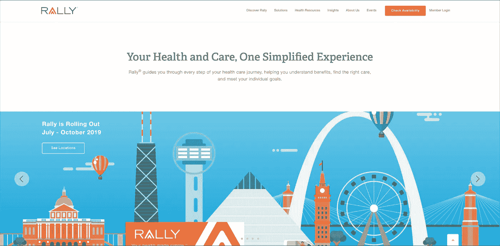

Rally homepage

# 他们做什么:卫生协调和激励

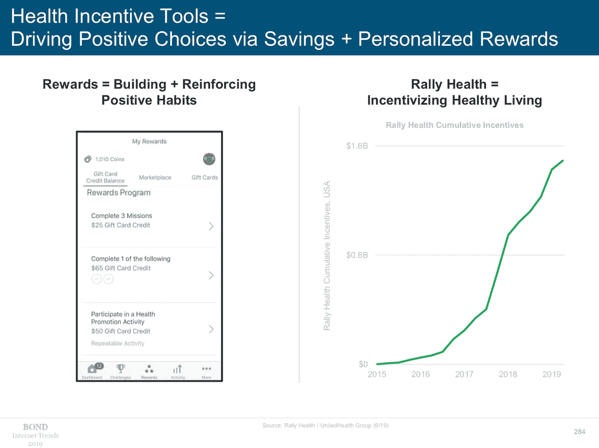

[**Rally Health**](https://www.rallyhealth.com/)**(**[**@ Rally _ Health**](https://twitter.com/rally_health)**)**通过为医疗保健、健康和其他健康相关活动提供单一界面，简化了医疗保健体验，同时为健康行为提供奖励系统。

# 商业模式

由雇主支付，作为福利。[更多](https://www.quora.com/How-does-Rally-Health-make-money)。

# 阅读更多

财富:[一个 27 岁的大学辍学生如何简化医疗保健](https://fortune.com/2016/10/13/college-dropout-health-care/) (2016)

# 7 — SolvHealth

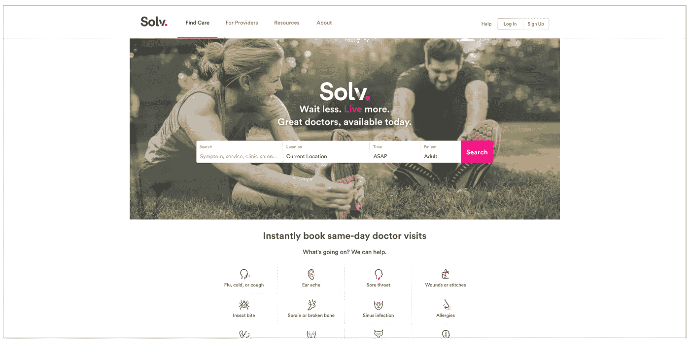

Solv homepage

# 他们做什么:日程安排和病人交流

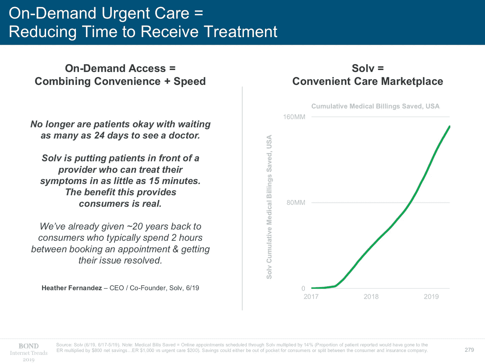

[**Solv Health**](http://www.solvhealth.com/)**(**[**@ Solv Health**](https://twitter.com/solvhealth)**)**想要成为“紧急护理的 OpenTable”，通过向紧急护理中心出售一个简单的预约和患者通信系统——将患者从更昂贵的急诊部门转移出去。

# 商业模式

销售给紧急护理中心，并计划增加其他类型的护理

# 阅读更多

《财富》:[这家初创公司希望成为紧急护理的 OpenTable](http://fortune.com/2017/04/19/solv-urgent-care/)(2017)

# 8 — Teledoc

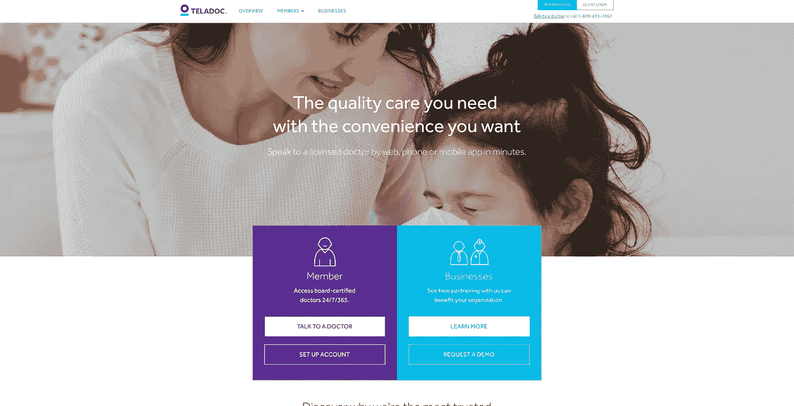

Teledoc homepage

# 他们做什么:远程医疗

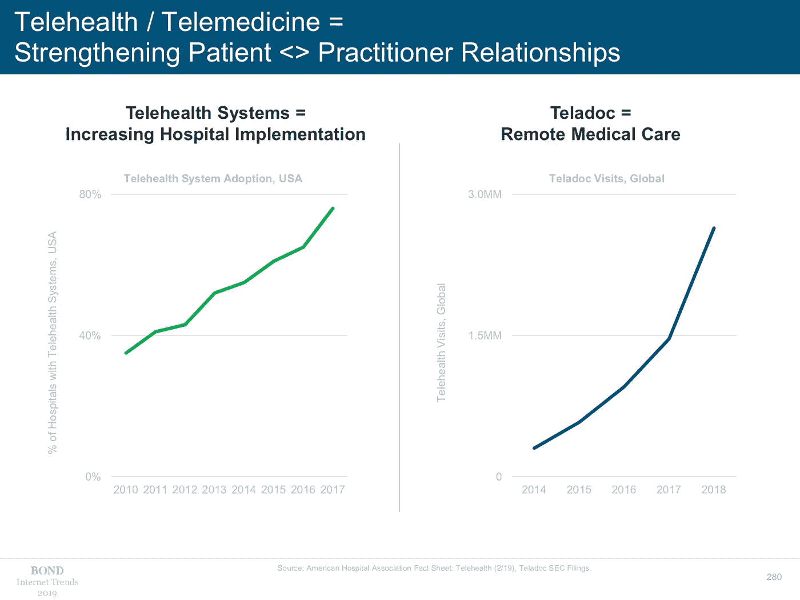

[**Teladoc**](http://www.teladoc.com/)**(**[**@ teladochealth**](https://twitter.com/TeladocHealth)**)**让你“在几分钟内通过网络、电话或移动应用程序与执业医生交谈”，只需 45 美元的固定费用。如果需要的话，医生可以把处方送到当地的药店。

# 商业模式

由雇主(作为员工福利)和保险公司(作为成本节约者)支付的每月收费订阅

# 阅读更多

Barrons: [Teladoc 的股票因其在线治疗品牌](https://www.barrons.com/articles/teladoc-stock-betterhealth-online-therapy-brand-buy-rating-51560433939?refsec=health) (2019)的乐观情绪而上涨

# 9 — Zocdoc

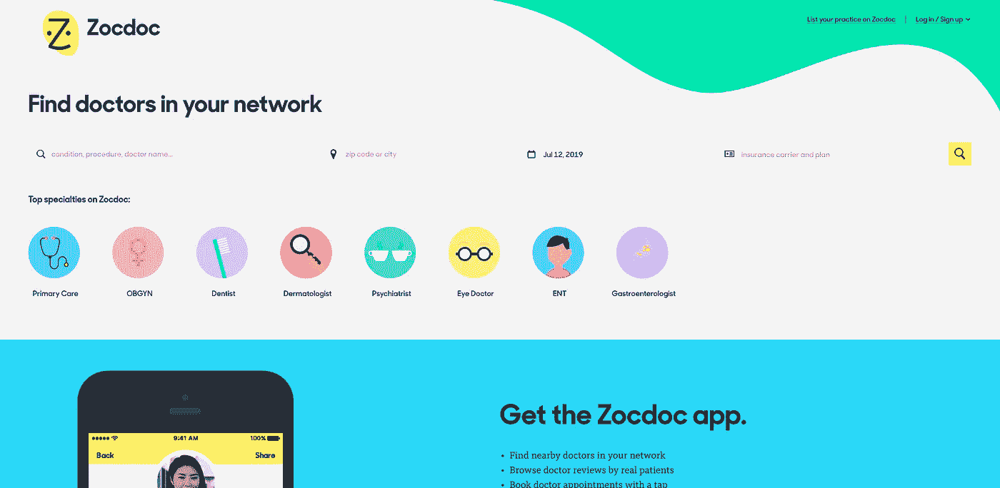

Zocdoc homepage

# 他们做什么:日程安排

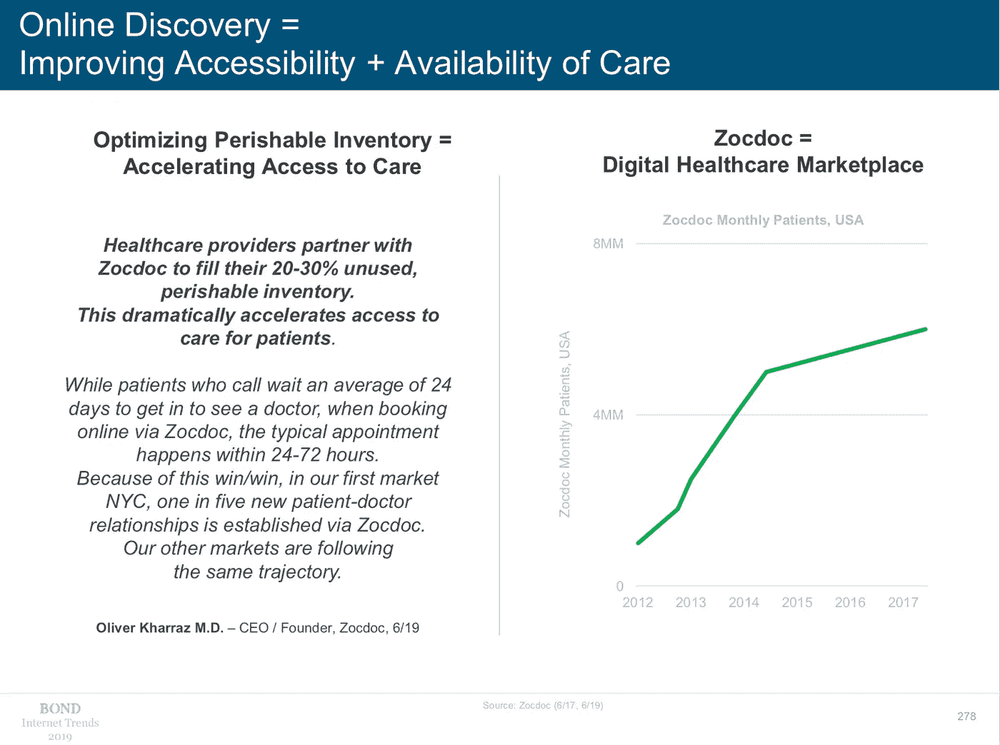

[**Zocdoc**](http://www.zocdoc.com/)**(**[**)@ Zocdoc**](https://twitter.com/Zocdoc)**)**与 Solv 一样，希望提供更容易的预订，并且很容易卖给提供商(他们支付订阅费)，因为 Zocdoc 帮助他们“填充他们在时间表中未预订时段的 20-30%未使用的、易腐烂的库存”。

# 商业模式

直接面向消费者、保险和患者共付报销。

# 阅读更多

财富:[保持 Zocdoc 成功的商业计划](http://fortune.com/2017/06/29/zocdoc-online-booking-health-care/) (2017)

*本故事最初发表于*[*future health*](https://futurehealth.live)*。*