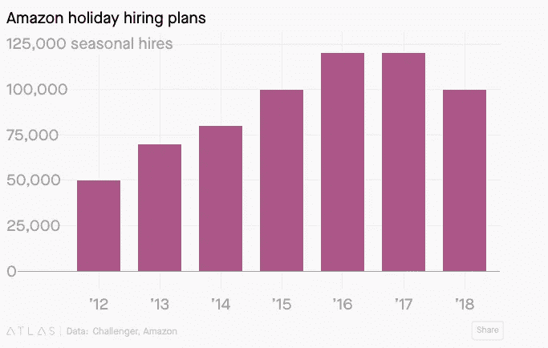
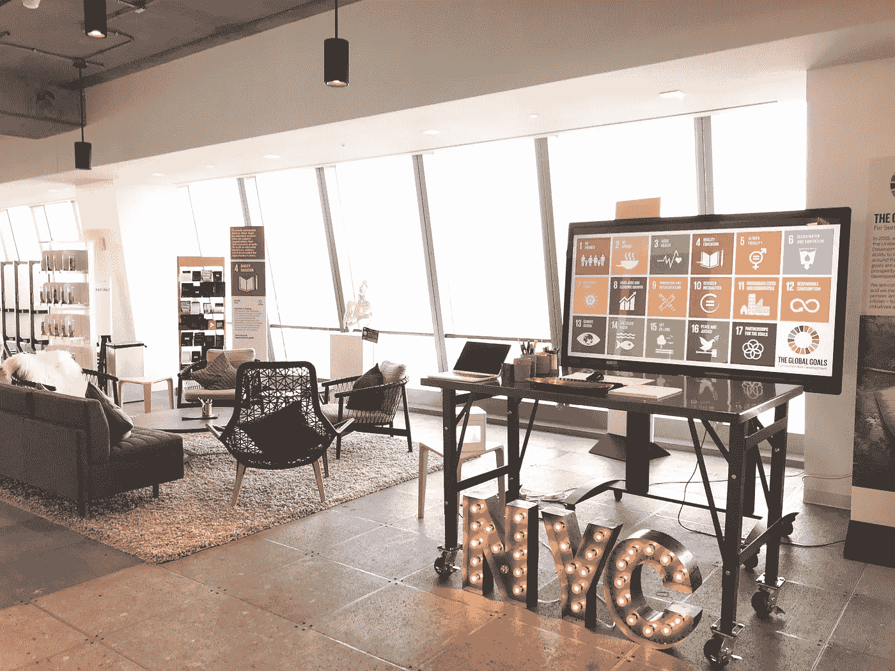
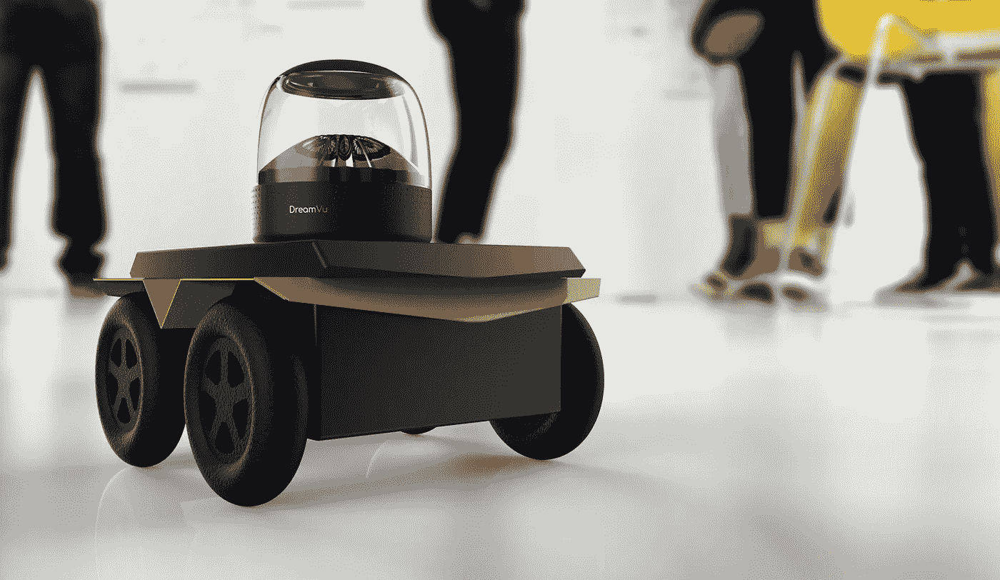
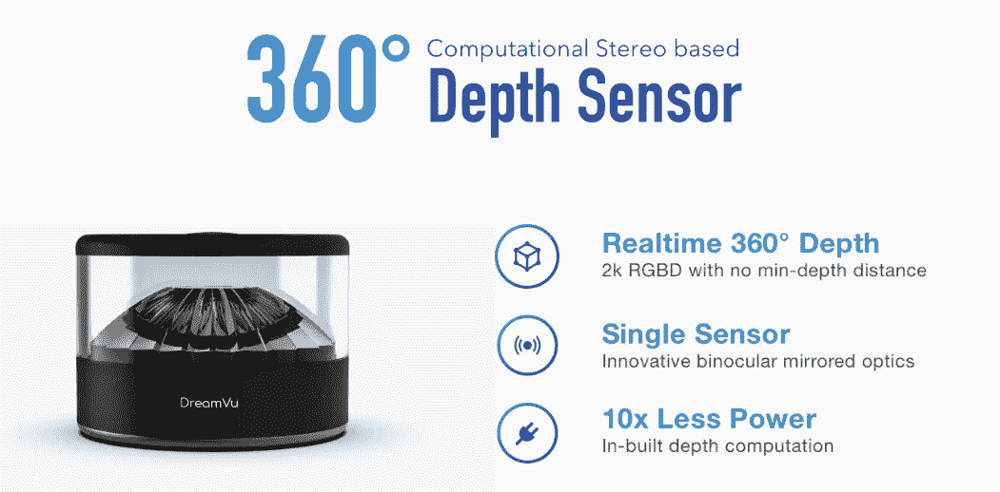
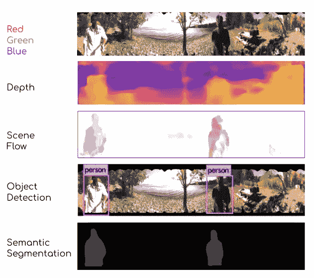

# 孵化机电一体化的 360 度视角

> 原文：<https://medium.datadriveninvestor.com/a-360-degree-view-of-incubating-mechatronics-a25b223cc340?source=collection_archive---------11----------------------->

上个月，私募股权巨头黑石集团[宣布](https://www.bloomberg.com/news/articles/2019-09-30/blackstone-to-buy-colony-capital-warehouses-for-5-9-billion)以 59 亿美元收购 Colony Capital，这笔交易包括 465 个设施中 6000 万平方英尺的仓库空间。据报道，黑石集团目前在全球范围内管理着价值超过 2500 亿美元的资产，在收购 Colony 之前，该集团还收购了新加坡的 GLP 和格拉梅西地产公司(Gramercy Property)。这一最新的履行中心组合使黑石控制了超过 4.4 亿平方英尺的配送中心。本周，物流竞争对手 Prologis 以 126 亿美元收购了[的 Liberty Property Trust，使他们现在能够管理超过 5.7 亿平方英尺的工业用地。](https://www.wsj.com/articles/blackstone-and-prologis-battle-for-fast-shipping-leadership-11572955205)

在解释这一积极举措时，黑石总裁乔纳森·格雷说，“我们一直是世界各地仓库的大买家，可能购买了 700 亿美元，前提是商品正从实体零售转向在线零售。”格雷战略最好的(也是最讽刺的)实现可能是亚马逊最近在[将全国各地的封闭商场](https://www.cbre.us/research-and-reports/trading-places-retail-properties-converted-to-industrial-use?utm_source=prcomms&utm_medium=newsrelease)转变为履行中心的举措。

 [## 为什么亚马逊要吞并失败的购物中心

### 随着实体零售业的衰落，商业房地产开发商剩下了大量被遗弃的…

www.wsj.com](https://www.wsj.com/video/why-amazon-is-gobbling-up-failed-malls/FC3559FE-945E-447C-8837-151C31D69127.html) 

随着越来越多停滞不前的房地产转变为熙熙攘攘的电子商务中心，雇佣熟练劳动力变得越来越具有挑战性。用劳工管理执行官 Peter Schnorbach 的话来说，“过去每个月，企业都会解雇最底层的 10%，用新人取而代之。那已经不管用了，因为你无法取代他们。”自从收购了 Kiva Systems 之后，亚马逊一直在积极地将其劳动力从人手转变为机械人。今天，这家价值万亿美元的公司在全国 175 个配送中心雇佣了超过 10 万个机器人。

 [## 模式和机器人:复杂的现实|数据驱动的投资者

### 哈耶克的名著《复杂现象理论》(哈耶克，1964)深入探讨了复杂性的话题，并断言…

www.datadriveninvestor.com](https://www.datadriveninvestor.com/2019/03/04/patterns-and-robotics-a-complex-reality/) 

根据劳工统计，该零售商 2016 年和 2017 年的季节性员工分别为 12 万和 15 万名工人。2018 年，这一数字下降到 10 万左右，许多人预测 2019 年可能会进一步下降，尽管今年的假日在线消费预计将飙升至 1400 亿美元以上(增长 14%)。

除了将关闭的购物中心重新打造成充满活力的商业仓库，亚马逊还投入大量资金孵化独家机电一体化发明。昨天，它宣布投资 4000 万美元在马萨诸塞州的韦斯特伯勒建造一个新的 35 万平方英尺的“机器人创新中心”。新闻稿大胆宣称这座工业建筑是“公司机器人技术创新的中心”亚马逊机器人公司的首席技术专家泰·布雷迪(Tye Brady)解释说，新的结构将能够将其所有的自动化实验室和制造车间整合到一个目的地，将“设计、制造、编程和运输我们的机器人，所有这些都在同一个屋檐下。”多年来，这家电子零售商举办了“挑选挑战”，邀请全球各地的机器人专家参加比赛，解决该公司最困难的履行问题。去年，这个一年一度的活动神秘地消失了，并作为一个提交科学研究拨款提案的[在线平台](https://ara.amazon-ml.com/index.html)重新出现(使亚马逊能够第一时间看到最新的学术突破)。

在企业创新的世界里，有戏剧，然后是实践开发。在前一种情况下，创新部门通常位于一个建筑精美的陈列室中，配备最新的小工具，并配有热情的大学演示者。不幸的是，有太多的这些企业演员急切地扮演技术侦察员的角色，以达到低调的宣传目的。杰夫·贝索斯的公司反对这些舞台作品。亚马逊模式的最佳例证是 2015 年推出 1 亿美元的 Alexa 基金，以加速其 Echo 音箱的生态系统。虽然苹果的语音应用程序 Siri 在 2011 年在数百万部 iPhones 中发布，但 Alexa 很快成为事实上的家庭语音助手，出货量超过 100 亿部，具备 7 万种语音功能。今天，超过 150 种产品内置了 Alexa，超过 28，000 台智能家居设备与 4，500 家制造商制造的 Alexa 兼容。这一战略的关键是认识到开发社区的影响，以及他们在原始设计之外以新的创造性方式进行创新的新观点。作为其成功的进一步证明，Alexa 基金已经增长到 2 亿美元，以扩大其“Alexa 无处不在”的目标。由于布雷迪的团队旨在用最新的机器人技术进步填充韦斯特伯勒物业，可以采用类似的基金模式来超越沃尔玛、沃尔格林和其他最近提升了创新游戏的零售商。六月，沃尔玛雇佣了前 Rethink Robotics 的斯科特·埃克特来管理其新泽西孵化器[8 号店](https://www.storeno8.com)的“下一代零售”部门，去年一月，沃尔格林[与微软合作。](https://news.walgreens.com/press-releases/general-news/walgreens-boots-alliance-and-microsoft-establish-strategic-partnership-to-transform-health-care-delivery.htm)

作为一名早期投资者，我每天都被淹没在夸大其销售的宣传中，吹嘘他们的试点项目清单。精明的管理者非常清楚，将这些概念证明转化为经常性收入是一条漫长而艰难的道路，需要大量的资本和时间才能取得成功。为了指导创始人完成这一过程，我指导他们将试点项目与潜在客户的收入里程碑联系起来。虽然亚马逊、沃尔玛和其他大型零售商能够预算大笔支出来实现仓库自动化，但大多数美国运营商发现机器人难以企及，因为单位经济效益仍超过其员工的年薪。虽然长期机器可以连续运行(没有医疗保健和工人补偿)，但在现实中，机器人部署需要在持续维护、物理设备升级和员工培训方面进行额外投资。设备安装应该与增加工人产量挂钩，以成倍增加收入，从而提高完成率，而不是将机器作为小时工资的直接替代品。

作为纽约大学[无尽前沿实验室](https://endlessfrontierlabs.com/)的深度技术领域的导师，我见过两家专注于开发技术以降低自动化单位经济的初创公司——[wheel . me](https://robotrabbi.com/2019/10/28/wheelme/)和 [DreamVu](https://dreamvu.com/) 。三周前，我详细介绍了 wheel.me 的电动脚轮，它有可能将任何木制托盘转变为无人系统。本周，我采访了 DreamVu 的首席执行官 Rajat Aggarwal，他开发了一款名为 PAL 的 360 度视觉传感器，价格仅为其他传感器的一小部分。Aggarwal 描述了他的发明是如何改变金融模式的，“目前，传感是扩展的瓶颈。我们强烈需要这样一种视觉传感器，它可以消除对多个传感器的需求。高度混乱和动态环境中的自主导航、遥控操作和态势感知是 PAL 最适合的关键应用。”与利用 GPS 的自动驾驶汽车不同，室内机器人完全依靠传感器在周围环境中导航。迄今为止，在仓库周围移动纸箱的无人漫游车已经被昂贵的传感器所拖累，以捕捉其在设施内的空间理解，以避免与人类和其他设备发生碰撞。

在将他的解决方案与其他产品进行比较时，Aggarwal 自豪地说:“PAL 在成本、计算和电力需求方面比其他竞争传感技术具有多倍优势。”虽然许多现有的机器人装置严重依赖于由激光雷达启动的导航，每个传感器花费数千美元，但他认为这些设备“考虑到它们的高价位、更远的范围和压倒性的精度，是多余的。”为了大规模推出自动化，集成商需要“关注可制造性、可扩展性以及在为人类设计的世界中运作的能力。”这位技术专家进一步声称，“为了实现完全的自主，我们需要情境意识，这不仅是完全的，而且是非常快速的。我们必须将这种感知扩大到数百万个机器人。传感成本必须降低。DreamVu 的光学技术简化了我们习惯于捕捉不同类型数据(2D 图像、3D 图像、3D 点云)的方式，然后将这些数据融合到一个复杂而沉重的人工智能引擎中。”

今天的物流市场是其他自治领域的先驱。Aggarwal 分享了他的长期展望，“到 2024 年，将有 7900 万人在家中拥有机器人。这些机器人将需要在杂乱和动态的环境中自主操作。360 度深度感应非常关键。市场上没有其他解决方案能够在给定的价位(< 50 美元)和硬件规格下提供所需的输出。”他继续说道，“在未来 5 年，我们看到自己进入无人机、智能家居、智能手机和内窥镜市场，在所有情况下提供可负担得起的 360°感测。我们即将推出的产品具有超高分辨率和更高的深度范围，可以在室内和室外环境下工作。我们已经在智能城市(零售、建筑)和智能监控用例中进行了早期试点。”Aggarwal 没有向投资者推销公司徽标的拼贴画，而是沿着亚马逊的道路，为开发人员社区提供强大的工具，“我们的客户很高兴看到一种围绕传感的新方法，他们可以使用我们的评估套件进行尝试，这些评估套件可以订购。无缝的硬件和软件集成使他们能够非常快速地测试传感器，并缩短产品开发时间。”这位企业家乐观地预测，“如果感应正确，人工智能将更加准确，因此机器人将更加高效和健壮。”今年假期，DreamVu 和一系列其他技术将首次亮相仓库，使拣货员能够以创纪录的速度(和利润)包装订单。