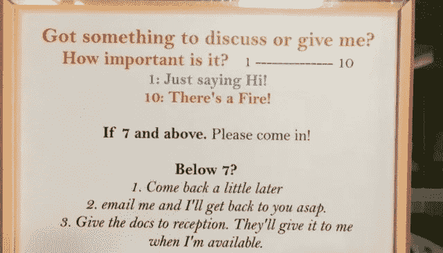

# 限制干扰的 4 步技巧

> 原文：<https://medium.datadriveninvestor.com/a-4-step-technique-to-limit-interruptions-7f01463ff0cc?source=collection_archive---------22----------------------->

Photo by [Michael Mroczek](https://unsplash.com/photos/iC2imdhnPac?utm_source=unsplash&utm_medium=referral&utm_content=creditCopyText) on [Unsplash](https://unsplash.com/search/photos/stop-sign?utm_source=unsplash&utm_medium=referral&utm_content=creditCopyText)

我认为我们生活在一个工作被打断的世界里并不奇怪。在收到通知(电子邮件、What's app、内部网、pick your flavor)和人们进来之间，大多数办公室工作人员不得不在完成工作之前停下手头的工作，以便对同事突然出现的事情做出回应，这并不罕见。

我曾经计算过，每 2.5 分钟就会有人打断我，要求我关注一些事情。虽然有时候，这是一件好事，但有很多时候，它可以，也应该等待。

Theo Compernolle 在他的书 Brainchains 中展示了一项研究，根据这项研究，超过 40%在工作中被打断的人在处理完中断后不会再回来。任务越复杂，或者对能量的需求越大，我们就越不会回头。

因为我们知道要恢复到同样的注意力水平需要很大的努力(Compernolle 还表明，恢复到中断前的注意力水平需要 2 到 25 分钟)。

所以，每 2.5 分钟中断一次是很多的，我必须做点什么。

诀窍是:我想在办公室里重新获得长时间不受打扰的时间，同时允许被打扰，但只是在值得的时候。

所以我想出了这个简单的系统，4 个步骤，到目前为止，这个系统对我来说非常有效，对其他和我分享过这个系统的人来说也非常有效。

## 1/定义你不在的罕见的短时间。

很简单，对吧？这一步重要的是两个字:“难得”和“短”。向你的同事和员工(甚至客户，为什么不呢)传达的理念是，你大部分时间都是有空的。但有时候，不是。这没什么大不了的，因为这些时间不会经常发生(想想一周一次或两次)，也不会持续很长时间(一到两个小时)。如果有人非常不幸，需要你的关注，那个人最多要等 2 个小时。

我有时会看到人们长时间频繁地堵住“紧闭的门”。如果你总是没空，你认为人们什么时候会来找你？一直都是！他们的推理大概是这样的:“反正永远都不是合适的时机，所以为什么不是现在呢”。

## 2/放一个标志让其他人知道

你必须在远处警告人们你没空。这只是为了避免“咚咚，我能打断你一下吗？”你已经做了。

我想避免这种情况，不仅因为这确实是一种打扰，尽管我可以告诉那个人以后再来，而且因为在社交层面上，我倾向于做一个好人，对许多事情说是。因此，如果我的同事在问任何问题之前就被拦住，那就更好了。

所以，让他们远远地知道你没空(但这没什么大不了的，因为这种情况很少见，而且不会持续太久)。

## 3/沟通！

这听起来不言自明，但事实并非如此。除非你告诉人们你的新系统，否则他们是猜不到的。你也不想在他们打断你的时候告诉他们，因为他们没有看到你放好的标志。

我们是社会动物，即使在工作场所也是如此。请注意，所以你必须向任何人宣布你建立了这个系统，在一周中你会有很少很短的时间不在，但他们可以在其他时间来找你做任何事情。

## 4/标度系统

现在说核心问题。在某些情况下，这是你允许被打断的地方。当向可能受到影响的人宣布你的这个新的小行为时，告诉他们从 1 到 10 对他们想要打断你的事情的重要性进行评级；1 是闲聊，10 是有人想从屋顶跳下去。

当你看到我放了一个标志，表明我在那个(短暂而罕见的)不想被打扰的时刻，我请你对你想见我的事情的重要性进行评级，如果低于 7，我请你等我再次有空。只要进来或轻拍我的肩膀，如果那是上面的话。

这是我的一个合作伙伴在印度实施的这个系统的一个例子。

The Scale System

## 和平之岛

我第一次这么做的时候，我对自己说“伙计，从现在开始一切都要变成 7 分了”。幸运的是，我大错特错了。人们真的很擅长估计他们想见你的目的的重要性。

当然，我有一些 8 实际上是 3，但很少，这也是一个很好的机会进行对话，说明为什么这确实是 3。

这里的好处是，几个月后，我再也看不到任何低于 4 的东西。人们自己对那些事情负责！我得到了宁静、不受干扰的时间。

如果你决定在你的工作场所实施，告诉我你是怎么做的，我很乐意完善这个系统。