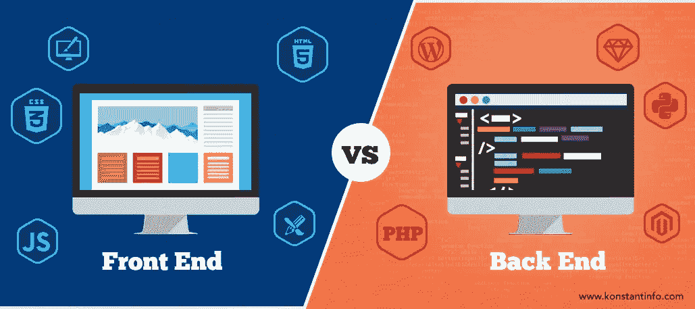

# 前端网页设计的后端视图

> 原文：<https://medium.datadriveninvestor.com/a-back-end-view-of-front-end-web-design-fb89a0a220ae?source=collection_archive---------21----------------------->

> **原载于编码鸭博客:**

**因此，昨天我发布了关于勉强满足最后期限的内容，您可以在这里找到[今天](https://dev.to/kaelscion/beating-the-clock-h0a)，我将向您介绍我多年来对前端开发的看法。**

**首先，网页设计是如何发生的？当 HTML 是众多可供选择的标记语言之一时，谁是第一个学习 HTML 的人，并认为“你知道，我现在已经在 Pac Bell 工作了一段时间，人们真的很喜欢我正在做的工作；我受到尊重和钦佩，人们真的很喜欢我正在建造的东西。老实说，我有点厌倦了。另外，我昨天部署的软件中的那个巨大的错误搞垮了美国领先公司的基础设施，而他们甚至没有生气！我想在时间和预算之内，做一些人们讨厌的项目，即使我完全按照他们的要求去做。如果有人每天给我打电话，坚持说某件武断的事情毫无理由地是错误的，那也是件好事。我在想，只有每天能和别人就绿色的深浅争论至少 6 个小时，我才会真正快乐。”但这就是全职 web 开发人员生活的世界！先说清楚，我绝对不会自称是前端设计师或者开发人员，至少不是真的。我也不会被认为是“全栈”。我是一个后端开发人员，简单明了。我的职业生涯从 C#开始，进展到 Python，目前正在尝试在 Julia 中复制 Flask 框架。不要误解我的意思，我们后端人员也是代码受虐狂(参见前面提到的将 web 框架移植到旨在用于数据中心管理和数据科学的语言的参考资料)，但是你们这些全职前端人员是如何做的呢？**

**我和妻子工作的大多数客户都是企业，所以我们的大部分开发都是系统自动化、与现有技术的集成，或者为 B2B lead gen 或“API”构建 web-scrapers，以帮助没有技术人员的小企业可靠地相互共享服务和数据。不用说，这是非常“后端”的工作。但是，正如我在以前的帖子中提到的，我们确实经常接受前端合同。但是这些合同通常会采用一个已经建成的网站，并在响应能力、外观和性能方面对其进行升级。如果我们不得不处理:“我有一个业务的想法，但不知道我希望网站看起来如何，行为如何，或者使用什么颜色。我也没有一个标志或任何字体偏好。能帮忙吗？”我们可能会退出。所以，下一次你的公司让你的架构人员走出地下室，找到你的前端团队，给他们一个拥抱。还要反复告诉他们“这不是你的错”，因为相信我，他们需要。**

**在我看来，发展的有限元和边界工程之间的主要区别在于，边界工程的小误差在某种程度上比有限元的小误差更容易被接受。出于某种原因，公司(尤其是中小型公司)对事情可能不总是正确工作这一事实没什么意见，但如果他们的表单提交按钮有
"padding-right: 1rem "而不是他们"可以发誓他们明确要求的" padding-right: .95rem "，就会煽动一群人冲进你的工作室。以我个人的经验来看，我认为这主要是由于我们都被品牌理念和“如果它闪亮，我就买”的文化所欺骗。想一想；为什么其他人更关心他们的网站/应用看起来如何，而不是如何工作？我错过了什么吗？难道你不认为色彩理论对你的顾客来说没有他们付费使用的系统的实际功能重要吗？**

**在很大程度上，我认为网页设计很大程度上是一个“计算东西”的游戏。许多软件开发都围绕着边缘案例，但在美学上这是疯狂的。我曾经有一个网络客户告诉我，他们的网站不像他们希望的那样响应迅速。我准备帮助他们，问他们在什么设备上试过。他们回答说，“在谷歌浏览器中，我使用了响应标签，在某一点上它变得很奇怪。”**

**我的天啊。嗯，我一直在使用 Chrome 中的响应工具，我一定是错过了那个屏幕尺寸。"响应窗口破裂时的像素大小是多少？"我问，他回答说:“185 像素乘 225 像素”。接下来的沉默让我很不舒服，因为我试图判断他是不是在耍我。我决心表现得专业一点，告诉他“好吧，你不用担心这个。这个屏幕尺寸大约相当于一个小型智能手表的大小。”**

**“是啊，我知道。”他回答说，“但可穿戴设备是下一个大趋势，所以我想把它修好。”**

**我就不跟你说接下来的对话了，在那次对话中，我决定放弃成为专业人士的决心，这样就没人会有任何可能损害他们职业生涯的想法。作为背景，这个人拥有一家汽车经销店。即使你能浏览，也很难找到你想在手表上浏览的网站。第二，他一直是皇家的痛苦，无视我们的工作范围合同一次又一次，而支付他的发票至少晚了 30 天，所以，足以说，我已经准备好切断他无论如何。**

**这个故事的寓意是，前端很难。我帮助设计了 ML 软件，编写了每天可以收集数万次数据请求的网络爬虫，并喜欢保留一些爱好，比如在缝进帽子之前将耳机扬声器焊接到蓝牙上，以及为我的狗制作自动治疗弹射器。但是设计一个反应灵敏、快速、易于使用的界面，让你的客户在第一次尝试时就喜欢上它...那是一头我想我永远也驯服不了的野兽。向你们这些全职设计师、前端 web 和 UI/UX 人员致敬。我希望你喜欢你的工作，因为我当然不喜欢你的工作**