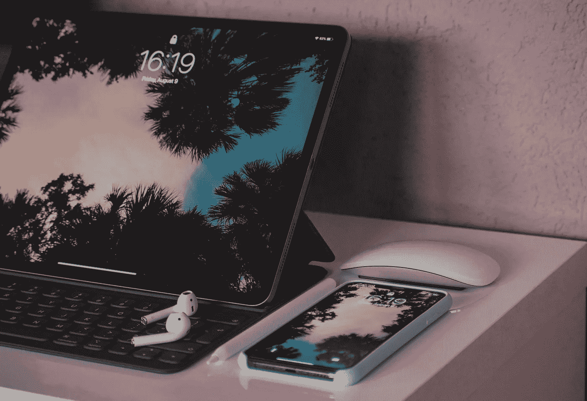
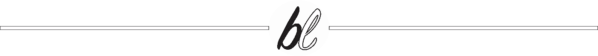

# 害群之马

> 原文：<https://medium.datadriveninvestor.com/a-bad-apple-f407c688c0b1?source=collection_archive---------16----------------------->

## 为什么这位苹果粉丝对最新发布的 iPhone、iPad 和 Apple Watch 不感兴趣

Photo by [Alexandar Todov](https://unsplash.com/@alexandar_todov) on Unsplash

昨晚苹果终于公布了他们最新的 iPhone 阵容——iPhone 11、iPhone 11 Pro 和 iPhone 11 Pro Max。

为了配合它，他们发布了一款新的 10.2 英寸 iPad，取代了 9.7 英寸的 iPad，这将是 iPad 系列中入门级和最便宜的 iPad。

 [## 苹果会成为新的网飞吗？数据驱动的投资者

### 有可能。然而，该公司肯定会与大公司竞争。许多人不得不看到这一天的到来…

www.datadriveninvestor.com](https://www.datadriveninvestor.com/2019/02/15/will-apple-be-the-new-netflix/) 

同时发布的还有取代系列 4 的 Apple Watch 系列 5。系列 3 仍然保留，但现在价格低得多。

那么，这位苹果粉丝对最新的公告有什么看法呢？

咩。

不要误解我。

我仍然是苹果的忠实粉丝。我为什么这么说？因为，尽管大多数苹果产品的价格都高于大多数国家(包括我的国家)的最低工资标准，我还是会买，尽管不是最高规格的。

目前，我正在使用 iPhone XR、MacBook Air、iPad Mini 和 Apple Watch Series 1。这是我目前的经济状况允许我做的。

我会喜欢使用 iPhone XS 吗？当然了。

我会喜欢使用最高规格的 MacBook Pro 吗？绝对的。

我会喜欢使用最高规格的 iPad Pro 吗？没错。

我会喜欢把 Apple Watch Series 4 绑在手腕上吗？哪个苹果粉丝不会？

但是对于一个收入仅略高于 iPhone XS Max 的人来说，不卖掉一个或两个肾几乎是不可能的。)在黑市上。

尽管如此，更多像我这样经济状况的苹果粉丝涌入苹果商店，购买最新最好的苹果产品。一旦今年 9 月 27 日最新的 iPhone 11 系列上市，我不会感到惊讶。

但是你知道哪个苹果粉丝不会去吗？

我。

还有更多！

答根据[做的调查](https://fortune.com/2019/02/21/apple-iphone-sales-2018/)，iPhone 的销量一直在下降。我并不奇怪它为什么会下降。如果你看看自 iPhone 6 发布以来，后续机型的发布并没有太多值得称道的地方。

iPhone 6，6s，7，8 都是一样的设计，只是处理器稍微好一点，性能提升了。没什么突破性的东西。

iPhone 7 Plus 和 8 Plus 增加了双摄像头，但三星和华为等其他公司很久以前就已经这样做了。

最新的 iPhone 11 和 11 Pro 拥有一个三镜头相机，但同样没有真正的突破。其他公司的手机上有 4 个甚至 5 个镜头的摄像头。

苹果可能在很多事情上仍然做得更好，但他们率先推出突破性技术的日子已经一去不复返了。

是的，他们仍然在做一些其他人最终会效仿的事情，比如移除 3.5 毫米耳机插孔或转向顶级屏幕。尽管其他公司嘲笑苹果这么做，但他们最终也效仿了，三星最近秘密撤下了所有嘲笑苹果移除 3.5 毫米耳机插孔的视频。他们不得不这么做，因为最新的三星 Galaxy Note 10 也做了同样的事情。

但是除此之外，苹果已经很久没有革命性的东西了。

他们的产品仍然是最可靠的产品之一，我喜欢他们的生态系统。能够在一台设备上开始一些事情，并在另一台设备上继续，这是我会继续购买苹果产品的原因。我也喜欢他们的设计和操作系统界面。

这实际上可以归结为用户的偏好。

但即使我能买得起他们所有最高规格型号的产品，老实说，我也不会全部买下。

从最新的阵容来看，我大概会得到:
*iPhone 11 Pro
*iPad Pro 11 寸
*MacBook Pro 13 寸
*iMac Retina 显示屏
*Apple Watch 系列 4

只是因为生态系统。

再说一次，我确实喜欢苹果产品，只要我买得起，我会继续购买。但是那种想尽快拥有它们的强烈愿望正在慢慢消退。

许多其他苹果粉丝也有同样的感觉。

甚至有很多人完全放弃了生态系统，转而使用基于 Android 的操作系统。

这当然是他们的选择。

但是我觉得苹果现在非常依赖他们的品牌和粉丝群来生存。

如果他们不小心，如果另一个科技巨头推出比他们的操作系统更好的生态系统，他们可能会发现自己陷入困境。

我希望未来的发布会让我更加兴奋，尤其是 2020 年的 iPhone 系列。

人们可以希望。

 [## 你应该进行社交媒体排毒的 7 个理由

### 自从 2004 年我在 Friendster 上注册了我的第一个社交媒体页面，我就被吸引住了！正在连接…

medium.com](https://medium.com/datadriveninvestor/7-reasons-why-you-should-do-a-social-media-detox-3eb5cdaec346)