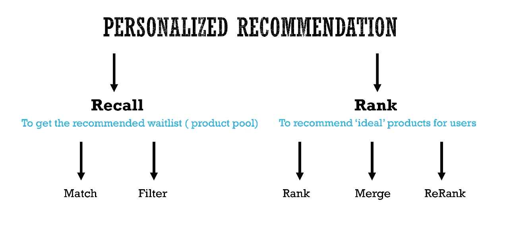
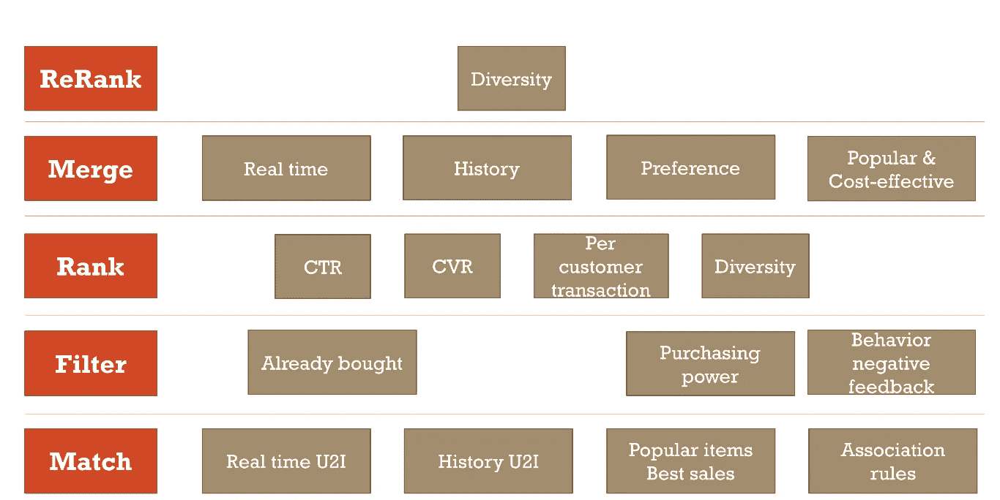

# 个性化推荐的初学者概述

> 原文：<https://medium.datadriveninvestor.com/a-beginner-overview-for-personalized-recommendation-cf6898b52280?source=collection_archive---------3----------------------->

five steps for personalized recommendation

我是一名数据科学家，在美国最大的电子商务网站之一从事个性化推荐领域的工作。在这篇文章中，我想总结一下我对个性化推荐的理解，为有志于此课题的数据科学家和算法工程师提供一些有用的信息。

我将这个主题大致分为五个步骤:(1)匹配，(2)过滤，(3)排名，(4)合并，(5)重新排名，对于每一步，都有如此多的细节需要注意，从商业和技术角度来看都是如此。好的推荐对企业和客户来说都是双赢的解决方案。在我的实际工作中，我发现有很多关于推荐系统的教程，其中大部分只是冰山一角。所以我希望在这里尽力展示整个冰山，让数据科学家/软件工程师不仅知道怎么做，还知道为什么要做。让我们开始吧。

# 比赛

Match 的目标是**生成一个与用户参与的产品**相关的产品池，这是我们的第一步，也是我们最终产出的基础。在实际工作中，match 是使用商业策略和技术的组合来产生一个待推荐的产品名单。

1.  近 U2I 和历史 U2I 基于内容的相似性。
2.  基于用户/基于项目的协同过滤。
3.  使用数据挖掘的关联规则。
4.  热门商品/畅销商品。

如何用矢量的方式表现物品，请参考我的[上一篇](https://medium.com/datadriveninvestor/represent-users-and-products-in-a-data-science-way-for-e-commerce-website-22d7dbc24c33)。

值得注意的一点是，对于不同的策略，我们可以根据业务需求决定产品池中不同数量的产品。500 的最终产品池可以包括来自基于内容的相似性的 100 个产品、来自协作过滤的 200 个产品、来自关联规则的 150 个产品以及来自最佳销售的 50 个产品。

# 过滤器

作为顾客，我们也可能会抱怨，为什么我们总是收到几天前刚买的推荐产品。从我的购物经验来看，大部分电商都不会删除客户最近购买的商品。那完全是糟糕的客户体验。所以，过滤步骤来了。在这一步中，我们从匹配步骤中获得的产品池中删除产品。但是我们应该去掉什么呢？

客户最近购买的产品是我们应该删除的第一类产品。但是我们不会在实际工作中删除每个购买的项目。我们要根据不同的产品类别来考虑客户的**回购周期**。

其次，我们应该考虑客户的购买力，即客户是否能负担得起如此昂贵的产品？客户对价格是否敏感？如果我们的产品太贵(或太便宜)，顾客会付钱吗？我们可以看到，客户的**价格偏好**是影响客户最终购买决策的最重要因素之一。

最后，对**负面反馈**做更深入的数据分析。如果我们已经推荐了产品，而客户并不真的喜欢，我们肯定应该删除它们。

# 军阶

到目前为止，我们有一个干净的产品池，可以很好地直接展示给我们的客户。但是…我们应该先给顾客看哪一个呢？让机器学习和深度学习来帮助我们吧！我们可以预测我们的客户是否会在我们的网站(环境)上购买我们的产品，这显然是一个 CTR 预测问题。这是一个巨大的子主题，传统机器学习和高级深度学习中的许多模型可以提供令人敬畏的结果。我编写了大部分代码，所以我可以在后面讨论更多。

传统的机器学习方法:

1.  逻辑回归
2.  因式分解机
3.  场感知因式分解机
4.  GBDT + LR(脸书)

深度学习方法:

1.  广度和深度(谷歌)
2.  DeepFM(华为)
3.  深度交叉网络
4.  深趣网(阿里巴巴)
5.  ESSM(阿里巴巴)

# 合并

我们可以根据不同的指标对产品池进行排名，如点击率(CTR)、约定率(CVR)、CTCVR 等。很难简单地将它们结合在一起，因为各种指标是不可比的。因此，我们可以为每个组设置不同的权重，并将它们合并到一个最终的、更干净的产品池中。

我的想法是，个性化是一个过程，使**越来越干净，产品排名列表**，满足客户的需求，提高客户的参与度。见下面 youtube 的纸图:从几百万，几百到几十，越来越干净啊哈？！

Youtube’s paper, from missions to hundreds to dozens.

# 重新排名

这一步和第三步类似，后面也会讨论模型细节。

summary about the overview