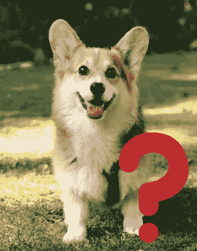
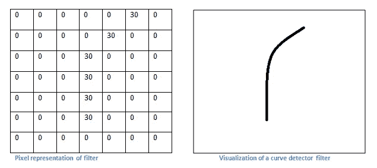
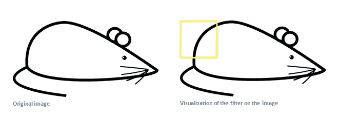
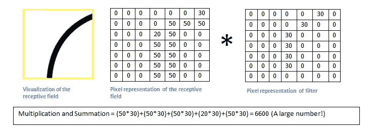
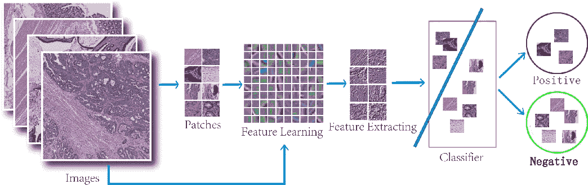

# 卷积神经网络初学者指南

> 原文：<https://medium.datadriveninvestor.com/a-beginners-guide-to-convolutional-neural-networks-49384c75d1a?source=collection_archive---------1----------------------->

> ***答:本文假设对神经网络有基本的了解。如果你需要赶上自己，检查*** [***这个***](https://medium.com/@joshua.payne/neural-networks-demystified-34bee0c45fb7) ***出来。***

神经网络最令人兴奋的功能之一是图像分类。有了这种超能力，计算机可以完成大量通常由人类完成的任务。

无论是路标检测、癌症诊断，还是区分猫和狗，图像分类都非常适用于我们的日常生活。

对于人们来说，看到图像并对其进行分类似乎是很自然的，几乎是潜意识的。我们已经从多年的经验和学校教育中学到了我们周围的世界意味着什么，所以我们是专家！

但是对于计算机来说，这就不那么容易了。尝试编写常规代码对图像进行分类，即使只有 50%的成功率，也需要数千条 if/else 语句。这是因为与我们不同，计算机从未见过路标、恶性肿瘤或柯基犬的照片！

COMPUTER: What is this?

传入**卷积神经网络**(CNN)。事实证明，我们可以教我们的计算机，并给它们我们所拥有的经验来准确地“看”东西。通过利用 CNN，我们可以用“数据”训练它们——也就是我们教我们的计算机检测的大量图像！

 [## 今年值得关注的 5 大人工智能趋势|数据驱动的投资者

### 预计 2019 年人工智能将取得广泛的重大进展。从谷歌搜索到处理复杂的工作，如…

www.datadriveninvestor.com](https://www.datadriveninvestor.com/2019/02/19/artificial-intelligence-trends-to-watch-this-year/) 

# 酷豆！但是 CNN 实际上是如何工作的呢？

## 整体架构

卷积神经网络由几个主要组件组成。

Convolutional Neural Network

该模型从输入图像开始，经过**卷积、非线性和汇集**的过程，然后进入**全连接神经网络**以产生我们的输出。输出是代表图像属于每个类别的概率的矢量**和**。在这种情况下，“鸟”、“日落”、“狗”和“猫”。别急，这些都会详细解释！

整个模型可以分为两个主要部分:*特征学习*和*分类*。

在前者中，我们通过卷积和池化从图像中提取特征。这可能像识别边缘一样简单，就像检测鼻子一样。

然后，我们将检测到的特征数据传递到分类部分，即我们完全连接的层。在这里，我们的神经网络使用输入来产生我们的输出，“告诉我们”它将图像分类为什么。

## 预处理

首先，为了让我们的图像准备好进入 CNN，我们必须对它进行预处理。这通常意味着*调整*图像到模型的最佳像素尺寸。

所有的图像都是简单的像素值矩阵，所以我们的图像通常是 3 个像素矩阵。这是因为每个矩阵被指定用于 R、G 或 B 值。为了简化这一点，我们可以将我们的图像转换为**灰度**。我们的图像现在由一个通道组成。

## 核和卷积

一旦我们准备好我们的图像，我们现在执行*卷积。* **内核**，也叫**过滤器，**是‘特征检测器’。它们*在我们的输入图像上扫描*，并执行*与像素值的逐元素乘法*。

Our kernel/filter detects curves

Our kernel/filter scans over our image bit by bit. In this instance, it’s focused over the top right section.

Element-wise multiplication between the image’s pixel values and the kernel’s pixel values are performed.

因为我们得到了一个高数值，我们知道我们的高滤波器值乘以/“超过”高图像值。换句话说，我们知道过滤器*检测到了曲线。*

我们的内核继续在图像的每个部分上移动，直到它完全扫描它。每次移动执行的元素乘法的结果数被添加到我们的*特征图*中。内核每次扫描移动的像素数称为*步距*。下面，我们看到一个步幅为 1 的内核。

Kernel and Stride

记住，内核产生的数字代表某个特性被检测到的几率(高数字=高几率)！如果特征图包含大量数字，**输入图像很有可能包含我们正在寻找的特征**。

## 激活

为了消除任何负值，一个**‘ReLU’激活**被应用于我们的特征映射值。这里有一个展示这个*非线性*函数的图表。

No negative y values.

## 联营

此时，卷积已经完全应用于我们的输入图像。然而，我们通常会有*比*大得多的图像，有*比*大得多的特征地图。更多的数据意味着我们的模型有更多的参数，意味着更多的计算([，这对环境不利](https://medium.com/swlh/ai-and-global-warming-a-double-edged-sword-22b08a10d333)😉 ).为了缩小规模，我们使用**池**。

我们有几种类型的池(平均，总和等)。)，但实际操作中， *max pooling* 效果最好。为此，我们一点一点地扫描我们的特征图(就像我们的内核一样)，然后*取最大值并把它放到我们新的更小的图*上。

An example of max pooling

## 完全连接的层

我们现在已经到达了模型的末尾！

我们做的第一件事是*展平我们汇集的特征地图*。我们*将*我们的*网格*的值转换为*向量*，现在充当我们的**全连接层**网络的输入节点。

此时，我们有了常规的神经网络——通过[反向传播](https://skymind.ai/wiki/backpropagation)学习的权重和偏差。然而，我们对输出层使用了一个 *softmax 激活*。这意味着我们得到一个数字向量，每个数字代表图像符合某个类别的概率。

Green has the highest value, so this is what the computer has classified it as.

总之，我们通过检测图像中的特征来对图像进行分类，然后将数据传递给完全连接的神经网络。通过卷积识别特征，我们赋予计算机解读照片的能力。

现在你知道了！用 CNN 进行图像分类！

# 应用程序

那么我们如何将这个框架应用到现实生活中，并最终造福社会呢？嗯，我之前没开玩笑！我们可以利用 CNN 进行自动驾驶汽车(比如检测路标)和癌症检测！

这是当今 CNN 的两个非常突出的实现。

## 计算机视觉和自动驾驶汽车

当我们开车时，我们下意识地执行许多任务。无论是车道检测，路标，还是看红绿灯！自动驾驶汽车使用 CNN 在一个名为*计算机视觉的领域内自动化所有这些过程。*

## 癌症检测

但是医疗保健呢？嗯，你可能知道，我们可以教我们的网络检测癌症！通过在大量皮肤、乳房甚至其他形式的癌症照片上训练我们的 CNN，卷积神经网络[可以比普通医生](https://cs.stanford.edu/people/esteva/nature/)更准确地诊断这些疾病。再见误诊！

总而言之，CNN 是令人敬畏的框架，有潜力自动化和改进大量的人工任务。有如此多的领域和行业正在被它们所颠覆——以上仅仅是几个例子。他们仍然有很大的创新空间！现在你知道他们是如何工作的了，你会在 CNN 的哪个领域捣乱？

# 关键要点

*   CNN 是能够对图像进行分类的神经网络
*   通过特征检测和连接层，计算机可以从照片中识别对象
*   内核、池和非线性是特征检测的基石
*   CNN 非常适用于现实生活！

# 进一步阅读

这个网站对我来说非常有价值，希望对你也是如此！

 [## 理解卷积神经网络的初学者指南

### 卷积神经网络。听起来像是生物学和数学的奇怪结合，还有点 CS 的成分，但是…

adeshpande3.github.io](https://adeshpande3.github.io/adeshpande3.github.io/A-Beginner%27s-Guide-To-Understanding-Convolutional-Neural-Networks/) 

*如果你喜欢这篇文章，请随时在 joshuapayne1275@gmail.com 的* [*LinkedIn*](https://www.linkedin.com/in/joshua-payne-0bb2a7194/) *联系我。感谢阅读！*