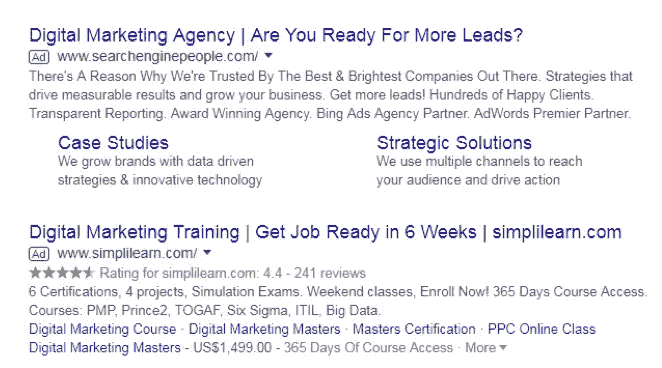
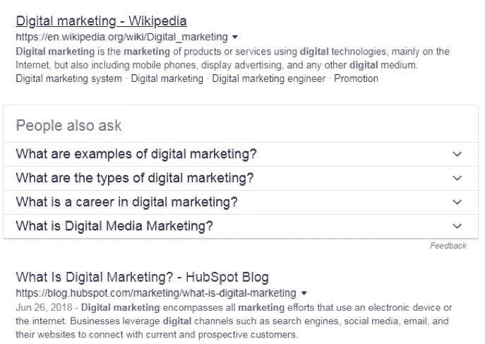
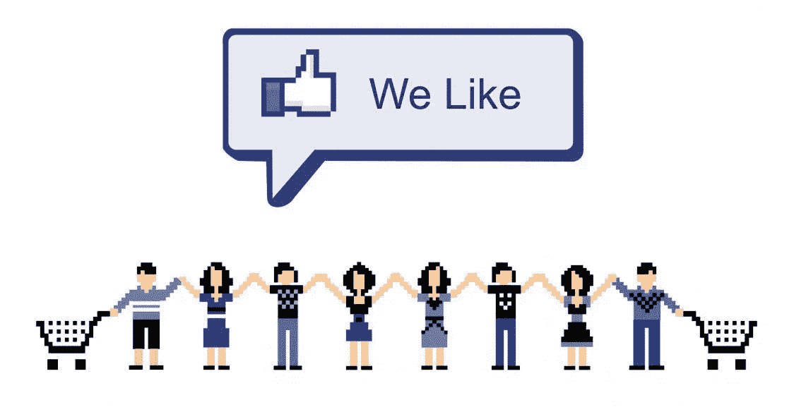
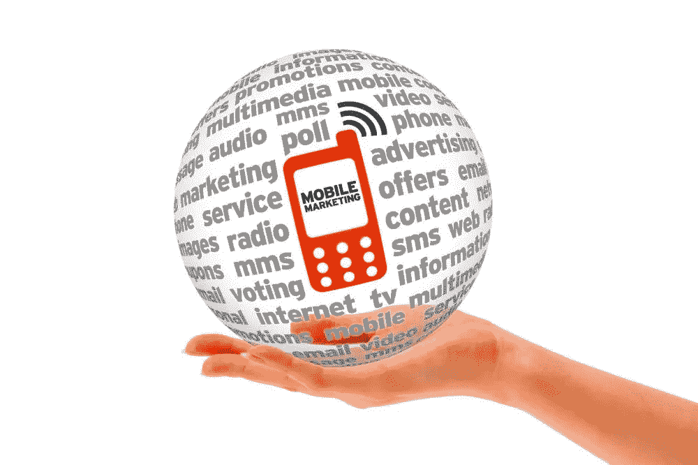

# 有效数字营销初学者指南

> 原文：<https://medium.datadriveninvestor.com/a-beginners-guide-to-effective-digital-marketing-d2c2da5ecf92?source=collection_archive---------45----------------------->

数字营销已经存在了一段时间，但直到最近它才发展成为一种重要的营销工具。事实上，企业在数字营销上投入了大量的时间和金钱。最好的部分是，结果更加切实可见。在许多情况下，利息回报(ROI)高于通过传统方式产生的 ROI。

广告牌和电视广告不是已经过时了吗？
没有。广告牌和电视广告没有过时。它们是一些最古老的营销形式，仍然可以产生效果。不幸的是，它们可能非常昂贵，并且需要大量投资，这对中小型企业来说是难以承受的。

一个好的广告牌很容易每月花费 550 到 17000 美元。然而，这个价格会根据市场规模、知名度和位置而波动。上述数字仅适用于乙烯广告牌。对于数字电视，成本更高，一个人每月可以轻松支付 2100 美元到 9500 美元不等。在像时代广场这样拥有巨大市场规模和国际知名度的地区，广告牌空间非常昂贵。它很容易使企业每年损失大约 100 万到 400 万美元。

相比之下，电视广告在国内或国际曝光的基础上也极其昂贵。在超级碗赛季，一个 90 秒的广告可能要花费 900 万美元。对于一个 30 秒的商业广告，商家也可以期望支付 500 万美元。看到成本上升，数字营销是一个可行的解决方案。它不仅更具成本效益，更容易适应任何人的预算，而且覆盖面更广。

**仔细观察数字营销**
本质上，数字营销与通过数字媒体共享的任何形式的营销相关。这些年来，这个术语已经在很大程度上涵盖了在线营销。从 YouTube 视频到网站横幅、电子邮件和脸书帖子等等，数字营销极其灵活且经济高效。一项活动每月花费高达 50 美元，投资回报率是这个数字的两倍。

**数字营销的 5 种主要形式**
现在，在你一头扎进数字营销之前，最好先了解这个术语下的不同营销形式或渠道。看一看它们，你会发现数字营销只是一个笼统的术语，包括以下内容:

**1。搜索引擎优化— SEO 和搜索引擎营销— SEM**
SEO 和 SEM 是一个硬币的两面。这两种营销技术都依赖于优化各种搜索引擎，如谷歌、必应等，以便在搜索结果中展示你的产品和服务。这里的主要区别是 SEO 本质上很大程度上是有机的。SEM 是你付费在相关搜索引擎中出现。谷歌有一个算法可以显示有机的和付费的结果。作为一个规则，你得到的第一个结果通常是付费的。

**SEM**

你可以在它们下面看到一个写着“Ad”的小盒子。结果中的下一个链接由算法有机地挑选出来。SEO 和 SEM 都利用内容、关键词、图片等，让你的内容更相关，更容易被算法阅读。当有人搜索“美国广告牌广告费用”这样的术语时，如果你的网站提供相同的信息，就会显示出来。

**SEO**

搜索引擎优化和搜索引擎营销必须小心翼翼，因为谷歌不时改变其算法。不改变营销来反映这一方面的商家将面临问题。幸运的是，它适用于几乎所有形式的数字营销。谷歌还提供各种服务，如谷歌广告词，谷歌分析和更多，以提高您的使用方便。

**2。社交媒体营销**
这是另一个笼统的术语，指的是在脸书、推特、YouTube 等社交媒体平台上进行的所有营销。最好的部分是，这意味着你可以有一个非常灵活的营销策略，创造一个内容链。此外，社交媒体平台也为企业提供了不同的选择，通过这些选择，他们可以赚钱，赚更多。

最棒的是，这种灵活性扩展到了所有平台，甚至 LinkedIn 也提供营销选项。许多企业利用社交媒体营销作为进军数字营销的垫脚石。此外，数字营销实际上允许营销人员将不同形式的数字营销融入其中。这在很大程度上包括邮件营销、移动营销甚至 SEO 营销。

它也有一个较小的学习曲线，许多小企业通常开始自己管理他们的在线营销。这可以使他们从较小的预算开始时更容易。这种营销模式也提供了很高的投资回报率，企业很快利用这一事实。

**3。电子邮件营销**
电子邮件营销是最古老的数字营销形式之一。作为一种沟通方式，它也是企业及其目标受众之间的主要沟通方式。可悲的是，它经常被认为是过时的。与社交媒体营销相比，它的反应要慢一些。相比之下，通过电子邮件营销产生的投资回报率可以与社交媒体营销持平，有时甚至更高。

另一方面，电子邮件营销是少数几种能让你直接接触到目标受众的营销形式之一。在这种情况下，您可以访问他们的收件箱，并根据需要向他们发送有关您产品的相关信息。事实上，拥有一个电子邮件地址数据库对企业来说是非常有利可图的。他们以这种方式向客户提供时事通讯和折扣是有原因的。

你还可以找到各种专注于电子邮件营销服务的企业，如 Mail Chimp、Campaign、Campaign Monitor 等。他们所有的服务都旨在帮助你轻松地制作电子邮件并自动发送。它还在集成和使用方面提供了很大的灵活性。对你来说，整合你的电子邮件营销和社交媒体营销活动是可能的，也是非常容易的。这确保了更高的投资回报率、更短的响应时间和更强的销售线索挖掘能力。

**4。转化率优化——CRO**
这与提高你的业务的转化率有关。转化是指用户在你的网站上的任何可以增加销售机会的行为。在这方面有很多困惑，因为许多企业认为用户的如下行为是转化，但实际上并非如此:

*   增加关注者——拥有大量的目标受众并不总是有益的，尤其是当你无法转化他们的时候。越来越多的参与对 CRO 有着直接的影响。
*   **获得喜欢或收藏** —喜欢和收藏是用户在社交媒体上可以采取的最少承诺的行动。他们最多能做的是告诉你是否在正确的轨道上，但不要认为这会导致转变。这种情况发生的可能性很低。
*   **流量增加** —流量增加可能是因为你发布的任何帖子。就像喜欢的人一样，不要太在意。这可能会导致一些转换行为，但这种可能性很低。

为了实现有效的 CRO，您需要更加关注以下转化行动:

*   **评论** —参与度提高的最大标志是评论。这说明有人花了时间去了解发布的内容并做出了回应。虽然并不是所有的评论都是为了创造对话，但对一个或多个问题做出回应有助于将这个人转化为可能的销售对象。
*   **点击量** —关注链接点击量。这又是一个感兴趣的标志，不像你得到的喜欢或喜爱。包含链接还可以让你把对方的注意力从社交媒体平台转移到你的网站上。

一旦你把重点放在 CRO，你可以很容易地从你的网站，你的电子商务商店和更多的搜索结果。这也有助于你解决顾客的行为，如弃车，以及如何改善顾客的购物体验。

**5。移动营销**
移动营销是一种更年轻的数字营销模式，但它对企业来说潜力巨大。如今，目标市场的很大一部分使用智能手机或平板电脑来访问互联网。无论他们是在使用社交媒体平台，还是在寻求购物，大多数人都倾向于使用智能手机。

移动营销可以让你更有效地锁定在线移动受众。它的重点是优化您的服务和移动格式的产品。这个过程实际上不仅仅包括一个手机友好的网站。以下是你需要关注的不同的移动营销技巧:

*   **应用商店优化— ASO** —谷歌 Play 商店和苹果应用商店是所有应用的最大平台。开发者需要确保他们的应用程序出现在搜索结果的前列，以增加被目标用户下载的机会。
*   **二维码** —这是移动设备可以读取的小条码。根据编码，它可以引导这个人到网站，或者获得购物折扣，或者订阅时事通讯。
*   **短信营销** —通过短信营销是接触目标受众的另一种有效方式。很像电子邮件营销，短信营销可以用来保持更新的人，通知他们所有的促销活动等等。
*   **移动视频** —用于营销目的的 Snapchat 和 YouTube 视频属于移动视频范畴。就连脸书和 Instagram 也有“故事”选项，很像 Snapchat。
*   **移动搜索** —这涉及到增强你的搜索引擎优化，以确保你出现在移动搜索中。此外，您需要优化您的网站，使其对移动设备友好。

一个好的数字营销活动包含一种或多种上述形式。这是一个好主意，以了解差异，用途和限制，每一个数字营销方法可以强加给你。

**策划一个好的活动**
除了了解不同形式的数字营销，你还需要确保你确实在策划一个合适的活动。竞选策略将大大有助于保证你得到你想要的结果。在计划时，最好记住以下几点:

**1。永远要有一个目标**
即使你不打算推出新产品或销售，也要试着在头脑中为活动设定一个目标。这给了你更多的方向，也让你专注于你正在得到的整体结果。这也确保了你知道哪些地方需要改进，哪些地方做得很好。

**2。了解你的目标受众**
当你对不同形式的数字营销感到困惑时，了解目标市场是个好主意。这可以让你缩小选择范围，并针对这些人开展活动。例如:通过电子邮件营销可以更好地接触到一些目标受众。另一方面，通过社交媒体营销和二维码可以更好地接触到一些人。

**3。使用数据和分析**
除了知道什么对你有用，你还应该有分析软件来关注数字营销活动。这让您对该活动的表现有了更清晰的了解。此外，不同的社交媒体平台，如 YouTube、脸书、Instagram 和 Twitter，提供了对一场演出的不同帖子的表现的分析。

在这些建议的帮助下，你可以更轻松地尝试设计一个数字营销活动，满足你的所有业务需求，并提供切实的结果。

最初发表于[www.anthonyvallonejr.com](http://www.anthonyvallonejr.com)