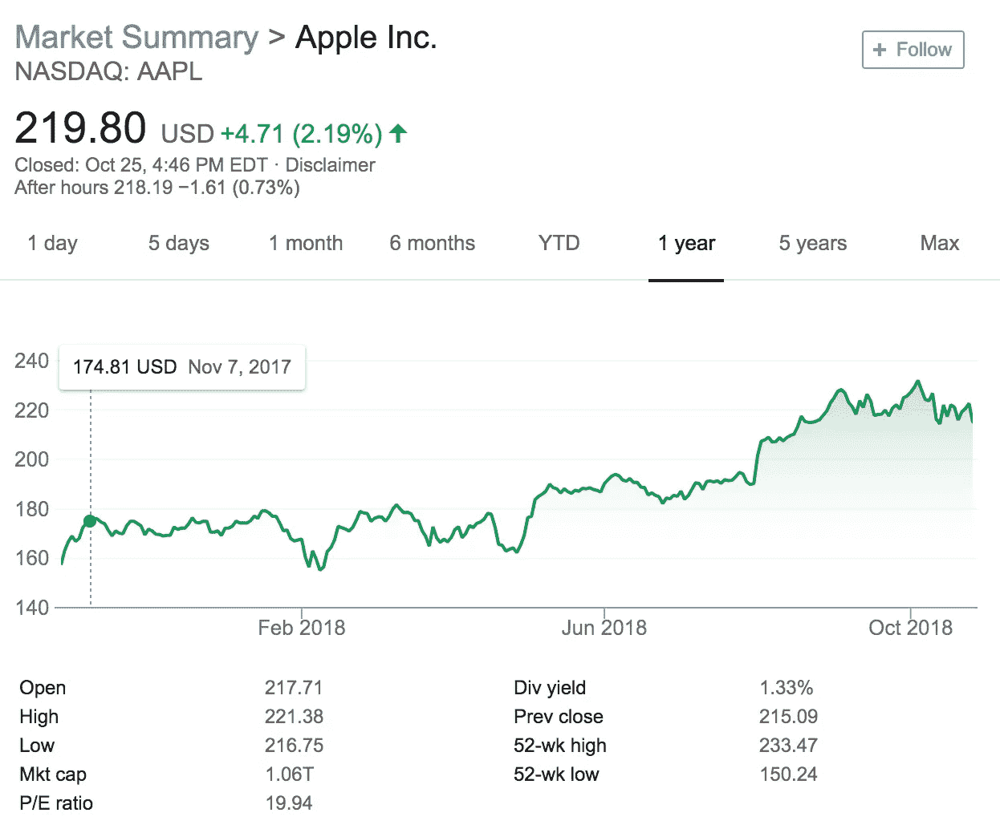
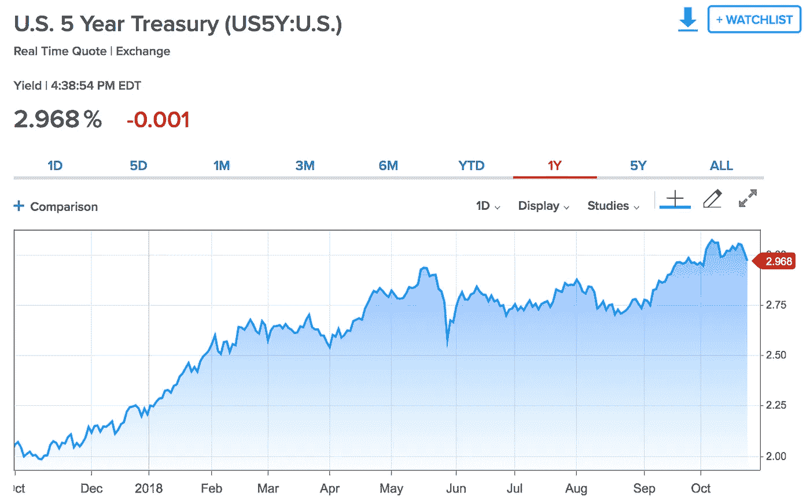
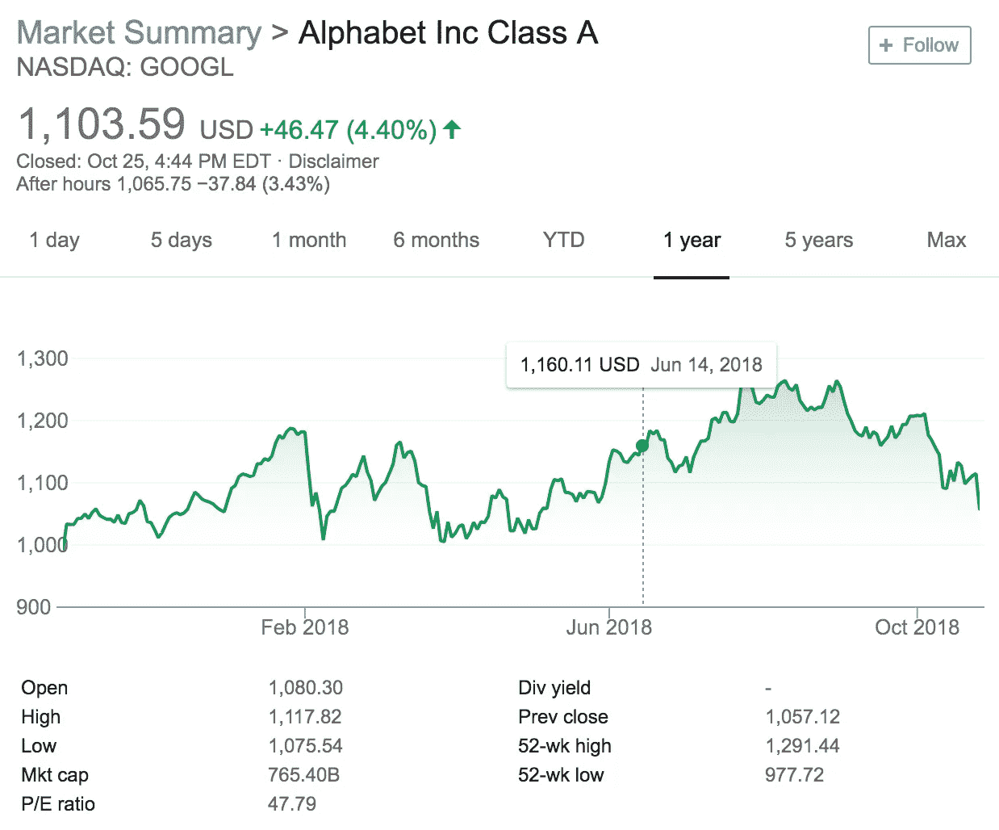

# 投资初学者指南

> 原文：<https://medium.datadriveninvestor.com/a-beginners-guide-to-investing-a60cc673acee?source=collection_archive---------15----------------------->

Credit: Howard Gold/Getty Image

"经验很可能是最好的老师，但学费很高。"查尔斯·埃利斯

随着 Robinhood 和 Acorn 等电子交易平台的出现，投资话题在千禧一代中越来越受欢迎。每个人，不管有没有经验，都开始在投资平台上交易，在瞬息万变的市场中试试运气。

但是，是否赚钱，并不是单纯靠运气。以下是所有新手投资者应该遵循的一些技巧，以获得最大回报:

**1。** **了解自己的目标和风险承受能力**

开始投资时最重要的是确定和理解你的最终目标。问自己一些问题是有帮助的，可以确保你为自己做了正确的投资。不是每个人的投资组合看起来都一样！

问自己一些问题:

你确定要持有你的投资吗？短期，长期？

你想进取还是保守？

你想投资多少钱？

你希望得到多少钱作为回报？

你愿意承担多大的风险？

在设定目标时，重要的是要记住高回报往往伴随着高风险。如果你希望获得尽可能高的回报，你可能会投资风险很大的股票。

下面是一个高风险高回报股票的例子:

如上图所示，在过去的一年里，苹果公司的股票价格波动很大。最低点是当价格跌至 150.24 美元时(见 52 周低点)，而最高点是当价格跌至 233.47 美元时(见 52 周高点)。过去一年的价格波动在 80 美元左右，这对学生投资者来说无疑是高风险的。

但是，单看这个折线图，大趋势向上说明这只股票收益很大。另外，很多人都知道，苹果最近发布了一批新品。在那段时间内(2018 年 9 月—10 月)，苹果的股价达到了历史新高。这对苹果来说是一个好迹象，因为它表明公众对苹果的新产品有着积极的接受。

对于所有高风险高回报的投资者来说，苹果的股票绝对是值得推荐的。

另一方面，对于规避风险的投资者来说，最终目标可能只是从固定的季度支付中赚钱。

如果是这种情况，下面是一个低风险低回报债券的例子:

美国 5 年期国债是一种政府债券，被认为是投资界最接近无风险的债券。它是无风险的，因为投资者每年将获得两次固定利息。此外，这些固定付款由美国政府担保，因此不存在贷款和无法收回资金的风险。

上面的线形图是根据债券收益率来衡量的，债券收益率是衡量投资者对债券回报的指标。当债券持有人购买债券时，他们以固定的债券收益率购买；固定债券收益率决定了债券价格和购买特定债券的固定利息支付。因此，美国国债被认为是无风险的，因为当投资者投资于美国国债时，他们确切地知道他们将获得多少回报。

因此，对于所有规避风险的投资者来说，美国国债是一个强烈推荐的投资组合。

**2。** **做你的研究**

在投资任何股票或债券之前，最重要的是做研究。看看新闻中的公司，比如雅虎财经，华尔街日报或者晨星。看看其他知名公司(如摩根士丹利、杰弗里斯)的分析师对该公司的评价。通过雅虎财经上的图表来看看过去的市场表现。问问你的朋友或者同事！深入了解行业和公司本身；这一信息可以通过公布的公司年度报告以及上述相同的融资来源找到。

正如沃伦·巴菲特所说，“永远不要投资你不了解的业务”。如果你要把钱投到什么东西上，最好先了解一下。这类似于购物:如果你想在商店购买一件商品，你通常会在网上查看评论，以确保买到最好的商品。

**3。** **不要反应过度**

交易很像过山车，有高有低；有赚钱的时候，也有赔钱的时候。因此，重要的是不要反应过度。不要对收益过于兴奋，也不要对低点过于失望。市场波动。事情每天都在发生，导致起起落落。当你投资组合中的一只股票下跌 1%、5%甚至 10%时，没有必要反应过度。基于你的风险承受能力，你甚至可能想继续持有某一天下跌 15%-20%的股票。本质上，把你的钱放在那里，不要强迫性地监控它。

很多高风险高回报的股票往往会有很大的价格波动。这并不意味着股票不是一个好的投资；这只意味着投资者必须准备好度过低谷。

下面是一只股票的例子，它的价格波动很大:

正如你所看到的，Alphabet(谷歌的母公司)是一只经历了大量价格波动的伟大股票。52 周的最低价是 977.72 美元，52 周的最高价是 1291.44 美元。鉴于这种高价格波动，决定投资 Alphabet 的投资者必须做好准备，在股价波动时保持冷静。

**4。** **不要把所有的鸡蛋放在一个篮子里**

在投资中，多样化是关键。没有一个聪明的投资者会把所有的钱都投在一只股票上，然后收工。相反，重要的是建立不同行业和部门的股票投资组合。根据你打算投资多少钱，一般建议是 10 到 30 只股票。

**5。** **相信自己**

最后但同样重要的是，相信你自己。充满信心地投资，并从中获得乐趣。无论你是选择在电子交易平台上投资，还是通过你的银行开设自己的经纪账户，在你开始投资经历时，请记住所有这些简单的规则。祝你好运！