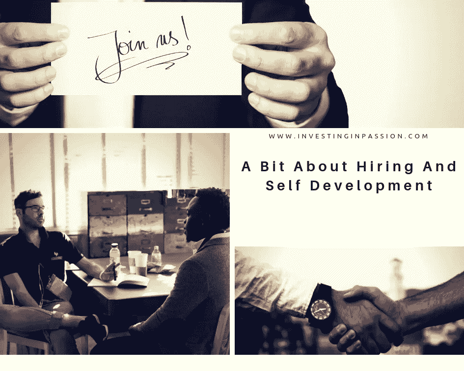

# 关于招聘和自我发展

> 原文：<https://medium.datadriveninvestor.com/a-bit-about-hiring-and-self-development-76e16c965abb?source=collection_archive---------8----------------------->

这些天我们畅游在知识的洪流中。我们尽可能多的学习，并尝试做更多的事情。我们被通知、新闻、消息、博客、出版物分散了日常活动的注意力，我们不断地把它们放在“要阅读”的列表中，这个列表每天都在不断增加。我们分析人们的行为，检查和讨论公司指数和业绩，跟踪我们最喜欢的风投、投资者和创始人。但是专注于你自己怎么样？让我们花点时间注意你的感受，哪里好，哪里不舒服。我们的感受和我们真正喜欢的东西。保持一段距离，像看别人一样看着自己，分析、讨论、观察。

我这样做的灵感来自于[莉莉·莱曼的媒体帖子](https://blog.underscore.vc/dont-hire-for-culture-fit-2c19d7a23b98)，标题为:
***【不要为了文化契合度而招聘】*** 。她喜欢问人们以下问题:

*   ***“你自己在做什么？”***
*   *“你收到的反馈中有哪一条很难回答，你* ***如何回应？”***
*   *“你的* *最负面的引用是什么？”*
*   *“这个角色的哪个部分会大部分在* ***你的*** *舒适区之外？”*
*   *“你* *最近收到了什么反馈，你同意吗？”*
*   *“说说你* ***和一个人*** *发生的冲突，你是怎么处理的？”*

我觉得我很有自知之明，对自己有很深的了解，但我很难用语言来表达对上述问题的一些回答。你也是吗？也许，事实上，这并不总是关于我们不断获得的知识和硬技能，而是我们的思维方式，我们的经验，同理心，拥抱紧急情况的能力，使我们在我们的榜样和我们关心的人眼中变得有价值。

当我有机会以面试官的身份参加面试时，我常常会问一个经常得不到回答的问题:“关于你，你想告诉我们什么，而我们没有问你这个问题？”。这是一个开放性的问题，但是人们有时看不到他们的日常生活是重要和有趣的。他们的家庭生活、宠物、朋友、旅行构成了我们与之交谈的个人的全貌，我们想听听他们除了与业务相关的事情之外还关心什么。这与你用来给公司定价的估值方法无关，有时这与你接近创始人的方式以及你将与他们建立什么样的关系有关。

我记得，我受雇于一个空缺超过 6 个月的职位，即使它很紧急，直到找到合适的人，它才被填补。一旦我加入这家公司，我就能真正注意到**的不同**，以及到目前为止他们收集了多么独特、有趣和志同道合的人。所有这些都是通过不同意“**几乎符合我们的价值观**”，不让时机和压力决定决定。

最后，想想你的超能力是什么，是什么驱使你，你在哪里发光。

最初发布于:[https://investinginpassion . com/2018/12/22/a-bit-about-hiring-and-self-development/](https://investinginpassion.com/2018/12/22/a-bit-about-hiring-and-self-development/)