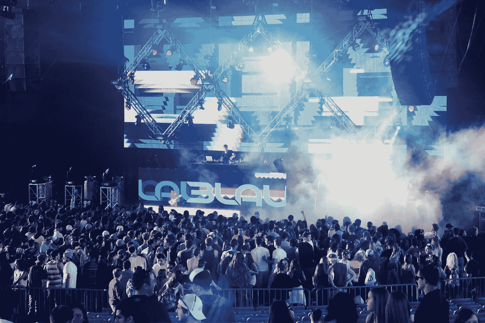

# 基于区块链的音乐节？！用例一直在增长

> 原文：<https://medium.datadriveninvestor.com/a-blockchain-based-music-festival-the-use-cases-just-keep-growing-44488e3d4f7a?source=collection_archive---------15----------------------->

我敢肯定，当我第一次读到这个标题时，很多人和我想的一样。来吧，区块链-举办一个音乐节？有些事情没有区块链会更好。但是，很快我的立场改变了。

音乐活动票务行业充斥着高得离谱的价格。买一张活动门票可能会花掉你一大笔薪水，如果不是全部的话。一些音乐会的费用高达数百美元，而且这一价格多年来一直在稳步上涨。公平地说，如今音乐会的铺张浪费花了一大笔钱。我的意思是去看一场碧昂斯的演唱会，你就会知道在这样一场演出中付出了多少努力。支付所有的贡献者，艺术家，推广，场地等。要花很多钱。对越来越奢侈的表演的需求只会上升。然而，门票价格的透明度是相当扭曲的。

这就是区块链的用武之地，有一群先锋艺术家站在这个想法的最前沿。在 EDM 艺人 3LAU 的带领下，他打算将区块链带入音乐节体验，并最终带入整个音乐行业。我们的音乐节(OMF)将于 2018 年 10 月 20 日在旧金山湾区举行，这将是第一个区块链推动的音乐节。佐德和嘻哈艺术家大肖恩也将出席。

## 透明度，区块链最引人注目的使用案例之一

区块链技术可以应用于任何缺乏透明度的行业。从产品到客户的路径可能被篡改、多次转手、间接，而且在许多情况下被垄断。音乐活动票务行业也是如此，门票要经过中间商，比如黄牛。这极大地助长了价格膨胀和荒谬的收费，大大抬高了票价。为什么艺人不能直接把票卖给粉丝，让艺人完全控制价格，同时提供一个象征性的经济让粉丝参与。DJ 3LAU 评论:

> 随着我们的发展，OMF 将继续增加新功能，我们有两个最终目标:
> 
> 1.让粉丝在他们参加的节日中拥有所有权
> 2。使粉丝能够策划从挑选阵容到地点的节日体验
> 
> 这些目标可能遥不可及，但我们需要从某个地方开始。第一年，我们将启用门票加密支付，并以令牌卡的形式向所有与会者发放他们的第一个 ETH 纸质钱包。我们相信，这将有助于推动主流采用新的、强大的技术，我们迫不及待地希望您加入我们今天开始的这一漫长旅程

3LAU 对加密货币并不陌生。他参与加密货币领域多年，是比特币的早期投资者。事实上，他拒绝了一份报酬丰厚的华尔街工作，转而追求音乐事业，并开始了一个区块链项目。

OMF 代币将成为音乐节代币经济的原生加密货币。这些代币允许粉丝购买商品、优惠、升级，甚至赚取代币来完成某些任务，如促销和售票。门票和门票提供商在区块链上是可验证的，给予买方关于价格和合法性的完全透明。这也将消除中间商，如 ticketmaster 和 stubhub。不仅价格会更低，而且粉丝可以参与选择阵容甚至活动地点。

所有这些都在区块链以太坊进行。加密货币预售已经开始，票价应该低于 30 美元。现在只能在 [omf.io](https://omf.io/) 用 86 美元的信用卡买票。这让我有点担心，因为它完全违背了整个想法，但嘿，我很高兴至少有一个区块链主题的 EDM 音乐节正在举行。那是毒品！整个节日期间都将搭建帐篷，教育节日游客关于加密货币和如何使用钱包。这一事件将以全新的视角激发人们对区块链和加密货币的认识。