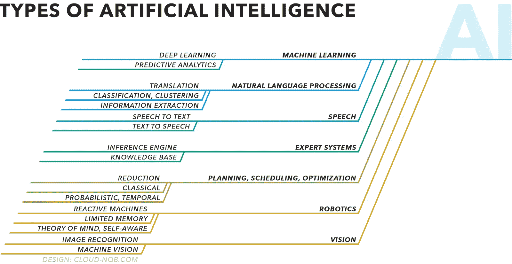
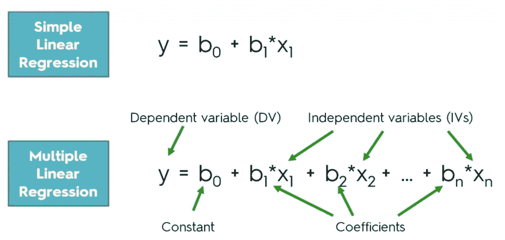
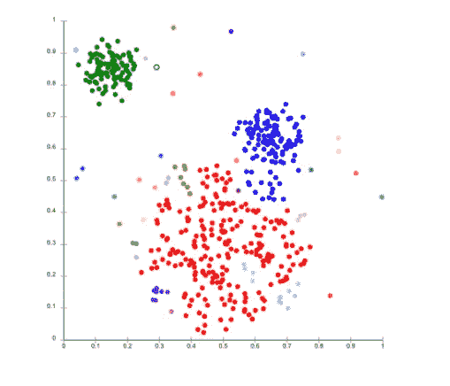
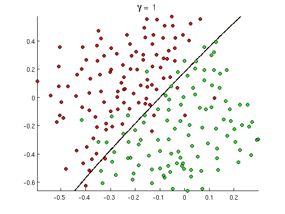

# 人工智能的崩溃

> 原文：<https://medium.datadriveninvestor.com/a-breakdown-of-artificial-intelligence-9207960cadff?source=collection_archive---------2----------------------->

经过适当的训练，人工智能(AI)可以比人类更精确地执行任务。这并不新鲜，因为它出现在多个行业，如自动驾驶汽车。开发自动驾驶汽车的整个目的是强调该技术的安全方面，这一切都是由于人工智能计算的精确运动。

本质上，这个人工智能的行为就像一个人，问一些问题，比如前方有左转，有车靠近吗？那个绿灯变黄灯，我该减速还是加速？我有通行权，但是一个行人走在我前面，我该怎么办？

人类回答的这些问题并不总是准确的。例如，当受损的司机开始操作车辆时，他们的反应时间和决策能力都会大大降低。然而，这也可能发生在没有受伤的司机身上，因为它只需要**一个**错误的决定，而人类是**不**完美的。

但是通过共同的努力和从错误中学习的能力，如果我们能创造出完美的东西呢？换句话说，它可以以接近 100%的准确率运行，并且不需要睡觉或吃饭。此外，如果我们可以利用这一想法来帮助人类完成一些要求最精确的工作，如外科手术，会怎么样？

本文将深入探讨人工智能的各个方面，并在稍后解释与许多领域的可能集成，因为这些产品需求很大，并且有可能非常有用，例如，医生，我们的气候，企业，甚至普通消费者。

## 人工智能的分类

然而，为了理解人工智能如何应用，理解它如何工作是必不可少的。AI 根本不是一个指代任何具体事物的术语，事实上，AI 这个术语就像一把雨伞，它横跨各个类别，比如 ML(机器学习)，NLP(自然语言处理)。每个类别都有不同的应用程序和相关算法，提供不同的结果。

Types of Artificial Intelligence. Source: [https://cdn-images-1.medium.com/max/1600/0*EXi2uaA-2QlNvjMu.png](https://cdn-images-1.medium.com/max/1600/0*EXi2uaA-2QlNvjMu.png)

# 机器学习

ML 是提到 AI 时最常用的术语之一。ML 有许多不同的子类别，如深度学习、监督学习和非监督学习。ML 被归类为一种使用算法来训练神经网络的方法，以在没有额外人类交互的情况下完成特定任务。这对于完成一个狭窄的任务来说是最理想的，例如，在从相似的数据点进行训练之后，从某一段数据中预测可能的结果。

例如，如果有人想让你告诉他们某个队赢得棒球比赛的可能性，你会怎么回答？你可能会查看这支球队以前的数据，例如他们过去赢了多少场比赛，或者这支球队的球员与对手相比的实力。

从这些数据中，你可以做出比较准确的预测，因为你有证据支持你的答案。

同样的逻辑也适用于 ML 模型。ML 采用包含许多先前结果的大数据集，并训练自己**以非常高的准确度预测未来结果**。作为初学者，接触一些 ML 过程是有好处的，在这种情况下，称为线性回归和反向传播。

## 线性回归

线性回归是在模型中实现最大似然学习的最简单的方法之一。它包括将您的输入(如棒球运动员的力量)乘以一定的权重，以缩小数据。然后将一个恒定的偏差添加到等式中，最终确定 y 轴上的点是在线的下方还是上方。这里的想法是，线性方程将被训练来识别和遵循数据的趋势。

线性回归的方程式如下所示。如您所见，您可以引入无限量的输入，这些输入将具有不同的权重，但总会受到相同偏差的影响。这使得缩放和绘制数据非常有效，这使得它成为具有大量数据的狭窄任务的伟大模型。

Linear Regression Model. Source: [https://brokerstir.com/wp-content/uploads/2018/04/multiple_linear2-1024x489.png](https://brokerstir.com/wp-content/uploads/2018/04/multiple_linear2-1024x489.png)

线性回归只是许多不同机器学习算法中的一种，这些算法都适合用不同的数据量获得不同的结果。ML 算法很像药物，从某种意义上说，一种类型并不总是比另一种更好，它们只是针对任何需要的不同选项。

但是，如果模型预测的是最准确的数据，它们如何真正理解呢？当他们犯了错误或数据计算错误时，培训他们背后的流程是什么？对于使用梯度下降(稍后讨论)的分类模型，这个过程将被称为反向传播。

## 反向传播

反向传播是一个相对容易理解的概念。当模型出错时，它通常会理解这一点，因为它会查看提供的结果，然后将其与标记的数据或正确的分类进行比较，并计算出该点的分类是否成功。如果没有成功，它会尝试自我更新，从而“训练”模型更新其权重和偏差，以便下次能够更好地对该点进行分类。

经过多轮反向传播和模型不断自我更新后，它现在可以以高精度对数据集中的每个点进行分类。当然，我们不能让模型非常精确，因为如果引入一个新的数据点，模型将不知道如何处理它，因为它只知道训练数据集点去了哪里。

# 自然语言处理

NLP(自然语言处理)最终试图在**人类交流和计算机解释**之间架起一座桥梁。NLP 最常见的例子是 Siri，或 Alexa，其中 NLP 机器人处理各种人类语言并对其做出反应。尽管这些系统非常依赖深度学习和 ML，但 NLP 是理解不同语法和语言规则的关键部分，无论它们有多复杂。

NLP 的工作方式是首先清理你的数据，这是所有人工智能企业都需要的步骤，包括 ML。这包括将所有单词转换为小写字母，删除标点符号等。第二步是特征提取，即提取数据中最有价值的部分，由模型进行分析。

## 聚类与分类模型(NLP)

A sample cluster model. Source: [https://dzone.com/storage/temp/9303788-screen-shot-2018-05-31-at-114834-am.png](https://dzone.com/storage/temp/9303788-screen-shot-2018-05-31-at-114834-am.png)

如果您使用的数据是未标记的，您最有可能使用聚类分析模型。这些模型获取一段数据，并根据它与其他先前数据的相似性和差异来判断，试图**将相似的数据分组在一起**。左边是一个包含特定数据的聚类模型的示例。

正如您所看到的，它试图将相似的数据分组在一起，以便任何新的输入数据都可以很容易地添加到现有的聚类中，如果它不是离群值的话。作为一个过于简化的例子，该模型可以使用聚类将相似的声音或术语分组在一起，然后分析它们以形成意图。

A sample classification model. Source: [http://openclassroom.stanford.edu/MainFolder/courses/MachineLearning/exercises/ex8materials/ex8b_1.png](http://openclassroom.stanford.edu/MainFolder/courses/MachineLearning/exercises/ex8materials/ex8b_1.png)

如果数据被标记，分类模型通常最适合 NLP。分类模型通过边界将数据分开，如左图所示。这样，如果引入一个新的点，只要模型理解它是在线下还是在线上(也是一个过于简化的例子)，它就可以**容易地被分类**。

分类模型很少只有线性障碍，除非任务非常简单。通常，屏障在二维上可以是抛物线形状，在多维上甚至可以是更复杂的形状。

模型训练完成后，NLP 的最后一步(以及所有其他模型)是用测试数据集对其进行测试，并验证它对输入进行了高精度的分类。NLP 是构建聊天机器人和人形机器人的伟大工具，因为每种语言都有许多需要学习和实现的规则。

# 人工智能的改编

关于人工智能的具体机制，还有更多需要了解。这包括激活函数、不同类型的神经网络，以及本文中只略微涉及的其他课程。然而，人工智能最重要的方面不是源于它如何工作，而是作为一个社会我们能利用它做什么。

虽然已经描述了人工智能及其模型的最常见的用途，但是还有许多其他的用途来完成更具体的任务。比如**图像识别**也是 AI 广泛使用的一种形式。智能计算器就是一个很好的例子，用户拍下一张数学方程式的照片，应用程序扫描书写的数字，然后输出答案。

当这些模型适用于在活检中筛选肿瘤、骨折甚至传染病迹象的图像时，可以看到这种完全相同的技术的更复杂的用途。这是一个很好的例子，说明了我们如何利用分类算法来解决当今世界迫在眉睫的健康问题。

对于那些设想世界的未来可以用人工智能来改变的人来说，一个很好的例子是神经蕾丝的机制。Neural Lace 是 Neuralink 公司(被埃隆马斯克收购)正在使用的技术，可能会彻底改变人类。这项技术的工作原理是首先通过使用小电极来了解更多关于人类大脑的信息，这些电极可以精确地分析大脑信号。之后，计划是这些信号将由人工智能解释，然后由人工智能回答。

更具体地说，人们认为这项技术有潜力做一些令人惊叹的事情，例如通过人工智能执行的存储和导航允许无限的内存。这是假设我们可以捕捉到大脑的基本机制，这些机制首先允许记忆发生，对此我们有一个很好的想法。然而，这项工作仍然主要是理论性的，不会很快上市。

最近，正如本文开头所提到的，自动驾驶汽车严重依赖人工智能的许多方面。这是人工智能在不久的将来被使用的一个很好的例子，因为我们预计自动驾驶汽车将在未来几年变得更加广泛。这些汽车使用成像技术和传感器结合 ML 来绘制周围一定半径范围内的区域，以便安全驾驶。

然而，就我个人而言，我一直对人工智能的潜在外科适应性很感兴趣。这包括新的成像技术，甚至手术机器人助手！为了将这些想法应用于医学领域，最大似然算法必须证明比人类具有更高的准确率。正是通过这项技术，我们可以延长人类寿命，甚至有一天找到治愈癌症的更好机会。

正如我们所知，人工智能有潜力改变人类。仅仅是增强一个简单的项目，比如一个猫狗分类模型，来解决社会中一个更大的挑战，比如对肿瘤进行分类，就可以**产生巨大的影响**。大多数未来会用人工智能影响我们的项目甚至还没有想到，这是一个值得思考的有趣概念。总的来说，这里的关键要点是**人工智能可以适用于解决任何行业的问题**——所有需要做的就是首先确定一个问题，然后选择最佳的人工智能模型来解决它。从那里开始，你的模型只能改进，因为永远不会缺少数据。