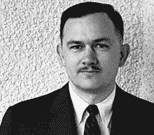
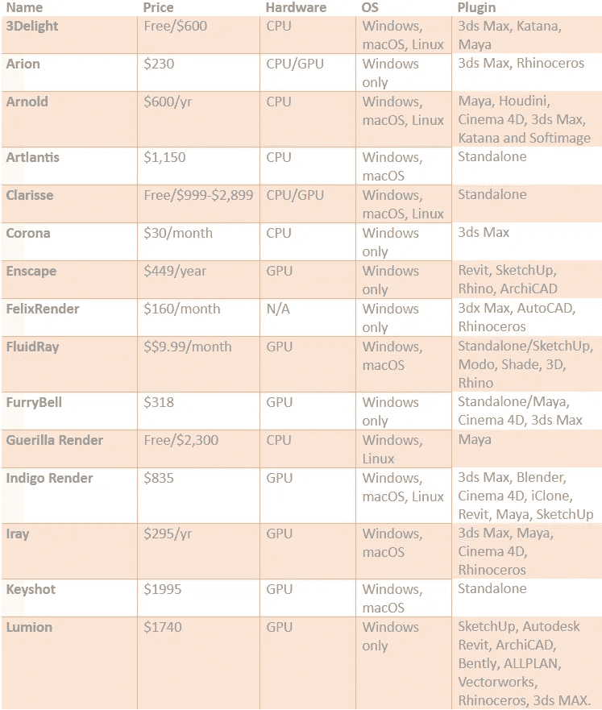

# 3D 渲染的简要说明。

> 原文：<https://medium.datadriveninvestor.com/a-brief-explanation-of-3d-rendering-90590beffd1c?source=collection_archive---------15----------------------->

© [Enter the future of home design with 3d rendering](https://www.supremesupports.com.au/enter-future-home-design-3d-rendering/)

3D 渲染是目前世界上最受欢迎和发展最快的技术之一。但在平面设计或室内设计行业，有些人对这个术语知之甚少。所以，这里是这项技术的内部简介，以及为什么这项技术非常重要，并准备在室内设计行业使用。

如果我们浏览人类物种历史，我们可以看到洞穴里充满了我们祖先绘制的图画。通过进化的漏斗，计算机成为了我们的洞穴，图形设计软件成为了我们的画布。3D 渲染是最新设计的最新进化产物。虽然我们称之为孩子，但这项技术在三十年前就已经开始发展了。从那 30 年到现在，3D 渲染已经足够成熟，可以无缝地使用它。这项技术让我们看到了在 80 年代被认为是不可能的曙光。

3D 渲染不仅仅局限于图形设计行业。由于其巨大的可行平台，这项技术已经超越了一个行业。它只是一个令人敬畏的工程奇迹，用于医疗行业、视频行业、电影行业、建筑行业等等。本文旨在向您传达一个信息，即为什么以及如何在未来的技术进步中使用这种 3D 渲染技术。

# 什么是 3D 渲染？

那么什么是 3D 渲染呢？3D 渲染是二维计算机化线框的表示。这个线框被赋予了完美的阴影、光照、纹理以及常用的工具和材料。有趣的是，看着广告牌或杂志的图形图像，我们不知道这些是使用 3D 建筑渲染制作的。喜欢看钢铁侠电影中托尼·斯塔克穿着他巨大的金属机器人身体与坏人战斗并用手握枪点燃他们吗？我们都喜欢它，但有多少人知道所有的动画都是由 3D 渲染制作的？这项技术无处不在，在杂志上，在电视上，在我们书籍的封面上，在广告中，在更多的数字媒体中。这项技术发展如此之快，以至于我们都跟不上它。

# 3D 渲染的事后分析。

完成 3D 渲染任务需要两种类型的软件，它们是

1.  建模者和
2.  渲染器。

渲染从一个粗略的 3D 模型开始。那个模型是由一系列的几何形状组成的，这些几何形状以三维的方式连接在一起。这些几何形状被称为“多边形”。这些几何形状或多边形是任何数字 3D 建模的主干。使用计算机软件如 3DStudio Max、SketchUp 或 Rhinoceros 3D 来创建和操纵 3D 模型。来自这个软件的模型是最终模型的未精炼版本。模型显示为原始线框场景或对象。原始模型需要通过给它们添加阴影、纹理、人工光源和一些其他滤镜来进行优化。最终产品是纯粹的完善和良好的三维渲染的形状。

还需要一些额外的软件来完成建模和渲染任务。但是这些不是强制性的。它被称为后期制作过程。像 Photoshop 这样的软件给最终产品画龙点睛，使设计栩栩如生。为了完成所有这些耗时且复杂的软件，一个 3D 渲染艺术家必须对这些软件了如指掌。否则，最终产品将不会是最高质量的。

# 3D 渲染的诞生。

飞机很牛逼。它带我们在云层上飞行数千英尺，并在几个小时内穿越大西洋。但是客机的旅程并不像我们想象的那么容易。它有困难。这些困难给了我们一个叫做 3D 渲染的解决方案。你可能会问我，飞机和 3D 渲染有什么关系。是的，有关系。这种关系存在于飞机的驾驶舱中。在那个时候，没有一架飞机有自动驾驶仪。1990 年，一位名叫威廉·费特的计算机图形设计师接到一项任务，要他利用飞机驾驶舱的空闲空间。由于飞行员无聊的长途旅行，需要一个自动驾驶系统。威廉·费特最终得到了一张电脑生成的人体正投影草图。他把它命名为“计算机图形”,从此一切都成为历史。

[William Fetter](https://en.wikipedia.org/wiki/William_Fetter)

跟随威廉·费特的脚步，伊凡·苏泽兰博士一步一步地进行实验。他发明了画板，世界上第一次看到了完整的 3D 计算机建模程序。这种软件使人能够在计算机屏幕上工作或创建图像。这是图形用户界面(GUI)的第一步。

[Dr. Ivan Sutherland](https://en.wikipedia.org/wiki/Ivan_Sutherland)

在那之后，我们都知道发生了什么。一切都发生在我们眼前。计算机变得更快，软件变得更智能，需要处理所有复杂 3D 作品的工具变得复杂。

# 3D 渲染软件/工具

也许你正打算成为一名渲染专家，却找不到最好的软件来做这件事！好，先迈出第一步。开始学习什么是 3d 渲染，以及为什么要学习它。如果你不是来自基层的设计师，那就先学基础。否则就没办法学渲染了。3D 建筑渲染是以照片般的图像设计内部或外部结构的最新技术途径。这就是为什么 3d 建筑渲染服务在世界各地越来越受欢迎，成为一个众所周知的职业。好吧，你是专家？那么这篇文章就是你的道路。我们收集了 22 个最好最先进的渲染软件。这些是动画电影、效果的最佳选择，而不仅仅是做 3d 渲染。三维渲染是三维动画或三维模型的最后阶段。因为 3d 渲染是一个复杂的过程，是电影或建筑行业不可或缺的一部分，所以今天有如此多的软件可用。因此，找到完美且合适的软件来完成特定的工作变得更加困难。为了帮助您找到合适的 3d 渲染软件，我们为您的项目收集了解决方案。

Best Tools & Software for 3D Rendering © [supremesupports.blogspot.com](https://supremesupports.blogspot.com/2018/12/best-tools-for-3d-rendering-in-2018.html)

# 电影中的 3D 渲染

也许这个电影行业(所谓的娱乐业)是受 3D 渲染影响最大的行业。每年都有大量以浣熊、熊猫或无数角色为主角的动画电影上映。我们可以用最现实的方式来看待它们。他们的肢体动作、嘴部动作、表情看起来都是真实的！像皮克斯、梦工厂这样的工作室已经改变了动画娱乐的整个轨迹，包括运动媒体画布。

在 70 年代，计算机生成的图像根本不像今天这样逼真。但当时，看了《星球大战》后，人们哑口无言。他们惊讶地站了起来，心想，他们到底是怎么做到的！‘这是第一次在电影中使用 3D 渲染。这是以前没有人见过的技术。然后进化就发生了。还是最好的硬核导演之一的斯皮尔伯格先生在 1993 年给我们带来了' ***《侏罗纪公园》****'**。它成了世界级的热门歌曲。人们开始适应商业电影中技术的介入。然后好莱坞就想出了' ***T2:审判日*** *'。我们知道那部电影发生了什么。到目前为止，3D 渲染已经完成了它的工作。到目前为止，它对电影业来说是最好的，并将继续给我们带来惊喜！**

# 建筑和设计

借助 3D 渲染，建筑有了一种浪漫的感觉。毫无疑问。它的魅力让虚幻变得真实。我们在谈论建筑，不是吗？不是浪漫的故事！不好意思，我把曲目弄丢了(quink quink)！

好的，想象一个 50 层的建筑，包括它的内部和外部。想象它的墙，它的装饰，它的走廊，它的房间，和许多许多东西。不可能？通过勾画一个建筑所能容纳的每一个基本事物的设计是可能的。但不是在图片模式下，不是吗？在 3D 渲染技术进入建筑行业之前，建筑师、设计师和工程师在他们的客户面前提出了基于图纸草图的想法。但是用浪漫的手法(！再次)的 [3D 渲染服务](https://www.supremesupports.com.au/services/3d-rendering/)中，设计师可以把那张纸上的草图设计成照片般逼真的奇迹，很容易被客户识别。如果客户不想要或不喜欢任何东西，只需将其移除，并用其他预制材料替换即可。3D 渲染是建筑师和设计师最好的朋友。这让他们展示项目，而不是告诉他们。