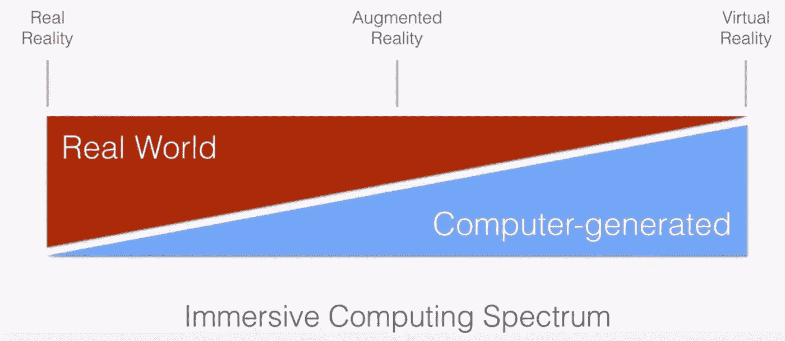
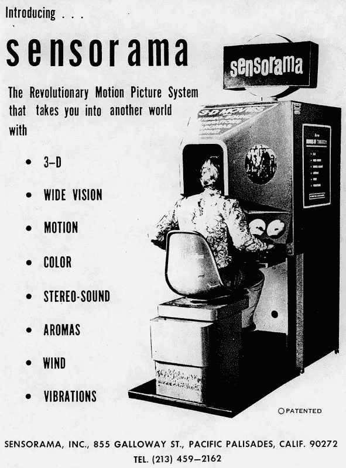

# 增强现实的简史

> 原文：<https://medium.datadriveninvestor.com/a-brief-history-of-augmented-reality-b07dcb7b4221?source=collection_archive---------3----------------------->

([https://www.pexels.com/photo/123335/](https://www.pexels.com/photo/123335/))

“这些事情是相当不可能的，可以肯定的是；但它们是不可能的吗？”L·法兰克·鲍姆(《万能钥匙》，1901 年)

在这篇博客中，我希望给出我的观点并回答几个问题，主要是什么是增强现实以及它从何而来。

经常被提出的问题是增强现实(AR)和虚拟现实(VR)有什么区别。这些术语并不完全可以互换，也不完全不同。正如谷歌增强和虚拟现实副总裁 Clay Bavor 在 2017 年谷歌 I/O 大会上所说。“它们是光谱上点的标签”。

一端是真实世界，另一端是虚拟现实，中间是增强现实。

Google I/O presentation 2017

简单来说，真正的现实是我们每天经历的事情。虚拟现实是一种完全人工的沉浸式现实，而增强现实是真实现实上技术覆盖的混合。

**什么是增强现实？**

[牛津英语词典](https://en.oxforddictionaries.com/definition/augmented_reality)将该术语定义为“一种将计算机生成的图像叠加在用户的真实世界视图上，从而提供合成视图的技术”。我们今天在 Pokémon GO 和 Stack AR 等应用商店的游戏中看到了这一点。还有像 Ikea Place 这样的应用程序，人们可以在购买之前将在线宜家目录中的虚拟家具放入家中，看看它们看起来如何，是否合适。

但是这一切是从哪里开始的呢？

波音公司的研究人员托马斯·考德尔和大卫·米泽尔被广泛认为是在 1992 年创造了“增强现实”这个词的人。当 AR 的第一次工业应用是在波音公司为飞机部件的装配而设计的时候。

考德尔和米泽尔发表的论文中多次提到早期的设计，但没有一个比伊凡·苏泽兰更引人注目。在 IFIP 1965 年的*会议录中，谁写了“[终极展示”](http://www8.informatik.umu.se/~jwworth/The%20Ultimate%20Display.pdf)。更类似于星际旅行全息甲板，电脑可以控制房间内物质的存在。*

从 1966 年开始，在麻省理工学院的林肯实验室，萨瑟兰和他的同事们致力于与头戴式显示器相关的项目。然后，再一次在 1968 年的《IFIP 会议录》中，萨瑟兰写了' [*一个头戴式三维显示器*](http://cacs.usc.edu/education/cs653/Sutherland-HeadmountedDisplay-AFIPS68.pdf) *'这就是通常所说的达摩克利斯之剑。头戴式显示器太重了，不得不悬挂在天花板上。毫无疑问，这被认为是第一批增强/虚拟现实机器之一，但我们能回到更远吗？*

为了找到一个可行的模型，我们只需要再往前追溯一点。1962 年，电影制作人莫顿·赫里格申请了一项名为 [Sensorama 模拟器](http://pdfpiw.uspto.gov/.piw?PageNum=0&docid=03050870&IDKey=355154D24A44&HomeUrl=http%3A%2F%2Fpatft.uspto.gov%2Fnetacgi%2Fnph-Parser%3FSect2%3DPTO1%2526Sect2%3DHITOFF%2526p%3D1%2526u%3D%2Fnetahtml%2FPTO%2Fsearch-bool.html%2526r%3D1%2526f%3DG%2526l%3D50%2526d%3DPALL%2526S1%3D3050870.PN.%2526OS%3DPN%2F3050870%2526RS%3DPN%2F3050870)的专利，这是一种“刺激个人感官以逼真地模拟实际体验的装置”。虽然它最初的应用是为了娱乐。为用户提供骑着摩托车穿过布鲁克林街道的模拟体验。根据他的专利，他设想它的最终用途是在可能对受训者造成伤害的工作和环境中进行教学和训练，如军事训练。不幸的是，该设备从未成功过原型阶段

Advertisement for the sensorama 1960’s

如果我们追溯到更远的世纪，在尝试应用之前，我们还能找到更多增强现实概念的例子吗？有一个这样的例子被广泛认为是第一次提到增强现实。

长度弗兰克·鲍姆在 1901 年写了一个名为“万能钥匙”的短篇故事。故事中出现了一副眼镜，本质上是电的，它可以通过向使用者展示人们额头上的字母来显示佩戴者的性格。

与我们现在称之为增强现实的标准定义保持一致，这绝对符合要求。

在短篇小说导言中，鲍姆写道，“这些事情确实不太可能；但它们是不可能的吗？”。现在我们知道他们不是。

