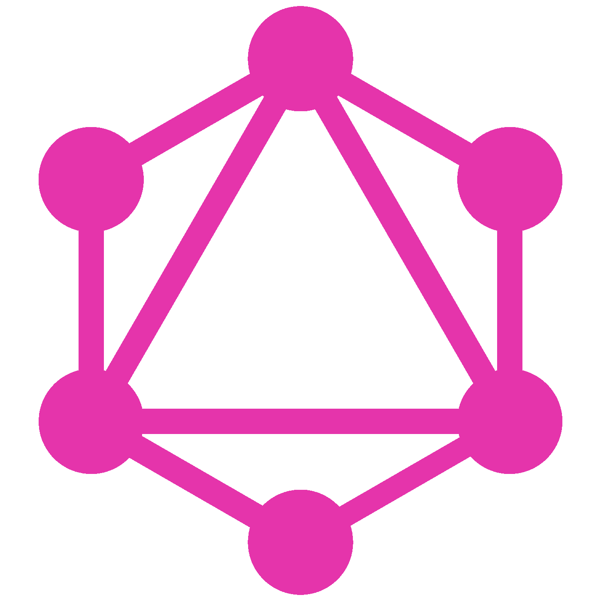
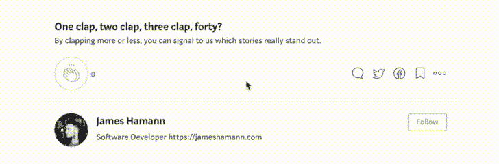

# GraphQL 简介

> 原文：<https://medium.datadriveninvestor.com/a-brief-introduction-into-graphql-62fcb0eb491d?source=collection_archive---------11----------------------->



我知道我参加 GraphQL 聚会有点晚了，但最近有了一些时间，我想我应该在我正在做的一个新的兼职项目中使用它。最初我发现自己有点迷失，但是在通读了[站点](https://graphql.org/)文档并理解了它的目的和它所解决的问题之后，它变得很有意义。

## GraphQL 到底是什么？

创建于 2012 年，由脸书于 2015 年开源，

> GraphQL 是一种 API 查询语言，也是一种用现有数据完成这些查询的运行时语言。

本质上，它是一个描述我们如何从服务器向客户端检索数据的库。一些主要特征是:

*   描述数据的模式
*   在单个请求中检索您需要的或多或少的资源
*   在没有版本控制的情况下持续开发您的 API

让我们更深入地探讨一下这些特性。

## (计划或理论的)纲要

我从一开始就发现了一个巨大的好处，那就是能够在单个模式文档中定义我的数据、数据的类型和关系。GraphQL 是强类型的，这意味着在执行操作之前会检查查询中的所有内容。这确保了语法、数据类型和查询在执行之前都是有效的。

```
**#yourSchema.graphql**type Item {
  id: ID!
  name: String!
  comments: [Comment] 
  description: String
}type Comment {
  id: ID!
  content: String!
  photo: Photo
}
```

这是一个模式文档的基本示例。开箱即用的默认标量类型有五种，分别是**字符串、浮点、整数、布尔**和 **ID。**除了这些默认类型，您还可以创建自定义标量类型，例如，如果您有一个 **Date** 或 **Time** 数据类型，您可以定义一个自定义标量用于您的模式中。**！**表示是否需要字段。

拥有一个模式可以为您的数据提供有用的参考，并确保没有歧义。

## 在单个请求中检索您需要的或多或少的资源

这是非常有用的特性之一。下面的示例查询将检索所有项目的列表。

```
query {
    items {
      id
      name
      description
   }
};
```

然而，假设我们在一个列表视图中，我们可能只需要名称和描述。

```
query {
    items {
      name
      description
  }
};
```

这允许我们只查询和**检索我们需要的数据，**使工作变得更加容易、快速和高效。它还减少了过量提取。

除此之外，我们还能够在查询请求中通过几行额外的代码获取与该项相关的评论。

```
query {
    items {
      id
      name
      comment {
        id
        content
        photo
      }
      description
    }
};
```

现在，假设我们有一个复杂的仪表板视图，需要从多个资源中获取多个属性。没问题！

```
query {
    items {
      name
      description
    }
    comments {
      content 
    }
    todos {
     todo
     description 
    }
};
```

这个请求将从列出的多个资源中只获取我们指定的所需属性。与 REST APIs 不同，它不需要执行许多 http 请求来接收所有需要的数据

## 在没有版本控制的情况下持续开发您的 API

当取消或引入新字段时，REST APIs 需要版本控制，因为服务器指示响应，因此客户端需要能够处理该响应。GraphQL 的关键区别在于查询本身决定了响应，正如上面所强调的，因此无论添加或废弃什么新字段，客户端都是兼容的。

## 赞成的意见

*   快速原型和产品开发
*   减少资源提取过量和不足
*   允许您的 API 在没有版本控制的情况下不断发展
*   强类型— GraphQL 可以确保语法、数据类型和查询在执行前是有效的

## 骗局

*   缓存可能很棘手
*   对于更复杂的用例，查询会变得臃肿、嵌套和复杂
*   典型的速率限制稍有不同，因为只有一个端点，并且每个查询都不同，所以操作要么昂贵，要么便宜。

## 结论

GraphQL 提供了另一种构建客户端-服务器关系的方法，它有助于将您的 API 从它的消费者中分离出来，并使迭代您的产品变得容易，而不用担心引入突破性的变化。

在以后的文章中，我将介绍如何在 AWS 中设置一个无服务器的 GraphQL React 应用程序，并展示更多 GraphQL 的特性和优势。

一如既往，感谢阅读，点击👏如果你喜欢你所读的，一定要关注并跟上未来的文章。

