# ImageJ/斐济简介

> 原文：<https://medium.datadriveninvestor.com/a-brief-introduction-to-imagej-fiji-48fee184a49b?source=collection_archive---------8----------------------->

训练目标类别检测器需要一大组由边界框标注的图像。然而，这个过程非常耗时，这取决于您使用什么工具。我提出了一个工具，将减少耗时的过程。我想介绍的工具是 ImageJ/FIJI。

我出于自己的目的使用了这个工具，我展示了我经常使用的功能。

ImageJ 或 Fiji，这是一个开源的 Java 图像处理程序。

打开斐济应用程序，将单个图像或图像文件夹拖到斐济的窗口。

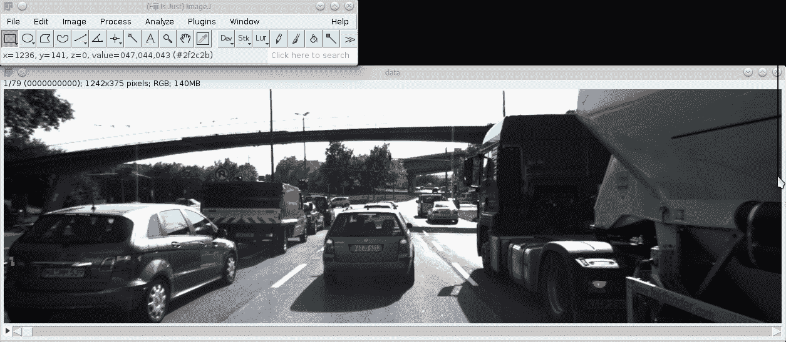

# **工具**

**精选**:

创建矩形、椭圆形或不规则区域选择。

要为对象创建边界框:

使用多边形选择工具创建对象的轮廓。先不要按回车键，你可以通过 CTRL + F(填充对象)/转到编辑->填充或转到分析->设置测量，然后在设置测量后按 m / CTRL + M 保存对象的轮廓。

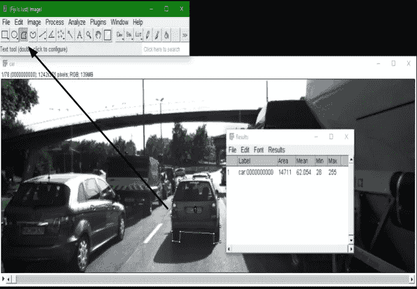

后一种方法将在后面的章节中解释。

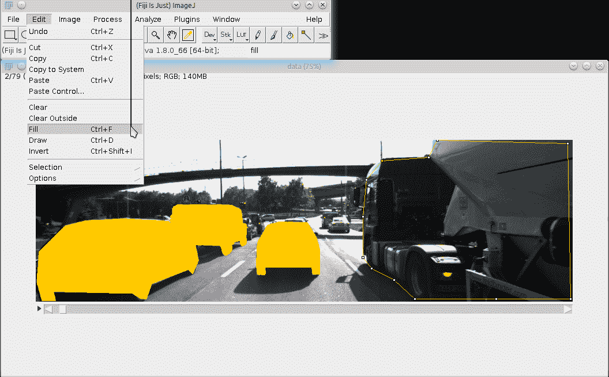

在你画完一个物体的周长后，进入编辑->选区->边界框。

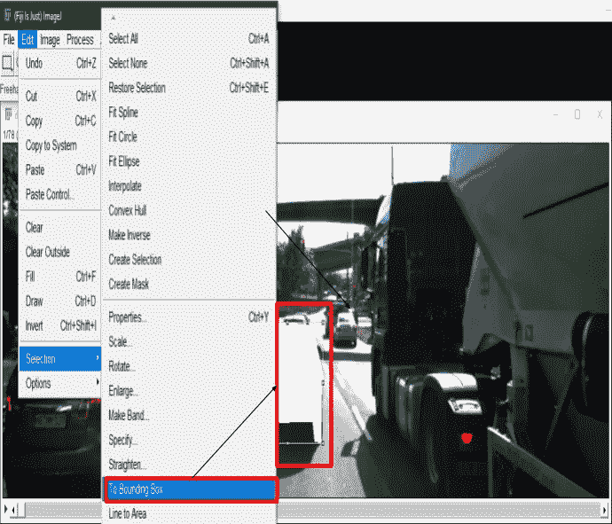

ImageJ 还允许我们使用喷雾罐工具。您可以根据自己的需求配置几个选项。

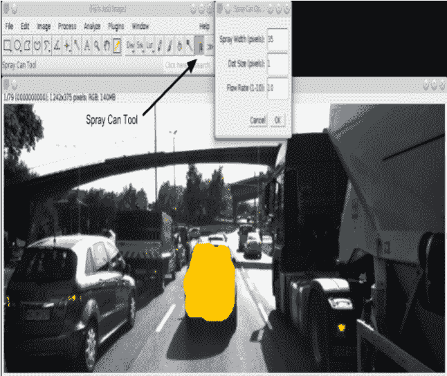

**给物体贴标签**:

我们首先要画出要贴标签的物体的轮廓。接下来，我们必须右键单击对象，然后选择重命名对象所属的组(汽车、人类、骑自行车的人等)。

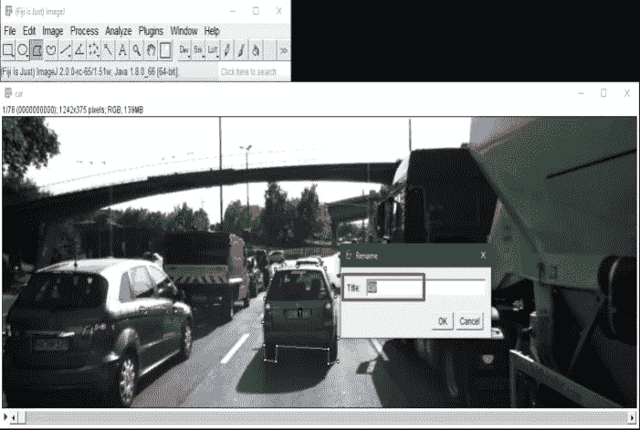

然后我们必须去分析->设置测量。突出显示的是最重要的选项，其余的是可选的。

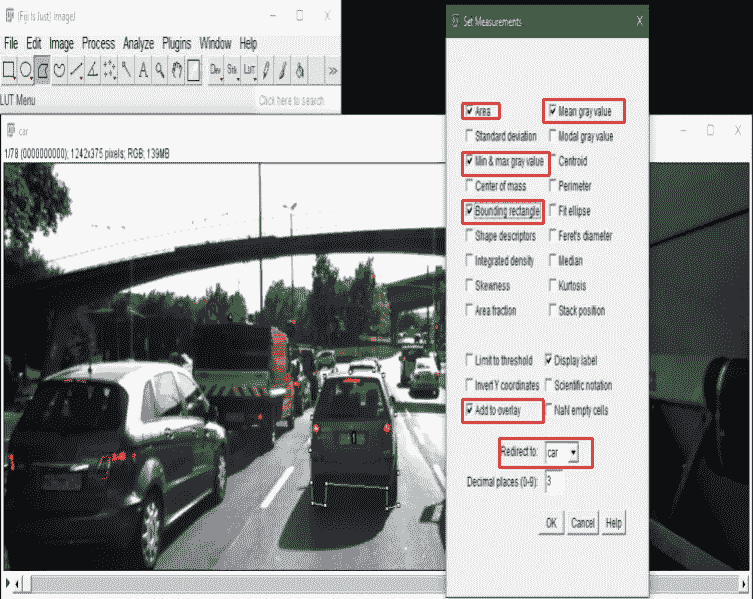

如果您希望保存边界框坐标，进入分析->测量或(CTRL + M ),它也将为每个对象创建一个标签号。

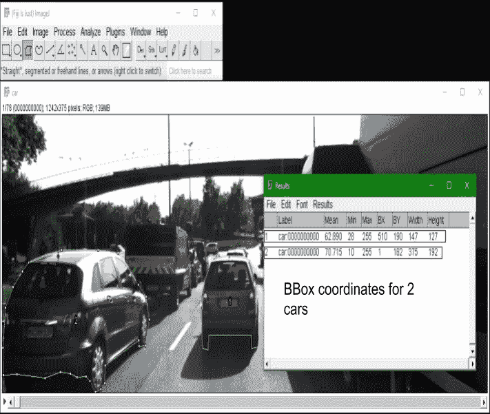

如果您想标记下一个图像，在下一个对象上绘制多边形并左键单击以重命名它，然后只需按 CTRL + M 或者，分析->测量或只需按(M)。

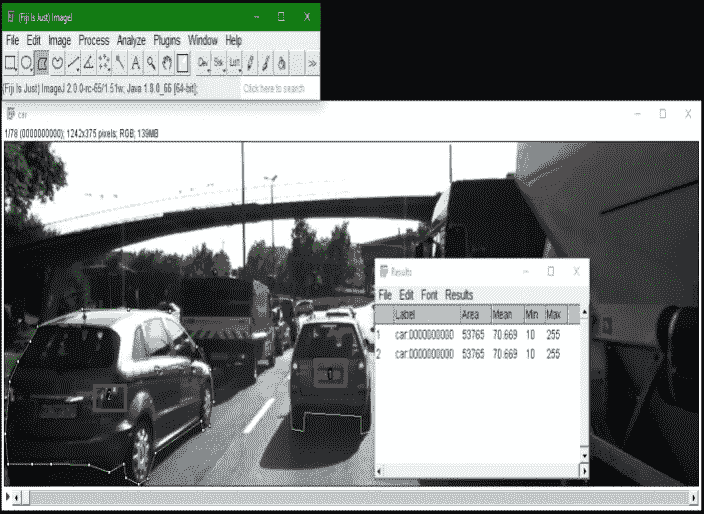

这是它看起来的一个例子，

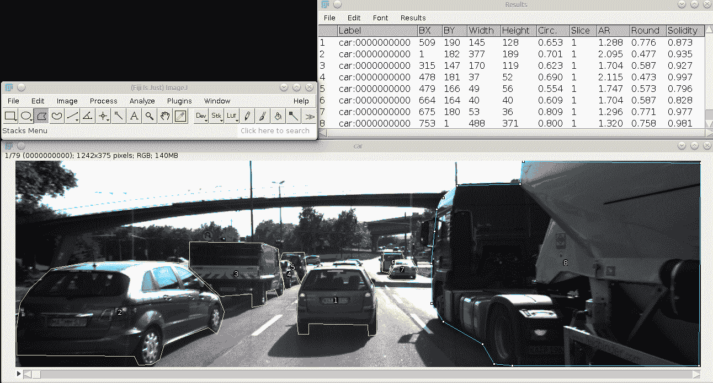

支持对 8 位灰度和 RGB 彩色图像进行平滑、锐化、边缘检测、中值滤波和阈值处理。

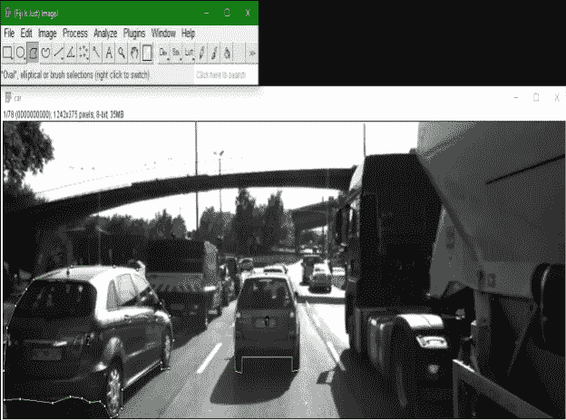

*   **几何运算**:

使用 AND、OR、XOR 或“混合”模式粘贴。给图像添加文本、箭头、矩形、椭圆形或多边形。以下是对 11101 进行 AND 运算后的图像示例。

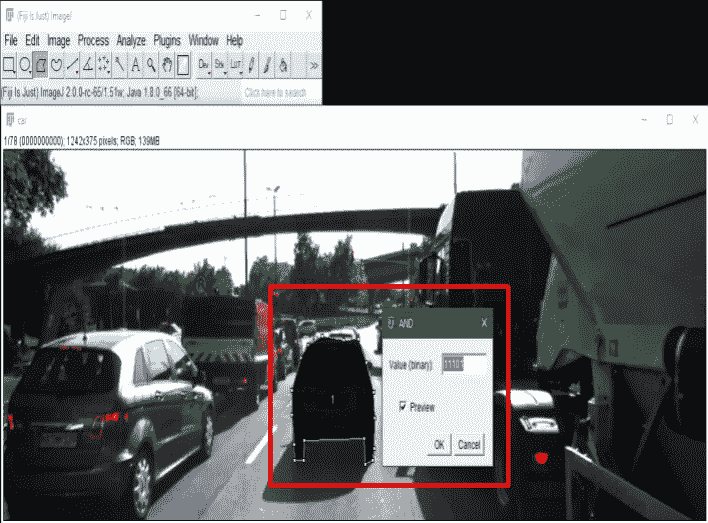

**包围盒:**

要创建边界框，请编辑->选择->到边界框

要创建遮罩，请编辑->选择->创建遮罩。

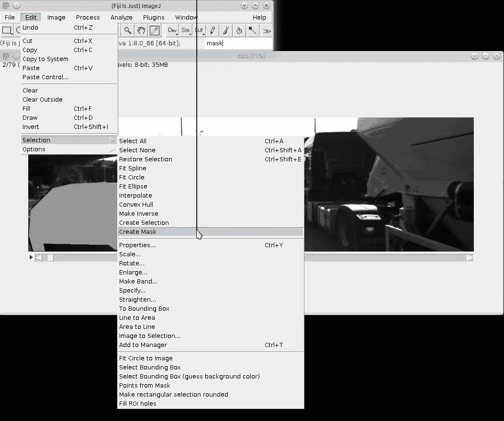

最终结果会像下面这张图片一样，

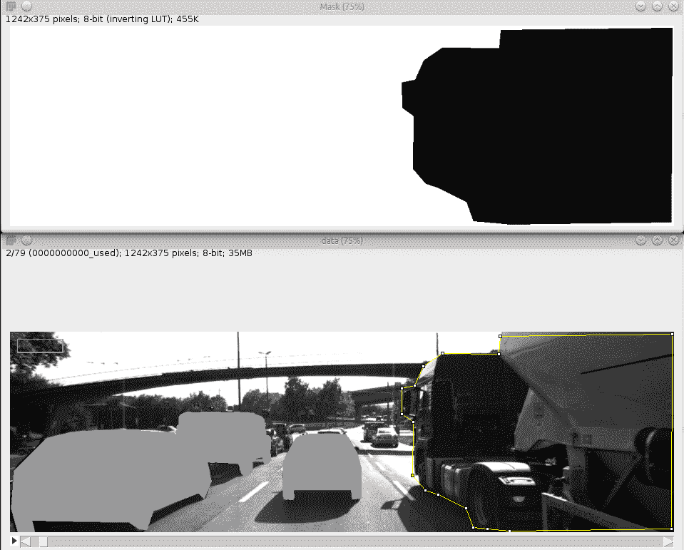

**宏:**

下面的 python 脚本将访问并显示图像或图像堆栈的属性。

```
imp = IJ.getImage()
width = imp.getWidth()
height = imp.getHeight()print(“”)
print(“title:”, imp.getTitle())
print(“width:”, width)
print(“height:”, height)
print(“stack size:”, imp.getStackSize())bitDepth = imp.getBitDepth()
type = “RGB”
**if** bitDepth != 24:
 type = str(bitDepth)+”-bit”
print(“type:”, type)composite = imp.isComposite()
hyperstack = imp.isHyperStack()
print(“composite:”, composite)
print(“hyperstack:”, hyperstack)
**if** composite **or** hyperstack:
 print(“channels:”, imp.getNChannels())
 print(“slices:”, imp.getNSlices())
 print(“frames:”, imp.getNFrames())cal = imp.getCalibration()
scaled = cal.scaled()
print(“scaled:”, scaled)
**if** scaled:
 units = cal.units
 print(“pixel width:”, cal.pixelWidth)
 print(“pixel height:”, cal.pixelHeight)
 print(“pixel depth:”, cal.pixelDepth)
```

下面的 python 脚本创建了一个合成图像。

```
width = height = 1024
ip = ShortProcessor(width,height)
**for** y **in** range(height):
 IJ.showProgress(y,height-1)
 **for** x **in** range(width):
 ip.set(x, y, y)
imp = ImagePlus(“Synthetic Image”, ip)
imp.show()
```

以下 python 脚本反转了一幅图像。

```
imp = IJ.getImage()
ip = imp.getProcessor()
width = ip.getWidth()
height = ip.getHeight()
stats = ip.getStatistics()
**for** y **in** range(height):
 IJ.showProgress(y,height-1)
 **for** x **in** range(width):
 v = ip.getf(x,y)
 ip.setf(x, y, stats.max-(v-stats.min))
imp.updateAndDraw()
```

下面的脚本演示了如何使用 ImageJ 的 RankFilters 类对图像进行中值滤波。

```
imp = IJ.getImage();
ip = imp.getProcessor();
filter = RankFilters();
radius = 5;
filter.rank(ip, radius, RankFilters.MEDIAN);
imp.updateAndDraw();
```

这个脚本演示了如何在 Javascript 中使用 ImageJ 的 RankFilters 类对图像进行中值滤波。

```
img = IJ.getImage();
ip = img.getProcessor();
filter = **new** RankFilters();
radius = 5;
filter.rank(ip, radius, RankFilters.MEDIAN);
img.updateAndDraw();
```

此宏通过将图像复制指定的次数，将单个图像扩展到堆栈中。

```
n = getNumber(“Stack Size:”, 10);
run(“Copy”);
**for** (i=0; i<n-1; i++) {
 run(“Add Slice”);
 run(“Paste”);
}
```

更多的宏脚本可以从:[这里](https://imagej.nih.gov/ij/macros/)和[这里](https://imagej.nih.gov/ij/developer/macro/macros.html)访问和开发。

**功能(跟踪)**:

**跟踪器名称:跟踪器**

# 优势:

*   快速使用
*   容易阈值任何图像

# 缺点:

*   仅适用于某些对象，因为跟踪是基于像素的。

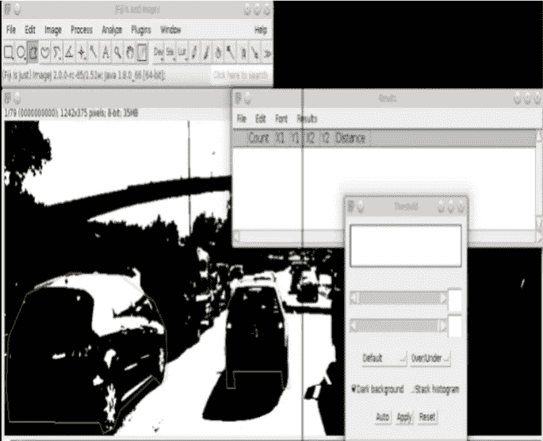

**追踪器名称:** **Trackmate**

# 优势:

*   提供了各种广泛的选项。
*   注释后，所有的帧都自动执行。

# 缺点:

*   很难分析哪个选项适合这项任务。

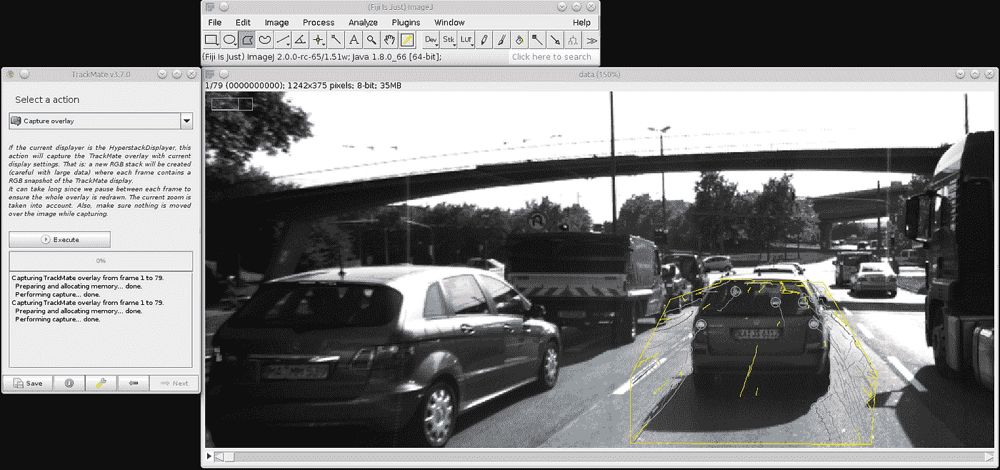

**跟踪器名称:** **MTrack2**

# 优势:

*   适用于形状和大小相似的对象。例如，培养皿中的蠕虫。

# 缺点:

*   不太适合 3D 对象。
*   阈值处理无法准确检测。
*   仅适用于某些对象，因为跟踪是基于像素的。

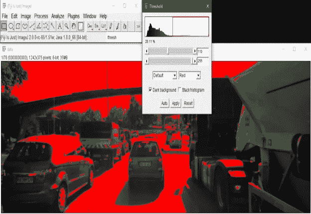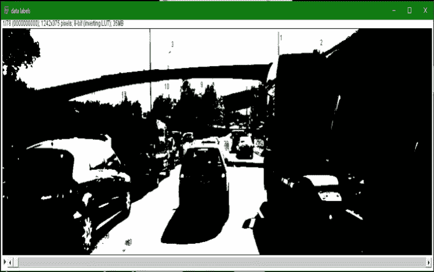

这个题目到此为止。谢谢你坚持到最后！这是我的第一篇文章。非常感谢！