# 正则表达式简介

> 原文：<https://medium.datadriveninvestor.com/a-brief-introduction-to-regex-9a5be64f408b?source=collection_archive---------16----------------------->

## 如何使用它，它有什么用途

在我作为一名程序员的整个历程中，我遇到过一些恼人的问题，包括使用用户输入来搜索数据，或者搜索用户输入来验证某些特定字符的存在。

我如何控制用户输入，以便他们仍然得到他们想要的？如果我的食谱的名字是“威灵顿牛肉”，我从用户那里得到的输入是“威灵顿牛肉”(🧽)或任何其他荒谬的输入，这都没有关系——如果我们诚实的话，这可能来自另一个开发人员。

我在 Flatiron School 的编码训练营已经进行到第 11 周了，我已经很久没有使用 regex 了，所以是时候投入进去了。

正则表达式是(由您指定的)模式，可以帮助您:

*   *确认用户输入符合预定义的格式或要求*
*   *鼓励更强的密码*
*   *查找并替换页面上的文本*
*   *让你的搜索栏更加动态*

超级有用吧？不幸的是，它看起来也像有人吐了一个特殊的键盘主题的字母汤！

No seriously, help, regex is practically unreadable

下面是一个了解正则表达式会有所帮助的例子。在 Flatiron 有一个特别的实践实验室，涉及到用 ruby 编写自定义验证。通常，验证是这样写的:

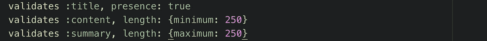

自定义验证是通过引用特定方法编写的，如下所示:

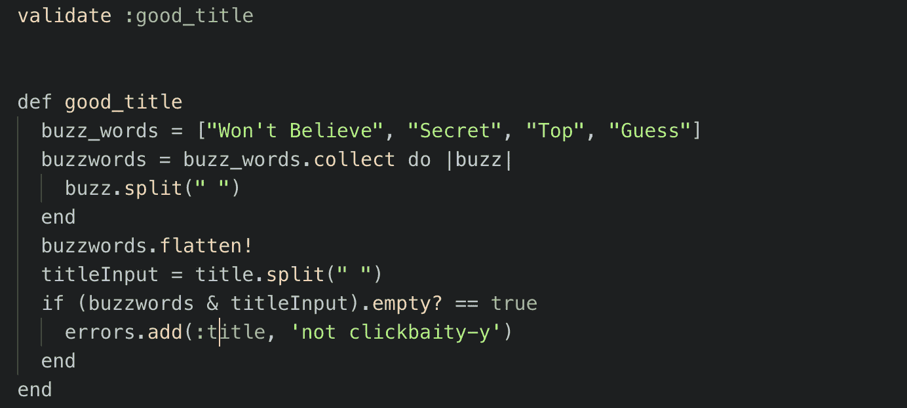

Don’t mind my spelling of clickbait-y 👀

在这个验证中，我们检查用户帖子标题中的流行语。在这种方法中，我将给定的流行语分配给一个变量，映射到每个流行语(或一个案例中的短语)上，并在必要时进行拆分——现在，如果我们考虑本实验中的可交付成果，我已经搞砸了，因为单词“不会”和“相信”比短语“不会相信”的点击率低得多！

在做这一步时，我们通过添加一个“！”结束了嵌套数组，我称之为破坏性展平到表达式的结尾。然后，我们获取用户给定的标题并破坏性地拆分它。

在 ruby 中，我们可以编写[ array1 & array2 ]并返回一个包含公共元素的数组，在本例中是单词。如果数组是空的——这意味着两者之间没有共同的单词——我们添加一个自定义错误，它将显示在用户的视图上。这种解决方案是可行的，但这不是本文的主题。

下面是使用 regex 的解决方案！

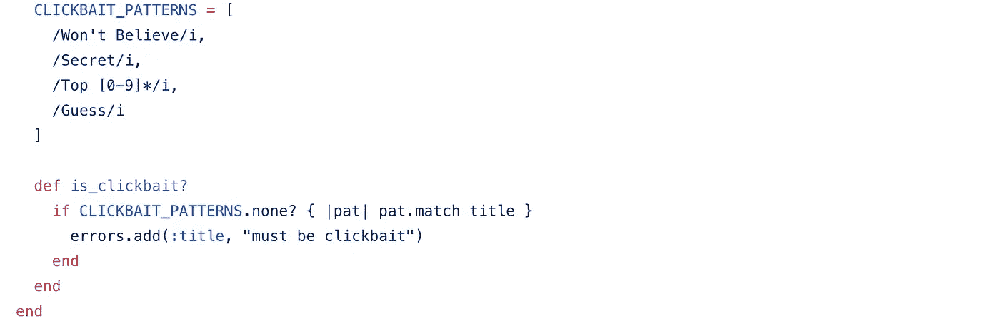

正则表达式(不幸的是)/看起来像这样，因为它们通常以正斜杠开始和结束。在这里，我们使用 **i** 修饰符(或标志)为一个 const 变量分配一个正则表达式模式数组，表示“这些是我想看到的模式，不管它们的大写与否”——“I”代表不区分大小写。这段代码遍历我们预定义的 clickbait 模式(regex ),并检查是否没有一个模式与标题匹配。很好，我们有解决方案，但这是针对一个非常具体的问题。

我的用户用坏了的键盘搜索惠灵顿牛柳的食谱怎么办？我的第一反应是像这样插入用户输入:

> **`/＄{ user input }/i`**

但那在技术上是一个字符串，字符串不是有效的 regex。正则表达式对象构造函数来拯救！(*注:我们现在切换到 react . js)*

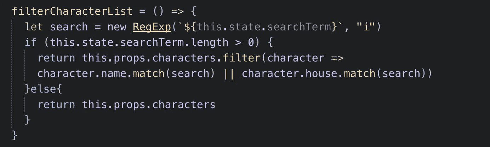

An example for case-insensitive search for Harry Potter characters in an API with a matching name or house

regex 对象构造函数接受一个模式的参数，以及任意数量的有效 regex 标志——正如我前面所说的, **i** 标志用于不区分大小写的匹配。现在，如果我的用户想搜索“惠灵顿牛肉”，我仍然会得到那个食谱！

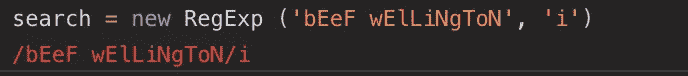

This is how the above code would render

# 旗帜

你知道 Ruby 或 JS 中的‘find’方法吗？Regex 的工作方式与此类似，只是我们可以使用标志来更具体地说明我们希望 find 方法如何工作。让我们看几个例子。

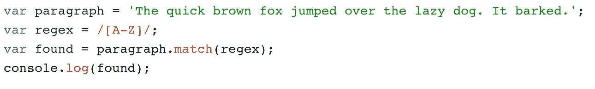

如果没有标志，regex 将在数组的斜线**中找到第一个返回 true 的东西。所以我们上面的代码会返回:["T"]。**

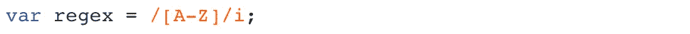

如果我们在正则表达式中添加“I”会怎么样？结果仍然是["T"]，因为 regex 查找的是第一个匹配指定范围的内容，不考虑大小写。那么，如果我们想找到该范围内的每个字母，而不考虑大小写，该怎么办呢？我们实际上可以像这样堆叠标志:

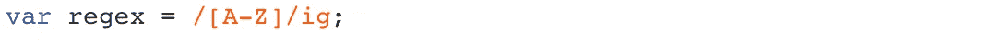

与所有情况一样， **g** 标志返回 regex 表达式中为真的*全局*结果。现在我们的数组将是*(因为这个句子使用字母表中的每个字母至少一次)*:

["T "、" h "、" e "、" q "、" u "、" I "、" c "、" k "、" b "、" r "、" o "、" w "、" n "、" f "、" o "、" x "、" j "、" u "、" m "、" p "、" e "、" d "、" o "、" v "、" e "、" r "、" T "、" h "、" e "、" l "、" a "、" z "、" y "、" d "、" o "、" g "、" I "、" T "、" b "、" a "、" r "、" k "、" e "、" d"]

找数字呢？

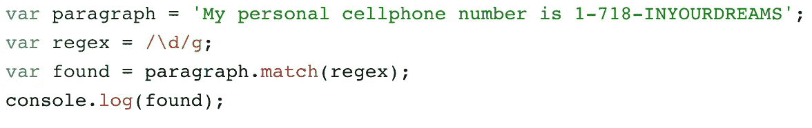

**d** 标志将返回数字字符，而 **g** 标志将返回*全局*结果。上面的代码将返回["1 "、" 7 "、" 1 "、" 8]]，如果我们将 **d** 改为 **D** ，我们将得到所有非数字的字符。您也可以给出一个类似于 **[/abc/ig]** 的字符集来获取这些指定字母的每一次出现。

现在我们知道如何找到对验证有用的东西。但是如果我想做一个用表情符号查找和替换单词的应用程序呢？我们很幸运，因为有一个简单的方法可以做到这一点。

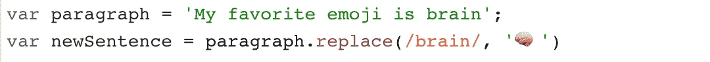

但是这个正则表达式有必要吗？没有。我们可以将/brain/替换为“brain ”,它仍然可以工作。当我们想要替换页面上所有出现的单词“brain”时，正则表达式就变得有用了——然后我们使用全局标志！那么什么时候正则表达式最有用呢？一个非常具体的例子是检查有效的电子邮件地址格式，如下所示:

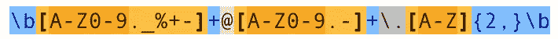

😱

我知道。我们来分析一下。你会注意到它以' \b '开始和结束，这指定了一个**单词边界。**它指定了一个特定的输入或表达式将在哪里开始和结束。括号中的内容是我们电子邮件特定部分允许的内容。

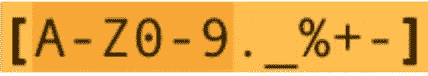

**第一组括号表示**:

*   从 A 到 Z 的所有字母
*   从 0 到 9 的所有数字
*   **。_%+-** (开头的句点是通配符，将匹配其后的任何单个字符，因此我们允许用户的电子邮件中包含这些" **_%+-** "字符)

在第一组和第二组括号之间有一个加号。加号的工作方式与处理常规字符串完全一样，所以我们添加了“@”符号并开始一个新的括号。第二个括号中没有新内容，所以我们将再次跳到括号之间的空格。

像任何编码语言一样，regex 有关键的“单词”或字符。当我们要用‘T8’的时候。作为一个实际的句号，我们必须用一个反斜杠来否定它作为关键字符的力量。继续前进。

括号中的内容也不是什么新东西。但是在它旁边，是所谓的量词**。表达式的这一部分是在说:我接受 A-Z 中的任何字符，但它必须至少是两个字符。如果，出于某种原因，我们只想要扩展名只有两个字符(.欧盟，。我们，。io)我们会写 **{2}** 。这种特定的表达是考虑到域名扩展可以是任何人想要的长度，所以这就像从数字 **2** 到数字 **n** 说，接受字母字符。**

**现在你已经有了一点经验，这里有一些资源可以提升你的正则表达式游戏:**

*   **[正则表达式备忘单](https://www.rexegg.com/regex-quickstart.html)**
*   **[正则表达式教程](https://www.regular-expressions.info/tutorial.html)**
*   **[Javascript 中正则表达式的介绍](https://codeburst.io/an-introduction-to-regular-expressions-regex-in-javascript-1d3559e7ac9a)**
*   **[匹配、搜索、替换](https://gorillalogic.com/blog/regex-match-search-replace/)**
*   **[PregX](https://medium.freecodecamp.org/pregx-for-those-who-wish-to-dodge-regex-250e4a484ee0) —一个常用正则表达式的库。**