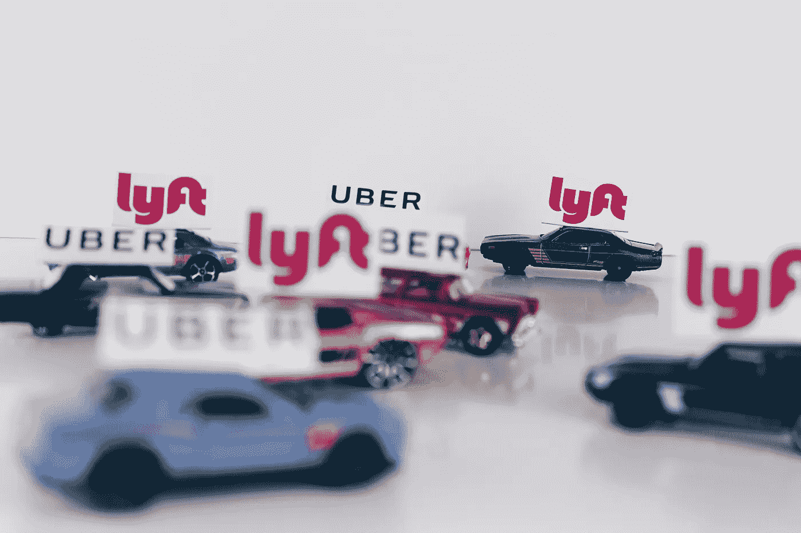
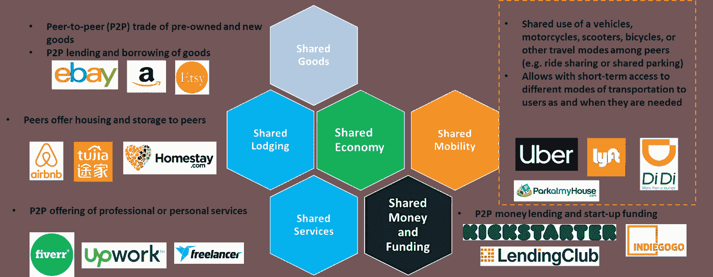
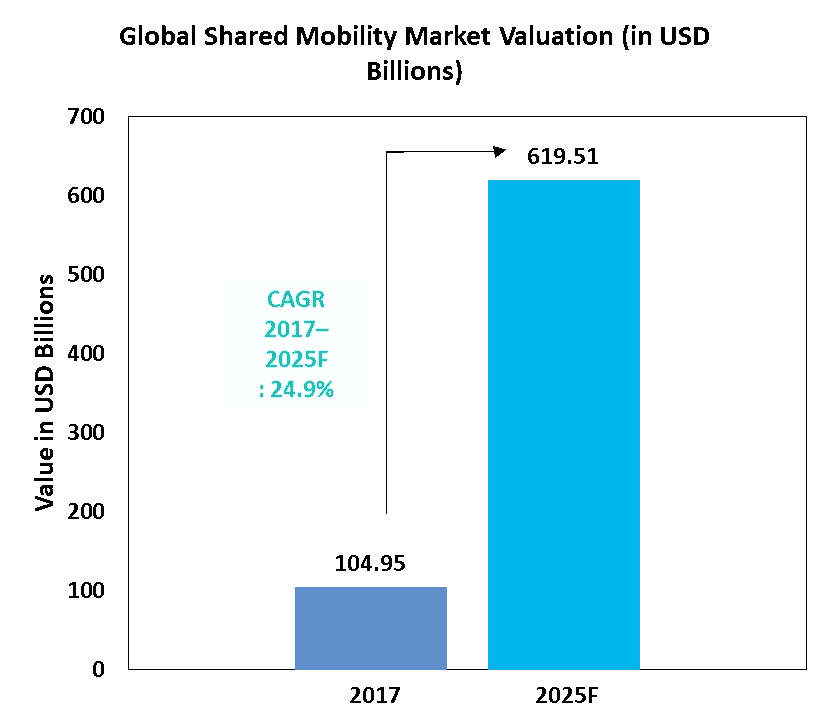
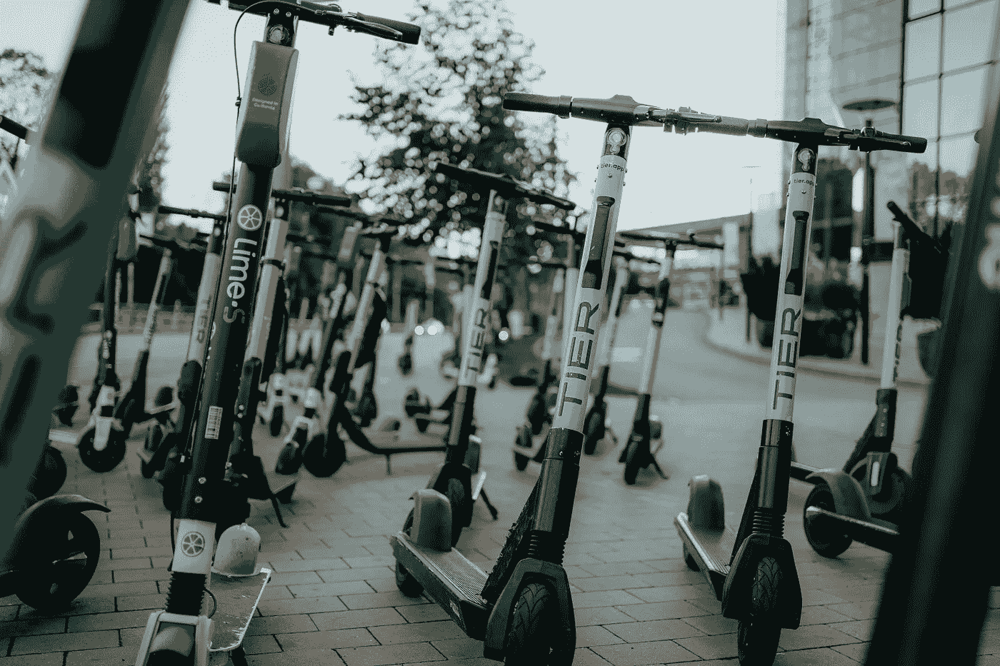

# 共享移动性简介

> 原文：<https://medium.datadriveninvestor.com/a-brief-introduction-to-shared-mobility-ba46b5d1ab34?source=collection_archive---------10----------------------->

全球拼车巨头优步在 2019 年 5 月备受期待的首次公开募股时估值为 755 亿美元。在此之前的几个月，优步的美国竞争对手 Lyft 成为第一家上市的拼车公司，估值为 243 亿美元。尽管之后两家公司的价值都大幅下降(优步目前的价值约为 600 亿美元，而 Lyft 的价值约为 154 亿美元)，但两家公司都专注于通过收购、合作和雄心勃勃的创新来积极扩大市场份额。

这仍然是所有主要运输网络公司(跨国公司)的故事，如滴滴出行、Grab、OLA、Bolt 等。所有这些都通过颠覆性创新快速增长，以解决消费者不断变化的交通相关需求。随着行业重点转向自动驾驶出租车和飞行汽车，共享移动预计将成为未来 10 年增长最快的行业垂直领域之一。

Photo by [Thought Catalog](https://unsplash.com/@thoughtcatalog?utm_source=unsplash&utm_medium=referral&utm_content=creditCopyText) on [Unsplash](https://unsplash.com/search/photos/uber?utm_source=unsplash&utm_medium=referral&utm_content=creditCopyText)

本文将尝试向您简要介绍共享移动性以及这一领域快速增长的原因。

 [## 在自动驾驶汽车发生事故的情况下，谁应该承担法律责任？数据驱动的投资者

### 我仍然认为自动驾驶汽车是一种奢侈品，而不是必需品…

www.datadriveninvestor.com](https://www.datadriveninvestor.com/2018/11/02/who-is-legally-accountable-in-the-case-of-an-autonomous-vehicle-accident/) 

> **什么是“共享移动”？**

简单来说，共享出行就是在同行之间共享使用车辆、摩托车、踏板车、自行车、停车或其他出行方式的“**”T3。允许用户在需要时短期使用不同的交通方式** ”。

共享移动也是一个更广泛的概念的组成部分，这个概念叫做**共享经济或协作消费**。这一概念涉及通过基于互联网的平台直接点对点共享资产和服务。

第一个声名鹊起的此类平台是 P2P 市场**易贝**，它由皮埃尔·奥米迪亚于 1995 年创立，最初名为“**拍卖网**”。根据创始人 Omidyar 的说法，AuctionWeb 上卖出的第一批商品之一是一个坏掉的激光笔，售价 14.83 美元。对高价点感到惊讶，Omidyar 联系了中标者，询问他是否理解激光笔坏了。这位买家在回复邮件中解释道:“我是一名破碎激光笔的收藏家。”

同样，Airbnb 的诞生也发生在室友布莱恩·切斯基(Brian Chesky)和乔·格比亚(Joe Gebbia)决定在他们阁楼公寓的客厅里放一个充气床垫，把它变成一张床和早餐，作为支付房租的额外收入来源。

这些鼓舞人心的故事表明了这个概念的关键成功因素，那就是资产利用的**优化。任何资产(如消费品、仓储设施、房间、车辆、金钱等。)或者对某个人来说没有价值的专业服务对具有不同需求的另一个人来说可能很有价值。**

因此**在过去 10-20 年互联网连接和智能手机使用的快速增长**的鼓舞下，许多精通技术、富有创造力的企业家利用这一概念建立了各种**颠覆性的轻资产公司**。下图说明了共享经济中的一些关键领域以及每个垂直领域中的主要参与者。

***Illustration of the key segments in a shared Economy and key players within each sector***

> **共享移动细分市场的市场规模和增长预测**

共享移动可以被认为是协作消费领域中最具破坏性和增长最快的部分。根据 [Grand View Research](https://www.grandviewresearch.com/industry-analysis/shared-mobility-market) 的数据，2017 年全球共享移动市场价值**1049.5 亿美元**，中国和美国占**近 50%的市场份额**。

然而，由于人口稠密的亚太国家(包括中国和印度)对乘车和汽车共享服务的高度采用，预计到 2025 年，共享移动市场的整体规模将增长到**6195 亿美元**，复合年增长率****【CAGR】****24.9%**令人印象深刻。**

****

*****Source — Industry analysis by Grand View Research, Inc. (***[***https://www.grandviewresearch.com/industry-analysis/shared-mobility-market***](https://www.grandviewresearch.com/industry-analysis/shared-mobility-market)***)*****

> ****共享移动细分市场采用和增长的主要原因是:****

# ****为无力购买和维护私家车的个人提供负担得起的交通选择****

**拥有车辆的成本很高，除了购买价格，车主还需要承担相关费用，如保险、登记、税收、停车和日常维护。因此，尽管许多人渴望拥有汽车，但并不是所有人都买得起。特别是在发展中国家，私人车辆被认为是奢侈品。**

**打车和拼车服务为那些买不起私家车的人提供了一个负担得起的选择。**

# ****提供更灵活的移动选择****

**优步、滴滴出行、OLA 和 Car2Go 等交通网络公司(TNC)提供一系列车辆类型和品牌。客户可以根据旅行目的、预算和到达目的地所需时间等因素选择最佳方案(根据用户偏好，选项可以从豪华豪华轿车到便宜得多的嘟嘟车)。**

**移动选项的灵活性是当前车主采用移动平台的关键驱动因素。**

# ****降低运输成本****

**由于**的轻资产商业模式，**创办跨国公司不需要大量的前期投资。随着类似优步的移动应用程序(称为“优步克隆”)在市场上随处可见，你可以以合理的价格购买或设计一个应用程序。一旦手机应用程序完成，推出这项服务可以通过一个只有几名全职员工的小型公司办公室来完成。因此，在大多数国家的城市地区，跨国公司之间竞争激烈。**

**由于跨国公司供应商之间的竞争，大多数全职出租车司机也与多家跨国公司合作。由于**与跨国公司合作或转换没有任何障碍或成本**，大多数司机倾向于使用多部智能手机，这使他们能够根据可用性无缝选择不同跨国公司的车辆。**

**与司机一样，用户也可以在手机上安装多个 TNC 应用，并根据自己的具体需求选择其中的任何一个。由于竞争激烈，大多数跨国公司试图通过降价和提供频繁的折扣/免费服务来增加使用率，从而赢得市场份额。这一战略大大降低了大多数国家的运输成本。**

**这方面的一个典型例子是我的家乡科伦坡，那里的总人口约为 240 万，由超过 15 家跨国公司提供服务。在我个人的研究中，我采访的大多数司机都与多家跨国公司有合作关系(大多数情况下是 3-4 家)。同样，从用户的角度来看，许多人倾向于使用至少两个应用程序。据用户称，他们经常收到他们所使用的所有跨国公司的报价，因此明智地使用多种应用程序使用户能够大大降低他们的运输成本。**

# ****提供最后一英里和第一英里解决方案****

**这一领域的颠覆性创新为用户的一些主要运输问题提供了有效的解决方案。其中一个解决方案是**引入自行车和踏板车共享平台**以解决公共交通用户的第一英里和最后一英里交通需求。**

****

**Photo by [Jonas Jacobsson](https://unsplash.com/@jonasjacobsson?utm_source=unsplash&utm_medium=referral&utm_content=creditCopyText) on [Unsplash](https://unsplash.com/search/photos/lime-bikes?utm_source=unsplash&utm_medium=referral&utm_content=creditCopyText)**

**自行车和滑板车共享平台(如 JUMP、Lime、Bird 等。)越来越受欢迎，预计将成为共享移动领域增长最快的部分，2018 年至 2025 年的 CAGR 将超过 29%。**

# ****透明和信任****

**优步等移动应用程序允许用户对司机进行评级，并对他们的行为提供反馈。这使得其他用户在选择满意度较低的驾驶员之前更加警惕。此外，这些应用程序允许你与他人分享你的旅行细节，这样你的家人或同事就可以实时跟踪你的旅行。**

**提高透明度的特征增加了消费者对跨国公司的信任，这对采用产生了积极影响。**

# ****减轻各种形式的环境污染****

**随着运输价格因竞争而下降，跨国公司和司机需要想出节约成本的战略来提高利润。一种常见的策略是使用电动汽车。随着电动汽车价格的下降，由于电池价格的大幅下降，电动汽车的购买量正在快速增长。充电技术的进步和充电站的可及性进一步支持了这一点(例如，特斯拉超级充电站网络的快速增长)。此外，电动汽车的维护成本更低。因此，与汽油车相比，考虑到节省燃料，跨国公司的司机使用电动汽车可以节省大量的资金。考虑到这些因素，由共享移动性推动的电动汽车采用的预期增长将对应对全球变暖产生积极影响。**

**此外，电动自行车和电动滑板车在快速增长的自行车和滑板车共享领域的使用也有助于减少城市地区的排放和交通拥堵，从而保护环境。**

**因此，所有因素都被认为是快速的，共享移动领域的增长是不可避免的。随着跨国公司之间的竞争进一步加剧，优步、Lyft 和滴滴出行等有资金支持的主要公司将试图通过专注于更具破坏性的创新(如自动驾驶出租车和空中出租车)来实现差异化，同时通过并购区域公司来加强其全球影响力(例如，滴滴出行收购了 99 家出租车公司，优步收购了 Careem)。**

**我希望在以后的文章中写更多关于这个领域的创新和策略。因此，请在评论中告诉我你的想法和建议。**