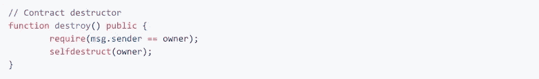

# 智能合同简介

> 原文：<https://medium.datadriveninvestor.com/a-brief-introduction-to-smart-contracts-ac8987891648?source=collection_archive---------25----------------------->

请继续阅读，了解更多关于智能合约的信息——只需 5 分钟左右！

# 什么是智能合同？

智能合同本质上是写入区块链的编码协议。它可以帮助各方以透明和无冲突的方式交换金钱、财产、股票或任何其他有价值的东西，同时避免使用中间人。它是一个“每个人”都可以查看和交互的实例化计算机程序(取决于网络)。

Photo by [rawpixel](https://unsplash.com/photos/nZPnSyeLUcg?utm_source=unsplash&utm_medium=referral&utm_content=creditCopyText) on [Unsplash](https://unsplash.com/search/photos/smart-contract?utm_source=unsplash&utm_medium=referral&utm_content=creditCopyText)

**智能合同的特征**

在没有许可的区块链，智能合同是公开的。这意味着合同(及其执行)是可公开验证的。一个智能契约永远不应该修改其中编写的代码(除非被指示这样做)。它应该运行已经写入协议的代码。智能合约也不应该在执行过程中中途停止运行(除非它被指示这样做)。

区块链是一种分散的对等网络。由于区块链上的每个节点都将收到该区块链上发生的事务的副本，因此效果是网络上的每个对等节点都将重新执行程序的执行，以便通过称为“一致”的协议保持同步。因此，每个节点维护数字签名交易的分类帐的副本。重新执行智能合约代码的内在好处是，所有节点将在某个点上对程序的结果达成一致，因此，智能合约可由整个网络验证。

应当指出，私人交易是以牺牲普查和公开性为代价的，参与交易验证的网络参与者较少。

因此，智能合约可以被视为具有公共状态的可信第三方，并且由于区块链的公共性质，这里与密码学有着重要的联系。

**为什么加密对智能合约很重要？**

每个智能合约都绑定到一个合约帐户，代码执行由从其他合约收到的事务或调用触发。合约账户不能自行发起新的交易；他们只能对收到的其他事务做出响应。密码学是一门将数学函数应用于数据以保证其安全性的科学。这种数据安全性非常重要，可以确保智能合约管理的事务按照预期触发和实现。

Smart Contracts can self destruct — but only if they are told to! [https://github.com/ethereumbook/ethereumbook/blob/develop/07smart-contracts-solidity.asciidoc#intro_chapter](https://github.com/ethereumbook/ethereumbook/blob/develop/07smart-contracts-solidity.asciidoc#intro_chapter)

由于每个合同都存储在世界各地的几台计算机上，智能合同没有单点故障，一旦启动，任何人都无权操纵智能合同，即使是制定智能合同的人也不行。

广义地说，信任区块链是可能的，因为交易是不可变的。发生这种情况是因为每一个新的事务在数学上与以前的事务混合在一起。例如，以太坊的状态有数百万个交易，这些交易被分组为“块”。智能合约的未来成功取决于开发人员构建用户可以信任的更安全的应用程序的能力。