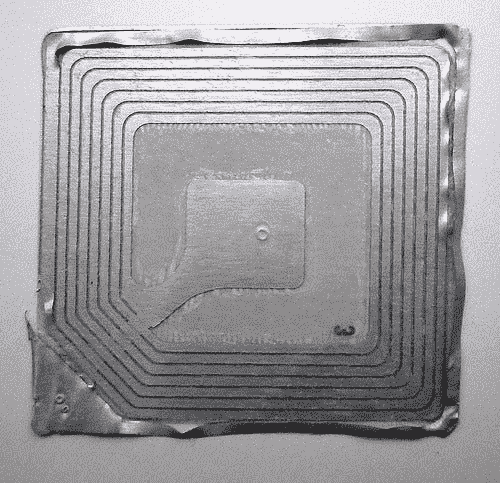

# 物联网简介

> 原文：<https://medium.datadriveninvestor.com/a-brief-introduction-to-the-internet-of-things-d2fa2bf4f436?source=collection_archive---------11----------------------->

伟大的尼古拉·特斯拉在 1926 年说过:

> “当无线技术被完美地应用时，整个地球将被转换成一个巨大的大脑，事实上它就是，所有的事物都是一个真实而有节奏的整体的粒子。不管距离有多远，我们都将能够立即相互交流。不仅如此，通过电视和电话，我们将会看到和听到对方，就像我们面对面一样，尽管中间相隔几千英里；与我们现在的电话相比，我们用来实现他的意愿的工具要简单得多。一个男人将能够在他的背心口袋里携带一个。”

你能想象一辆汽车能够在发生事故时通知紧急服务，告知乘客数量和车辆的确切位置吗？—不要想象，它被称为 e-Call，并且自 2018 年起在欧洲是强制性的。

到 2020 年，将有 240 亿台设备连接到互联网。

“物联网”一词是由英国人 Kevin Ashton 在 1999 年创造的，他是 Auto-ID Lab 的联合创始人，Auto-ID Lab 是麻省理工学院的一个项目，与条形码、RFID 标签和全球贸易有关，今天他也致力于物联网。

在下图中，你可以看到这些标签中的一个，我们今天在任何类型的产品中都可以看到。

Image by [Melanie Hughes](https://www.flickr.com/photos/melanie_hughes/) [CC License](https://creativecommons.org/licenses/by/2.0/)

最初，Auto-ID 实验室的研究重点是产品的可追溯性和库存控制。因此，通过使用 RFID 类型的智能标签，将有可能知道特定对象在哪里，有多少，从而控制替换订单。

阿什顿自己说，物联网是为宝洁公司做的关于 RFID 标签如何工作的演示的标题。

另一份由另一位麻省理工学院研究员签署的基础文件是尼尔·格申菲尔德于 1999 年 1 月出版的《当事情开始思考》。在他的作品中，他谈到了一个充满计算机的社会，但是看不见，藏在墙壁里，汽车里，东西里。格申菲尔德从物理世界和数字世界融合时将发生的技术变革中描绘了世界的未来。

但即使在这个概念存在之前，已经有东西连接到互联网上了。以下是几个例子:

1982.美国匹兹堡卡耐基梅隆大学计算机科学系的一群学生(迈克·卡扎尔、大卫·尼科尔斯、约翰·扎奈和艾弗·达勒姆)在可口可乐机中放置了几个连接到互联网的微型开关，这样他们[就可以从自己的电脑上检查机器](http://www.cs.cmu.edu/~coke/history_long.txt)中是否有软饮料，以及它们是否是冷的。

1990.Dan Lynch,一个名为 Interop Internet Networking Show 的互联网会议的主任,在 1989 年版中挑战了计算机工程师 John Romkey,将烤面包机连接到互联网。如果我这样做,烤面包机将成为 1990 年国会的明星。

Romkey’s toaster

在他的朋友西蒙·哈克特的帮助下,Romkey 设法将烤面包机远程打开和关闭,并且效果,这在 1990 版的 Interop 互联网网络展上展出。在下一版中,Romkey 增加了一个机器人起重机,将面包引入烤面包机。顺便说一句,烤面包机的模型是 Sunbeam Deluxe Automatic Radiant Control。

我们已经看到互联网的未来和演变是如何建立在事物连接到互联网的能力之上的. 感谢计算机的小型化和廉价化, 使我们周围的一切都包含在其内部 连接到互联网的微型计算机.这就是所谓的普遍计算(Ubiquitous computing)。

Andrei Vazhnov talks about ubiquitous computing in his book 2015 [万物网络:物联网与互联经济的未来](https://medium.com/@andreidigital/%C3%ADndice-iot-internet-de-las-cosas-libro-105fd19250e1)

> “互联网和看不见的计算机的概念并不新鲜。1988 年,PARC 实验室的 Mark Weiser 创造了“普遍计算”(ubiquitous computing)一词。Weiser 设想计算机和传感器无形地集成在我们周围,以帮助我们的日常生活。自动调节环境光以提供所需照明的灯具,在唤醒您之前准备新鲜咖啡的闹钟,巧妙地告诉您可以从您凝视的角落看到的预测的窗户,将您识别到房间的引脚,并根据您的喜好调整音乐的温度和音量。不仅仅是我的想象,2015 年我们仍然认为是未来主义的许多发明在 20 世纪 80 年代后期在他们的实验室里都有实验原型。关于他试图建立的技术愿景,他在论文《21 世纪的计算机》中说:“最重要的技术是那些正在消失的技术。它们与我们日常生活的结构交织在一起,直到它们不再与之区分开来。

互联网变得无形，因为它无处不在。在他 1991 年的文章《21 世纪的计算机》中，魏泽谈到了电动机，它在 19 世纪彻底改变了世界，它们是一项昂贵的技术，以至于一家公司拥有一台很棒的电动机，可以用于任何事情。任何人都知道他有多少台电脑，但他几乎不知道他家里有多少台电动机。电动马达作为一种技术已经消失了，它的低价格使它被用于一切事物，因此它几乎看不见了。今天的用户不知道何时使用电动机来升起百叶窗、刷牙、摇动、吸尘等。

道格拉斯·恩格尔巴特说，如果所有的东西都大十倍，蜘蛛就会从天花板上掉下来。鼠标的发明者对事物的大小想了很多，并且知道除非计算机很小，否则它们不能发挥全部潜力。这就是后来建立的摩尔定律。

戈登·摩尔在 1965 年声称，集成电路中的晶体管数量每年都会翻一番，而且这种情况将持续 20 年。从逻辑上讲，这需要元件的小型化。结果是越来越小的设备，越来越强大，越来越便宜。

摩尔定律的应用产生了技术的蔓延。有如此多的电子设备可用，而且如此便宜，以至于它们充斥着一切。

瓦日诺夫说:“智能技术的一个关键设计原则是:计算机不应该问人类一些他们可以自己找到的东西。”

总有一天，事物会开始相互交流并做出决定。例如，当我的汽车检测到交通流量很大，而我比计划的时间晚到家时，它决定警告家用系统延迟启动供暖，或者当我在看电视剧时睡着了，我的智能腕带警告我的电视暂停网飞。

在不久的将来，我们周围的一切都将包括一台与互联网相连的计算机，我们将拥有专门处理日常事务的迷你或微型计算机，以至于我们不知道家里有多少台计算机。

亚马逊已经有了一个实体店，你可以拿任何东西，把它放在你的包里，然后出门，而不用进行任何实物支付，没有排队，没有盒子，没有自动取款机。整个商店布满了传感器和摄像头，可以检测和识别用户，并能够与我们的银行通信，收集我们在商店“购买”的所有商品。东西，在这种情况下，传感器，有能力相互交流，并解决我们的购买，而无需我们做任何事情。

这种类型的商店仍在测试中，我们在日常生活中看不到，但让我们看一个更近的例子。

在西班牙，Repsol 加油站有一个名为 Waylet 的移动支付系统。加油后通过移动电话付款并不令我们惊讶，尽管更有趣的是，我可以在加油站停下我的车，无需任何操作员或泵中包含的 ATM 的合作，我可以告诉移动应用程序我要在 4 号加油，系统会自动释放它并向我收费，而无需之后去任何地方。