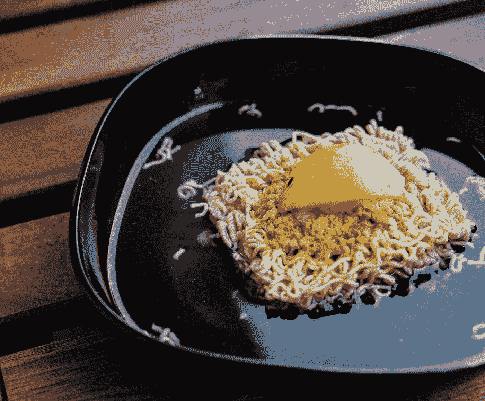

# 对持续的经济稀缺思维的简要反思

> 原文：<https://medium.datadriveninvestor.com/a-brief-reflection-on-the-persistent-mindset-of-economic-scarcity-647a9b9f12f2?source=collection_archive---------6----------------------->

你在贫困中长大，总是听到或看到或感觉到没有钱，或至少不够。你很少去餐馆，当你做饭时，就像吃披萨一样，是一种共享的体验，所以爸爸可以控制成本。你总是吃光你盘子里的所有食物。没人会切面包皮。你处理好事情，因为不会再有第二次了。你在街上或小巷里捡看起来有用的东西。孩子们取笑你的鞋子。

Photo by [Kevin McCutcheon](https://unsplash.com/@kevinmccutcheon?utm_source=unsplash&utm_medium=referral&utm_content=creditCopyText) on [Unsplash](https://unsplash.com/s/photos/cheap?utm_source=unsplash&utm_medium=referral&utm_content=creditCopyText)

后来，如果你成功了，这种心态依然存在。你口袋里可能有 50 美元或 500 美元，银行账户里有 5 万美元，这都没关系。一切都是从寻找交易的角度来看的，这是一个扭曲的经济学和效用方程。你出去吃饭，很想吃牛排，但却勉强接受了一份价格合理的鸡肉三明治。每次都是。你想尝试一种奇特的鸡尾酒，但要坚持喝上好的威士忌。这种思维方式毒害了你理性思考的能力，尽管你会发誓自己因为严重依赖一个错误的想法而变得超理性:为什么要浪费钱？

# 正是在这种“浪费”的观念中，这些线交叉了。

有一次经历(比如旅行，或者一顿新奇的饭)并不是浪费，当你在城镇里的时候吃一顿令人愉快的饭(比如牛排)也不是浪费。但是这种训练却引导你走向另一个方向——它认为食物 90%是营养，8%是味道，2%是体验。所以你寻找交易([营养+口味] /菜价)以优化价值。你无法想象买牛排的过程。

 [## 为什么包容性财富指数比 GDP 更能衡量社会进步？|数据驱动…

### 你不需要成为一个经济奇才或金融大师就能知道 GDP 的定义。即使你从未拿过 ECON 奖…

www.datadriveninvestor.com](https://www.datadriveninvestor.com/2019/03/08/why-inclusive-wealth-index-is-a-better-measure-of-societal-progress-than-gdp/) 

这一概念不受控制地渗透到你对经济交流的看法中。即使是旧货店也只有在打折时才有价值。即使在所有东西都大幅打折的地方，也有这种本地化的“价值”方法，因此在你所在的地方达成“交易”更重要。即使在一元店，似乎也只有买二送一的商品才具有合适的价值比例。旅行也是一样，当你发现自己在一个货币汇率有利的国家，口袋里装满现金时，你会在内部争论四美元的餐馆餐和五十美元的街头餐。

在你的余生中，你都不能放松。这就像拔牙一样，要弄清楚你真正想要的是什么，因为经济礼仪和不惜一切代价的严格节俭的精神干扰破坏了你的内在自我。那个天真单纯的自己，有时会想要一份餐馆牛排，没有借口，没有经济上的考虑，没有负罪感。

# 有时你想倒退成一个没有经济学概念的孩子，对现在的世界只有贪婪的享乐主义反应。

你想在菜单上找到最美味和最吸引人的东西，而不是“最美味但在我可接受的价格范围内且价格合理”的东西。但是你只是。不能。去拿。完毕。的。噪音。你希望有一天看到一些鞋子，然后买下这些该死的东西，因为它们穿在你身上很好看，你喜欢它们，而不是因为它们在打折，是第三好的选择，但绝对是最好的价格。你有钱。你经济稳定。你是你自己最大的敌人，你知道这一点，但你不能改变，因为有一种存在的焦虑爬进你所有的决策机制；一个吱吱声和生锈的活塞，需要注意，只有在做出明智的选择时才会润滑和静音。驱除这种恶魔可能需要一生的时间，就像以前的瘾君子一样，旧的自己就在拐角处徘徊，准备重新加入你的打折餐，怂恿你去查看家具店的划痕和凹痕部分，并斥责你扔掉了一个过熟的香蕉和一些枯萎的蘑菇。嘿，老朋友，还记得我吗？