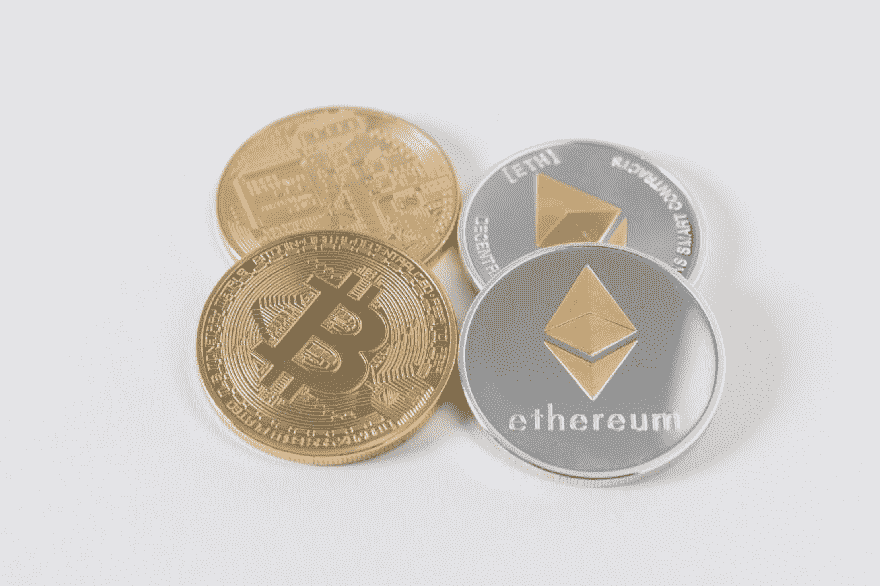
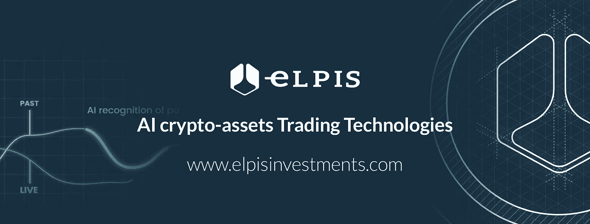

# cryptos 的光明未来:德国最大的交易所和纳斯达克将于 2019 年让 BTC 和瑞士联邦理工学院上市

> 原文：<https://medium.datadriveninvestor.com/a-bright-future-for-cryptos-germanys-biggest-exchanges-moves-and-nasdaq-to-list-them-in-2019-23ff9aa9f137?source=collection_archive---------4----------------------->

根据 ICO Journal [最近的报道](https://theicojournal.com/exclusive-nasdaq-source-the-listing-of-several-coins-will-happen-in-2019/),“一位可靠的纳斯达克消息人士”向该出版物暗示，[纳斯达克](https://www.nasdaq.com/)，目前按总市值计算是世界第二大证券交易所，可能准备好在 2019 年的 Q2**上市比特币和以太坊等主要加密货币。**

[elpisinvestments.com](https://elpisinvestments.com/)

据称，这位“可靠的纳斯达克消息人士”写道:“围绕硬币上市的讨论集中在如何从监管角度对它们进行分类。可以想象，我们的领导力与 SEC 和 CFTC 围绕 cryptos 的传言以及未来 3-6 个月的预期密切相关。即使假定了最长的时间框架，也会提供一些指导，我希望我们会迅速行动。框架(基于两种不同的监管结果的两套不同的框架)已经奠定，以创建一个单独的硬币上市筒仓和一个强大的交易机构。在这里做数学，寻找监管机构在 2019 年的 Q1 提供指导，以及 2019 年在 Q2 宣布或推出的公告和“硬币交易所”

这份报告是在纳斯达克首席执行官 Adena Friedman 今年早些时候接受美国消费者新闻与商业频道的 Squawk Box 采访时发表的，当时她说:“我相信数字货币将继续存在，只是这个空间需要多长时间才能成熟，”Friedman 说。“一旦你看着它说，‘我们想为此提供一个受监管的市场吗？’纳斯达克当然会考虑。"

[elpisinvestments.com](https://elpisinvestments.com/)

7 月，[彭博](https://www.bloomberg.com/news/articles/2018-07-27/crypto-players-gather-as-nasdaq-bids-to-burnish-industry-s-image)报道了纳斯达克在芝加哥举办的一场所谓的“闭门活动”，“有大约 6 家公司的代表参加，包括传统交易所以及 Gemini 和其他加密市场”，该活动旨在“鼓励该行业采取行动，改善其形象，并验证其在全球市场的潜在作用

这些报告提出的观点是，**纳斯达克可能在 2019 年将比特币和以太坊等加密货币上市**，这强化了一个观点，即加密市场目前所经历的不确定性是由于需要一个更广泛和可接受的监管框架，以及来自纳斯达克等主流机构的**日益增长的兴趣将极大地有利于**克服当前的僵局，并帮助加密货币在整个金融领域中合法化。

一些大型欧洲机构正朝着这个方向前进。特别是在德国，德意志交易所集团 刚刚宣布成立一个 24 人团队，“以协调集团在区块链的活动”德意志交易所集团是德国最大的证券交易所运营商，是股票和其他证券交易的市场组织者，市值 1.4 万亿欧元。

德意志交易所集团 DLT 加密资产和新市场结构董事总经理 Jens Hachmeister 是该倡议的负责人[他说](http://deutsche-boerse.com/dbg-en/about-us/insights/The-transformational-potential-of-the-blockchain-technology---a-conversation-with-Jens-Hachmeister/3480150)“看着技术进步的步伐和区块链的变革潜力，**我们可能正站在一个可能颠覆整个行业的新时代的开端**。”

今年早些时候，德国第二大证券交易所**[宣布](https://www.boerse-stuttgart.de/en/company/news/media-relations/media-releases/?ID_NEWS=1365)计划建设一个促进加密货币交易的端到端基础设施，“为加密货币建立一个多边和受监管的交易场所。”rse Stuttgart 管理委员会发言人 Alexander Hö ptner 解释了如何在“交易场所通过我们的 ICO 平台发行代币，可以在二级市场上进行交易。这是 ICOs 的一个重要成功因素，”宣布**比特币或以太坊等加密货币也将被交易，**他说:“我们将帮助促进**对数字资产的接受。”****

****

**[elpisinvestments.com](https://elpisinvestments.com/)**

*****如果您正在寻找一家坚实可靠的人工智能驱动的贸易公司，并希望参与我们的 ICO，请查看我们的网站***[***【www.elpisinvestments.com】***](https://elpisinvestments.com/)***，或者加入我们的*** [***电报***](https://t.me/joinchat/E34qxhL2yukir8BJSGpNMw) ***群直接与我们取得联系。*****

*****如果您想参与 Elpis 投资代币掉落，请访问***[**exchangedrop.com/drops/elpis-investments**](https://exchangedrop.com/drops/elpis-investments)***，并使用您的***[***Ternion***](https://ternion.io/)***账户 ID 注册 Elpis 投资计划。跟随***[***Elpis Investments***](https://elpisinvestments.com/?utm_source=Medium&utm_medium=article&utm_campaign=investoretail&utm_content=mainsale)***和***[***exchange drop***](https://www.facebook.com/exchangedrop)***社交账号进行定期更新。*****

****朱塞佩·索利纳斯****

****首家人工智能驱动的加密和传统资产投资公司 Elpis Investments 主编:**[**www.elpisinvestments.com**](https://elpisinvestments.com/)**、info@elpisinvestments.com****