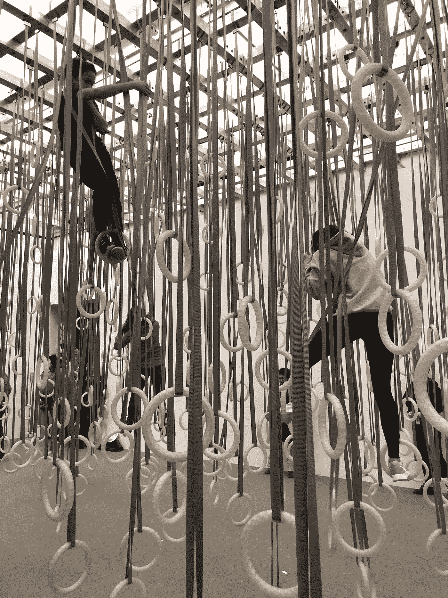

# 创新生涯，第一部分:经验

> 原文：<https://medium.datadriveninvestor.com/a-career-in-innovation-part-1-the-experience-78821bf5b14e?source=collection_archive---------18----------------------->

你是否曾经有过这样一种怪异的感觉，你一直保守的秘密被某个人或某件事微妙地暴露了，而这些人或事根本不可能知道。你有没有和别人交谈过，或者读过一些东西，或者看过一些东西，然后对自己说，“他们是怎么知道的？”

几个月前，我在波士顿当代艺术学院(ICA)就有这种感觉。

这让我笑了。主要是为了不让我哭。

## 一点背景知识

展览*威廉姆·弗西斯:舞蹈物品*是“美国第一个关于国际著名舞蹈指导威廉姆·弗西斯的表演物品、视频装置和互动雕塑的综合展览。”

对于门外汉(我)，威廉姆·弗西斯是一个著名的编舞家，他通过自己独特的“编舞、舞台、灯光和舞蹈分析”方法“重新定义了古典芭蕾”自 20 世纪 90 年代初以来，他还一直在开发艺术装置，旨在“刺激游客的运动”

这一切听起来很好，就像一个有趣的展览，我需要在我爸爸在城里的时候找点事做，所以我们就出发了！

## 欢迎来到丛林

William Forsythe, *The Fact of The Matter, 2009*

展览中的第二件作品是福赛思的*《事实真相》——*本质上是一个巨大的房间，用不同长度的带子从天花板上悬挂着数百个环，并附有只使用环从一端移动到另一端的说明。由于(明显的)责任原因，这是该作品在美国的首次展出。

爸爸和我对自己的身体健康过于自信，决定试一试，于是加入了绕着房间的队伍(每次只允许 10 个人参加)。

就在那时，我开始有种以前经历过这种事情的感觉。

45 分钟后，我只完成了装置的三分之一，在至少八种不同的情况下勉强避免了破裂、扭伤或拉扯某物，我走了出来，靠着墙倒下。

经过一段令人尴尬的恢复时间后，我走向下一个装置，并意识到为什么整个体验感觉如此熟悉。

这是企业创新生涯的完美概括。

## 企业创新者的 45 分钟体验

1.  最初的兴奋是因为“耶！我们要做一些有趣的新东西！”
2.  逐渐接受你必须等待开始，因为有规则，我们需要安全，不能冒任何风险
3.  当你耐心地等待，看着别人试一试，并在互联网上搜索如何成功的技巧时，你会渴望学习
4.  越来越多的人相信，通过观察和学习，你已经学到了足够的东西，可以做得比现在正在尝试的人更好
5.  当你向正在工作的人大声提出建议和指导时，你表现出的那种有益的傲慢
6.  当终于轮到你时，你感觉到的肾上腺素激增
7.  开始时你感觉到的确定性和力量，每只手抓住一枚戒指，把自己拉离地面
8.  害怕把脚放在第一个环上，感觉它朝一个绝对不应该去的方向射出，并意识到这比你想象的要难得多
9.  当你的第一只脚回到控制之下，第二只脚踩在它的环上，意识到你现在不能放弃，因为你还没有取得任何进展，所有你给过建议的人都站在不同的墙边看着你(如果我们要诚实的话，可能会感到非常自满)，这种安静的弹性就扎根了
10.  当你意识到，既然你已经控制了所有的肢体，你需要将一只脚从当前的环移到另一只环时，你会有一种末日感
11.  重复第 8 步到第 10 步，直到你身心俱疲，以至于你不知道自己在想什么，你现在感到肌肉疼痛，而你自己都不知道，你今晚肯定要喝酒。
12.  当你靠在墙上时，回到坚实的土地上，感受到被支持的感觉，然后看着那些对你大喊大叫的年轻人，他们现在正紧紧抓住环和带子
13.  当你选择要不要从头再来一遍时，艰难的自我反省

## 福赛思(显然)知道大多数人不知道的企业创新

1.  直到你*做*某事之前，你什么都不知道:我看到了很多从一端到另一端的方法，我想我有一个绝妙的计划。但是在我抓住第一枚戒指后，我唯一确定的是我需要尽可能地靠近地面。
2.  **做一件事比看着别人做要难得多**:不管你学习或观察别人有多深入，不管你的建议看起来有多“好”，不管你在这方面有多少经验(我的童年是在攀登架上度过的！)，做一些事情总是，*总是*比观察和批评别人更难。
3.  没有一种“最好”的方式，只有适合你的方式:我花了 30 分钟观察人们从一个环走到另一个环。一些人(大多数是孩子)走得很快，看起来毫不费力，一些人采取了更有分寸的方法，一些人(大多数是老年人)保持脚踏实地，只在戒指之间移动他们的手。每个人完成任务的方式都不一样，考虑到他们的能力，努力实现他们自己对成功的定义。
4.  最难的部分是前进:每当我稳住自己，我就感到一股如释重负的暖流。“我有这个，”我会对自己说。然后我会意识到我有一个选择——我可以站着不动，保持安全，或者我可以把我的脚移到另一个环上，从根本上破坏我自己的稳定性，让四肢到处飞，但也更接近我的目标。
5.  **只有当你开始责备的时候，你才会失败:是的，我离目标还差得很远。我没有上半身的力气坚持下去。但是我失败了吗？没有。我知道我需要更加努力地锻炼我的手臂、肩膀和核心力量。其他人在到达终点之前就放弃了吗？没错。是不是有些失败了？是的，他们做到了。他们责怪展览(“当然我没能坚持到最后，这是由专业编舞设计的，只有专业舞者才能做到”)，他们责怪他们无法控制的事情(“我太老了，做不了这个”)，他们责怪其他人(“那个孩子总是挡我的路！”).他们没有庆祝自己开始的勇气，也没有认识到自己学到了什么。他们只是从那个永远不会工作的“愚蠢的装置”中走出来。**

## **隔壁房间**

正当我以为福赛思可能只是幸运地拥有了他的“体验企业创新的职业生涯”装置时，我走进了隔壁房间。他用黑板记下了企业创新者在向更高管理层汇报时所经历的会议进程…

这个故事即将上演。

***

如果您喜欢这篇文章，请与朋友分享，单击👏很多次，跟着我在媒体上。

如果你想了解更多我在创新上阅读和喜欢的内容，请在 LinkedIn 上关注我。

要了解更多关于我如何与企业创新者合作，超越理论和戏剧，让创新发生，请访问我的 [MileZero](http://www.milezero.io) 。

## 来自 DDI 的相关故事:

 [## 数据科学和软件工程哪个更有前途？

### 大约一个月前，当我坐在咖啡馆里为一个客户开发网站时，我发现了这个女人…

medium.com](https://medium.com/datadriveninvestor/which-is-more-promising-data-science-or-software-engineering-7e425e9ec4f4)  [## 股票市场投资的机器学习

### 当你的一个朋友在脸书上传你的新海滩照，平台建议给你的脸加上标签，这是…

medium.com](https://medium.com/datadriveninvestor/machine-learning-for-stock-market-investing-f90ad3478b64)