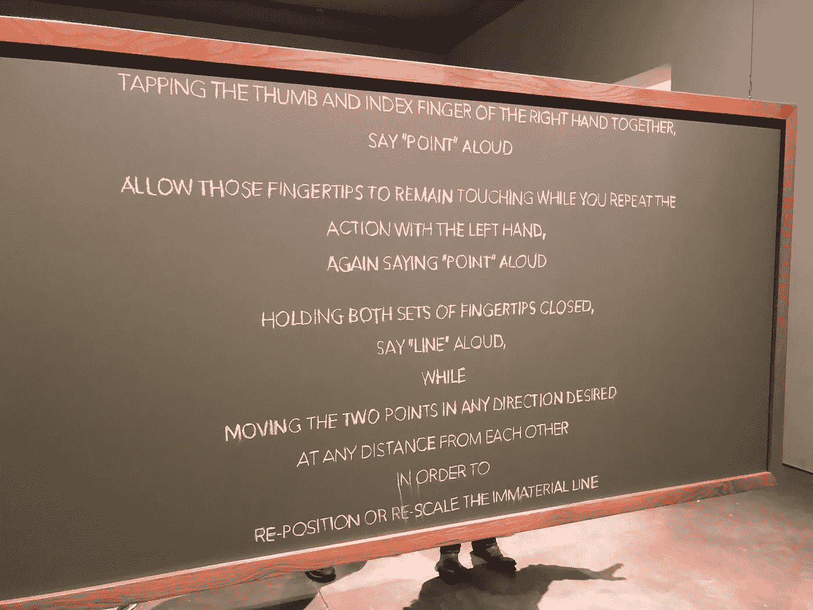
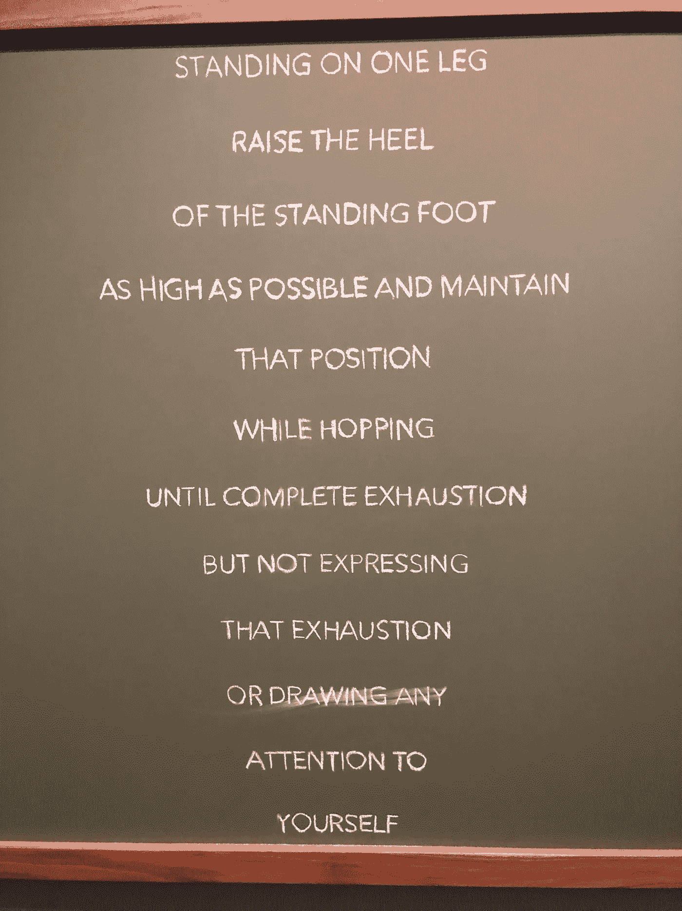
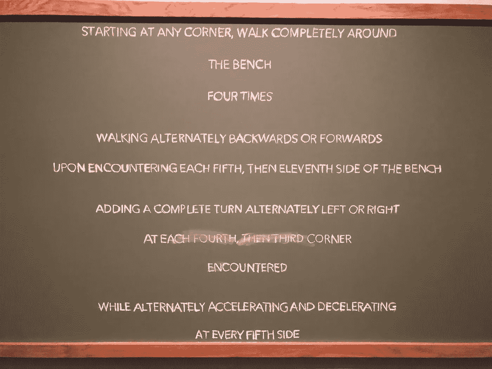
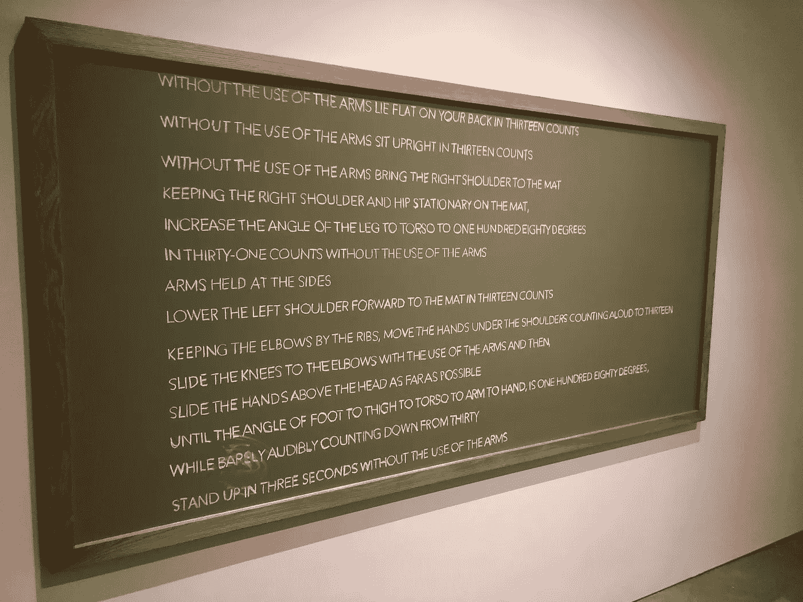

# 创新生涯，第二部分:会议

> 原文：<https://medium.datadriveninvestor.com/a-career-in-innovation-part-2-the-meetings-1d379a7b9c31?source=collection_archive---------17----------------------->

第一部分([在这里阅读](https://medium.com/@rmbolton/a-career-in-innovation-part-1-the-experience-78821bf5b14e))都是关于在企业创新中工作的经历，因此，第二部分自然是关于在上述职业中花费时间最多的领域之一:会议。

在试图通过“事实”(也就是体验创新的职业生涯)时，我几乎拉伤/扭伤/折断了脚踝/手腕/肘部/肩膀/膝盖，我期待着下一个装置的安全。

相反，我走进了“差异室”，也就是企业创新者必须忍受被一系列黑板捕捉到的每一次会议。

## **第一次团队会议**

*“Point Point Line” (2015) from “The Differential Room” (2018) by William Forsythe*

有点奇怪，有点有趣。

就像你作为创新团队成员的第一次会议。

这是你意识到自己身处一个完全不同的世界的时刻。你现在不是在研究那些存在的、可触摸或可体验的、已知的和可解释的事物，而是在一个抽象的、无形的世界里，这个世界依赖于你来定义它、使它变得有形并解释它。

你被给予了工具(制造“点”的手指)，如客户研究、接触公司人员，甚至可能是一点钱，你被期望将他们连接在一起到某个东西(一条线)。采取什么形式取决于你，是产品、服务还是流程(例如，线有多长，是垂直、水平还是对角线)。

你会发现，摆弄各种选项、想象可能发生的事情是相当有趣的，最终，你会真正开始看到你正在创造的东西。

人们走过，给你奇怪的眼神。有些人停下来问你在做什么。你回答，“我想做一笔生意(线)！看吧！是不是很酷？”他们慢慢后退，摇摇头，继续他们的工作。

## 会见创新团队领导

设计业务(产品线)很有趣，但你不能永远呆在那里。是时候继续前进，深入这个过程了。

是时候去见你的老板了。

“Standing on One Leg (1st Act)” (2018) from “The Differential Room” (2018) by William Forsythe

你知道你必须更保守一点，你必须给她看你认为最好的选择(不是你做的、测试过的、废弃的所有线)。所以你准备了一场演讲，兴奋地谈论台词

是的，会议感觉有点像表演，但这就是会议。你感到惊讶的是，在介绍完你的业务后，你的老板告诉你，除了处理你的业务(生产线)，你还需要与财务部门的这个人(用一条腿站立)、法律部门的那个人(抬起站立的那只脚的脚跟)以及供应链部门的这三个人交谈，并且在同一截止日期内完成所有这些工作，没有额外的资金(不要表现出疲惫)，但不要让任何人知道你在做什么，因为那会让你慢下来(不要…引起任何对你自己的注意)。

## 创新委员会会议

你现在因为跳跃而筋疲力尽，但是你成功地隐藏了这种疲惫，你仍然可以做一条线，所以是时候更深入地进入这个过程，并在梯子上移动更多的梯级。

你和你的老板准备另一个演示文稿，然后去见创新委员会——5 个人都比你的老板高一级，不参与团队的日常工作，但肯定感兴趣，有点支持，并有预算继续资助这项工作。

“Starting at Any Corner” (2018) from “The Differential Room” (2018) by William Forsythe

比上一次会议表现得更好，但也是意料之中的。

出于某种原因，他们认为你的业务(line)应该是一种基于应用的服务(bench)，可以提升现有业务的收入，而不是成为新的收入来源。他们要求你制作应用的原型(绕着长凳走)，与现有的业务团队分享原型(交替前进和后退)，根据现有业务团队的反馈修改原型(交替向左或向右完成转弯)，并模拟出一个 5 年的 NPV(交替加速或减速)。

你应该知道会涉及到数字。

## **高管会议**

你花了几次尝试来完成创新委员会的愿望，花费的时间比你想象的要长得多。你的商业理念(line)已经成为遥远的记忆，你现在有了一个基于应用的服务(bench ),它看起来比实际需要的复杂得多，但却让现有的商业团队感到高兴，还有一个财务模型，如果你诚实的话，它有很大的数字，因为你使用了 Goal Seek。

是继续前进的时候了，一直到安装结束和组织的最高层！

“Without the Use of the Arms” (2018) from “The Differential Room” (2018) by William Forsythe

甚至在你开始演讲(表演)之前，问题和反馈就开始向你袭来。

有些要求是可以理解的(仰卧 13 下，坐直 13 下)，但是他们削减了你的预算(不使用手臂)，同时仍然希望你做他们要求的事情。

然后，他们问你是否能在 2 个月内而不是 12 个月内上市(将腿部与躯干的角度增加到 180 度)，并在 12 个月内获得 5 亿美元的收入(保持肘部靠着肋骨，双手放在肩膀下，大声数到 13)。

从某种意义上说，你不再听了，因为这听起来像是胡说八道。他们所要求的是不可能的。

您加入了一个基于应用程序的服务(bench ),每个人都喜欢，理论上看起来也不错，现在您有了…..什么？

还有 BTW，客户调研(分)说人家要你 9 个月前设计的业务(行)！

## **明年规划会议**

你已经放弃了去理解，更不用说采取行动了。但你不是轻易放弃的人。你继续下一个装置。到下一次会议，团队计划在明年召开的会议，请求所需的资源，以便更快地发展和建立更大的业务。

“Towards the Diagnostic Gaze” (2013) by William Forsythe

“看起来明年对公司来说将是一个低迷的年份，所以他们真的需要我们站出来，做更多的事情，创造至少 1 亿美元的收入。也就是说，他们还必须将我们的预算削减 75%，并将我们的团队规模减半。”

FML

**总之……**

平心而论，不是所有公司都这样。但是，说实话，我这周已经进行了 6 次类似的对话。在与不同行业、不同公司的客户交谈中，他们几乎都说了同样的话:

> 在一家大公司做一些新的或不同的事情真的真的很难。尝试也很重要，但我感到沮丧和疲惫，我开始怀疑这是否值得。或者是否有可能。

我知道这么说让他们很痛苦。听到这件事我很难过。

在大型组织中实现创新不仅仅是建立流程、结构和 KPI(这些都是成功的必要条件，但不是充分条件)。

它是关于领导者学习如何以不同于管理现有业务时通常要求的方式思考、行动和反应。

它需要一定程度的乐观、弹性和对目标的信念，而面对越来越有限的资源、越来越短的时间表和越来越弱的组织耐心，人们很难保持这种乐观、弹性和信念。

因此，当我们的信念动摇时，我们会做我们唯一能做的事情:我们与其他处于类似情况的人分享我们的经验，对这些废话一笑置之，并在继续之前深呼吸或休息片刻。

毕竟，隔壁房间里摆满了 80 个悬挂着的钟摆，我们必须躲开它们才能继续展览。

如果您喜欢这篇文章，请与朋友分享，单击👏很多次，跟着我在媒体上。

如果你想了解我在创新方面阅读和喜欢的更多内容，请在 [LinkedIn](http://www.linkedin.com/in/robynmbolton) 上关注我。

要了解更多关于我如何与企业创新者一起超越理论和戏剧，让创新发生，请访问我在 [MileZero](http://www.milezero.io) 。