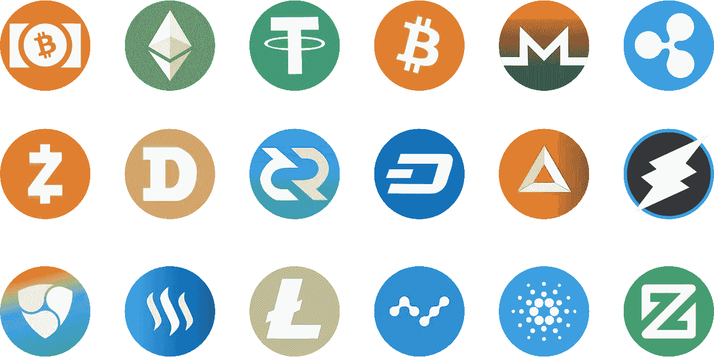

# 让区块链/加密术语更容易理解的案例

> 原文：<https://medium.datadriveninvestor.com/a-case-for-making-the-blockchain-crypto-terminology-more-accessible-e80966b5a6a7?source=collection_archive---------27----------------------->

对于我们这些密码爱好者来说，新兴技术的可能性总是令人兴奋的消息。我们早上醒来，开始在我们选择的社交平台上滚动，我们发现我们最喜欢的硬币一夜之间发生了什么，推出了什么新的 ico 等等。我们陷入了关于区块链未来的无休止的对话，但最终我们并不关心现在发生了什么。最终，我们会想为什么我们钟爱的技术没有被广泛采用。

我给你的答案是:行话。这就是为什么我们不能让人们相信密码是真实的，它不是什么可怕的东西。HODL，ASIC，Altcoins，ICO，STO 什么？我们生活在一个首字母缩写词的世界里，世界上 90%的人都不理解这些首字母缩写词。我们建造这个系统是因为我们想要感觉特别，因为我们想要能够认出彼此，隐藏在复杂的术语后面。嗯，我们应该去掉标签。这并不是说它背后的技术对加密文盲来说太复杂了。有多少人能真正掌握法币背后的货币体系。谁印刷，基于什么，如何分发，如何评估？这些都是复杂的问题，只有少数人知道答案，然而，人们每天都在和钱打交道。我们不需要理解加密背后的一切就能采用它，但我们需要少关注标签和首字母缩写词。

当然，我们还有很多区块链项目的问题，这些项目可以大大改善我们的生活，但它们的展示对普通人和投资者来说真的没有吸引力。没有多少投资者有时间总是确保技术是健全的，进展是真实的。这就是为什么我们应该尽量简化事情。相反，在演示中使用不太花哨的词语不会降低你的项目的价值。正如爱因斯坦所说

一切都应该尽可能简单，而不是更简单。

在 Daicore，我们正在努力平衡投资者和企业之间的领域。我们希望以更简单的方式展示我们列出的项目，以便每个人都能理解。吸引更多的人到奇妙的区块链宇宙意味着打破泡沫。我们需要更加开放，我们需要能够向任何人解释我们在做什么。

