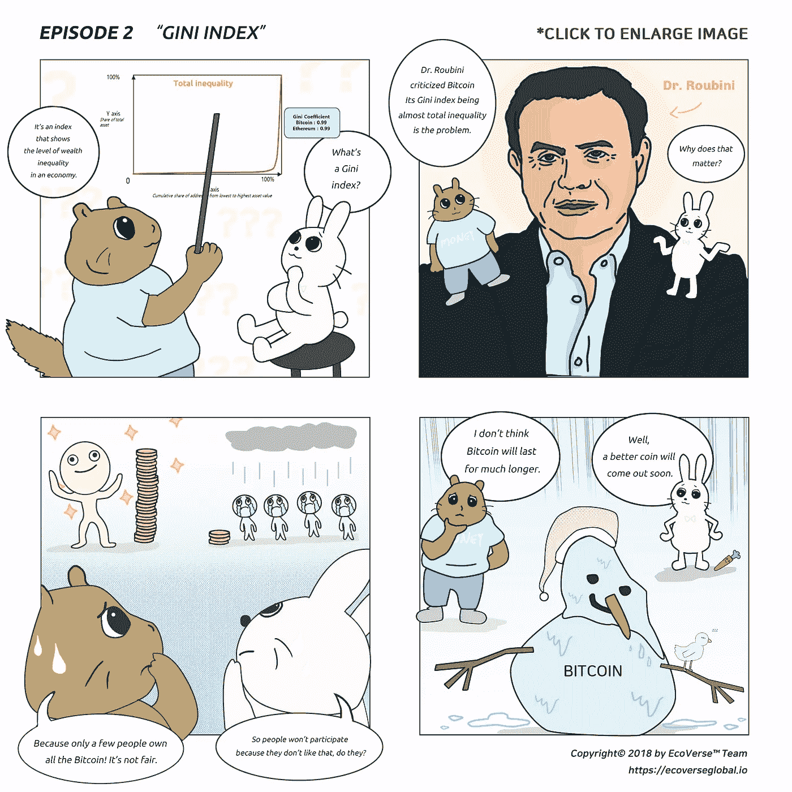

# 对“末日博士”鲁比尼的挑战:来达沃斯，让我们辩论。(已修订)

> 原文：<https://medium.datadriveninvestor.com/a-challenge-to-dr-doom-roubini-come-to-davos-lets-debate-254a53fb4d98?source=collection_archive---------23----------------------->

人是发明家，总是追求下一个伟大的创新。然而，一项发明的第一次迭代可能是平庸的。因此，他们被许多权威人士嘲笑，被视为骗子、骗子，甚至被关进监狱。

例如，第一辆汽车是由一个名叫库诺特的发明家制造的。他的蒸汽机汽车在当时是相当创新的，然而，它的性能并不比一辆畜力车好。它的最大速度不超过每小时 5 公里，而且因为水分蒸发太快，它不能行驶超过 15 公里。也许最令人不快的是，没有刹车。这意味着当面对下坡时，事故是不可避免的。库格诺特入狱两年，可能是因为鲁莽驾驶。[1]

关于加密货币，很多人称之为骗局。就连著名的研究员，无疑是当今最聪明的头脑之一的“末日博士”鲁比尼也称之为人类历史上“所有泡沫之母和之父”。[2]

我能理解他来自哪里。我甚至同意大多数密码都设计得很差——包括比特币、以太坊、EOS 等等。我同意有泡沫要破裂。然而，即使它们最初看起来是平庸的创新，我与他的不同之处在于，我相信平庸是可以克服的。crypto 的发明将把我们带到一个全新经济的世界，就像 Cugnot 的有缺陷的汽车最终将我们引向飞往月球的技术一样。

现在，我邀请鲁比尼博士于 2019 年 1 月来到达沃斯，就以下问题展开辩论:

*   密码目前毫无用处。在未来，它们还会继续没用，走向灭绝吗？
*   我们能克服平庸，实现一个全新的、分散经济的新世界吗？

因预测 2008 年金融危机而闻名的经济学家鲁比尼博士没有看到加密货币与危机的区别:加密货币的平庸可以被克服；2008 年的危机不能。

参考

[1]维基百科。[https://en.wikipedia.org/wiki/Nicolas-Joseph_Cugnot](https://en.wikipedia.org/wiki/Nicolas-Joseph_Cugnot)T2【2】众筹内幕。努里埃尔·鲁比尼博士准备了证词:“加密是所有骗局之母”&区块链有史以来最被夸大的技术。[https://bit.ly/2PQs4b7](https://bit.ly/2PQs4b7)