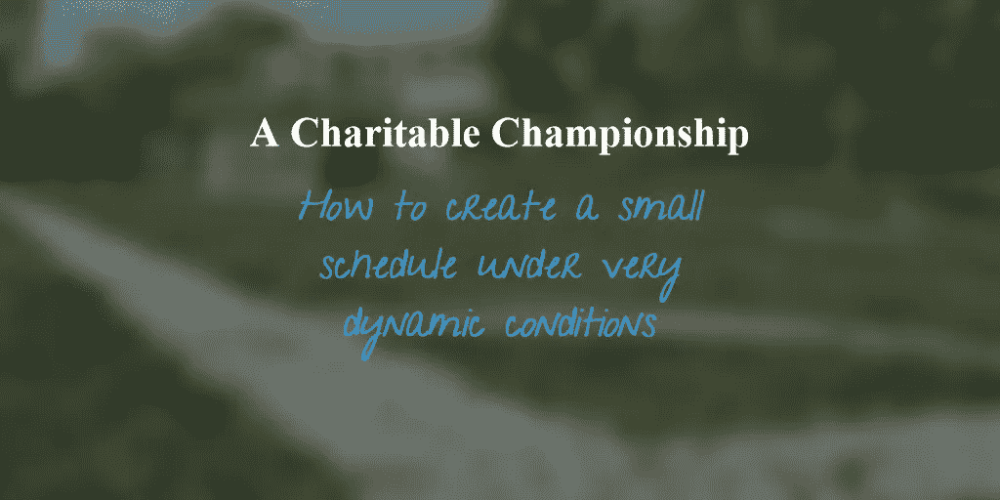
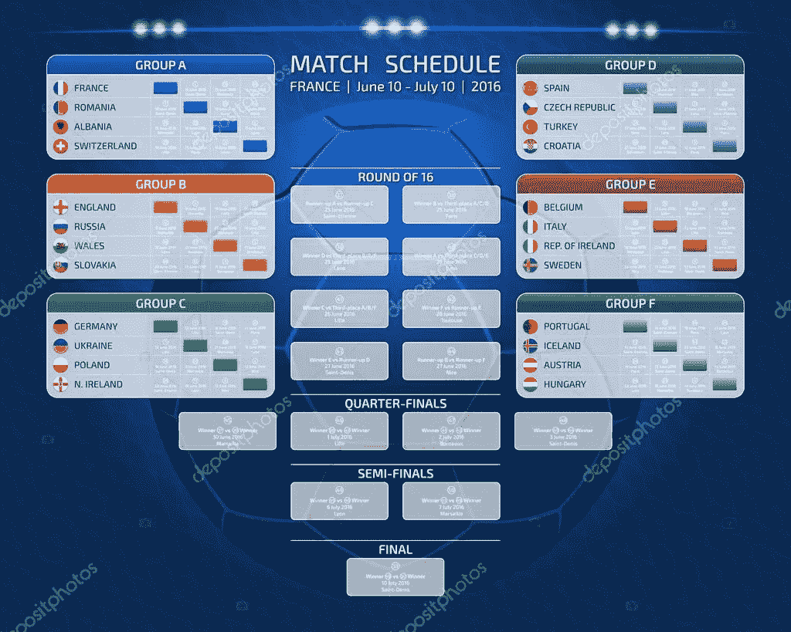

# 慈善锦标赛

> 原文：<https://medium.datadriveninvestor.com/a-charitable-championship-f230f20c917f?source=collection_archive---------13----------------------->

[](http://www.track.datadriveninvestor.com/1B9E)

假设您的客户是一个非盈利组织，想要在青少年中组织一次锦标赛。想象一下，你被要求创建一个占据一定数量足球场的时间表。锦标赛的规则有可能会改变(无论是季后赛还是联赛)，也有可能在最后一分钟给我们的客户一个新的球场。

事实上，有趣的是，不同的球队以分散的方式比赛，包括友谊赛在内，以使用球场。


Sometimes the most complicated problem is what to do with so many idle teenagers.

这篇文章试图展示如何将所有的日程表分组，用一个任意的数字进行索引，从而在最后时刻决定哪个是最终的日程表。所以特点是:

[](https://www.datadriveninvestor.com/2019/02/21/best-coding-languages-to-learn-in-2019/) [## 2019 年最值得学习的编码语言——数据驱动的投资者

### 在我读大学的那几年，我跳过了很多次夜游去学习 Java，希望有一天它能帮助我在…

www.datadriveninvestor.com](https://www.datadriveninvestor.com/2019/02/21/best-coding-languages-to-learn-in-2019/) 

*   小时间表。
*   动态编程。
*   任务不能长时间闲置。
*   这可能是可取的分配时间，即使他们在锦标赛之外。
*   每场比赛需要整整一个小时。

# 履行

一场**比赛**是四人赛(*第一队*、*第二队*、*哪场赢了*、*哪场输了*)。因此，在每场比赛后，我们将使用比赛的四倍重命名获胜者。如果**锦标赛**的*组织*是一个**比赛**四人组的名单，那么一个**锦标赛**必须定义为一个三人组(*球队名单*、*球场数*、*组织*)。

在创建了**锦标赛**之后，你可以花费的小时数被提供，所以是时候根据任意标准(一个整数)通过所有可用的差距来分配任务了。

代码(你可以在这篇文章的末尾找到一个链接)将以一种**自上而下**的方式显示:假设我们有 2 场比赛和 3 个小时来结束**冠军赛**，我们有一个比赛的模式:

```
def test(seed = 0, pitches = 2, hours = 3):
    O =[("t1", "t2", "w1", "l1"),
       ("t3", "t4", "w2", "l2"),
       ("w2", "e5", "w3", "l3"),
       ("w1", "w3", "w4", "l4")]
    teams = Championship.findTeams(O)
    C = Championship(teams, pitches, O)
    C.generateTimetable()
    if hours>1:
        C.merge(seed, hours)
    return C
```

构造函数及其清单的下一段代码:

```
class Championship:
    def __init__(self, I = [], P = 1, O = []):
        self.I = I
        self.P = P
        self.O = O self.teamAval = Championship._init_teamAval(I)
        self.pitchAval = Championship._init_pitchAval(P)
        self.played = 0  #matches played in the object Champ. self.timetable=[[] for p in range(self.P)] @staticmethod
    def findTeams(matches):
        T = set([])
        for A, B, C, D in matches:
            T.add(A)
            T.add(B)
        return list(T) @staticmethod
    def _init_teamAval(teams):
        R = {}
        for e in teams:
            R[e] = 0      # First Hour avalaible
        return R @staticmethod
    def _init_pitchAval(pitches):
        R = {}
        for p in range(pitches):
            R[p] = []     # Hours in a pitch
        return R def list(self):
        for p in range(self.P):
            print("Pitch ", p)
            for h in range(len(self.timetable[p])):
                print("Hour:", h, "Teams:",*self.timetable[p][h])
            print("--------------")
```

如果你读了这篇文章，你将能够输入(并得到即时回复):

```
>>> test(24).list()
Pitch  0
Hour: 0 Teams: t1 t2 w1 l1
Hour: 1 Teams: l1 l2 -- --
Hour: 2 Teams: w1 w3 w4 l4
--------------
Pitch  1
Hour: 0 Teams: t3 t4 w2 l2
Hour: 1 Teams: w2 e5 w3 l3
Hour: 2 Teams: l3 l1 -- --
--------------
>>> test(25).list()
Pitch  0
Hour: 0 Teams: t1 t2 w1 l1
Hour: 1 Teams: l1 l2 -- --
Hour: 2 Teams: w1 w3 w4 l4
--------------
Pitch  1
Hour: 0 Teams: t3 t4 w2 l2
Hour: 1 Teams: w2 e5 w3 l3
Hour: 2 Teams: l3 l1 -- --
--------------
```

我们有两个主要功能要开发:

*   如何生成时间表
*   如何交换时间表中的时间



Before optimizing the hours it is necessary to assemble the teams independently of the time that is available.

# 生成时间表。尽可能短的时间。

在动态编程中，只有一种方法可以生成锦标赛的赛程，那就是比赛。

```
def generateTimetable(self):
        while self.playMatch():
            passdef playMatch(self):
        if self.played == len(self.O):
            return False
        (team1, team2, winner, loser) = self.O[self.played]
        if not team1 in self.teamAval:
            raise OutOfOrder(team1)
        if not team2 in self.teamAval:
            raise OutOfOrder(team2)
        playHour = max(self.teamAval[team1], self.teamAval[team2])
        for p in range(self.P):
            if not playHour in self.pitchAval[p]:
                playHour -= 1
                break
        playHour += 1
        self.pitchAval[p].append(playHour)
        if len(self.timetable[p]) > playHour:
            self.timetable[p][playHour] = (team1, team2,                                                                      winner, loser)
        else:
            self.timetable[p].append((team1, team2, winner, loser))
        if not winner == None:
            self.teamAval[winner] = playHour + 1
        if not loser == None:
            self.teamAval[loser] = playHour + 1
        self.played += 1
        return True
```

在这段代码中，我们可以观察到有一个无序异常，它是在*self . teama val*[*aTeam*确定团队未注册， *teamaval* 告诉我们该团队的第一个游戏小时是什么时候时产生的。如果在锦标赛的组织中没有正确地呼叫获胜者，就会产生这种情况:例如，获胜者必须在参与者之后比赛。

```
class OutOfOrder (Exception):
    def __init__(self, team):
        self.team = team
```

因此，两个团队可以玩的第一个小时必须在 *teamAval* 为每个团队设定的最小小时的最大值内:

```
playHour = max(self.teamAval[team1], self.teamAval[team2])
for p in range(self.P):
    if not playHour in self.pitchAval[p]:
         playHour -= 1
         break
playHour += 1
self.pitchAval[p].append(playHour)
```

上面的代码描述了在找到第一个可用小时后，如何在他可用的第一个小时中进行推销。

目标是代码的这一部分，它进行分配:

```
if len(self.timetable[p]) > playHour:
    self.timetable[p][playHour] = (team1, team2, winner, loser)
else:
    self.timetable[p].append((team1, team2, winner, loser))
```

最后一部分将*赢家*和*输家*注册为*团队*，并注册这场比赛是在锦标赛中进行的。

```
if not winner == None:
            self.teamAval[winner] = playHour + 1
if not loser == None:
            self.teamAval[loser] = playHour + 1
self.played += 1
```

正如你所看到的，这部分代码非常简单，考虑到*组织*直接负责确定我们所需要的最少推销时间。所以它总是会生成一个时间表。

# 交换时间。现在我们将使用时间用户。

为了优化所有可用时间的匹配，您可以使用一个简单的排列函数，但在这种情况下，我们将使用一个特殊的 *spendHour* 方法进行合并: *spendHour* 将用于**扩展**用户提供的所有时间的时间表。

```
def merge(self, criteria, hours):
        'Swap pitches based on criteria'
        self.spendHour(hours)
        for hour in range(hours):
            pitch1 = criteria % self.P
            criteria //= self.P
            pitch2 = (pitch1 + criteria) % self.P
            criteria //= self.P
            if not pitch1 == pitch2:
                self.swap(hour, pitch1, pitch2)def swap(self, hour, pitch1, pitch2):
        'Both pitches must be assigned in this hour'
        X = self.timetable[pitch1][hour]
        self.timetable[pitch1][hour] = self.timetable[pitch2][hour]
        self.timetable[pitch2][hour] = X
```

如你所见， *swap* 方法只交换，合并的标准是随机的。所以问题出在 *spendHour* 方法上。

## 然后花费一小时方法

压缩的锦标赛可能会让一些球队被孤立起来打一会儿，我们的客户有渴望比赛的青少年。出于这个原因，我们必须找到在学习时间之前最空闲的队伍，他的对手必须是和他们玩得最少的队伍。

```
def _spendHour(self, hour):
        pitches = self.pitches_avaliables(hour)
        if not pitches:
            return False
        teams = self.teams_avaliables(hour)
        team1 = self.mostIdle(teams, hour)[0]
        teams.remove(team1)
        team2 = self.findWithWhoLessPlayed(team1, teams, hour)[0][1]
        self.timetable[pitches[0]].append((team1,team2,"--","--"))
        self.pitchAval[pitches[0]].append(hour)
        return Truedef spendHour(self, hours):
        for h in range(hours):
            for p in range(self.P):
                if not self._spendHour(h):
                    break
```

## 最空闲的方法

可以找到最空闲的队伍研究*花费*，直到一个小时每个队伍打了多少场比赛。一个队可能是锦标赛的赢家或输家，但在比赛之前，两个队中的哪一个是赢家？

```
def spendings(self, hour):
        'Average of times that every team played until this hour'
        R = {}
        for team in self.I:
            R[team] = 0
        for c in range(self.P):
            for h in range(min(hour, len(self.timetable[c]))):
                (team1, team2, w, l) = self.timetable[c][h]
                R[team1] += 1
                R[team2] += 1
                R[w] = (R[team1] + R[team2]) / 2
                R[l] = R[w]
        return Rdef mostIdle(self, teams, hour):
        'Find the most idle two teams until this hour'
        L=[(Y,X) \
             for X,Y in self.spendings(hour).items() if X in teams]
        L.sort()
        return [Y for X,Y in L]
```

## *findWithWhoLessPlayed 方法*

在这种情况下，我们必须找出在这之前与我们交手最少的对手是谁。在这种模式中，所有青少年都必须尽可能地与他人交往。因此它将返回按与目标*队*比赛的次数*乘以*排序的队伍的*列表*。

```
def findWithWhoLessPlayed(self, team, teams, hour):
        'Find the teams with who less played until this hour'
        times = {}
        theTeam = set([team])

        for X in teams:
            times[X] = 0
        for c in range(self.P):
            for h in range(min(hour, len(self.timetable[c]))):
                (team1, team2, w, l) = self.timetable[c][h]
                if team1 in theTeam:
                    if team2 in times.keys():
                        times[team2] += 1
                    if w in times.keys():
                        times[w] += 1
                    if l in times.keys():
                        times[l] += 1
                    theTeam.update([w, l])
                elif team2 in theTeam:
                    if team1 in times.keys():
                        times[team1] += 1
                    if w in times.keys():
                        times[w] += 1
                    if l in times.keys():
                        times[l] += 1
                    theTeam.update([w, l])
                elif w in theTeam:
                    if team1 in times.keys():
                        times[team1] += 1
                    if team2 in times.keys():
                        times[team2] += 1
                    if l in times.keys():
                        times[l] += 1
                    theTeam.update([team1, team2, l])
                elif l in theTeam:
                    if team1 in times.keys():
                        times[team1] += 1
                    if team2 in times.keys():
                        times[team2] += 1
                    if w in times.keys():
                        times[w] += 1
                    theTeam.update([team1, team2, w])

        listing=[(Y,X) for (X,Y) in times.items()]
        listing.sort()        
        return listing
```

# 结论

正如我们所看到的，这段代码是一个例子，说明如何轻松地解决一些如果手工完成可能需要几个小时的工作。事实上，当由机器运行时，结果实际上是自动的。

所以这段代码不仅仅是一个时间表生成器，一个时间表显示。

你可以在 timeTable.py 中找到这个英文的代码 [(或者在 HorariosDin.py 中找到西班牙文的代码](https://archive.org/download/alternancias/Horarios/)