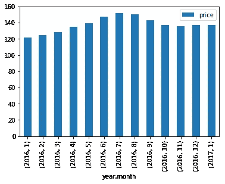
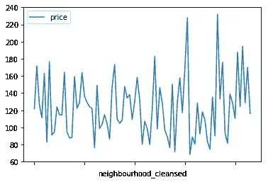
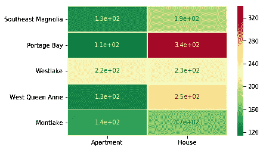
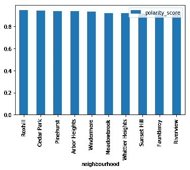
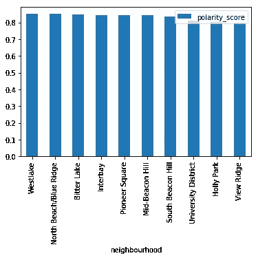

# 仔细研究西雅图 Airbnb 市场的数据

> 原文：<https://medium.datadriveninvestor.com/a-closer-look-into-the-data-of-seattles-airbnb-market-d9812ea863f5?source=collection_archive---------14----------------------->

当我在 2017 年第一次访问西雅图参加 Build conference 时，我就被迷住了！这座城市生气勃勃，熙熙攘攘，雷尼尔山的宏伟壮丽为其提供了完美的背景。

View from our Airbnb in Seattle

自从第一次访问后，我有机会去了西雅图五次，住在各种酒店，但也在 Airbnb 住过两次。和我的同事一起住在一栋房子里(有一个令人惊叹的露台，可以看到联合湖的景色)，感觉更像是一次家庭度假，而不是商务旅行。

作为一个天生的数据极客，我很高兴将我以前的经验与数据科学纳米学位课程(Udacity)的项目相结合，从而有机会深入研究 Airbnb 的西雅图开放数据。

在本文中，我将概述以下问题的调查结果:

**Airbnb 在西雅图的定价趋势:**

1.  定价如何随季节增减，西雅图的旺季是什么？
2.  价格是如何随着街区的不同而上升或下降的？哪些是西雅图最贵的街区？
3.  社区内的房产类型如何影响最昂贵社区和最常见房产类型的价格？

**西雅图 Airbnb 点评感悟:**

1.  我们如何根据观点对评论进行分类？
2.  我们能否将评论中的正面和负面情绪映射到社区，以了解哪些社区在正面情绪量表中排名较高，哪些在负面情绪量表中排名较高？
3.  我们可以探究一些最差的评论来获得更多的见解吗？

**西雅图 Airbnb 房源价格预测:**

1.  我们能预测给定列表的价格吗？
2.  列表中的哪些因素最适合预测价格？

# 西雅图的 Airbnb 定价趋势

首先，我想了解不同季节和不同社区的价格趋势。下一次我去旅游的时候，最好能在旺季左右做好计划，因为价格往往会变得相当昂贵，同时也要知道哪些地区会在我们的价格范围内。让我们看看我发现了什么:

Airbnb Pricing by Season

西雅图的旺季是从 6 月到 8 月的夏季，价格在 7 月达到顶峰，这并不奇怪。这是西雅图一年中最美好的时光，阳光明媚，野花盛开，雨水很少。春天和假期也是受欢迎的时候。

Airbnb Pricing by Neighborhood

在西雅图的不同街区，肯定有巨大的差异。最昂贵的社区是东南木兰花与平均。价格为 231 美元，其次是波蒂奇湾 227 美元。价格较低的街区是奥林匹克山(Olympic Hills)和雷尼尔海滩(Rainier Beach)，分别为 71 美元和 68 美元。

我对上述发现很感兴趣，所以我决定进一步探索最常见的房地产类型(住宅与公寓)中昂贵社区的价格趋势。

Neighbourhood Pricing by Property Type

波蒂奇湾的房子绝对是最贵的选择。有趣的是，在西湖，公寓和房子的价格差不多。

# 西雅图 Airbnb 评论的情感分析

转变思路，查看西雅图 Airbnb 用户发布的评论，我决定通过一个快速情绪分析器来运行这些评论，以了解积极、消极和中立的情绪。高达 97.2%的评论是正面的，相比之下只有 1%的评论是负面的。大约有 1.8%的评论是中立的。我进一步将这些评论与社区联系起来。

Top 10 Neighborhoods by Reviews

评论最积极的街区是洛克希尔、雪松公园和松林街。

Bottom 10 Neighborhoods by Reviews

评论表上排名最低的街区是大学区、霍利公园和维尤里奇。

# 西雅图 Airbnb 价格预测

最后，我研究了一种基于 Airbnb 数据集中提供的房源信息来预测西雅图 Airbnb 房源价格的方法。经过一些数据准备，我成功地实现了一个[线性回归](https://en.wikipedia.org/wiki/Linear_regression)模型来预测上市价格。

此外，我还想看看某个特定房源的哪些因素对预测价格影响最大。我发现列表中有主机的详细信息是很重要的，比如主机的名称、主机的简介、主机的图片等等。拥有关于列表本身的描述性信息也很重要，例如交通信息、列表是什么样的、社区概况等。

# 结论

根据我的分析，我现在有可靠的数据支持西雅图绝对是一个受欢迎的目的地！夏季是这里的旅游高峰期，不同地区的价格差异很大。西雅图的大多数 Airbnb 房源评论都是积极的，所以看起来肯定有优质的住房可供选择，让你的下一个假期过得最好！

我真的相信旅行不仅让我们成为更好的人，也让我们了解自己。那么你的下一个目的地是哪里？Airbnb 绝对是在让我们所有人的事情变得更简单，所以我们没有借口！