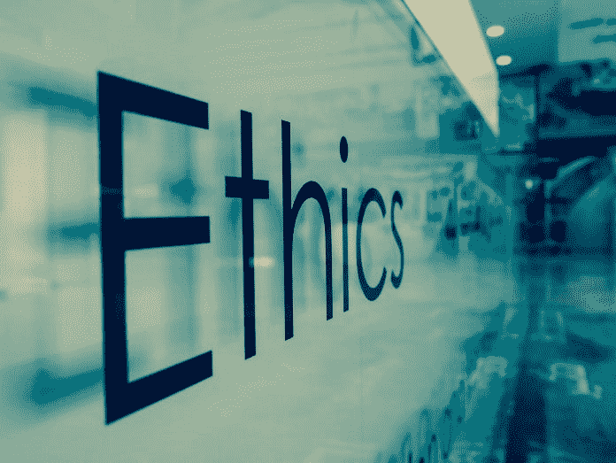

# 道德准则对纠正当今软件的问题没有什么作用

> 原文：<https://medium.datadriveninvestor.com/a-code-of-ethics-does-little-to-correct-the-issues-with-todays-software-ff64c99bb881?source=collection_archive---------20----------------------->

恶意软件的故事充斥着许多出版物。 [*哔哔声计算机*](https://www.bleepingcomputer.com/) 实际上是恶意软件和安全漏洞的活动记录。像 [*【每日 WTF】*](https://thedailywtf.com/)这样的公告不断提醒着应用程序的普遍缺陷。目前的一套程序还有许多不足之处。今天的软件环境需要一个修复。一些人提出的一种修复方法是道德准则。然而，这种改进不太可能改善当今节目的全貌。道德规范是通向更好的软件或避免糟糕结果的一条不可能的道路。

道德不会导致合理的软件工程实践的采用。一致认同的精神特质可以提供目标，但它并不代表实现这些目标的方法。例如，一个共同的目标是对高质量软件的承诺。然而，达到目标的意图并没有给开发人员配备这样做的工具。大多数程序员打算生产好的产品，但是他们达不到这个目标。当达到卓越的目标时，工程师很可能已经采用了合理的开发实践。采用适当的工程习惯并不源于接受道德规范。一种风气可以提供目的，但不能提供知识。拥有专业知识是遵循可靠的软件开发方法的原因，而不是道德准则。

行为惯例不会带来更好的产品，而采用正确的工程方法会。为了生产更好的软件，团队必须接受合理的编程实践。一个执行代码评审的单元会比一个团队产生更好的系统，而不仅仅是坚持一个道德规范。一种风气提供目的，但不提供工具。要求追求质量的规则并不能提供实现这一目标的手段。这些机制由坚实的开发习惯提供。代码审查减少了错误。更少的缺陷伴随着质量的提高。纯度目标是通过合理的工程实践，而不是道德准则来实现的。

行为惯例不会降低诸如安全漏洞等不良后果的可能性，而可靠的编程习惯会。安全要求并不能提供真正降低被利用可能性的工具。例如，威胁建模减少了保护缺陷。然而，在实现任何好处之前，该工具必须被团队使用。为了获得回报，一个团队必须知道一种技术的存在，然后才能使用这种方法。威胁建模等工具的知识并不直接来自任何行为规则。惯例提供的是目的，而不是手段。方法由合理的开发实践提供。良好的工程习惯减少了不良结果的可能性，而不是行为命令。

道德准则不能消除某些不良产品的市场，如恶意软件。勒索软件有市场。秘密矿工也有一个。一种产品有经济，因为这种产品既有生产者又有消费者。勒索软件和密码矿工有重视他们的人。个人愿意交换一些东西来获得软件。勒索软件现在正在[暗网](https://www.bleepingcomputer.com/news/security/halloware-ransomware-on-sale-on-the-dark-web-for-only-40/)上出售。这些产品并没有出现。他们有开发人员生产它们。这些程序员可能会因为道德准则而感到羞愧而放弃，但至少有一个工程师会找到一个客户，他会给出一个足够高的价格来减轻开发者的羞愧。耻辱只会提高做生意的成本。被要求构建勒索软件的程序员要求更多的回报来构建该软件。一个加密采矿者的客户需要更多的支付来证明生产者所要求的价格。开发者不会制造勒索软件或密码挖掘器，除非他知道有买家愿意支付他的价格。随着支出的增加，客户数量会下降，但这一数字不太可能降至零。每个市场都至少有一个消费者，即使是那些有着强烈尴尬感的市场，比如雇佣杀手行业。如果为了金钱而杀人不能被羞辱所劝阻，那么内疚就不可能说服程序员放弃开发恶意软件。如果羞耻感无法阻止工程师构建勒索软件或加密矿工，那么道德规范就无法消除某些不良后果(如恶意产品)的市场。

许多不良结果和许多争议已经通过现有的法律规范得到处理，从法理的角度来看，行为惯例是不必要的。勒索软件和密码矿工分别实施勒索和盗窃，这已经是刑事犯罪行为。导致伤害的努力也有相关的刑事犯罪。即使是法律责任、合同或责任上的分歧也已经通过法律解决了。数百年来，英语圈的法学一直在不断完善和发展。当前的法律体系不会从批准软件开发者的道德规范中获益。

一种风气不太可能改善计算机程序的前景或避免糟糕的结果。行为惯例不会导致可靠的工程实践的采用。良好的开发方法会带来更好的产品，而行为规则不会。伦理不会降低坏结果的可能性，但可靠的工程技术可以。明智的、经过验证的、健全的实践才是解决软件世界弊病的方法，而不是道德准则。

*原载于 2018 年 11 月 28 日*[*【www.datadriveninvestor.com】*](https://www.datadriveninvestor.com/2018/11/28/a-code-of-ethics-does-little-to-correct-the-issues-with-todays-software/)*。*