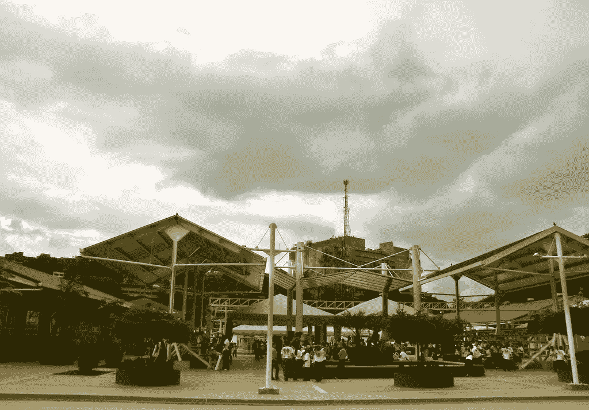

# 一群老板

> 原文：<https://medium.datadriveninvestor.com/a-company-of-bosses-e91a38df7d33?source=collection_archive---------6----------------------->

***作者延斯·埃里克·古尔德
日报***

***2005 年 7 月***

Ana Margarita Guedez 检查了一条蓝色儿童运动裤上的新缝线，并称赞她的同事做得很好。虽然是主管，但 Guedez 肯定会指出，她纺织厂的所有员工都是公司的合伙人，并享有同等的利润。

该工厂是新建的 Fabricio Ojeda 中心的一部分，该中心是一个工业和社区“核心”,位于加拉加斯西部的 Catia 附近。

该中心代表了政府的“内生发展”运动，旨在通过优先发展本地合作生产而非全球资本主义来促进社会和经济增长，减少委内瑞拉对进口的严重依赖。

Catia 的纺织厂和隔壁的靴子厂总共雇佣了大约 300 人，其中许多人是有生以来第一次工作。

“我们都是老板，”当被问及她是否是经理时，Guedez 说。她解释说，公司的重大决策是由全体大会举手表决的多数票决定的。

国营的委内瑞拉石油公司( [PDVSA](http://www.pdvsa.com/index.php?option=com_content&view=article&id=651:260&catid=10&Itemid=589&lang=es) )投资了 Bs。700 万美元在公司的土地上建造中心，这里以前是一个废弃的油库和仓库。该中心还拥有几个国家资助的社会项目，包括二级医疗诊所和梅卡尔折扣杂货店。

员工通过政府资助的“使命”Vuelvan Caras 完成了为期一年的培训计划，并在今年 1 月完工时开始工作。

对此类项目的批评者称，对石油收入的依赖使其不可持续。

此外，一些纺织工人说，他们目前在工厂的收入，依赖于公司的生产，不足以支撑他们的家庭。由于几名员工似乎是在社交，而不是在工作，该工厂大约有一半的缝纫机在使用。

然而，地区主管 Ruth Torres 表示，通过 Vuelvan Caras 接受的培训——加上后续课程——将为她提供必要的技能，以便在未来创办自己的小企业。“现在我有了保护自己的东西，”她告诉《每日日报》。

受雇于 PDVSA 的项目主管 Antonio Frausto 说，这个新生的项目将产量提高到自给自足的水平需要时间。“(这些员工)六个月前甚至不知道如何播种，”他说。他补充说，该中心目前享有 17 亿英镑的无息政府贷款，确保工人获得最低工资。

Frausto 指出，该项目的目标不仅是经济的，也是社会的。例如，他说，该项目旨在改变他所说的委内瑞拉长期以来阻碍蓝领工人晋升为经理的制度。

“那里的许多房子都有缝纫机，”弗劳斯托指着工厂上方山上星罗棋布的房子说。他说，不同之处在于，在工厂里，他们有医疗保险和发展技能的结构化环境。

“我们习惯在家里工作，”以女性为主的劳动力的地区主管露丝·托雷斯说。“我们被排除在外了。”

在 Vuelvan Caras 之前，少数工人已经从事纺织工作，但现在接受了更专业的培训。托雷斯说，最初有 280 人报名参加了培训项目，但在一年的课程结束后，将近一半的人离开了，补助金也停止了。

但是托雷斯感谢总统给了他工作的机会。“当查韦斯成为总统时，他做的第一件事就是把我们包括进来，”她说。

Frausto 说，政府没有更早启动这样的中心，因为它“花了查韦斯任期的前三年”来“保护自己”，指的是 2002 年失败的政变和当年晚些时候开始的全国石油罢工。
他还表示，美国阻止委内瑞拉生产石油以外的出口产品，称美国是“世界的主人”

全国有 200 个类似的中心，其中大多数不如 Catia 的发达，另外四个在加拉加斯。社会工作者 Facoundo Baudoin 说，他计划在东部的阿马库罗三角洲建立一个自己的内生中心。该中心将致力于为土著瓦劳社区成员提供就业机会。

项目总协调人安吉尔·怀克尔曼说，这块 14 公顷的地产只开发了 20%。未来的项目包括一所小学。

二级医疗保健中心被称为“大众诊所”，比 Barrio Adentro 医疗中心更大，提供更先进的护理，后者在全国贫困社区提供免费医疗。

【jenserikgould.com】