# 商业智能中数据可视化的完整指南:问题、库和集成工具，免费数据可视化工具

> 原文：<https://medium.datadriveninvestor.com/a-complete-guide-to-data-visualization-in-business-intelligence-problems-libraries-and-tools-to-4f620656acc?source=collection_archive---------4----------------------->

科技公司不是唯一关注数据分析的公司，任何一种企业都是如此。分析商业信息以促进数据驱动的决策，这就是我们所说的 [*商业智能*](https://www.altexsoft.com/blog/business/complete-guide-to-business-intelligence-and-analytics-strategy-steps-processes-and-tools/?utm_source=MediumCom&utm_medium=referral&utm_campaign=shares) 或 *BI* 。简而言之，BI 是一套工具和方法，用于从源中提取原始数据，对其进行转换，将其加载到统一的存储系统中，然后呈现给用户。

在实际数据以可视形式呈现之前发生的一切都可以被视为底层基础设施，称为[数据管道](https://www.altexsoft.com/blog/datascience/what-is-data-engineering-explaining-data-pipeline-data-warehouse-and-data-engineer-role/?utm_source=MediumCom&utm_medium=referral&utm_campaign=shares)。管道的主要部分是 [*提取、转换、加载*](https://www.altexsoft.com/blog/datascience/who-is-etl-developer-role-description-process-breakdown-responsibilities-and-skills/?utm_source=MediumCom&utm_medium=referral&utm_campaign=shares) *(ETL)* 过程及其工具。你可以把它想象成任何 BI 系统的后端。然后系统的前端是用户界面，数据最终以可视化的形式呈现给用户。

 [## 成为数据科学家所需的 8 项技能|数据驱动型投资者

### 数字吓不倒你？没有什么比一张漂亮的 excel 表更令人满意的了？你会说几种语言…

www.datadriveninvestor.com](https://www.datadriveninvestor.com/2019/02/07/8-skills-you-need-to-become-a-data-scientist/) 

数据可视化、它的工具和技术产生了许多问题，因为这个主题足够大。因此，在本文中，我们将通过商业智能的棱镜关注数据可视化。由于这篇文章很大，我们建议您根据需要使用以下大纲进行浏览:

[什么是数据可视化:它是如何工作的，要可视化的数据类型，可视化格式](https://www.altexsoft.com/blog/data-visualization-tools-types-techniques/?utm_source=MediumCom&utm_medium=referral&utm_campaign=shares#what-is-data-visualization)

[数据可视化工具:付费、免费和开源工具](https://www.altexsoft.com/blog/data-visualization-tools-types-techniques/?utm_source=MediumCom&utm_medium=referral&utm_campaign=shares#data-visualization-tools-and-libraries)

[数据可视化库:可视化数据的库列表](https://www.altexsoft.com/blog/data-visualization-tools-types-techniques/?utm_source=MediumCom&utm_medium=referral&utm_campaign=shares#libraries-packages-and-open-source-tools-for-data-visualization)

[数据可视化陷阱:需要考虑的问题和挑战](https://www.altexsoft.com/blog/data-visualization-tools-types-techniques/?utm_source=MediumCom&utm_medium=referral&utm_campaign=shares#pitfalls-of-data-visualization)

# 什么是数据可视化？

**数据可视化**是将原始信息(文本、数字或符号)转换成图形格式的实践。数据的可视化有一个明确的目的:显示单元之间的逻辑关系，并定义倾向，趋势和模式。根据逻辑连接的类型和数据本身，可以用合适的格式进行可视化。所以，非常简单，任何分析报告都包含数据解释的例子，比如饼状图、比较条、人口分布图等等。

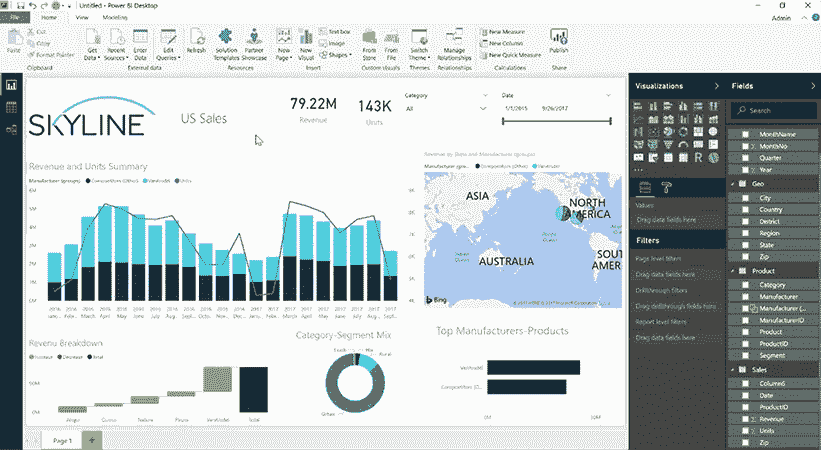

*Skyline BI dashboard depicting multiple visualization formats. Source:* [*skylinetechnologies.com*](https://www.skylinetechnologies.com/power-bi-dashboard-hour-webinar)

在大多数情况下，视觉效果是通过相应的软件手工制作的，无论是 PowerPoint 还是 Photoshop。但是，它的核心用途仍然是在分析领域。因此，数据可视化或 dataviz 成为通过 BI 接口(数据表示工具)向用户介绍信息的标准方式。

# 数据在 BI 中是如何可视化的？

正如我们提到的，数据表示工具只是整个商业智能系统的用户界面。在用于制作视觉效果之前，这些数据要经过一个漫长的过程。这基本上是对 BI 如何工作的描述，所以我们将很快将其分成几个阶段:

1.  首先，您应该定义将要使用的数据源和数据类型。然后确定转换方法和数据库质量。
2.  接下来，数据来源于其初始存储，例如，Google Analytics、ERP、CRM 或 SCM 系统。
3.  使用 API 通道，数据被移动到临时区域，在那里进行转换。转换假定数据清理、映射和标准化为统一的格式。
4.  此外，清理后的数据可以移动到一个存储器中:一个普通的数据库或数据仓库。为了使工具能够读取数据，数据集的原始基础语言也可以重写。

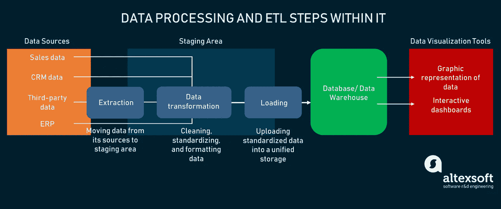

*Business intelligence data processing in a nutshell*

现在，您可以看到数据可视化在整个过程中的实际位置。大多数现代商业智能界面都有许多选项，可以选择如何使用可视化数据。在大多数情况下，有一个带有拖放界面的命令仪表板，允许您:

*   通过 [API](https://www.altexsoft.com/blog/engineering/what-is-api-definition-types-specifications-documentation/?utm_source=MediumCom&utm_medium=referral&utm_campaign=shares) (或定制集成)将数据源连接到系统
*   选择要使用的数据集
*   选择可视化的类型
*   在仪表板上放置多个视觉效果
*   创建交互式元素来操作数据
*   随着数据更新修改视觉效果
*   手动键入信息
*   保存报告
*   共享报告

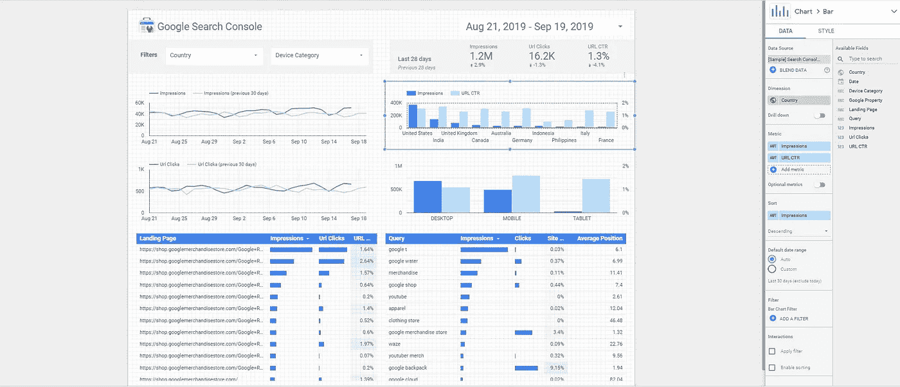

*An example of data visualization in Google Data Studio*

选择来源，用户可以在内置的沙盒中自由操作，沙盒中有视觉模板。这些模板可以填充所需的信息，并放在仪表板上或用作单一表示。

虽然可视化的过程不是真正自动的，但仍然没有必要手动创建视觉效果。通常，所有的 BI 界面都有您可以使用的模板。可以通过设置所需的数据属性来修改和编辑这些属性。在某些情况下，可视化可以响应数据的变化，并通过自动修改图形和表格来显示这些变化。这基本上是通过利用数据可视化库来完成的。我们在下面专门用了一个章节来讨论这个话题。

但是现在，让我们讨论一下用于生成报告的视觉效果的类型。

# 常见的数据可视化类型

将信息转化为图像不是目标。在更高的层面上，当数据以可视化的形式呈现时，更容易理解:这就是为什么我们将季度或百分比这样的东西解释为饼图的一部分。

但是，在较低的层面上，视觉是传达不同单位之间联系的工具。正如德佩什·莫德所唱的歌曲[“一切都很重要”](https://www.youtube.com/watch?v=1t-gK-9EIq4):“墙上的图表讲述了一切。”没错，视觉是用来通过数据解释来讲述故事的。谢谢，Depeche 模式！

每种类型的视觉都与它能解释什么数据，以及它能更好地显示什么类型的联系(关系、比较、组合或分布)的想法相对应。让我们看看在商业智能和数据分析中最常见的可视化类型。

## 条形图

条形图是比较数据单元的基本方法之一。由于其简单的图形形式，条形图通常在 BI 中用作交互式页面元素。

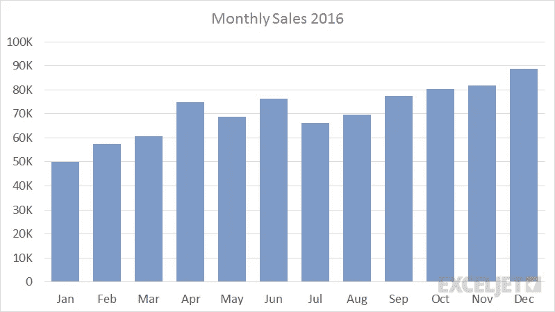

*Monthly sales bar chart*

条形图用途广泛，可以修改并显示更复杂的数据模型。这些条可以被构造成簇或堆叠，以描述跨细分市场或子类别项目的分布。水平条形图也是如此，更适合将长数据标签放在条形图上。

**何时使用**:比较对象，数值信息。使用水平图表来适应长数据标签。将堆栈放在条形中，将每个对象分成段，以便进行更详细的比较。

## 圆形分格统计图表

我们随处可见的一种更常见的图表类型是饼图。

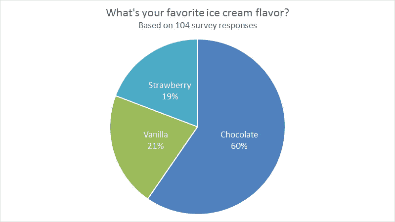

*Pie chart showing percentage correlation of ice cream flavor preference. Source:* [*exceljet.net*](https://exceljet.net/chart/survey-results-favorite-ice-cream-flavor)

这种类型的图表用于任何营销或销售部门，因为它可以很容易地展示对象的组成或单位与单位之间的比较。

**什么时候用**:一个物体的构成，把部分和整体做比较。

## 线图

这种类型的视觉效果利用水平轴和垂直轴来描绘一个单位随时间的价值。

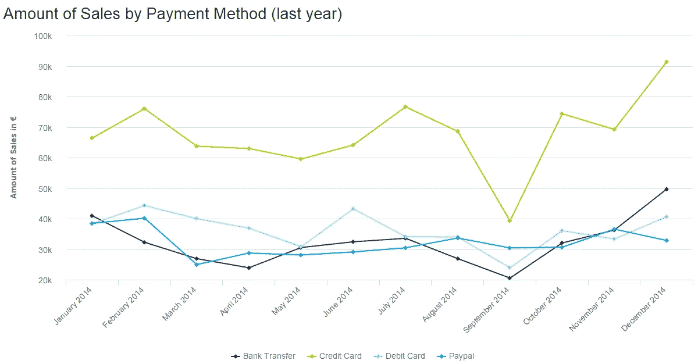

*Sales analysis by payment methods. Source:* [*datapine.com*](https://www.datapine.com/blog/sales-graphs-and-charts-for-managers/)

折线图也可以与条形图结合使用，以表示多个维度的数据。

**何时使用**:时间线上的对象值，描绘行为随时间的趋势。

## 箱形图

乍一看，一个盒子情节看起来相当复杂。但是如果我们仔细观察这个例子，就会发现它是以水平的方式描绘季度的。

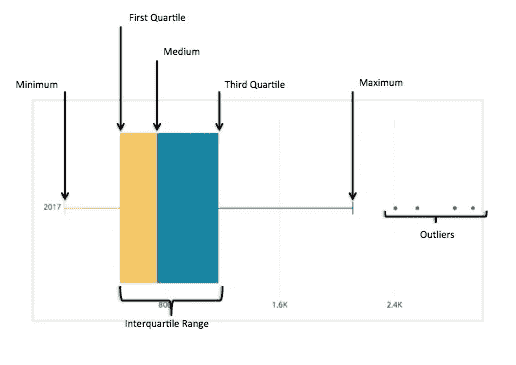

*Box plot divided into 5 quartiles, while outliers are shown as object that fall out of distribution area. Source:* [*chartio.com*](https://chartio.com/resources/tutorials/what-is-a-box-plot/)

我们这里的主要元素是最小值、最大值和位于第一个和第三个四分位数之间的中间值。方框显示的是对象的分布，以及它们与中值的偏差。

**何时使用**:复杂对象的分布，偏离中值。

## 散点图

这种类型的可视化建立在 X 和 Y 轴上。在它们之间，有圆点环绕，定义对象。一个点在图上的位置表明了它的性质。

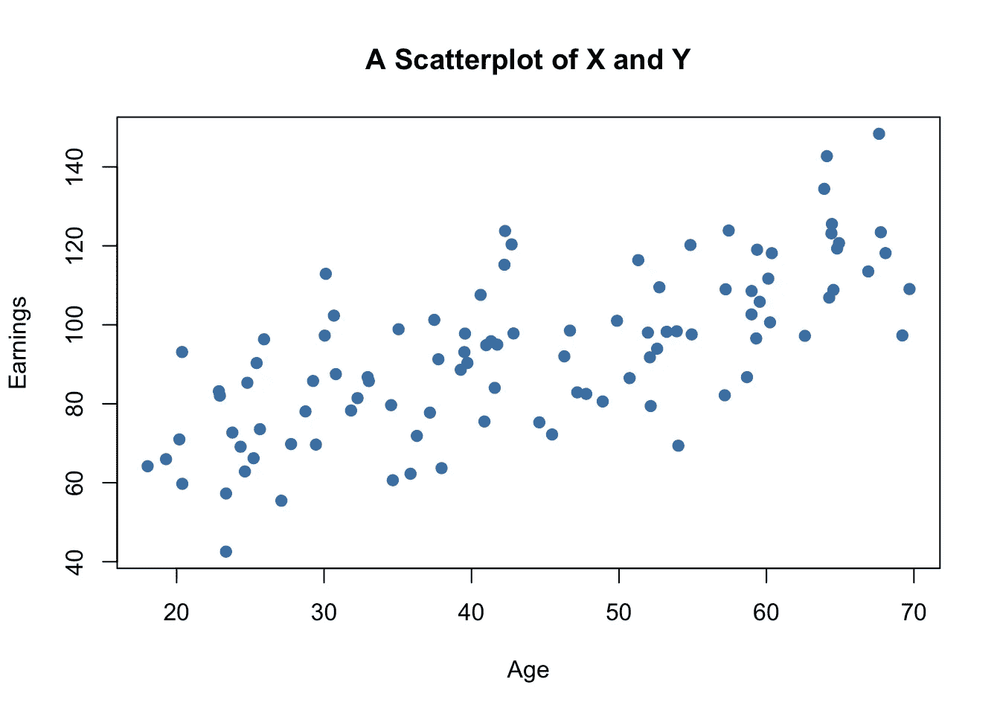

*A sad scatterplot showing the inability of young people to earn money. Source:* [*www.econometrics-with-r.org*](https://www.econometrics-with-r.org/3-7-scatterplots-sample-covariance-and-sample-correlation.html)

和线图一样，轴之间的点会在一瞬间被注意到。这种可视化的唯一限制是轴的数量。

**何时使用**:显示对象的分布，定义图形上每个对象的质量。

## 雷达图或蜘蛛图

这种类型的图表基本上是以放射状绘制的折线图。它有一个由多个轴和变量创建的蜘蛛网形式。

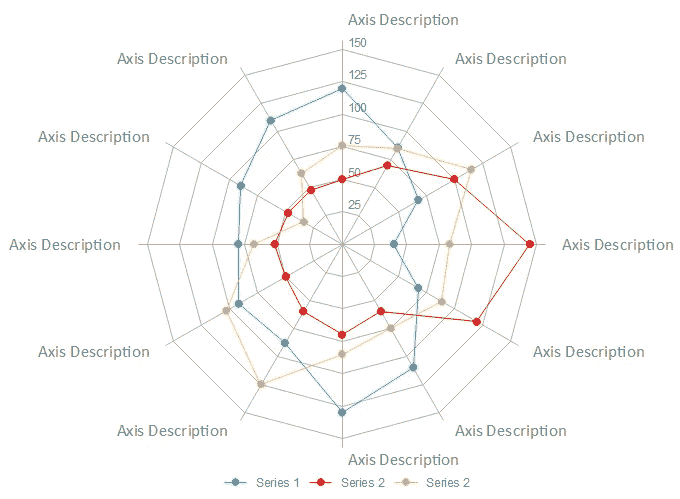

*Spider chart structure. Source:* [*edrawsoft.com*](https://www.edrawsoft.com/chart/when-to-use-spider-chart.php)

其目的与折线图相同。但是由于轴的数量，您可以从各个角度比较单位，并以图形方式显示倾斜度。

**何时使用**:描述数据质量，通过不同维度比较多个对象。

## 点阵图或密度图

在地图上叠加可视化效果适用于数据的地理范围。密度图是在地图上放置的点的帮助下建立的，标记每个单元的位置。

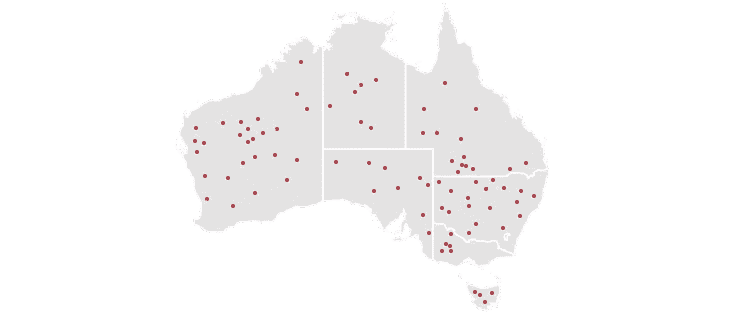

*A simple representation of a dot map. Source:* [*datavizcatalogue.com*](https://datavizcatalogue.com/methods/dot_map.html)

一个点可以定义一个单元(如市场)或表示某个区域的多个对象。这种格式使密度容易被注意到，但如果需要精确的数字，可能会提供零值。

**何时使用**:描绘物体的分布或密度。

## 漏斗图

这些非常适合显示不同项目组之间缩小的相关性。在大多数情况下，漏斗将利用几何形状和颜色编码来区分项目。

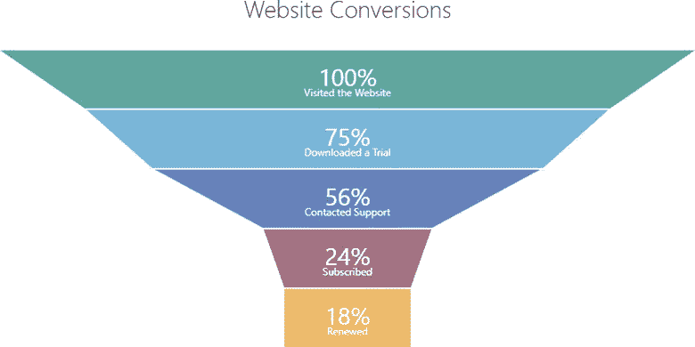

*The example shows conversion results starting from total traffic number and the number of subscribers. Source:* [*community.devexpress.com*](https://community.devexpress.com/blogs/oliver/archive/2017/10/12/new-funnel-chart-widget-coming-soon-in-v17-2.aspx)

当流程中有多个阶段时，这种图表也很方便。在上面的示例中，我们可以看到在“联系支持”阶段之后，订阅者的数量已经减少。

**何时使用**:用价值/对象的缩小百分比来描绘过程阶段

如果您想深入研究数据可视化类型，可以查看一个[目录](https://datavizcatalogue.com/)，它为每种类型的图形、图表、地图或表格提供了解释。在选择可视化的类型时，请确保您清楚地了解以下几点:

1.  **你的数据集的细节**:你公司的知识领域或部门
2.  受众:你想向其展示信息的人
3.  **连接逻辑**:对象比较、分布、关系、流程描述等。
4.  **输出**:简单来说，向某人显示该信息的原因

现在我们将讨论可以用来创建数据可视化的工具。

# 数据可视化工具和库

数据可视化市场上有很多产品。在选择供应商时，寻找适合您的企业规模和分析需求的[可扩展 BI 服务](https://www.altexsoft.com/business-intelligence-services/?utm_source=MediumCom&utm_medium=referral&utm_campaign=shares)。虽然功能非常相似，但每个供应商提供的生态系统可能包括也可能不包括重要的服务。在这一节中，我们将介绍提供者选项以及创建您自己的可视化软件的工具。

此外，请记住:由于复杂的分析技术、底层基础设施和明确的功能，大多数工具都是付费或免费的。桌面应用程序本身确实是重量级的( [Tableau](https://www.tableau.com/) 1.6 GB， [Sisense](https://www.sisense.com/) 大约 5 GB)。如果没有最新的硬件来操作它们，你的电脑就有被烤焦的危险。

## 流行的数据可视化工具

在大多数情况下，数据可视化工具是一个桌面应用程序，由一个命令仪表板表示。与数据源的集成是通过 API 完成的，因此数据集将自动上传。在您指出您的数据存储在哪里之后，应用程序将为您提供一个用于未来报告的画布，您可以在其中放置可视化效果并用数据填充它们。

每个可视化模板都有其数据属性和关联类型的设置。因此，结合不同类型的视觉效果，你将能够构建报告。根据功能，报告可以进一步导出为 CSV 文件或在系统内与其他用户共享。

与任何技术市场的情况一样，数据可视化提供商也提供类似的功能，因此我们将更多地讨论独立的功能，而不是解释它是如何工作的。要想更详细地了解工具，请阅读我们的文章 [BI 工具](https://www.altexsoft.com/blog/best-bi-tools-comparison/?utm_source=MediumCom&utm_medium=referral&utm_campaign=shares)。

[**看客**](https://looker.com/) 。一个数据分析平台，提供与基于 web 的数据源和 SQL 数据源的连接。长相特征:

*   拖放用户界面
*   可定制的仪表板
*   可导出的报告
*   API 与第三方资源的集成
*   从数据库查询数据
*   跨平台访问

[**Zoho 分析**](https://www.zoho.com/analytics/?src=top-header) 。这个商业智能产品是 Zoho 分析平台的一部分。在[解决方案页面](https://www.zoho.com/analytics/solutions.html)，您可以找到按部门划分的 Zoho 服务，以提供有价值的针对性见解。Zoho 特点:

*   拖放用户界面
*   网络应用
*   与许多数据源集成(默认为 Google 产品)
*   SQL 数据查询和 API 支持
*   报告嵌入
*   对分析的共享访问

[**画面**](https://www.tableau.com/) 。该提供商拥有包含各种产品的整个商业智能生态系统。Tableau 不仅提供了数据可视化工具本身，还提供了数据准备工具，用于在没有代码知识的情况下转换、清理和映射信息。Tableau 特征:

*   拖放用户界面
*   与数据源的大量本机集成
*   对分析的共享访问
*   报告嵌入
*   跨平台访问
*   服务器 REST API
*   不断更新的数据流
*   元数据管理工具
*   内置仪表板评论和突出显示

[QlikView。Qlik 是另一个 BI 提供商，它为愿意构建定制软件的团队提供了很大的灵活性。QlikView 是他们产品的免费增值版，可以升级到 Qlik Sense。Qlik 功能:](https://www.qlik.com/us/products/qlikview)

*   可定制的报告
*   基于角色和权限的访问系统
*   开放 API
*   开放式数据库访问
*   跨平台访问
*   对分析的共享访问

提到的每一种产品都为其工具提供了演示访问或试用期，以及适用于不同规模企业的可扩展产品。如果您正准备尝试数据可视化，并且刚刚接触 BI，我们建议您从免费工具开始。

## 免费的数据可视化工具

市场上没有多少完全免费的选择。无论如何，有一些付费的功能或产品需要升级。也就是说，您可以尝试一些供应商，以了解如何处理数据可视化:

[**微软 Power BI**](https://powerbi.microsoft.com/en-us/) 。微软免费提供软件并非罕见，但也有一些陷阱。您可以免费获得全部功能，但所有生成的报告都将发布到 Microsoft Gallery。所以基本上，你所有的报告都是公开可见的。Power BI 特性:

*   拖放界面
*   桌面应用程序
*   与数据源的大量本机集成
*   可定制的报告
*   增量数据更新
*   Power BI Pro 中的完整 BI 生态系统即服务

[**画面公**](https://public.tableau.com/s/) 。Tableau Public 也是如此，它提供共享的完整功能，您的所有数据都发布在公共服务上。我们不会复制这里的功能，但这必须在免费选项列表中。

[**谷歌数据工作室**](https://datastudio.google.com) 。也许，对于任何想要创建可视化报表的用户来说，这是最容易使用的选项。Data Studio 功能:

*   网络应用
*   拖放界面
*   内置与谷歌分析和谷歌营销平台的其他产品的集成
*   可定制的报告
*   数据转换仪器
*   对分析的共享访问

如果您打算利用您的技术背景并利用开源资源和库，下一节将列出一些。

# 用于数据可视化的库、包和开源工具

也有单独的工具可以用来构建某种类型的视觉效果。大多数都需要编程语言知识(有时也需要框架)。

[**D3。JS**](https://d3js.org/) 是一个免费的 JavaScript 库，通过 API 将数据与文档对象模型连接起来，将文档作为对象进行操作，从而创建可视化效果。

[**Dygraphs**](http://dygraphs.com/) 是一个免费的开源 JavaScript 库，用于在浏览器中构建 dataviz。它适用于构建交互式图表和图形的大型数据集。首先，查看 [API 参考](http://dygraphs.com/jsdoc/symbols/Dygraph.html)和[数据格式文档](http://dygraphs.com/data.html)。

[**Chartist.js**](https://gionkunz.github.io/chartist-js/) 是另一个基于 JavaScript 的工具，用于通过 CSS 样式化图形和图表来构建图形和图表。

[**Gleam**](https://github.com/dgrtwo/gleam) 是一个借助 CSS 和 HTML 构建散点图可视化的 Python 包。

[**Leather**](https://leather.readthedocs.io/en/latest/index.html) 是一个 Python 库，用于以最简单的形式创建图表，并将它们保存为 SVG 文件，以便进一步共享。

[**Matplotlib**](https://matplotlib.org/) 是另一个开源 Python 库，旨在创建 2D 可视化。

所有提到的库和工具都可以自由使用，并与现有软件集成，以创建新类型的数据可视化模板。

# 数据可视化的陷阱

如果你决定在你的分析中引入视觉效果，你必须对它们的潜在障碍有所了解。使用这些工具没什么大不了的。一般来说，即使是生态系统规模的产品使用起来也非常直观。

但是，如果您是一名经理或负责在您的组织中实施 BI，那么在实际数据可用于可视化之前，请注意一些后果。以下是数据分析中常见问题按问题领域的分类。

## 数据准备方面的挑战

在[数据集准备](https://www.altexsoft.com/blog/datascience/preparing-your-dataset-for-machine-learning-8-basic-techniques-that-make-your-data-better/?utm_source=MediumCom&utm_medium=referral&utm_campaign=shares)阶段的主要陷阱是做出正确的假设。在软件开发的任何过程中，定义所需的数据和可行的来源都是基于假设的。这同样适用于决定是否需要数据仓库，以及是否希望将数据转换成多种格式。

通过在数据处理的所有阶段进行测试，可以找到一个简单的解决方案。就数据可视化而言，我们必须测试那些将直接影响可视化过程的假设。这些项目是:

*   初始数据类型
*   选择的来源
*   数据源的类型(查询、持续更新、临时报告)
*   您的数据库/数据仓库的架构

所有这些结构元素都可以由该领域的领域专家(ETL 开发人员)进行测试，而假设可以与数据工程师/数据分析人员进行讨论。

## 关于可视化过程的挑战

可视化阶段不太受技术驱动。虽然有半人工智能驱动的商业智能工具，但用户仍然是决定在画布上放置何种可视化格式以及数据属性的人。这表明:

**陷阱 1** :使用错误的可视化格式。人们很容易迷失在图形、图表和地图的森林中，因此需要花一些时间来研究您的企业所需的最低限度的 dataviz。比如在对象只有一个特征可以比较的情况下使用蜘蛛图，会让大家挠头。反之亦然:用于比较多维单位的折线图，比如 3 个国家的季节性销售，每个国家有 10 个省，注定会失败。

**陷阱 2** :使用错误的数据类型。这是一个非常相似的问题，但是需要花一些时间来理解什么类型的数据可以应用到您久经考验的 dataviz。

**陷阱 3** : Dataviz 工具不会生成报告，但你会。这可能令人惊讶，但是，在目前的状态下，只有少数真正昂贵的工具可以为您解释部分信息。

**陷阱 4** :错误的工具选择。好吧，如果你选择使用一个免费的工具或者决定使用一个库，也许它对你来说不会是错误的。但是当我们谈到供应商的选择时，事情就变得更严重了。数据可视化的供应商提供了完整的服务，让使用报告的人的生活更加轻松。这里的要点是了解服务是否可扩展，因此它涵盖了您拥有的数据量及其更新频率。还应该考虑可视化功能，因为特定行业的分析可能包括奇特形式的 dataviz。

考虑到所有的机会和障碍，您可以自由实施可视化分析。数据处理最重要的阶段是在你进入用户界面之前。记住这一点，你就可以走了。

*最初发表于 AltexSoft tech 博客"* [*《商业智能中的数据可视化完全指南:问题、库和工具集成》，免费数据可视化工具*](https://www.altexsoft.com/blog/data-visualization-tools-types-techniques/?utm_source=MediumCom&utm_medium=referral&utm_campaign=shares)