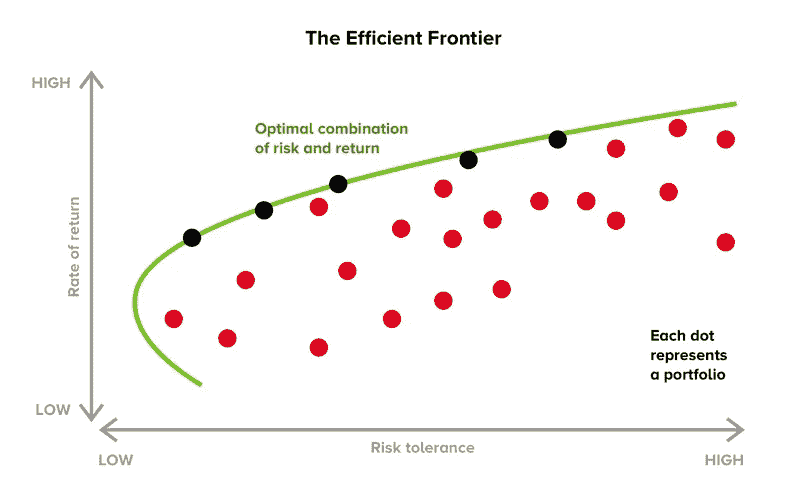
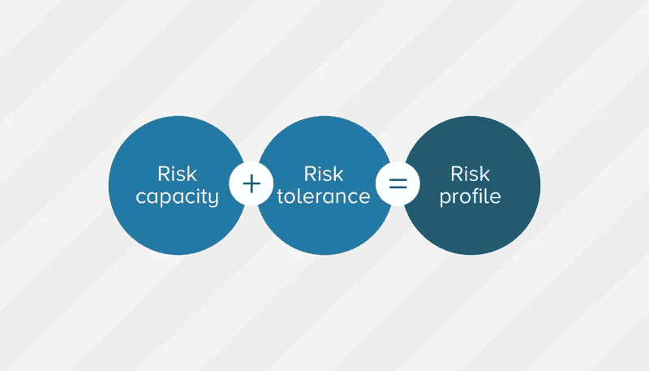

# 我们的“有效前沿”投资理论的完整指南

> 原文：<https://medium.datadriveninvestor.com/a-complete-guide-to-our-efficient-frontier-investment-theory-99455a64f0fc?source=collection_archive---------3----------------------->

你可能听说过没有“免费的午餐”这回事。无论是风险和潜在回报…还是金钱和三明治…当涉及到商业时，有些东西通常会转手。

然而，一些午餐提供了很大的价值，而另一些则很贵，令人失望。投资也是一样。

这不是关于直觉或内部知识，也不是关于市场下一步可能做什么的水晶球预测。在您的风险水平范围内，我们有一个更可靠的工具来优化瑞士投资的预期回报。

它基于获得诺贝尔奖的“有效前沿”投资理论，由经济学家[哈里·马科维茨博士于 1952 年首创。它指出，对于每一个金融概况，有一个投资组合，使投资者的回报最大化。](https://en.wikipedia.org/wiki/Harry_Markowitz)

让我们来看一个展示马科维茨理论的图表:

*   **在水平轴上，**根据每项资产的“标准差”分数绘制投资。这个分数基本上是这些股票的风险水平，基于它们在过去上下波动的幅度。根据 Markowitz 方法，你可以假设稳定波动的股票比像跷跷板一样波动的股票风险小。
*   **在纵轴上，**每项投资都根据其历史回报率进行定位。Markowitz 在这里做了一点假设——股票市场长期向上(从历史上看，他是对的，即使是在 1987 年的黑色星期一和 2008 年的全球金融危机之后)。
*   绿线是你希望你的投资组合出现的地方。这是有效边界，在这里你的潜在回报在每一个风险水平都是最大化的。

当然，历史风险和历史回报都不是完美的衡量标准。过去的表现和过去的波动不能预测明天或明年会发生什么。但在 60 多年的实践中，有效前沿模型被证明是实现回报的最可靠工具。

# 理论上听起来很棒…但是如何实现有效边界呢？

注意有效边界如何从左到右，从风险不大到风险很大。你将坐在哪里取决于你的风险状况(稍后会有更多相关内容)。

不管怎样，我们保证你的投资不会偏离这条线太远。通过这样做，我们可以在您能够承担的风险范围内优化您的投资。

我们如何做到这一点的核心是多样化。

当客户加入我们时，我们不只是给他们一些他们最喜欢的行业的股票，或者随机匹配他们的价值。相反，我们为每个客户建立一个由大约 35 到 40 家公司组成的投资组合，这些公司分布在不同的行业、地理位置、货币和公司规模。

通过分散投资组合，客户对经济衰退的风险敞口(特别是行业、货币和单个公司)得以降低。

假设，如果可再生能源行业陷入混乱，你不需要恐慌。这是因为，你的投资组合不是一两项巨额投资，而是由许多不太可能突然崩盘的较小投资组成。

# 那么，你如何计算我在有效边界上的风险水平？

在 Yova，我们对我们的客户负有重大责任。这就是我们一开始就提出问题的原因，这样我们就能准确了解您的风险状况和投资目标。然后我们会让你走上最适合你的道路。

在评估您的风险状况时，我们会考虑两个主要因素:

*   风险承受能力:这决定了你在经济上能够承受多大的风险。我们考虑的因素包括您的收入和总财富、您的年龄以及有多少人依靠您提供经济支持。
*   **风险承受度:**这是你在情绪上可以接受的风险水平(我们不希望你晚上失眠)。每个人都是不同的，有些人直到完成我们的[发现问卷](https://yova.ch/en/create-profile/schwerpunkte)后才意识到他们是多么厌恶风险或敢于冒险。

我们也看你的目标。假设你想在 5 年内买一栋房子——在这种情况下，我们将设计你的投资组合，以便你在那个时候有一笔可观的储蓄可以提取。你的投资可能位于有效边界的左边(风险较小的一边)。

另一方面，假设你在为退休存钱。根据你的年龄，这可能是 30 年或更长时间的投资期。这一较长的时间框架允许空间舒适地度过偶尔的市场低迷。如果你的风险能力和风险承受能力累积起来，我们将为你建立一个更接近有效边界右侧的投资组合。

# 我想加入。我在哪里报名？

第一步是参加我们的[探索问卷](https://yova.ch/en/create-profile/schwerpunkte)。这大约需要 10 分钟，而且完全免费。

我们会问你一些问题，以便了解你的价值观和对世界的希望，以及你承担金融风险的能力和你自己对风险的承受能力。从那里，我们的团队将创建一个个性化的投资策略供您考虑。

点击开始我们的 10 分钟探索问卷[。](https://yova.ch/en/create-profile/schwerpunkte)

*原载于*[*https://yova . ch*](https://yova.ch)*。*

在 Yova，我们帮助人们通过符合他们价值观的投资组合来积累财富。