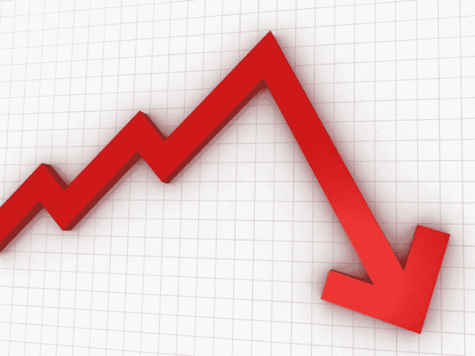
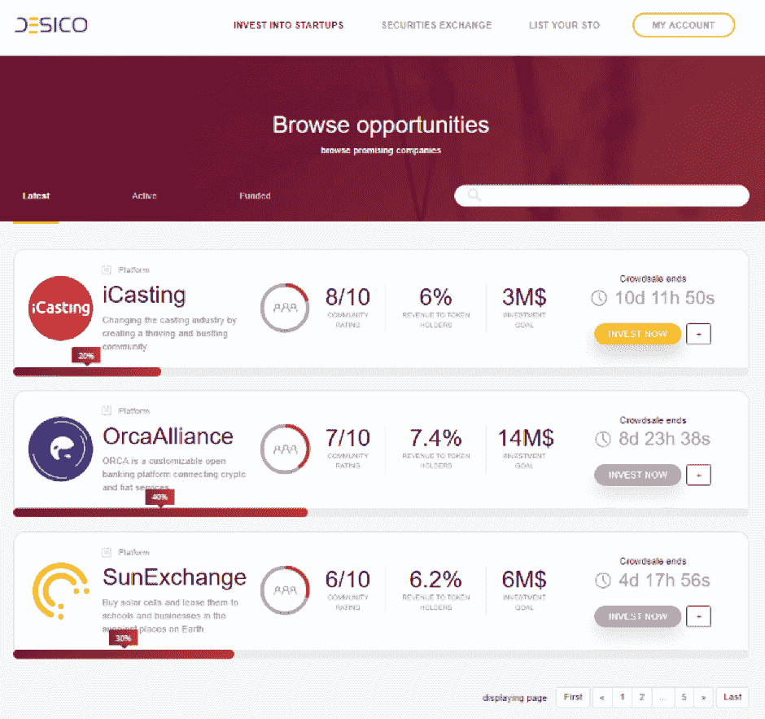
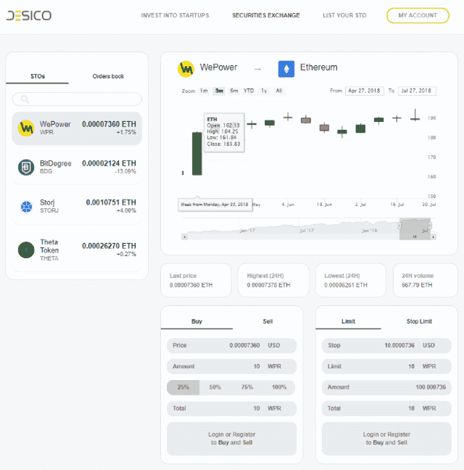

# 完整的安全令牌生态系统

> 原文：<https://medium.datadriveninvestor.com/a-complete-security-token-ecosystem-9834ca9e5f?source=collection_archive---------18----------------------->

到目前为止，投资公用代币是我们加密货币之旅的一大部分。然而，现实是，这些投资中有许多长期以来一直充斥着低回报、虚假承诺和骗子。

投资公用事业代币给投资者带来的只是从公用事业本身获利或在不拥有公司任何股权或权利的情况下访问系统或服务的潜力。

变革是需要的，而且它正以安全令牌的形式大量而迅速地到来。公用事业代币将被用于其预期用途的时候将会到来。投资者可以投资这些公司，但实际上拥有股票和股份的加密等价物。

令牌化证券是热门话题，不仅是加密社区，还包括迄今为止尚未涉足加密货币的公司和机构。在区块链交易证券的好处是显而易见的，无论是为了投资还是为公司筹集资金。

从将房地产、股票、商品和养老金等现有工具转换为安全代币，到创建使用安全代币筹集资金的新项目，并为秘密投资者提供一些“参与游戏的机会”。

默认情况下，监管将带有安全令牌。在我看来，这是加密领域迫切需要的东西，提供许可的交换和早该有的公开性和透明度。

在我的旅行中，我一直在寻找一个可以作为散户投资者进行投资和交易的平台，虽然有几个选择，但我还没有找到一个像 [DESICO](https://desico.io/) 这样全面的平台。

本质上，德西科是一个一站式商店，我正在寻找。它使我能够成为对安全令牌有共同兴趣的社区的一员，这提供了以下好处:

*   在受监管的交易所交易令牌化证券；
*   通过孵化器服务，新的区块链创业公司在他们的平台上诞生；
*   没有“鲸鱼”折扣，以帮助保护投资免受正常泵送和倾倒的影响；
*   监管保护；
*   没有价格操纵和骗局或欺诈项目的删除。

作为散户投资者，它提供了我需要的所有工具。

如果你知道任何其他平台，我会很高兴收到你的来信。如果这是加密货币投资的方向，我们有一个风险更低的光明未来，这无疑会吸引大众，推动加密货币和区块链向前发展，成为我们历史上的一个决定性时刻。

我在本文中讨论 DESICO，因为它们似乎是令牌化安全采用的催化剂。我希望其他综合平台能够提供选择，但目前我只找到了 DESICO。

DESICO 将于 2018 年 11 月 7 日上市。

更多信息请加入他们的[电报小组](https://t.me/desicochat)或访问他们的[网站](https://desico.io/)。

**免责声明:**

这篇文章纯粹基于我的观点。我不认可我所写的任何公司或品牌。我使用它们*仅仅是为了演示的目的，说明一个观点或者作为一个例子。这不是财务或任何其他形式的建议。*

*原载于 2018 年 10 月 25 日*[*www.datadriveninvestor.com*](http://www.datadriveninvestor.com/2018/10/25/a-complete-security-token-ecosystem/)*。*