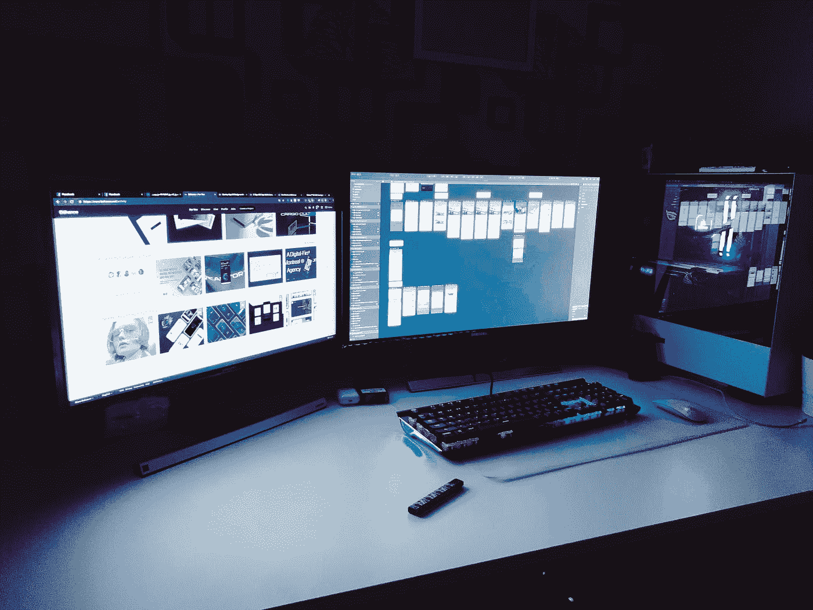
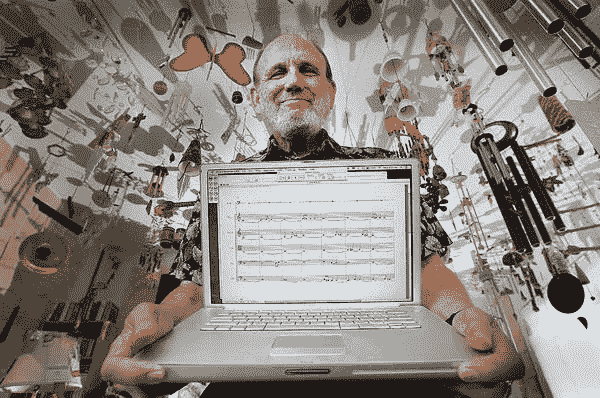
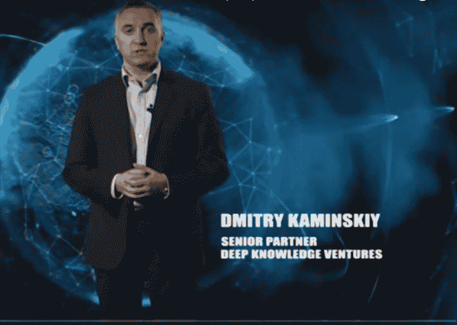
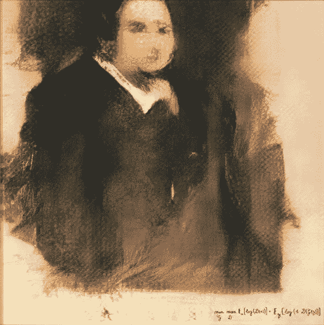

# 有一天电脑会拥有自己的东西

> 原文：<https://medium.datadriveninvestor.com/a-computer-will-own-things-one-day-c563a31a6e43?source=collection_archive---------1----------------------->

## 这听起来像科幻小说，但并不像你想象的那么遥远

Photo by [Saied Hosni](https://unsplash.com/@saiedhosni?utm_source=medium&utm_medium=referral) on [Unsplash](https://unsplash.com?utm_source=medium&utm_medium=referral)

在我们的文明中，我们来到了一个奇怪的点。想想我们今天作为人类所接受的东西。我们生活在一个以证据为基础的世界里，我们为发生在我们周围的事情寻找科学的原因。

闪电不是雷神挥动他万能的锤子造成的。它是由云中聚集的正负带电粒子造成的。

我们需要真实的答案，而不是我们头脑中编造的随机解释。然而，尽管我们对真实的需求，我们已经投入了大量的力量到我们大脑的人工创造——计算机。

我们今天允许这些人造人驾驶飞机。最终，他们也会开我们的车。当你在网上搜索信息时，你每天都在与一个看不见的无名生物互动。我们甚至给它起了一个好听的名字:*一种算法或者人工智能*。

 [## 人工智能预测能力的神话|数据驱动的投资者

### AI(人工智能)最有前途的优势之一似乎是它预测未来的能力…

www.datadriveninvestor.com](https://www.datadriveninvestor.com/2019/03/01/the-myth-of-ais-predictive-power/) 

很多时候，这些算法的功能就像一种块盒。他们为我们做各种各样的决定，而我们并不确切知道他们是如何得出答案的。

在 [*科技评论*](https://www.technologyreview.com/s/604087/the-dark-secret-at-the-heart-of-ai/)*的一篇文章中，威尔·奈特描述了英伟达如何创造了一辆自动驾驶汽车，它可以教会自己如何驾驶。科学家无法解释它是如何学习的。*

*他还描述了纽约西奈山医院使用的人工智能系统 Deep Patient。Deep Patient 在预测新患者的各种疾病方面变得非常熟练，它将检查这些新患者的记录。在没有指导的情况下，它以任何医生都无法做到的方式连接数据点。*

*该算法的创造者无法解释它是如何做到这一点的，但这并没有阻止医生使用该程序。*

*在我们当前的世界中，我们需要证据来证明我们周围发生的事情，我们接受人工造物在没有任何解释的情况下为我们做决定。*雷神变身算法*。*

*但是，我们愿意更进一步吗？我们会给这种人工创造所有权吗？它能拥有一栋建筑、知识产权或一家企业吗？*

*你可能会嘲笑这种想法。不要。我们的雷神算法有一天可能只是你的老板或房东。*

# *人工实体如何“拥有”任何东西？*

*非血肉之躯拥有财产的想法听起来像是阴阳魔界的一集。但纵观人类历史，人造实体拥有财产并雇佣活人。*

*在尤瓦尔·诺亚·哈拉里的书《德乌斯人》中，他解释说古代苏美尔的寺庙管理土地和雇佣工人。那些接受报酬和工作的人被视为那个特定上帝的雇员。土地和土地上的农作物被视为神庙所代表的神的财产。*

*这也延续到了现代历史。公司、政府和组织可能没有跳动的心脏，但他们可以做许多有血有肉的人能做的事情。*

*世界上最古老的公司实际上已经存在了 [1400](https://www.worldatlas.com/articles/the-oldest-companies-still-operating-today.html) 年，所以人工实体的想法并不新鲜。甚至旧约中的玛士撒拉也只活了 969 岁。*

*美国不是一个有血有肉的人，然而它却拥有这个国家大约 [28%](https://www.nytimes.com/2012/08/24/us/romney-would-give-reins-to-states-on-drilling-on-federal-lands.html) 的土地。天主教会本身，这个组织，拥有 1 . 77 亿英亩土地。*

*除了土地，人工实体也可以拥有知识产权。仅在 2018 年，IBM 就获得了 9100 项专利。除了思想的所有权，这个人工实体还雇佣人。谷歌搜索显示，同一家公司 IBM 在全球拥有 366，000 名员工。*

*企业可以像你我一样纳税并向慈善机构捐款。事实上，美国企业在 2018 年向慈善机构捐赠了 200 多亿美元。他们也可以在法庭上起诉和被起诉。*

*一个公司可能不能投票，但他们可以通过政治行动委员会向竞选活动捐款。*

*因此，人工实体拥有物品的想法并不奇怪。*

# *计算机可以创造并被赋予权利*

**

*Professor David Cope — University Of California Santa Cruz’s [Website](http://artsites.ucsc.edu/faculty/Cope/)*

*你可能会说公司和组织可能是人为的，但它们仍然是由人组成的。你也可以说计算机没有足够的创造力去“拥有”某样东西。他们只是遵循代码行，并作出他们被编程要做的决定。*

*关于组织由人组成的评论是正确的。然而，计算机没有创造力的想法远非事实。各种形式的人工智能使计算机能够以某种方式思考和创造。*

*大卫·科普教授创造了一个名为艾美奖(音乐智能实验)的计算机程序。这个程序可以通过采样伟大的已故作曲家以前的作品来创作他们风格的新作品。*

*正如柯普在接受《卫报》采访时解释的那样，有一天他按下机器上的按钮去吃午饭。当他回来时，艾美奖已经创作了 5000 首巴赫原创合唱曲。*

*1993 年，Cope 制作了一张专辑，名为[巴赫设计](https://www.amazon.com/Bach-Design-Design-Computer-Compos/dp/B0000057WM)，收录了这位作曲家风格的“新”作品。柯普继续以艾美奖创作的其他作曲家的风格制作其他专辑。但是，他并没有就此止步。*

> *“为什么不以未知的方式发展音乐？这才有意义。我不明白我写在纸上的笔记和其他写在纸上的笔记有什么不同。如果美存在，它就存在。我希望我能继续创作音符，这些音符对其他人来说也是美丽的。我不难过。我不开心。我是艾米丽。你是戴夫。生命和非生命存在。我们共存。我看不出有什么问题。”*
> 
> *—艾米丽·豪厄尔*

*上面的陈述听起来像是艺术家或作家的评论。然而，它是由大卫·柯普的新节目艾米丽·豪厄尔写的。艾米丽不仅创作音乐，还写俳句。*

*事实上，柯普创作了一本名为 [*的俳句《火红的夜晚来了》*](https://www.amazon.com/Comes-Fiery-Night-D-Cope/dp/1466219157/ref=sr_1_1?ie=UTF8&qid=1511975988&sr=8-1&keywords=comes+the+fiery+night) *。这本书有 2000 首由人类作者和艾米丽创作的俳句诗。Cope 并不标明谁写了什么，而是挑战读者去尝试并找出答案。最近的一本书[评论家](https://www.bigbangpoetry.com/2017/11/the-machine-that-writes-haiku.html)解释了他如何在 221 首诗中只猜对了 21 首。**

*如果这对你来说还不够的话，电脑还会画画。这幅由一个人工智能程序创作的画作 [**埃德蒙·贝拉米**](https://www.bbc.com/news/technology-45980863)**肖像在佳士得拍卖行以超过 40 万美元的价格售出。***

*除了创造能力，人工智能也可能在某一天被赋予权利。2017 年，欧盟发布了一份关于赋予“人造人格”合法权利的报告。这种人格将与公司获得的人格处于同一水平。*

*PBS.org 还研究了法律学者肖恩·拜尔(Shawn Bayer)的作品，其中他可以利用公司漏洞在人工智能上传达法律人格。*

*他描述了建立两个独立有限责任公司的过程。设立有限责任公司的人会将每个有限责任公司的控制权移交给人工智能，这也使每个公司成为另一个有限责任公司的一部分。这将使一个具有法律人格的公司只由人工智能控制。*

# *计算机能成为领导者吗？*

**

*Dmitry Kaminskiy — Screen Shot From Deep Knowledge Ventures [Video](https://www.youtube.com/watch?v=hOr-lVGoI-4)*

> *“我们将它视为我们董事会中具有观察员地位的成员。作为董事会，我们一致同意，没有 Vital 的证实，我们不会做出积极的投资决定。”*
> 
> *Deep Knowledge Ventures 的管理合伙人 Dmitry Kaminskiy*

*上面 David Cope 的计算机算法或许可以在某种程度上“创造”。也许有一天人工智能会被赋予某种权利。但是，你可能会说计算机不能“拥有”某物，因为它不能领导。它不能选择拥有什么。*

*这可能是一个合理的假设，但是如果我告诉你有一个计算机算法在一个公司的董事会里呢？为了坐上董事会的席位，必须展现出某种领导力。*

*Deep Knowledge Ventures (DKV)最初是一家普通的生物技术基金。它对潜在药物进行传统分析，并试图投资赢家。正如《日经亚洲评论》报道的那样，这可能是一种冒险的方法，因为 96%的药物无法通过临床试验。*

*DKV 聘请了一个专家团队来分析数据，他们为推进生命科学(Vital)开发了验证投资工具。这个人工智能程序可以根据 50 个参数分析公司。*

*随着维塔尔对大量公司的观察，DKV 开始意识到专注于对抗衰老影响的公司通常是最成功的。结果，DKV 改变了他们基金的整个方向，仅仅围绕生命科学的这个方面。*

*该基金的许多成员实际上把他们从破产的边缘拉了回来，这是非常有效的。*

*卡明斯基认为，在未来十年内，人工智能在企业管理中的应用将大幅增加。他还认为，有朝一日，公司将在没有人类互动的情况下自主运行。所以肖恩·拜尔和欧盟的想法可能是合理的。*

# *作为所有者的计算机*

**

*Portrait of Edmond Belamy — Created By Artificial intelligence software Via [Wikipedia Creative Commons](https://commons.wikimedia.org/wiki/File:Edmond_de_Belamy.png)*

*我们的祖先相信托尔住在云中。现代人在互联网和算法中看到了雷神。这些人造实体每天保护我们，运送我们，为我们做决定。通常我们不确定他们是如何做的。*

*尽管我们是一个以证据为基础的社会，但这并不妨碍我们使用和依赖它们。*

*正如你所看到的，计算机可以创造，领导，也许有一天会被赋予人格。*

*为什么一个算法或人工智能不能拥有财产或雇佣人？我们正在进入一个时代，在这个时代，像计算机“拥有”东西这样的想法将不再是一个奇怪的想法。*

*以后你的雇主或者房东可能就是一个算法。随着计算机和算法变得越来越复杂，它们拥有事物的想法可能会变得不可避免。*

*感谢你阅读我的漫谈，如果你喜欢你所读的，请分享。*