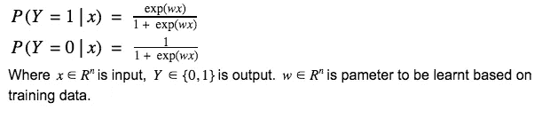
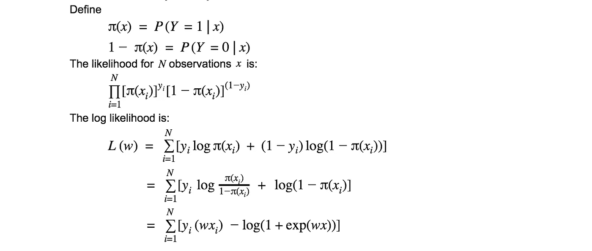
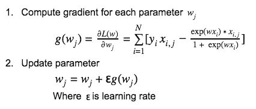
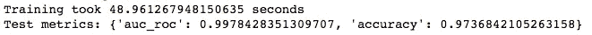

# 逻辑回归简明介绍

> 原文：<https://medium.datadriveninvestor.com/a-concise-introduction-to-logistic-regression-fe6efc130480?source=collection_archive---------17----------------------->

**Logistic 回归** **(LR)** 是一种简单而有效的分类模型，在工业中有着广泛的应用。为了帮助理解它，这篇文章将介绍 LR 二进制分类背后的主要思想。此外，在 [Github](https://github.com/FangzhengHu/blog/blob/master/logistic_regression/model.ipynb) 上有一个 Python 的基本实现。

# 模型定义

逻辑回归(二项式)是一种分类模型，用条件概率分布 P(Y| X)表示:

# 模型拟合

模型通常通过**最大似然**拟合训练数据。

Likelihood and Log-Likelihood for training data

最佳参数 w *可以通过最大化 L(w)来找到。梯度下降法是迭代逼近最优参数的常用方法。每个迭代中有两个步骤:

Gradient Descent for maximizing Log-Likelihood

# Python 实现

为了说明这个模型是如何工作的，我实现了一个复杂度最低的 LR 模型。该模型用威斯康星乳腺癌数据集[进行了测试。结果看起来很有希望:](https://scikit-learn.org/stable/modules/generated/sklearn.datasets.load_breast_cancer.html#sklearn.datasets.load_breast_cancer)

用于实施的 Jupyter 笔记本可从[这里](https://github.com/FangzhengHu/blog/blob/master/logistic_regression/model.ipynb)获得。如有任何反馈或问题，我们将不胜感激。

参考文献:
-j . Friedman，t . Hastie 和 r . TiB shirani，2001 年。*统计学习的要素*(第 1 卷，№10)。美国纽约州纽约市:统计中的斯普林格系列。