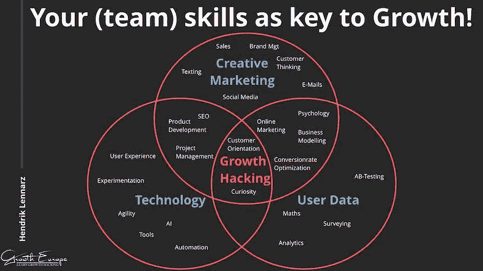
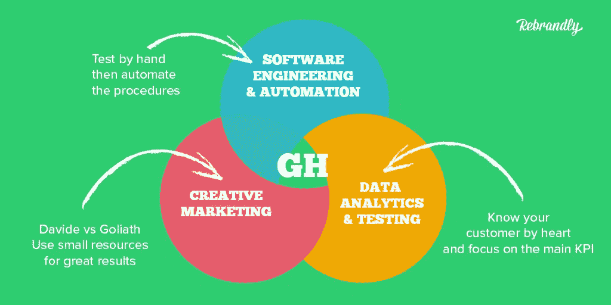
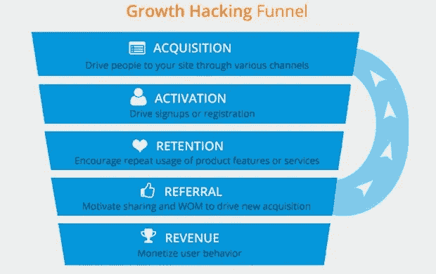

# 增长黑客速成班，你不用付钱

> 原文：<https://medium.datadriveninvestor.com/a-crash-course-on-growth-hacking-you-dont-have-to-pay-for-33b72522c53b?source=collection_archive---------0----------------------->

Photo by [Austin Distel](https://unsplash.com/@austindistel?utm_source=unsplash&utm_medium=referral&utm_content=creditCopyText) on [Unsplash](https://unsplash.com/?utm_source=unsplash&utm_medium=referral&utm_content=creditCopyText)

增长黑客在当今世界各地的初创公司和企业中非常受欢迎，以至于几乎没有在线速成课程。这是因为成长型团队或成长型黑客给公司带来的巨大价值。

几周前，我为我的数字未来学家小组参加了一个关于增长黑客的会议，在数字营销部分。虽然我来晚了，但这是我和大家分享的。

 [## 金融科技初创公司正在颠覆全球银行业|数据驱动的投资者

### 传统的实体银行从未真正从金融危机后遭受的重大挫折中恢复过来…

www.datadriveninvestor.com](https://www.datadriveninvestor.com/2018/10/20/fintech-startups-are-disrupting-the-banking-industry-around-the-world/) 

# 术语介绍:增长黑客。

增长黑客是肖恩·埃利斯在 2010 年创造的一个术语。Qualaroo 的创始人兼首席执行官。他帮助过 Dropbox、Eventbrite、LogMeIn 和 Lookout 等公司，这些公司现在都价值数十亿美元。[https://www.linkedin.com/in/seanellis/](https://www.linkedin.com/in/seanellis/)

不久之后，增长黑客是新的营销副总裁，陈楚翔写的博客文章。当时他是优步的增长主管。陈楚翔让这个术语变得非常流行&突然间，每个人都在寻找一个成长型黑客。【https://www.linkedin.com/in/andrewchen/ 号

> 一般来说，黑客是营销人员和技术人员的混合体，他们关注的是传统问题“我如何为我的产品赢得客户？”并通过产品实验、登录页面、病毒因素和利用其他产品来回答。

它可以是任何东西，从寻找产品的细微变化，营销策略的变化，为公司带来高速增长的病毒式视频。增长黑客与营销、销售、产品、技术和业务分析团队合作，了解用户行为，实施新的目标和实验，衡量结果，并再次进行相同的过程，直到他/她找到一个爆炸性的公式来实现增长的曲棍球棒曲线。

Growth Hacker Essentials Skills

增长黑客不能取代营销人员。成长黑客的每一个决定都是由成长决定的。每一个战略，每一个战术，每一个倡议都是为了成长而尝试的。这种对增长的绝对关注已经产生了许多方法、工具和最佳实践，这些在传统的营销剧目中根本不存在，而久而久之这两个学科之间的鸿沟加深了。

在几个案例研究之后，我们将回到增长黑客的角色和过程。这将有助于更好地理解这一过程。

增长黑客并不新鲜，让我们来看看一些案例研究，我们将为此回顾历史。我们将关注两个企业决定利用竞争的商业事件。

# 1.微软和 IBM:

1980 年，微软与 IBM 结成伙伴关系，将微软的操作系统与 IBM 电脑捆绑销售；这帮助微软接触到了世界上大多数的电脑。值得注意的是，IBM 显然期望微软要求更多的预付款，或者至少是每份版税，但是微软却希望能够向其他公司出售 DOS。当微软在 20 世纪 90 年代推出几个版本的微软视窗系统时，它们已经占据了全球个人电脑 90%以上的市场份额。

# 2.苹果 iPod 和 Itunes:

I pod 于 2001 年 10 月 23 日发射。前两年，苹果的销量分别为 40 万台和 90 万台。在那之后，苹果团队决定为微软 Windows 操作系统推出 iTunes(一种同步音乐所需的软件)。史蒂夫反对这一决定，苹果高层团队与史蒂夫·乔布斯对峙，并推进了这一进程。后来，史蒂夫勉强同意在 2003 年 10 月在 windows 上推出 iTunes。2003 年 4 月，苹果将 iTunes 引入 windows，史蒂夫·乔布斯说:“这可能是有史以来最好的 Windows 应用程序，”2004 年发布后，iPod 的销量为 450 万部，2005 年的销量高达 2250 万部。到 2007 年，iPod 为苹果创造了 40%的收入，销量为 5400 万台。同年，史蒂夫推出了 iPhone。

# 从两个案例研究中得出的结论是，利用竞争对手的能力。利用竞争的成功为你的产品赢得顾客。

*IBM 和微软都是竞争对手，两家公司都有自己的操作系统版本。苹果和微软是操作系统领域的竞争对手。有趣的是，微软对 IBM 的做法与苹果对微软的做法有点类似*

> 有多少次，你想到利用你的直接竞争对手的能力，并利用它？

# 3.YouTube:让人们传播视频

YouTube 于 2005 年推出，由三名前 PayPal 员工创建。YouTube 通过提供一小段代码将视频嵌入到任何网站来加速其发展。简单到 1，2，3。上传视频，复制代码，粘贴在你的网站上。视频可以在任何网站上直播，不需要视频播放器 YouTube 播放器可以在任何网站上自动播放视频。这一小步让 youtube 视频遍布网络，成就了现在的 YouTube。

> 每月有 20 亿人登录 YouTube，平均时长为 40 分钟。BTW Youtube 最初应该是一个视频约会网站。

类似地，Linkedin、Paypal 等公司也使用了各种增长技巧。Linkedin 使用从电子邮件导入联系人等工具，Paypal 利用 E-Bay。

游戏公司利用其他网络的增长技巧的更多现代例子

1.  糖果粉碎利用脸书邀请人们
2.  还记得 Zynga 的 FarmVille 吗，你邀请 FB 上的人成为你的邻居，而你所做的只是电子农业。

# 成长黑客流程:

在这个过程的核心，增长黑客是所有关于实现你的产品的病毒式传播或口碑。一言以蔽之，推荐。

成长黑客并不是像改变颜色、更换按钮、时不时地改变用户界面/UX 这样的小变化，而是对思维的巨大转变保持开放。小的改变带来小的结果，但是寻找最有影响力的改变。

我们如何实现增长黑客？我们需要主要在以下领域开展工作。

1.  利用:利用任何高用户群产品/利用竞争
2.  产品:让客户更容易参考、分享、交流、嵌入、展示等。
3.  网络/社区:让人们推广你的产品。
4.  营销:内容，突出的标语。

几个例子:

*   杠杆:Airbnb
*   产品:Eventbrite，Instagram
*   网络:Dropbox
*   营销:胳肢，中枢点

# 病毒式传播:

当你问别人你是在脸书、Instagram 还是 Linkedin 上。你为公司创造了口碑。你要求人们使用产品，这种增长黑客使用推荐的力量，或网络效应或病毒式传播。这对任何人来说都是最好的方法。让我们列举一些有效利用这一点的公司

1.  DropBox
2.  推特
3.  帕坦加利(丹克兰提)
4.  优步
5.  Quora

通过邀请/网络效应进行病毒式传播。Hotmail 是一个经典的案例研究。Hotmail 在每封邮件的底部都使用了一个电子邮件签名“在 Hotmail 获得免费电子邮件”。黑莓也使用了同样的黑客手段。类似于从黑莓设备或 LinkedIn 发送，邀请 LinkedIn 上的所有联系人列表。

如何衡量一场病毒式的战役？

要传播的产品必须有一个大于 1 的病毒系数或 K 因子。这意味着任何注册的新用户都会为产品带来一个或多个新成员。它有一个非常简单的等式

> 病毒系数(K) =客户发出的邀请 x 接受邀请的人的百分比。k 应该总是大于 1 以实现病毒式传播。

然而，如果这令人困惑，你可以使用下面的公式，这个简单的公式是由 Napster 的联合创始人、脸书前总统肖恩·帕克设计的。

## 病毒率=有效载荷 x 转化率 x 频率

让我们以 Hotmail 案例研究为例。有效负载是每个用户将邀请或发送促销的人数。(在 Hotmail 的情况下是电子邮件)转换率是指有多少人会采用该产品(创建 Hotmail 帐户的人)以及人们发送邀请和促销信息(新用户发送电子邮件)的频率

为了创造病毒式增长，你必须优化三个变量。在 Hotmail 案例中，有效负载很低，但是转化率和频率很高。所以即使有效载荷很低，你也能实现病毒式传播。

这么低的激励(Hotmail 的一个)现在可能行不通了。因此，当你为用户创建一个激励计划时，让它成为一个双面激励，给接收者和发送者都一些东西。

病毒程序是可以设计的，而不是火箭科学。你可以设计一个病毒式激励计划&用上面的公式来衡量它。

# 北极星公制。

简单地说，这是你应该追求的唯一指标，一个最重要的指标，一个对每个人来说都是基本指标的指标。例子

*   Airbnb:已预订的夜晚
*   脸书:每日活跃用户
*   Quora:用户回答的问题数量
*   WhatsApp:用户发送的消息数量

确定你的北极星指标可能是成为一家伟大的公司或一家即将出局的公司的区别。识别它也有助于你更好地了解你的客户和产品。如果用户不发送消息，他就不是 what's App 的用户，类似于 Twitter 或 FB。要在平台上，要在平台上活跃。

这也是为什么公司为了用户要遵循三个团队。

1.  获得物ˌ获得
2.  激活
3.  保留

作为一名成长黑客，你需要完整地审视所有这些指标，看看哪一个指标能同时满足所有这些指标。问一个问题，影响以上 3 点的一件事是什么？那就成了你的 NSM。

北极星指标(NSM)本质上是[一个重要指标](https://blog.grow.com/one-metric-that-matters/)的另一个名称——这是一个最能抓住你的产品向客户提供的核心价值的具体指标。

# 保留

作为一种策略，留住人才被低估了，但它是最有力的策略。如果你的底部漏斗是打开的，不要在收购中烧掉一切。你还应该关注你应该为你的客户实现的一件事是什么，客户使用/支付产品？例子

如果你在 FB 上没有 15 个朋友，你最有可能流失

如果你在 Twitter 上没有关注 30 个人，你很可能会流失

如果你没有在 Dropbox 上存储文件或分享文件，你就不是 Dropbox 的用户。

我忘了数字，所以把数字当作指示性的。你需要找出你必须为用户实现的一件事，这样他们才不会流失。你必须为你产品找到相似的度量标准。

所有的公司都依赖大量的分析来留住用户。Twitter 分析说，一个用户在过去的一个月里来了 7 次，在接下来的几个月里就会变得非常活跃。否则，他最有可能被淘汰或死亡或休眠。他们努力让用户在第一个月至少查看 twitter 7 次。

# API:应用编程接口

基本上，API 只是允许应用程序相互通信。

当人们谈到“一个 API”时，他们有时会泛指“一个公共可用的基于 web 的 API，它返回数据，可能是 JSON 或 XML 格式的”。API 不是数据库，甚至不是服务器，它是控制服务器访问点的代码。

## 使用 API 推广产品/品牌:

你的应用程序使用的登录 API 是什么，是 FB 还是 Google。它们现在是登录的同义词。每个人都需要通过 FB 或谷歌登录。这是如何发生的，因为他们为开发者发布了一个登录 API，使客户可以轻松登录，同时为 FB/Google 建立了一个品牌？哪家公司可能会尝试同样的做法？

微软，亚马逊，Github。想想你能为你的公司使用这个吗？这是一个简单的 API，你也可以发布它。

API 是一种不需要你做广告就能进入另一个应用网站的简单方法。Dropbox、FB、亚马逊、Pinterest、新闻网站、板球比分、足球比分等网站是否都使用它。使用 API 并向创业公司、app、API 发布公司推广。

# 成长黑客:我的经历

免费试用期:如果你有收费服务。我意识到尝试和限制一段时间会带来很好的结果。所以我们周末提供免费服务。没有一个月的试验，没有一周/天的试验。这个周末和下个周末对所有人都是免费的。我这样保持了 3 个多月。结果:订阅或付费用户增加了 300%。在周末使用的人在工作日回来并支付服务费用。

任何应用程序下载的 90%来自应用商店搜索。专注于你的应用故事发现，你可以在没有营销投资的情况下推动数百万次下载。

Google play 商店:简短的描述必须是一个杀手。没人会费心去读那些冗长的描述。长描述是为了应用商店搜索和输入正确的关键词。请记住，应用程序的发现取决于详细描述，下载取决于简短描述。简短的描述是你要写的最重要的一行。

详细描述中的前 3 行是关于应用程序最重要的几行。这将出现在谷歌搜索中，并将带动 10%-20%的应用下载。这也将成为 ASO 或 App store 搜索的一个很好的工具。

app 上的权限:使用联系人、登录、相机、照片等。保持应用程序的最低权限。权限会在你思考之前扼杀 app。一旦你建立了自己的品牌，你可以继续增加用户权限的数量。只有在最重要和绝对必要的情况下，才能将用户权限保持在最低限度。你会失去 50%的客户，因为你要求权限。

除非绝对必要，否则不要要求登录。让用户浏览应用程序。如果你在第一页登录，50%的客户甚至没有看到应用程序的第一个屏幕就流失了。

当我管理音乐、App Store 或任何图书馆等产品时，我意识到不提供推荐对客户来说更好。

我们过去常常展示下载最多、最受欢迎和最常用的应用程序。然而，当意识到客户再次回来时，他也会一遍又一遍地查看同一套产品/推荐。所以我们改变了一切。任何超过一定下载量的应用都不会出现在推荐中，因为人们会搜索它。我们用人工智能算法在主页上自动显示类别中销量第二或第三的商品。然而，当我们将新发布的产品放在各种页面的顶部时，销售额下降了。

当销售在外部世界获得一定的吸引力时，它总是在图书馆工作。当电影上映时，一首歌会从商店下载更多。当人们开始谈论一款应用时，它的下载量会增加。所以如果你在运营库产品，不要在产品新的时候推。等待一段时间；让它在外界获得牵引力。这个简单的政策帮助我获得了数百万美元的销售额。

脸书、Youtube、Instagram 和流行社交网站的新算法聚焦于评论。他们将评论视为参与度的衡量标准。因此，如果你的社交网站需要有机客户，就要专注于获取评论。

为了让新用户成为你的追随者，你也可以去不同的页面，在他们的帖子上发表评论。你评论得越多，你的追随者就越多。

社交更多的是一致性，然后才是内容。有一致性的伟大内容，才会有爆发式的增长。然而，一致性是关键。如果你每天在社交网络上发 2 条帖子，那么坚持几个月每天发两条。不要从 4 个降到 1 个或者有一天变成 10 个。保持一致。

# 流行增长黑客案例研究:

脸书:脸书在达到 5000 万用户的时候停滞不前。在他们之前，没有其他社交网络拥有超过 5000 万的客户，该团队不知道如何获得更多的客户，如果他们做到了，他们将成为第一家这样做的公司。

脸书转向了语言。FB 开始用当地语言提供服务。脸书做了其他社交网站做不到的事情。他们选择了在他们之前没有人尝试过的路线。其他公司也在效仿 FB，Twitter，Quora 就是其中之一。利用当地语言，这是一个伟大的增长黑客。

现在脸书有 104 种语言。印度有 3 亿人，是世界上脸书用户最多的国家，也是使用印地语最多的国家。

Pinterest:该公司为所有用户提供了一个 Chrome 扩展，使其更容易固定照片。安装扩展，你看到的任何图片都会有一个写着保存的 Pinterest 标志。用户可以一口气在 Pinterest 上发布大量链接，而且他们让这变得超级简单。如果你是 Pinterest 用户，你会对这个按钮上瘾。

*高收入和教育程度较高的美国家庭使用 Pinterest 的可能性是低收入和教育程度较低的美国家庭的两倍。59%的千禧一代在 Pinterest 上发现了产品。*

Poshmark: Poshmark 是美国的一个社区市场，它让女性购买从其他人的衣橱里出售的物品。挣扎了 3 年做传统营销，结果惨淡。该公司创建了一个名为“认识高贵者”的程序，邀请现有用户在该平台上与新认识的人打招呼。当有人问候时，人们感觉更好，这促使他们采取行动，收到问候的那组人有更高的购买者激活度。该公司目前的估值为 12.5 亿美元。

超过 500 万卖家在超过 7500 万个列表中列出了 500 个品牌。Poshmark 现在拥有超过 5000 万用户。

条纹:B2B 案例研究。你在网上付款吗，我肯定你会的。你很少知道，有时在网站/应用程序上集成支付网关需要几个月的时间。两兄弟，他们想出了七行简单的代码，任何人都可以在一天内插入任何应用程序或网站，以连接到支付公司。过去需要几周时间的流程现在变成了剪贴工作。便利是这家公司的增长秘诀。

*在过去的一年里，65%的英国互联网用户和 80%的美国用户已经从 Stripe-powered 公司购买了一些东西，尽管很少有人知道他们正在使用它。*

大本营:B2B 案例研究。Jason Fried 领导的公司用挫折做的项目管理工具。它始于 2008 年的 12 美元/月/公司/无限用户。定价如此之低，以至于它成为热门。在 Basecamp 首次进入市场 10 年后，近 15，000，000 人参与了 Basecamp 的一个项目！Basecamp 现在收费 99 美元/公司/月/无限用户。相比之下，slack 每月每用户 6.6 美元。

*Basecamp 现在有 280 万用户。Basecamp 现在估值 1000 亿美元，只有 53 名员工。*

# 基本增长应用:

Windows 应用程序:可以下载的桌面 Windows 应用程序。一次性你将有机会坐在世界上超过 10 亿台电脑上。我说的不是网站。适用于您产品的 Windows 应用程序。在网站上，你需要每天吸引人们，在应用程序上，你和他们生活在一起，是他们生活的一部分。

chrome 扩展:做一个简单的 Chrome 扩展，让用户从 Chrome 网上商店发现你。65%的世界人口使用 Chrome 作为浏览器。你可以成为下一个 Pinterest 或者 EverNote。

让我们以马克·扎克伯格的社交分享定律作为结束。马克在 2011 年提到了这一点，随着社交分享的增长，重新审视影响我们生活的法律是有意义的。

法律规定社交媒体上分享的内容将每年翻一番。所以如果你今天分享 X，明年你会分享 2X，然后年复一年分享 4X，8X。

非常感谢大家。

# 增长黑客必读&参考资料

*病毒循环平装本作者亚当·佩恩伯格*[https://amzn.to/2mi573t](https://amzn.to/2mi573t) *黑客成长作者肖恩·埃利斯和摩根·布朗*[https://amzn.to/2lY33gH](https://amzn.to/2lY33gH) *牵引:任何创业公司如何实现客户爆炸性增长作者*加布里埃尔·温伯格和贾斯汀·马雷斯[https://amzn.to/2mi573t](https://amzn.to/2mi573t)