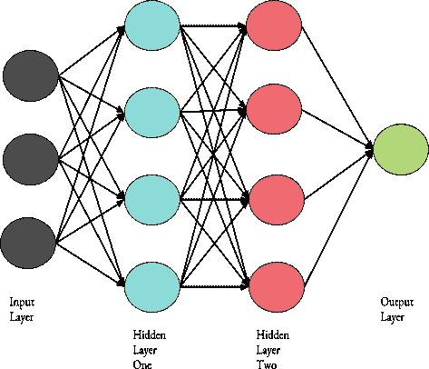

# 现代技术速成班

> 原文：<https://medium.datadriveninvestor.com/a-crash-course-on-modern-tech-aaa1793c59f?source=collection_archive---------15----------------------->

人工智能。这是今天的流行语。还有一些是:机器学习和深度学习。但是这些东西是什么呢？？？

# 什么是人工智能？

人工智能(AI)旨在创造具有类似人类智能的**计算机。**例如，一种人工智能算法允许与你兴趣相似的电影出现在你的网飞账户的推荐部分。这就相当于一个知道你喜欢什么的朋友，根据你的兴趣给你推荐一部电影。AI 算法确定一部电影是否与你看过的其他电影相似，然后显示出来。该算法使用机器学习，这将在下一节中解释。人工智能的另一个例子是数字助理，如 Siri、Alexa 和 Google Home。因为有了 AI，他们才能明白你在说什么。AI 识别并处理你对话中的命令，然后助手相应地执行命令。人工智能在许多方面融入了我们的日常生活，甚至我们都不知道。它有时以助手和算法在幕后工作的形式出现。人工智能是 T2，而不像许多电影描述的那样，只是一群试图接管世界的机器人。

有两种不同类型的人工智能:

*   狭义人工智能
*   艾将军

# 狭义人工智能

狭义人工智能是我们现在拥有的人工智能类型。人工智能在一项特定的任务上非常擅长(比如为你寻找推荐的节目和电影，或者处理你说的话)，但它不擅长其他任何不需要它做的事情。例如，网飞算法不能为你做功课，或任何其他任务。这就是艾将军的作用。

# 艾将军

通用人工智能是我们希望在未来建立的人工智能类型，但现在还没有通用人工智能。一般 AI 会精通多项任务，非常像人类。

# 什么是机器学习？

机器学习(ML)是人工智能的一个子集，它允许机器在没有明确编程的情况下学习**。说什么？？？是的，机器现在**能够自主学习**，无论是从**过去的经验**还是**大型数据集**。用于 ML 的算法寻找数据中的模式以得出结论。当算法擅长于推断正确的信息时，它们可以将它们的知识应用于不同的数据集。例如，网飞算法通过在你以前看过的电影的大型数据集中寻找模式，得出你可能喜欢哪种电影的结论。显示在推荐行中的电影不仅仅是基于你以前看过的电影类型。以下是一些其他因素，这些因素决定了算法会将哪些内容放入您的推荐部分:**

*   您最近观看的内容
*   看完某个节目/电影后你看了什么
*   在某个节目/电影之前你看了什么
*   你每天什么时候看某个节目/电影

正如网飞的例子所示，机器学习算法需要大量数据才能准确运行。有两种不同的数据类型可以输入机器:

*   标记数据
*   未标记的数据

# 标记数据

当给人工智能贴上标签的数据时，人工智能被**准确地告知数据是什么**。例如，如果一台计算机正在学习如何区分马和斑马，可以给它一张马的照片，并告诉它这是一张马的照片。它的**就像给数据贴上了一个标签**，因此得名。

# 未标记的数据

当未标记的数据**被给予 AI 时，AI 必须自己定义数据**。在这种情况下，**“标签”不会被赋予**机器。例如，如果机器正在对马和斑马进行分类，它将获得一张马或斑马的图片，并且它必须根据它们的不同特征来识别动物。

从数据中学习有三种不同的方法:

*   监督 ML
*   无监督 ML
*   强化学习

# 监督和非监督 ML

受监督的 ML 是一种学习类型，当带标签的数据被输入计算机时**就会发生这种学习。输出也提供给计算机，训练它识别哪个输出属于特定类型的数据。在上面的例子中，计算机使用输入的图像来学习分类马和斑马。它还被告知给出的图像是马还是斑马。监督 ML 有点像你在一张有答案的工作表上工作。当计算机**仅基于给定的输入数据**推导出学习算法时，就会出现无监督 ML。这是当计算机**没有被赋予标签**，并且**使用未标记的数据**时。这就像给你一个测试，你必须自己找出问题的答案。**

# 强化学习

强化学习是指计算机通过做正确的事情得到奖励，做错误的事情受到惩罚来进行学习。例如，计算机可以使用强化学习来自学玩游戏，如国际象棋。它可以每赢一局奖励一分，每输一局拿走一分。然后，计算机可以思考它赢得的游戏，并理解哪些移动让它赢了，并赢得那一分。

因此，有监督的 ML 使用有标签的数据，无监督的 ML 使用无标签的数据，而强化学习每次做对一件事时都会给人工智能一个鼓励。这些是人工智能可以使用的所有学习形式吗？没有。还有深度学习，在我看来，这是人工智能可以学习的最酷的方式。

# 什么是深度学习？

深度学习是 ML 的**子集，**允许计算机通过分析标签数据**来学习。大多数深度学习技术通过使用神经网络(又名**人工神经网络**)来模仿大脑。人工神经网络(ann)使用多层节点来工作，这些节点就像神经元(神经元是将信息发送到身体各个部位的脑细胞)。每个节点**分析给它们的数据**，然后**将它们的分析**传递给下一层节点**作为输入。****

输入层将数据提供给第一个隐藏层，隐藏层对数据进行分析。完成后，它把它交给第二个隐藏层进行进一步分析。当然，人工神经网络不仅仅局限于两个隐藏层。理论上，如果需要，可以有更多。最后，输出层是当任务已经完成时(例如，当图像已经被分类时)。根据算法的不同，这一层可能会显示所做工作的最终结果。

人工神经网络**自动学习关于给定数据的特征**。特征就像帮助**区分两个数据**的标识符。例如，斑马身上的条纹就是它的一个特征。这可以使人工神经网络真正擅长分类任务，例如对图像进行分类。

# 关键要点

*   人工智能是具有类似人类智能的计算机
*   人工智能有两种类型:狭义人工智能和广义人工智能
*   机器学习允许机器在没有明确编程的情况下学习
*   有两种类型的数据可用于机器学习:标记数据和未标记数据
*   人工智能有三种学习方式:有监督的最大似然、无监督的最大似然和强化学习
*   深度学习允许计算机使用人工神经网络和其他技术进行学习

人工智能听起来可能是一个复杂的话题，但希望这个速成课程能够帮助你理解它的一些不同部分。请继续关注更多文章，因为我开始使用 AI 开发自己的项目！