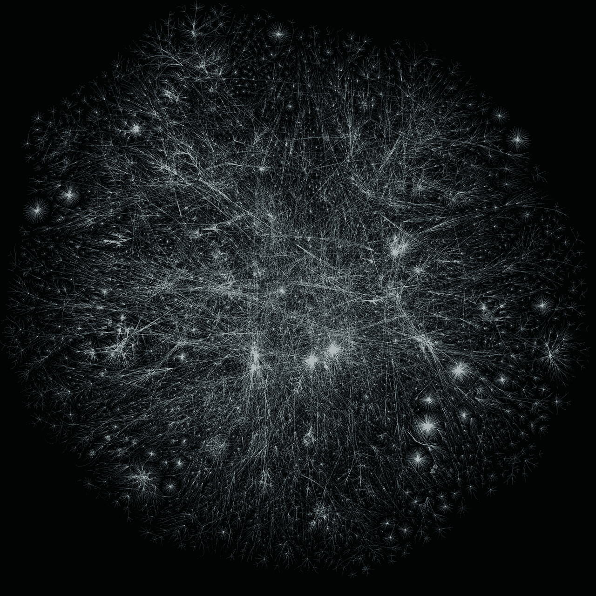

# 解决 bug 的数据驱动方法

> 原文：<https://medium.datadriveninvestor.com/a-data-driven-approach-to-solving-bugs-17020dffc09a?source=collection_archive---------48----------------------->

回到解决复杂(区块链)系统中的错误的基础。

在基于区块链的应用程序上工作很酷。但是解决 bug 是困难的。一旦错误变得棘手，就让它成为任何领域。

> 人们开始谈论感觉而不是数据。这就是中小企业的诞生。而且我也做过 SME，所以我知道。

# 每个人都做数据分析

在低成本数据时代，我们记录每一个事件。有了数百种数据分析工具，许多来自知名创业公司的人(有些来自 Y Combinator)谈论数据分析和发现用户模式。

> 让我说清楚，数据分析不等于发现模式。

数据分析是指对数据进行有意义的全面描述，包括中心价值和传播。

1.  你的团队最后一次测量 API 的响应时间是什么时候？
2.  你的反应时间有多长？或者 99%的反应时间？

在区块链系统中，延迟和数据一致性变化很大。第 99 百分位或分布测量变得至关重要。

# 每个人都忘记了统计推断

很多人或团队会做出推断，但没有人会做出统计推断。这意味着使用概率知识来推断。这个系统存在固有的风险；这很费时间。

> 有根据的猜测比统计推断要快得多。所以你付钱给你的 SME。你的 SME 能猜对几次？

在处理复杂系统时，需要引入技术上的严谨性。这种严谨给组织带来了巨大的信心。

> 让我带你看一个简单的场景。

1.  *C 是一个系统，它有两个独立的子系统 A 和 B*
2.  *C 延迟与 A 和 B 中的延迟相关*

*现在没有统计推断，你能告诉我们应该把重点放在哪里吗*

1.  *A+B 延迟*
2.  *B 延迟*
3.  *延迟时间*

> 现在想象一个依赖系统，有上瘾的特性。你现在能回答这个问题吗？

> 统计推断不只是针对延迟(连续数据)，也可以针对 HTML 502 响应错误(离散数据)。

我曾经和一个好朋友/QA 有过一次海量的争论，是关于统计和中小企业知识的。我坚信这两个学科同等重要，不能为了一个学科而牺牲另一个学科。

# 我期待用统计数据解决 Bug。再见

