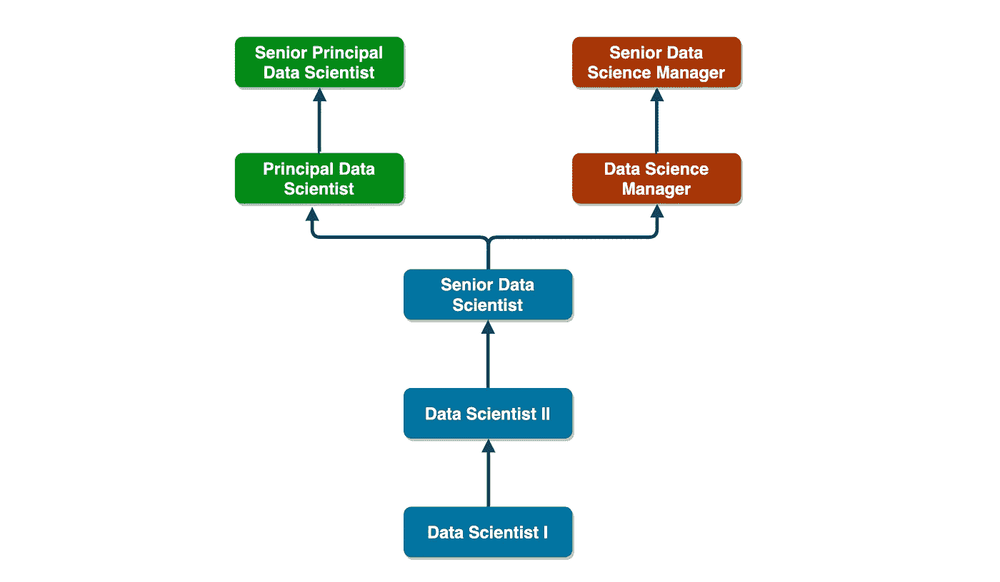

# 构建您自己的数据科学职业阶梯所需的一切

> 原文：<https://medium.datadriveninvestor.com/a-data-science-career-ladder-fc5356ec9c02?source=collection_archive---------3----------------------->

当你是一个组织中的第一位数据科学家，并且你很成功，你很可能会负责雇用其他数据科学家，并最终管理一个团队。随着您的团队不断壮大，您会收到来自员工的询问，询问他们对职业发展的期望，除了管理层之外，是否还有针对个人贡献者的途径，以及数据科学家的核心能力是什么。你需要一个职业阶梯。

职业阶梯是一份文件，说明一个角色的核心能力，以及它们如何随着角色资历的增加而发展。它有助于在晋升要求和成长路径方面建立明确的期望，并在整个团队中设定能力标准(随着组织规模的扩大，这变得非常重要)。虽然阶梯意味着线性路径，但现代职业路径很少是线性的，因此，阶梯只是一种简化的抽象，有助于以客观的格式组织信息。

 [## 数据科学和软件工程哪个更有前途？数据驱动的投资者

### 大约一个月前，当我坐在咖啡馆里为一个客户开发网站时，我发现了这个女人…

www.datadriveninvestor.com](https://www.datadriveninvestor.com/2019/01/23/which-is-more-promising-data-science-or-software-engineering/) 

当我开始开发自己的数据科学职业阶梯时，我希望网上有一篇文章可以为我提供一个良好的基础。不幸的是，我能找到的大部分信息都集中在软件工程上，这是一个建立良好的功能，有着相当标准化的职业发展。虽然在许多组织中，数据科学处于工程设计阶段，但我发现这两种职能的核心能力并不一定一致。

在其他情况下，数据科学与分析相关联，而传统的增长途径是通过人员管理。然而，数据科学是一个技术含量很高的领域，需要多年的经验才能达到成熟。纯管理的发展道路不利于技术上精明的科学家，他们宁愿花时间在杂草中掌握他们的艺术，而不是成为经理。

# 定义级别数

关于职业阶梯的最重要的决定之一是级别的数量。级别越低意味着晋升越少，这可能会让一些喜欢感觉自己在进步的员工感到沮丧。对一些人来说，更多的级别可能更有激励性，但缺点是很难区分角色。随着级别之间的灰色地带越来越多，提升或不提升某人的决定往往变得更加主观，这可能会导致问题。

我们发现有几个级别对我们的团队更有意义，因为我们相对较小。我认为拥有更多级别更适合大型组织，在这些组织中，员工可以在同一职能部门工作多年，同时继续获得经验和更深层次的专业化。

# 个人贡献者和管理跟踪

作为一名新经理，我让一名团队成员去询问是否只有通过人事管理才能获得发展。这个人对管理不感兴趣，想以个人贡献者的身份获得提升。仅仅在 IC 工作两年后，我自己就成为了一名经理，我从未停止考虑其他人可能对同样的道路不感兴趣。我很快意识到，对于像数据科学这样的技术领域，职业阶梯应该包括 IC 和管理轨道。

一个令人惊讶的挑战点是决定两条轨道是否应该对称(也就是说，是否应该有相同的层数)。作为一个团队，我们花了相当多的时间讨论这一点，在调整了多个职业阶梯图后，我们决定，是的，我们应该让它们对称。这背后的主要原因是，我们希望在两个轨道之间建立一种对等感，这样 IC 就不会感到处于不利地位。然而，这种对称性只在一定程度上成立。最终，当经理成为董事、副总裁等时，他们确实有更多的发展空间。，这就是生活的现实。

# 职业阶梯图

一旦您定义了级别和轨道的数量，您现在可以构建一个职业阶梯图，并用您和您的团队已经决定的角色填充它。作为参考，下面是我们小组使用的图表。它包含 5 个级别和两个对称的 ic 和管理轨道。我们明确决定限制高级经理级别的管理晋升，不包括总监级别。

Career ladder with IC and Management tracks

# 定义角色

此时，您为每个角色提供高层次的描述对小组很有帮助。这增加了解释包含核心能力的更详细的角色描述的上下文，我们将在后面讨论。请注意，我们包括了每个角色的预期时间表(或持续时间)。这有助于设定对晋升时间的预期，也有助于让员工知道他们有望在某个时候获得晋升。

## **数据科学家 I**

最近硕士毕业。这个人可能会有一些实习经验，但没有全职行业经验。他们在机器学习和/或统计方面有坚实的基础，并且精通 ML /Stats 的基本 Python 生态系统。好，虽然不是很好，编码技能是必需的。这个人将学习将模型投入生产，并习惯于工业世界，在那里事物快速移动并被迭代地构建。

*预计时间:1-1.5 年*

## 数据科学家 II

1-2 年的硕士项目行业经验，或最近从博士项目毕业，此人已经将模型投入生产，并知道如何操作我们的内部管道。他们有一些模型和问题的经验，他们磨练了自己的技术技能。这个人需要经常展示他们的工作，以改善沟通，并接受团队的批评，尤其是高级成员。他们还需要在这一级别掌握我们的管道工具。

*预计时间:1.5-2.5 年*

## 高级数据科学家

这是一个里程碑。他们被其他人视为榜样，并且必须如此行事。强大的编码技能，敏锐的技术知识，成熟的态度，在工业环境中操作自如。此人将指导他人，并在技术讨论中积极发言。

*预计时间:2-3 年*

## 首席数据科学家

此人将领导包含多个团队和利益相关者的中小型项目。技术知识和经验甚至比高级数据科学家更先进。他们有处理各种模型和问题的经验，他们非常了解我们的数据。

*预计时间:2-3 年*

## 高级首席数据科学家

这是个人贡献者可能达到的最高水平，这个人应该有很强的技术知识，包括实践和理论。但除此之外，他们知道如何以最小的努力获得结果，并能够识别最有价值的机会。他们将管理大型项目，并确保完成它们。

## 数据科学经理

这个人负责一个小团队。他们只是在学习管理和领导的方法，或者可能有 1-2 年的管理经验。技术专长仍然具有关键价值，应该保持敏锐。沟通、项目管理技能和领导技能现在是这个人需要培养的主要能力。授权是另一个需要学习的重要技能。

*预计时间:2-3 年*

## 高级数据科学经理

此人管理着一个由 5-7 名数据科学家组成的大型团队。他们擅长项目管理，被视为真正的领导者。现在规模扩大了，而他们的时间有限，这个人会把注意力转向通过增加流程和标准化来提高效率。他们将雇佣和培养最优秀的人才，并被期望与组织的高层领导建立牢固的关系。

# 数据科学家的核心能力

建立职业生涯最重要的部分之一是定义你的团队的核心能力。核心能力是一套反映团队理念、优先事项和兴趣的技能和能力(技术或其他)。这是令人兴奋的部分，你可以定义你的团体的身份。例如，我们的团队非常注重机器学习，这反映在我们的核心竞争力中。其他团队可能希望强调分析和面向业务的技能，如果这是他们最关心的。

定义团队职能的核心能力没有对错之分。对我有用的是列举尽可能多的相关技能，然后将它们组织成 3-4 个主要领域。然后，我带着这个“草稿”与团队进行了一次头脑风暴会议，在会上，我们添加和删除了一些技能，并对桶进行了微调，直到我们满意为止。

以下核心能力分为四个方面:1)技术技能；2)人或软技能；3)项目管理技能；以及 4)人员管理或领导技能。

## 技术

**编码**

*   干净、清晰、文档完整、高效、正确(几乎没有错误)的代码
*   遵循最佳实践和标准
*   有助于代码评审
*   为我们的共享代码库做出贡献

**建模(ML /统计)**

*   理解理论/数学
*   了解实践(如何将多种模型和技术应用于不同的问题类型)。
*   既有广度又有深度的知识
*   平衡速度与适当的分析精度
*   影响:部署成功的模型
*   创新:跟上该领域的新发展；将这些发展带入他们的工作中。

**商业视角**

*   了解业务
*   解决问题和跳出框框思考的能力
*   将业务问题转化为建模解决方案的能力

## **人/软技能**

**沟通**

*   清晰、有效的分享想法的能力(写作和口语)
*   能够影响他人而不出风头
*   倾听并考虑其他观点
*   能够为观众提供正确的详细程度(向非技术观众解释复杂的技术概念)

**到期日**

*   友好/平易近人的态度
*   谦逊:不表现得好像什么都知道或比别人强(不傲慢)
*   寻求自我改进，并能够根据反馈做出改变

**速度**

*   主动而非被动，采取主动
*   能够快速适应变化
*   快速迭代项目

## **项目管理技能**

**组织机构**

*   保持有组织的工作流程(和吉拉董事会)
*   规划:提前计划事情并制定路线图
*   时间管理:良好的时间估计，项目不会延误，并按时交付
*   状态跟踪和报告:知道项目进展如何，需要多长时间，并让利益相关者了解最新情况

**接近**

*   分而治之:将大任务分成小任务
*   增量/迭代工作:首先从简单的解决方案开始，然后逐步迭代到更复杂的解决方案(而不是从复杂的解决方案开始)
*   节俭:在适当的时候，喜欢简单的解决方案而不是复杂的

**所有权**

*   承诺:一旦上船，确保交付
*   与各方协调项目的顺利执行
*   积极参与多方项目的所有步骤
*   确保路障被清除(无论在哪里)
*   全面测试功能以确保成功
*   速度:推动项目所有领域的快速交付

## 人员管理/领导技能

**操作**

*   优先处理最有价值的任务
*   有效的利益相关者管理(良好的关系，设定清晰的界限)
*   在适当的时候委派任务
*   实施提高效率的流程

**领导力**

*   了解全局，具有战略思维和远见
*   采取主动:设定方向和目标，引领方向
*   在组织中有影响力的角色；让团队一起朝着一个目标前进
*   充当角色模型
*   团队建设

**团队表现**

*   设定高质量和技术标准
*   团队有强大的结果和高影响力
*   解决行为和表现问题，包括解决冲突
*   提供团队指导、培训和发展

# 把所有东西放进一个格子里

该过程的最后一步是将所有信息排列成一个网格。这是一个大表，详细列出了每个角色在每个核心能力领域所需的技能水平。这一部分可能相当乏味，有时很难在角色之间建立有意义的区别。别担心，我在这里向您提供我的网格[的访问权限，因此您可以将它作为一个起点。](https://docdro.id/Ogrh3cQ)

# 外卖食品

就是这样！现在，您已经具备了构建自己的数据科学职业阶梯所需的一切。如果你是一名新经理，我希望这些信息对你有所帮助。我最后的建议是，你应该让小组参与讨论。与他们一起讨论级别、路线和核心能力的数量，并允许他们提供反馈和分享他们的关注点。这将使他们感到自己是这个过程的主人，并更好地理解成长的途径。

祝你好运！