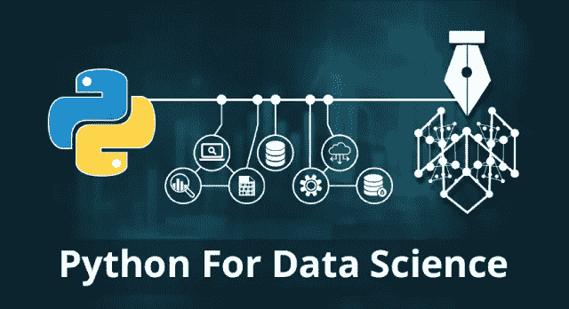

# 一个数据科学家的初恋——Python

> 原文：<https://medium.datadriveninvestor.com/a-data-scientists-first-love-python-a8f53c9a9868?source=collection_archive---------4----------------------->

## Python 为什么会进入石灰灯的答案

## 每个人都相信数字&数字不会说谎。

# 介绍

几乎今年所有的编程调查中，Python 都是吸引人的焦点。当它被认为是 ***“这个星球上最受欢迎的编程语言”时，它可以成为人们关注的焦点***

但是，你有没有想过它指数增长的流行背后的原因？Python 提供了什么其他编程语言没有的东西？

放松点。这篇文章什么都有。我已经介绍了您必须知道的关于 Python 在排行榜上的受欢迎程度的一切。

## [Python 游戏项目井字游戏——是时候重温过去的学生时代了](https://techvidvan.com/tutorials/python-game-project-tic-tac-toe/)

## **究竟是什么让 Python 对数据科学如此完美？**

我们分析了为什么 Python 在爆破数据科学行业如此占主导地位——以及如何在机器学习和人工智能项目中利用它。

## **为什么 Python 是最好的？**

众所周知，从语法角度来看，Python 是一种简单的编程语言。Python 同样有一个功能网络，有大量的库和资源可供选择。结果如何？你有一个编程平台，预示着与人工智能、机器学习和数据科学等发展进步一起使用。

 [## 成为数据科学家所需的 8 项技能|数据驱动型投资者

### 数字吓不倒你？没有什么比一张漂亮的 excel 表更令人满意的了？你会说几种语言…

www.datadriveninvestor.com](https://www.datadriveninvestor.com/2019/02/07/8-skills-you-need-to-become-a-data-scientist/) 

从事数据科学应用的专家不希望被复杂的编程先决条件所阻碍。他们需要利用像 Python 和 Ruby 这样的编程语言来轻松地完成任务。

## 1 简单易学:

python 最吸引人的本质是任何需要学习它的人——即使是初学者也可以快速有效地学习，这也是为什么学生更喜欢用 Python 学习数据科学的一个原因。

这对于那些时间有限、忙于学习的专家来说更是令人钦佩。例如，当与不同的语言 R 对比时，Python 通过其简单的语法结构*提出了一个较短的吸收信息的期望。*

*[**让自己熟悉 Python！**](https://techvidvan.com/tutorials/python-syntax/)*

## *2 可扩展性:*

*与其他编程语言(例如 R)相比，Python 在通用性方面超出了预期。也比 Matlab，Stata 之类的语言快。*

*它鼓励规模化，因为它给了数据科学家灵活性和各种方法来解决各种问题——这也是 YouTube 迁移到该语言的原因之一。*

## *3 数据科学库的选择:*

*将 python 用于数据科学的另一个关键优势是 python 提供了对大量数据分析和数据科学库的访问。这些包括熊猫、NumPy、SciPy、StatsModels 和 scikit-learn。这些只是众多可访问库的一部分，Python 将继续增加这个集合。*

*许多使用 Python 的数据科学家发现，这种强大的编程语言通过为最近似乎无法解决的问题提供新的解决方案，倾向于广泛的需求。*

## *4 Python 社区:*

*Python 如此杰出的一个原因是其社区的直接后果。随着数据科学网络不断采用它，越来越多的客户自愿制作额外的数据科学库。*

*这只是推动了当今最现代的工具和先进处理技术的产生，这也是绝大多数人更喜欢 Python 用于数据科学的原因。*

*[**关于 Python 你需要知道的一切**](https://techvidvan.com/tutorials/python-advantages-and-disadvantages/)*

## *用于数据科学的 Python*

*因为，Python 是适应性最强的编程语言之一，因此，它受到数据科学的推崇。此外，需要进入数据科学领域的个人倾向于 Python，而不是许多其他编程语言。按照这些思路，如果软件工程师和程序员需要尝试一些迷人和有趣的东西，他们可以用 Python 来做。*

*程序员甚至可以编写应用程序和网站的脚本，如果他们需要的话，他们可以用富有想象力的方式编写。Python 还是最容易掌握的语言之一。语言非常简单，也非常连贯。*

*对于需要在数据科学领域发展事业的人或分析师来说，他们更倾向于 Python。python 程序员不需要花一部分时间学习。*

*Python 是用于数据分析的最重要和最迷人的语言之一。随后，Python 的流行逐步发展，特别是在数据科学或数据分析领域。*

## *最终想法:*

*当你认为 Python 不能再酷了(一般来说)，你会发现它是以 Monty Python 的飞行马戏团命名的，这是一部从 20 世纪 60 年代末到 70 年代中期的典型喜剧系列。Python 文档中充满了对 Monty Python 的喜剧引用。*

*更好的是，Python 仍在开发中，这意味着它会定期更新和发布。因此，您可以相信学习 Python 进行数据科学是非常值得的。随着机器学习和人工智能逐渐成为商业和政府的基础，对更多有 Python 天赋的专家的兴趣将会上升。*