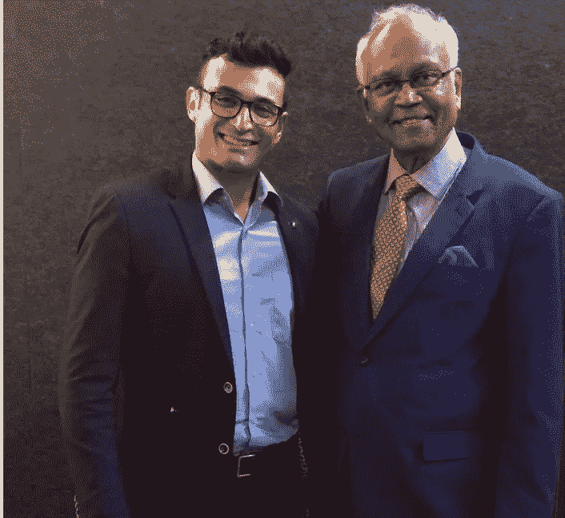

# 和 Mashelkar 医生在一起的一天改变了我的生活！

> 原文：<https://medium.datadriveninvestor.com/a-day-with-dr-mashelkar-that-changed-my-life-ad530f541dd?source=collection_archive---------4----------------------->

Dr. Mashelkar at Monash University

德国哲学家亚瑟·叔本华博士总是在他的桌子上打开《奥义书》,晚上睡觉前总是研究它。众所周知，他说过“从奥义书的每一句话；深刻的、原始的和崇高的思想升起，整个世界被一种崇高和神圣的诚挚的精神所弥漫……在整个世界上，没有一种学习像奥义书这样有益和令人振奋。它们注定迟早会成为人民的信仰。”

> 术语“奥义书”字面意思是内在的或神秘的教导。它来源于 upa，ni 和 s(h)ad，即坐在他们的老师附近向他学习秘密教义。在宁静的森林隐居处，奥义书的思想者思考着最深层次的问题，并将他们的知识传达给坐在他们附近的有能力的学生。
> 
> 2019 年 4 月 29 日感觉像是读了我的第一本这样的奥义书，因为我有机会坐下来，聆听并向我们时代最伟大的思想之一 Raghunath Mashelkar 博士学习。一个有远见的人，他对印度和世界的贡献绝对是无与伦比的，但他仍然保持着令人难以置信的谦逊、平易近人和礼貌。

 [## 人工智能与创造力:作为创意引擎的比根——数据驱动的投资者

### 的确，2018 年可以被视为人工智能创造的创造力全盛时期的开始。当然可以…

www.datadriveninvestor.com](https://www.datadriveninvestor.com/2019/02/13/ai-creativity-biggan-as-a-creative-engine/) 

只是为了让我对他的成就和我的声明有一些了解，Mashelkar 博士是皇家学会的**研究员，只有少数印度人取得过这一成就。他获得了世界科学院联想科学奖，这是为发展中国家科学家设立的小型诺贝尔奖**。他是 2019 年伊丽莎白女王工程奖的**评审团成员，该奖项相当于工程学的诺贝尔奖。如果这还不令人印象深刻的话，他已经获得了印度所有的三个最高平民奖，Padmabhushan，Padmavibhusan 和 Padmashri。**

此外，他是印度的首席科学家，也是众多董事会、科学机构和技术公司(如微软印度公司)的主席。

> 对于那些对数字印象深刻的人来说，Mashelkar 博士拥有超过 285 份出版物、29 项专利和 42 项荣誉博士学位。所以你明白了…

我非常荣幸有机会和他就我目前正在研究的问题进行深入的讨论。我想听听 Mashelkar 博士对人工智能(AI)和人类文明未来的看法。Mashelkar 博士和我讨论了几个在我们考虑人工智能的未来时需要解决的话题。我们讨论了教育、就业、政府政策和法规的未来，以及印度在人工智能方面的未来。

**教育**

根据 Mashelkar 博士的说法，教育系统需要彻底改革，因为过去的工作不会成为未来的工作。未来的工作是开发、维护和交付指数级技术，如人工智能、区块链和虚拟及增强现实。我们都同意，如果我们继续用过去的技术教育我们的下一代，那么我们将对他们造成巨大的伤害。过去的技术将继续通过人工智能等工具实现自动化，而这些工作在未来将不复存在。因此，教育系统需要快速适应变化的需求和就业市场的需求，以开发科学、工程和社会科学的新领域。未来的工作将在数据科学、机器学习、人工智能和区块链领域，因此教育系统需要设计学科来满足这一需求。Mashelkar 博士还认为，有一项人类拥有而机器没有的关键技能，那就是移情。未来对这种技能的需求会很高，因此我们不仅需要鼓励学生探索这一学科，还需要研究一门结合传统科学和社会科学的学科。

**就业**

我们过去的工作不会是未来 10 年的工作。随着人工智能和区块链等技术的指数级增长，金融服务、工程、科学甚至医学领域的工作将开始自动化。麻醉将由机器来管理，税收将由机器来申报和审核，汽车制造已经基本上是自主的，但汽车也将变得自主。因此，我们所看到的未来将需要一个完全不同的劳动力，一个能够开发、支持和设计当前和未来技术的劳动力。Mashelkar 博士认为，就传统工作而言，新一代人已经在打破过去的枷锁。他们渴望成为雇主，而不是被雇佣，这意味着他们是创新的一代，传统的就业框架无法满足他们的需求。**随着就业形势的变化，雇主和政府需要开始创造有利于创新的环境。**

**政府政策&法规**

Mashelkar 博士认为，就指数级技术而言，政府政策和监管是八个球的幕后推手。他还认为政策和法规需要时间来发展，并提供了一个在印度引入商品及服务税的例子。印度政府花了 14 年时间来制定和有效实施这一基本税收政策。指数级技术和政府政策是永远不会相交的两条线，但我们需要确保它们不会彼此偏离太远。技术的发展比政策要快得多，政府通常不得不修改法规，清理新兴技术留下的烂摊子。这方面的一个很好的例子是工业革命 2.0，当时机械化和电力在世界范围内呈指数级传播，并造成了我们现在所知的气候变化。过去 30 年来，世界各国政府一直在处理这个问题，许多总理和总统在这个问题上输掉了选举。这导致各国政府为应对气候变化而实施的政策无效且代价高昂，给各国经济造成了数万亿美元的损失。随着第四次工业革命的到来，Mashelkar 博士认为**世界各地的官僚机构需要着眼于未来而不是过去来设计政策和法规。**

**印度的 AI 未来**

我忍不住寻求 Mashelkar 博士对印度及其人工智能未来的看法。作为一个扎根于印度的印度裔人，我有这种好奇心是很自然的。Mashelkar 博士相信，鉴于政府和私营企业最近推动确保国家的增长不仅限于富人，印度在人工智能等技术方面有着非常光明的未来。印度企业已经承担起开发和使用人工智能等技术来帮助社会的责任。Mashelkar 博士提供了一个这样的倡议的例子，其中印度一家排名第一的公司投资了 1.8 亿美元，将人工智能解决方案部署到教育部门。这一举措旨在每年为 100 万儿童提供免费教育，并确保这些技术用于造福整个社会。Mashelkar 博士还认为，印度未来受过教育的人口与印度人天生的同情心相结合，将成为印度未来指数级技术的最大资产。

Mashelkar 博士和我讨论了其他几个关于指数级和新兴技术的话题，最后，他对我说，“我觉得我给了你更多的问题，而不是回答你的问题。”“恰恰相反”，我说，“你给了我更多探索的道路”。在新兴和指数级技术的众多新可能性中，我找到了一座灯塔，它不仅给我指明了方向，还提醒我，光的存在是为了照亮他人的道路。

当我们分手时，我做了任何一个印度学生见到他们的导师时都会做的事情。就像他们在梵语中说的…
古鲁梵天古鲁毗瑟奴，古鲁德沃马赫什瓦拉哈
古鲁萨克沙特帕拉梵天，塔斯迈斯里古拉夫纳哈

古鲁是梵天、毗湿奴和湿婆的代表。他创造并维持知识，摧毁无知的杂草。我向这样的大师致敬！

摸着他的脚，我寻求他的祝福，让我们正在走进的世界发生有意义的变化。如果我能达到他此生成就的一小部分，我将不胜感激！

关于作者

Hrishikesh Desai 是一名进步领袖，目前是澳大利亚国立大学 3A 学院的学生。赫里什克什有在联邦政府监管、知识产权方面的经验，你可以通过 [LinkedIn](https://www.linkedin.com/in/rishidesaii/) 和 [Twitter](https://twitter.com/ScalingAI) 与他联系。