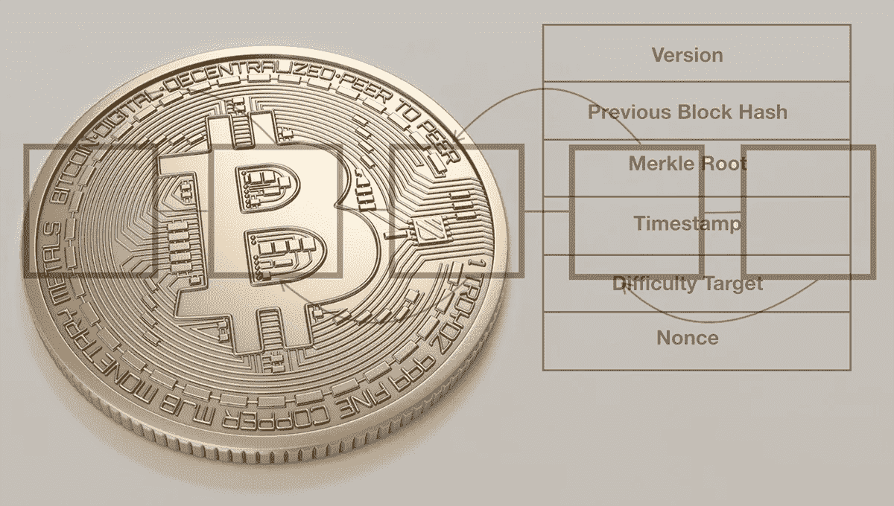
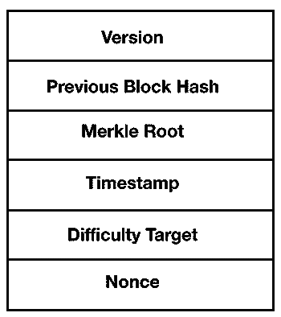
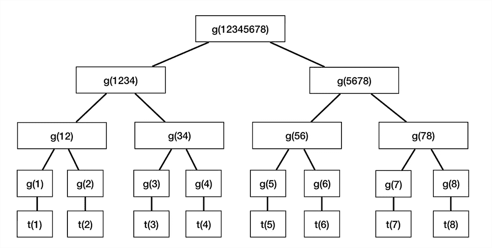
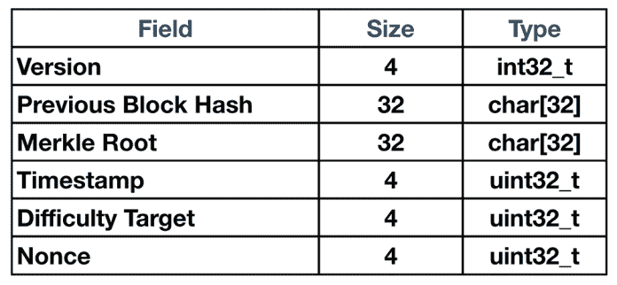
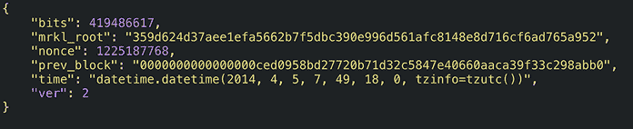

# 比特币块头的分解

> 原文：<https://medium.datadriveninvestor.com/a-decomposition-of-the-bitcoin-block-header-data-driven-investor-e094ee3ff03f?source=collection_archive---------10----------------------->



The Bitcoin Block Header

[比特币](https://www.datadriveninvestor.com/glossary/bitcoin/) **块头**包含了块内的重要信息。这些分为 6 个字段，提供块摘要的详细信息。除了块头之外，还有 ***事务*** 和 ***coinbase*** 字段，它们是块的独立部分。每个块头都是唯一的，并且受到密码保护，这就是它具有不变性的原因。

块头被序列化，总长度为 80 字节。然后，它被散列为**工作证明(PoW)** 共识算法的一部分，该算法在 ***挖掘*** 比特币时使用。在此过程中，序列化报头成为共识规则的一部分，作为共识机制的一部分， ***矿工*** 必须遵循这些规则。矿工是参与共识协议的节点，在共识协议中验证块，作为回报，验证块的矿工接收比特币(即 BTC)的奖励。



*The Bitcoin Block Header Contains 6 Fields.*

以下是块标题字段的描述。

## 版本号

这是一个 4 字节的字段，提供块中使用的版本号。在比特币的发展过程中，有不同的版本构成了历史的一部分。

*   第一版于(2009 年 1 月)推出，这是比特币网络的[区块链](https://www.datadriveninvestor.com/glossary/blockchain/)上生成的第一个区块。
*   **版本 2** 于比特币核心 0 . 7 . 0(2012 年 9 月)作为 ***用户激活*** [***软叉***](https://www.datadriveninvestor.com/glossary/soft-fork/)***【UASF】***。如 **BIP34** 中所述，有效的版本 2 模块需要 coinbase 中的[模块高度](https://www.datadriveninvestor.com/glossary/block-height/)参数。BIP34 还描述了拒绝某些块的规则。比特币核心 0.7.0 及更高版本从块高度 224，412(2013 年 3 月)开始拒绝 coinbase 中没有块高度的版本 2 块，三周后开始拒绝块高度 227，930 的新版本 1 块。
*   **版本 3** 区块作为 UASF 在比特币核心 0 . 10 . 0(2015 年 2 月)中推出。当[分支](https://www.datadriveninvestor.com/glossary/fork/)达到完全实施(2015 年 7 月)时，它要求在新块中对 ECDSA 签名进行严格的 DER 编码，如 **BIP66** 中所述。自比特币核心 0 . 8 . 0(2012 年 2 月)以来，不使用严格 DER 编码的交易此前一直是非标准的。
*   **版本 4** 在 **BIP65** 中指定并在比特币核心 0 . 11 . 2(2015 年 11 月)中作为 UASF 引入的区块于 2015 年 12 月开始活跃。这些块现在支持 BIP 中描述的新的`OP_CHECKLOCKTIMEVERIFY`操作码。

(来源[Bitcoin.org](http://bitcoin.org/))

版本是指块遵循的块验证规则。这些规则构成了上一节中针对每个版本描述的协议的一部分。如果数据块版本号不同于其他数据块，则它们不能是同一个区块链的一部分。在这种情况下，它将在不同的链上运行，并可能导致[硬分叉](https://www.datadriveninvestor.com/glossary/hard-fork/)。

# 前一个块哈希

前一个块哈希是一个 32 字节的字段，包含前一个块头的哈希。这包含一个指向前一个块的指针，这是区块链中一个非常重要的特性。如果不修改前面的块，就不能修改这个信息。因此，如果您有 200，000 个数据块，并且您试图更改前一个数据块的哈希值，则会发生 ***雪崩效应*** ，这意味着需要更改其他前一个哈希值。

这将需要大量的计算能力散列率，这将是太困难了。链接散列的这一特性提供了块的安全性和防篡改性。它仍然可以更改，但它会影响整个区块链，理论上，这需要所谓的。因此，由于块头的散列，在区块链上很难撤消所有事务。

块头使用 **SHA256** 哈希算法。这使用了函数:

```
**SHA256(SHA256())
SHA256(SHA256(Prev_Block_Header))**
```

这确保了在没有改变块头的情况下不能改变先前的块。此功能提供了一种防篡改措施。因此，尝试反转事务会变得更加昂贵，因为它需要更改块头的哈希。它利用高能耗的计算资源来重新计算哈希值。在现实世界中，矿工可以通过分叉区块链击退这种攻击。理论上，它可以挫败攻击者，但同样，共识是维护有效区块链信息的关键。

# Merkle 根

Merkle 根字段的长度也是 32 字节，包含区块链 Merkle 根的散列。它使用与前一个块头散列相同的函数。Merkle 根是从这个块中包含的所有事务的散列中导出的。散列法确保在不修改整个报头的情况下，这些事务都不能被修改。这又是一种为块提供安全性的防篡改措施，这是公共、分散和不可信系统的一个重要特征。

Merkle 根由块中所有事务的**txid(事务 ID)** 组成。TXIDs 按照共识规则要求的顺序排列:

*   coinbase 事务的 TXID 放在最前面。
*   该块中的任何输入都可以花费一个输出，如果它是有效的花费，则该输出也会出现在该块中。它必须是对应于输出的 TXID，该输出位于对应于输入的 TXID 之前的某个点。这遵循了 [**UTXO**](https://www.datadriveninvestor.com/glossary/unspent-transaction-outputs/) **(未用完的事务输出)**规则，即事务输入必须是先前的事务输出。



*This is an example of a Merkle Tree. The root of the tree is g(12345678) which is the hash of all transactions from t(1) to t(8). The hash g() of the root is a concatenation of all the transactions in the blockchain.*

32 字节的总长度是 SHA256 [哈希函数](https://www.datadriveninvestor.com/glossary/hash-function/)的结果。输入从可变长度值转换为 256 位长度的固定值。Merkle 根总是可以追溯到数据树结构的根(即**[**Merkle 树**](https://www.datadriveninvestor.com/glossary/merkle-tree/) )，并且是验证数据的快速有效的方式。**

# **时间戳**

**时间戳是一个 4 字节的字段，是以 Unix 纪元时间测量的时间。这是自 1970 年 1 月以来经过的秒数。时间戳从矿工开始散列报头时开始。这必须严格大于前 11 个块的中值时间。根据完整节点的时钟，完整节点将不会接受报头超过 2 小时的数据块。**

**Unix 时间不是 UTC 的真实表示。它忽略闰秒，每天总共包含 86，400 秒(60 秒/分钟 x 60 分钟/小时 x 24 小时)。根据比特币协议，块传播时间必须平均为 10 分钟，因此时间戳必须在此范围内的允许时间内。然而，可变性是由于接下来将讨论的[困难](https://www.datadriveninvestor.com/glossary/difficulty/)造成的。**

# **难度目标**

**难度目标是一个 4 字节的文件，也称为**位**。目标的编码版本是一个阈值，块的头哈希必须小于或等于该阈值。这些位指定包含前导零的值或 ***目标阈值*** 。这是难度目标的基础，和比特不一样。难度目标在比特币网络上每 2016 块调整一次。这一信息对矿工尤其重要。**

**难度目标编码为比特币协议。这决定了基于网络总散列率的散列值的难度。当矿工过多时，为了控制比特币的供应量，哈希难度增加。如果难度太容易，块传播时间平均降到 10 分钟以下。这可能会很快耗尽 BTC 的供应量，随着更强大的采矿设备添加到网络中，哈希速率会增加。当块传播时间大于 10 分钟时，难度太高，因此协议代码确保难度必须降低。**

# **目前**

**[随机数](https://www.datadriveninvestor.com/glossary/nonce/)是一个 4 字节的字段，它是任意数量的挖掘器改变以修改报头散列，从而产生小于或等于目标阈值的散列。随机数就像“幻数”，因为谁先发现它，谁就成为块验证器。然后，奖励将被放入硬币库字段，并奖励给最先发现随机数的矿工。随机数必须等于或小于难度目标。**

**发现随机数是挖掘者在验证块的共识机制期间参与的主要活动。矿工们互相竞争，试图解决一个难度低于目标的密码难题。它被编码在一个相当困难的协议中，因此不是任何一个在*无许可*系统中的人都能发现随机数。因此，指定了一个难度目标，它根据网络的总哈希速率来调整值。**

# **数据类型**

****

****大小**以字节为单位(1 字节= 8 位)**

****int32_t** 是一个带符号的整数值**

****uint32_t** 是一个无符号整数值**

****char[32]** 是包含十六进制值的字符值**

# **块标题示例**

**该数据是使用一个 [API](https://www.datadriveninvestor.com/glossary/application-programming-interface/) 调用比特币区块链来检索块头信息而获得的。这里有一个例子:**

****

*****【bits】***为难度目标，已编码为数值。难度目标值越低，越难生成格挡。难度值为十六进制形式，转换为 419486617。**

*****“mrkl _ root”***是块内所有事务的 hash。这已经使用 SHA256 算法进行了哈希处理。**

*****【nonce】***是验证该块的矿工已经使用的发现值。这是用于生成添加到区块链的块的编号。**

*****【prev _ block】***是前一个块头的散列。这是连接一个街区和区块链其余部分的纽带。**

***的“时间”是矿工开始在区块上哈希时显示的。该示例使用不同的时间格式，但它最初是基于 Unix 纪元时间的秒数。***

******“ver”***字段是遵循该协议版本的一致性规则的块的版本号。***

# ***摘要***

***块标题总结了块。块标题中的字段提供了块的唯一详细信息。数据被序列化为一个 80 字节的字符串，然后为后续块进行哈希处理。这提供了在比特币网络上形成区块链的区块之间的链接。***

****原载于 2019 年 11 月 21 日*[*https://www.datadriveninvestor.com*](https://www.datadriveninvestor.com/2019/11/21/a-decomposition-of-the-bitcoin-block-header/)*。****