# 对人工智能的深入研究

> 原文：<https://medium.datadriveninvestor.com/a-deep-dive-into-artificial-intelligence-52aa2507747e?source=collection_archive---------5----------------------->

探索人工智能(AI)和机器学习(ML)的世界。

# 什么是深潜，为什么？

DD 的努力是为了适应我内心深处一直刺痛的抽搐的欲望，为了简化；给思洛，我思想池中的一大群想法。这些 DD 打算在组织我的心理语义树中扮演一个角色。长期的主题是积极地影响我的习惯行为，并有无缝的可用性启发，以及促进更容易建立[记忆宫殿。](https://www.independent.co.uk/student/student-life/how-to-sherlock-your-degree-the-art-of-building-a-memory-palace-9087779.html)

深潜系列文章:

> [深潜:数字大世界](https://medium.com/@karanmjpinto/deep-dive-into-the-digital-macrocosm-e5075fc3b42a)
> 
> [深度潜水:经济的首要原则](https://medium.com/@karanmjpinto/deep-dive-into-the-first-principles-of-the-economy-bb6665299d49)
> 
> [深潜:用冥想满足正念](https://medium.com/@karanmjpinto/meeting-mindfulness-with-meditation-c0d79eb4a7cc)

# 为什么要读这篇深度探讨&你能学到什么？

几乎我们的每一个动作，每一个接触，每一个使用都会产生数据。“数据”今天获得的地位相当于“煤”昨天获得的地位。这是因为，就像煤炭一样，如果数据得到适当利用，它可以帮助获得以不同方式使用的见解，从提高产品性能到定制服务体验，从预先/预测性地识别系统中的问题，到通过目标营销影响你的行为。虽然，就其本身而言→数据是*无用的*。你需要一些东西，可以帮助你让那个日期变得有价值。那个东西是机器学习(ML)。ML 用于网络搜索、垃圾邮件过滤、推荐系统、广告投放、信用评分、欺诈检测、股票交易、药物设计以及许多其他应用。

> 我写这篇文章的原因之一是因为我知道有许多人知道“机器学习”这个时髦词，但在他们的对话中广泛使用它，而没有完全掌握它实际上是什么的基本原理！

> “到 2023 年，由医生、律师、交易员和教授完成的所有高技能工作的三分之一将被智能机器或由认知计算技术辅助的技能较低(非专业)的人取代。”— Gartner

> “到 2030 年，我们今天所知的 90%的工作将被智能机器取代。”— Gartner

人工智能和人工智能是上述两种说法的核心驱动力。除此之外，当人们在不太了解人工智能或人工智能的情况下，仅仅将自己与一些“创新”或“颠覆性”的东西联系在一起时，这让我感到“畏缩”！作为一个想成为*‘专家多面手’，*着迷于从零开始学习一些东西并弄懂一切的人，我希望这篇文章能帮助你掌握基本原理。下面是试图理解，然后明确解释。这不是纯粹的思想，也是我对 ML 的理解。如果我的理解有出入或不一致的地方请评论！

## **深潜结构**

这是一篇长篇阅读！建议保存这篇文章，跳进去跳出来！

*   数据→一切开始的地方
*   AI & ML →它们是什么&为什么重要？
*   ML 的类型
*   深度机器学习
*   基本关键 ML 术语
*   ML 算法基础→表示、优化和评估
*   监督学习算法→线性回归、决策树、K 近邻
*   重要的 ML 概念→概括、过度拟合、规范化和交叉验证
*   重要的 ML 课程和原则

# **数据**

数据集是数据的集合。数据是作为输入或输出点的任何度量。由于数据量大、种类多、速度快，需要一种有效且高效的“东西”来从数据中获得洞察力。那个东西就是 AI & ML。在我们继续之前，我希望您了解有两种类型的数据:

*   **结构化数据→** 这是高度组织化的信息，可以输入到关系数据库/行&列中。这些数据易于消化、形成、搜索和分析。电子表格就是一个例子。
*   **非结构化数据→** 这是一种难以组织和分析的数据，因为它不容易理解。大约 80%到 90%的企业数据是非结构化的。电子邮件、网页、视频、音频和社交媒体消息都是例子。我们周围的非结构化数据量正在激增！

AI & ML 不仅可以帮助我们从结构化数据中获得洞察力，还可以帮助我们从非结构化数据中获得洞察力！这是难以置信的宝贵！

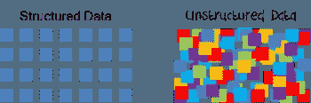

A **人工智能(AI)是**计算机系统的理论和发展，使它们能够执行通常需要人类智能的任务，如视觉感知、语音识别、决策和语言之间的翻译。

人工智能由多种技术组成，使计算机能够:

*   **感观感知:**识物于象，识词于声。
*   **领悟，知道:**表示知识，理解关系和因果关系。
*   **理由:**从事实和推理规则中得出结论，并计划行动。
*   **学习:**从事例或经验中获取新知识。
*   **沟通:**理解、生成、分析自然语言。
*   **计划并行动:**控制机器人，驾驶汽车或驾驶无人机。

> 人工智能不是什么新鲜事；1940-1956 年催生了人工智能的诞生。最初的研究集中在“旨在创造像人类一样有能力的智能机器的科学”最近，焦点转移到了“能够支持人类活动的智能系统”换句话说，制造人类超级，而不是制造超级人类！

## 日常生活中的人工智能:

*   脸书:预测可能的朋友。
*   网飞:预测你可能喜欢看的电影。
*   **Google/Bing 搜索:**从大型非结构化数据集中检索相关文档的子集，例如，在互联网上的搜索中提供五个最相关的文档。
*   **亚马逊:**为您提供一系列受您的浏览历史启发的商品、基于之前订单为您推荐的商品、受您的愿望清单启发的商品以及其他人已经购买的您可能喜欢的商品。
*   **汽车中的 GPS 系统:**穿越数百万条路线的复杂性，为您提供最佳路线。

## ML 和人工智能(AI)的区别:

*   **AI** 通常专注于编程计算机做出**决策**(基于 **ML 模型和逻辑规则集**
*   ML 更侧重于对未来做出预测。
*   它们是高度相互关联的领域，并且对于大多数非技术目的来说，它们是相同的。

# 为什么选择机器学习(ML)？

**机器学习(ML)用于解决那些确实很难编写计算机程序来解决的问题**

Recognising hand written digits

例如，假设你想让一台计算机识别手写数字，你需要设计一套规则来区分每一个数字。例如，零点基本上是一个闭环。但是如果这个人没有完美地完成这个循环呢？如果循环的右顶部在循环的左顶部开始处的下方关闭，会怎么样？在这种情况下，我们很难区分 0 和 6。我们可能会建立某种临界值，但是首先你如何决定临界值的值/范围呢？正如你所看到的，编译一系列**试探法(即规则和猜测)**来准确地分类手写数字很快变得相当复杂。

现在，更多种类的问题属于这一类，例如:

*   识别物体
*   理解概念

因此，没有尝试编写一个**程序，而是尝试开发一个**算法**，计算机**可以用它来查看成百上千个例子(以及正确答案)**，然后计算机使用经历了**的**来解决新情况下的**相同问题。本质上，我们的目标是教计算机通过例子来解决问题，就像我们教小孩区分猫和狗一样。****

# 什么是机器学习？

ML 是一个研究领域，它利用计算机科学和统计学的原理来创建统计模型。

这些模型通常用于做两件事:

*   **预测:**根据过去的数据预测未来
*   **推理:**发现数据中的模式

什么是统计模型？

教计算机做出**预测**包括**将数据**输入到**机器学习模型**、**中，这些模型代表了世界应该如何运转**。如果我告诉一个统计模型，世界是以某种方式运行的(比如说，高个子比矮个子赚得更多)，那么这个模型就可以告诉我，它认为谁会赚更多的钱，在 5 英尺 2 英寸的杰夫和 5 英尺 9 英寸的罗斯之间。

然而一个模型实际上是什么样子的呢？当然，模型的概念在理论上是有意义的，但是知道这一点只是成功的一半。你还应该知道它在计算机内部是如何表示的，或者如果你把它写在纸上会是什么样子。

**模型只是一个数学函数**，你可能已经知道，它是一组输入和一组输出之间的**关系。这里有一个例子:**

f(x) = x

这是一个接受一个数字作为输入并返回该数字的平方的函数。所以，f(1) = 1，f(2) = 4，f(3) = 9。

让我们简单地回到根据身高预测收入的模型的例子。让我们假设一个给定的人的年收入平均等于他们的身高(英寸)乘以 1000。所以，如果你身高 60 英寸(5 英尺)，那么我猜你可能一年挣 6 万英镑。如果你再高一英尺，我想你一年能挣 72，000 英镑。

该模型可以用数学方法表示如下:

收入=身高×1000

换句话说，收入是身高的函数。

> ML 指的是**基于数据集**(身高对及其关联收入)的一套估计函数(类似涉及收入的)**的技术。这些被称为模型**的**函数可以用来预测未来的数据。**

> 预测模型做出的预测旨在帮助人类在复杂领域做出决策，在这些领域中，只有历史观测数据可用，而控制实验是不可能的。

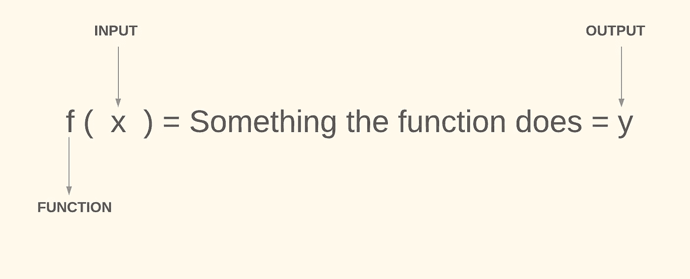

# 什么是算法？

使用算法来估计这些**函数或模型。在这种情况下，算法是一组预定义的步骤**，它将一组数据作为输入，然后通过数学运算对其进行转换。你可以把**算法**想象成**菜谱**——先做这个，再做那个，再做这个。完成了。****

> 所有类型的 ML 都使用**模型和算法**作为其**构建模块**来对世界做出**预测**和**推论**。

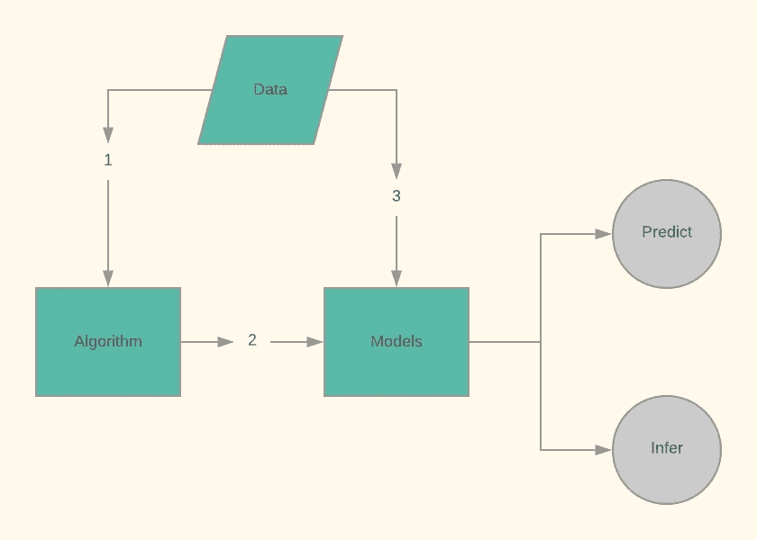

到底学到了什么？

为了解释机器学习正在学习什么，让我们从一个示例应用**、垃圾邮件分类**开始。编写计算机程序来将垃圾电子邮件与非垃圾电子邮件分类的一种方法是将每封电子邮件分割成单独的单词，并维护在垃圾电子邮件中更频繁出现的单词列表。例如，这样单词的一些例子可能是“贷款”、“美元”、“信用”、“折扣”、“报价”、“密码”、“伟哥”等等。然后，如果一封电子邮件有大量的这些词，它应该被归类为垃圾邮件。

虽然上面的策略可能会给出相当好的结果(比如检测垃圾邮件的准确率为 80%)，但准确率在很大程度上取决于我们维护的单词列表，以及我们选择将电子邮件分类为垃圾邮件的精确阈值。

在机器学习中，策略是从例子中学习单词列表和阈值。事实上，除了哪些单词是坏单词，我们还可以了解每个单词有多坏。(这个例子挺现实的，就是多少垃圾邮件分类算法在起作用。)

所以在这种情况下，我们学到的是，每个单词有多糟糕的概念。请注意，这并不是构建问题的唯一方式，我们以这种方式构建问题是因为我们注意到垃圾邮件通常包含特定单词的模式，然后我们提出了一种策略，将每个可能的单词作为可能的嫌疑对象进行分析。这种策略可能会给其他任务带来不准确的结果，或者效率太低。

## **机器学习的可取属性**

你可能会注意到，使用机器学习来学习每个单词有多糟糕，比手动维护这个列表有许多可取的特性。

**它减少了创建列表**的人工工作量。

想象一下，如果您尝试手动操作，这个列表会有多长。此外，如果您试图手动维护该列表，您将如何处理世界上数百种语言？如果没有机器学习，这项任务很容易变得不可行。

**同样的策略也适用于其他类似的任务。**

假设我们想对电影评论进行分类，看它对电影的评价是正面的还是负面的。如果我们手动创建单词列表，那么我们必须手动创建一个新的单词列表。但是如果我们学会了，同样的算法也可以工作，因为我们已经有了一些数据(比如用户在 imdb 上留下的评分和评论)。

**它会自动更新。**

假设明天垃圾邮件发送者变得更先进，并开始键入单词“password”作为“passw0rd”。或者他们可能试图卖给你保险，这是我们还没有遇到过的。我们可以简单地将机器学习算法设置为每天训练，它将使用可用的新数据，并随着时间的推移不断适应不断变化的行为。

# ML 有哪些不同的类型？

该算法从数据集学习以产生模型。基于这种学习过程，最大似然算法被分为以下类型:

## 监督学习

这里，算法从标记为数据 的 ***的训练数据集学习。标记数据意味着*训练数据集中的每个示例*都被*标记为*带有*答案*算法应该自己得出。因此，一组带标签的花卉图像数据会告诉模型哪些照片是玫瑰、雏菊和水仙花。当显示新图像时，模型将其与训练样本进行比较，以预测正确的标签。***

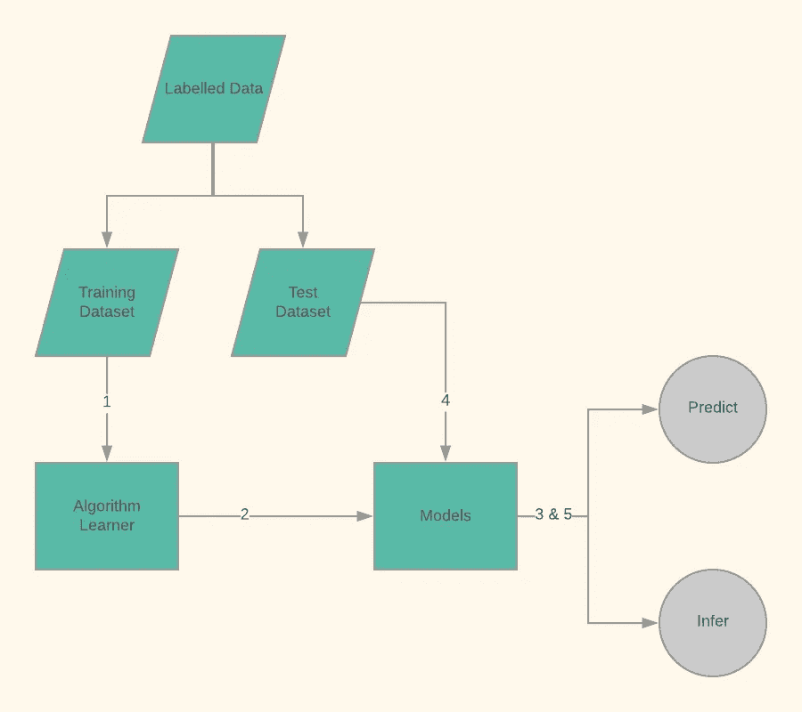

在监督学习中，我们用*特征*和*标签*来填充算法。考虑将网络分组分类为恶意或非恶意的问题。这里的*特征*可以是数据包的属性，如源 IP、目的 IP、端口、协议、有效载荷长度、标志等。并且基于分组是否是恶意的，*标签*可以是 0 或 1。

因此，您有一组输入或特征(X ),如一幅图像，模型将预测目标输出变量 y(图像的标题)= f(X)。

> F **特征**为自变量**目标**为因变量

**2 类监督学习问题:**

**分类** —当输出变量是一个类别时。

*   垃圾邮件过滤:电子邮件是否是垃圾邮件？
*   图像分类:给定一幅图像，输出图像中存在哪些物体(狗、猫、计算机、建筑物等等)

让我们看一个经典的图像分类问题→将鸢尾花分类成它的类型。数据集包含三类鸢尾花(圣淘沙鸢尾、杂色鸢尾和海滨鸢尾),如下所示，具有相应的特征，如萼片和花瓣尺寸(长度和宽度)。最终目的是建立一个模型，该模型从这些特征中学习，并在特征被提供作为输入时预测鸢尾花的类型。

分类可以为函数提供输入

**回归** —当输出变量为实值时。

*   给定一所房子的信息，预测它的价格
*   网飞:给定一个用户和一部电影，预测用户对这部电影的评价

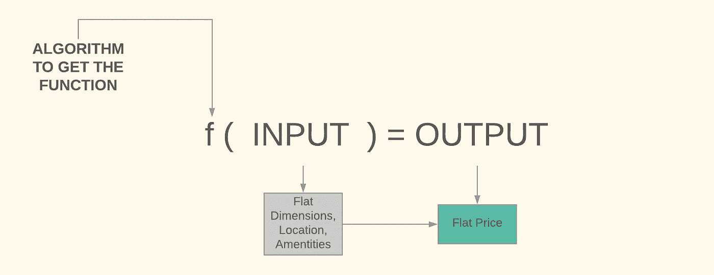

## 无监督学习

您有输入数据 X，但没有输出变量 y。目标是模拟数据的分布并识别数据中的模式

两类问题:

**聚类** —发现目标数据中的内在分组

*   给定一个客户列表和关于他们的信息，发现相似的用户组。这些知识可以用于有针对性的营销。
*   异常检测:给定来自制造设施中的传感器的测量值，识别异常，即某些东西是错误的

**关联** —发现描述部分数据的规则

*   发现数据中的模式，例如每当下雨时，人们倾向于待在室内。天气热的时候，人们会买更多的冰淇淋。

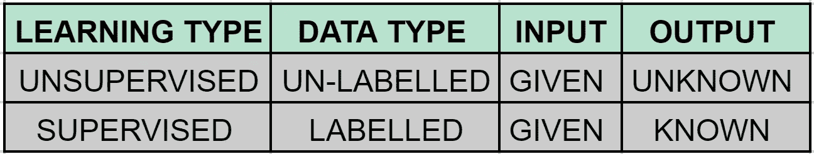

## 强化学习

输入不是给我们的，而是取决于我们采取的行动。机器人(代理人)因在其环境中采取某些行动而获得奖励。

示例:

*   机器人学:一个机器人在迷宫里，它需要找到出路。
*   为复杂的游戏如文明或 Dota 训练人工智能

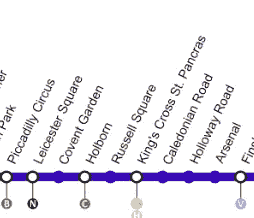

例如，假设我们的目标是让地铁到达喀里多尼亚路。我们将这个期望的结果输入到函数中。这个功能可以使火车向北或向南移动。该功能将评估当前状态，这里是列车当前所处的车站，评估期望的结果并采取行动(向北或向南)。比方说，当前状态在考文特花园，函数做出一个动作，向南移动到莱斯特广场。如果行动朝着目标的方向，那么这个功能就会得到相应的奖励，如果没有朝着目标的方向，这个功能就会受到惩罚。因此，由于该行动已将火车向南移动到莱斯特广场，朝着远离预期结果的方向(喀里多尼亚路)，它将受到惩罚。所以下一个动作会回到考文特花园之类的。

**其他类型的学习**

*   **迁移学习** →在一个模型上学习字母表，在另一个模型上学习句子
*   **半监督学习** →有些数据有标签，有些没有。

# 深度学习

深度机器学习(Deep Machine Learning)是一种机器学习技术，允许机器访问认知域，以前只有人类可以访问，例如:图像识别、文本理解和音频识别。学习器算法的灵感来自人脑生物神经网络的结构和功能。

深度学习和机器学习之间的主要区别在于，深度学习模型具有层次结构的*多层或多级*的概念，这为能够为*更复杂的任务*学习模型开辟了可能性。

深度学习架构设计有多层，直觉上较低到较高的*层*将自动学习建模较低到较高的抽象级别。

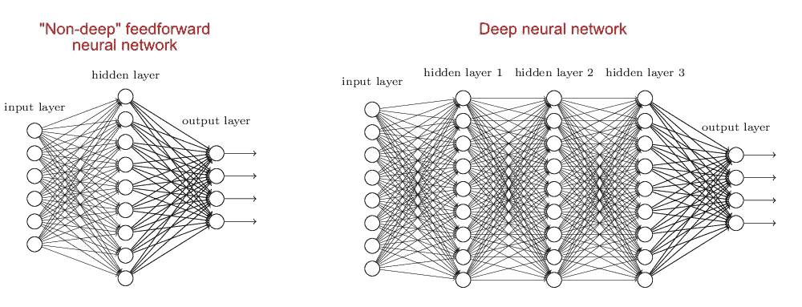

**标准神经网络**

学习算法模仿生物神经元的机器。它的输出是以下参数的函数:

*   输入
*   砝码
*   偏见术语
*   非线性参数

机器根据变化的输入数据调整学习算法中的权重，以刺激*学习。*

**深度神经网络**

数据通过隐藏的互连处理层的层次结构传递，以从原始输入数据输出适当的表示。增加隐藏层数会增加机器的深度。自主调谐越大，层对人类来说就越隐藏。

*   深度学习通过发现数据中的中间表示的能力来扩展机器学习，这
    允许以更高的准确性、更少的观察和更少的人工劳动来解决更复杂的问题。
*   当存在复杂数据或输入源的大型数据集时(例如，在图像和视频中)最适合使用；大量原始输入，每一个都很少或没有意义，发送“弱标记信号”和低水平的
    人类分析洞察力。
*   允许我们使用以前难以处理的 ML 数据类型，如图像、语音和视频。
*   正是这种技术让 Google Home 和亚马逊的 Alexa 从滑稽变成了有能力。
*   传统机器学习模型的一大挑战是一个叫做*特征提取*的过程。具体来说，程序员需要告诉计算机它应该寻找什么样的信息来做决定。向算法提供原始数据很少奏效，因此特征提取是传统机器学习工作流程的关键部分。这给程序员带来了巨大的负担，算法的有效性很大程度上依赖于程序员的洞察力。对于复杂的问题，如对象识别或手写识别，这是一个巨大的挑战。
*   深度学习具有学习多层表示的能力，是少数几种使我们能够绕过特征提取的方法之一。我们可以认为较低层执行自动特征提取，几乎不需要程序员的指导。
*   **应用:**
*   计算机视觉。语言翻译。图像字幕。音频转录。分子生物学(预测蛋白质相互作用)。

# **基本关键术语**

***训练样本:*** 训练样本是我们用来处理预测建模任务的可用训练集中的数据点 *x* 。例如，如果我们对分类电子邮件感兴趣，我们数据集中的一封电子邮件就是一个训练样本。有时，人们也会使用同义词*训练实例*或*训练实例*。

***目标函数:*** 在预测建模中，我们通常对特定过程的建模感兴趣；我们想要学习或近似一个特定的函数，例如，让我们区分垃圾邮件和非垃圾邮件。 ***目标函数*** *f(x) = y* 就是我们要建模的**真**函数 *f* 。它帮助我们实现最终目标。

***假设:*** 假设是我们相信(或希望)的某个函数与真函数相似，我们要建模的*目标函数*。在垃圾邮件分类的背景下，我们提出的*规则*允许我们区分垃圾邮件和非垃圾邮件。它让我们离最终目标更近了一步。

> 假设函数(最佳猜测)~真或目标函数

***模型:*** 在机器学习领域，术语*假设*和*模型*经常互换使用。在其他科学中，它们可以有不同的含义，即假设将是科学家的“有根据的猜测”，而*模型*将是这种*猜测*的表现，可用于检验假设。

> 模型=假设

***学习算法或学习者:*** 同样，我们的目标是找到或逼近 ***目标函数*** ，学习算法是一组指令，它试图利用我们的训练数据集*对*目标函数进行建模。一个学习算法带有一个 ***假设空间*** ，它可以提出一组可能的假设，以便通过公式化*最终假设来对未知目标函数建模。*它帮助我们定义我们的假设空间，并达到我们的目标真值或目标函数。

***分类器:*** 分类器是一个*假设*(现如今，经常被机器学习算法学习)的特例。*分类器*是一个*假设*或*离散值函数*，用于为特定数据点分配(分类)类别标签。在电子邮件分类示例中，该分类器可以是用于将电子邮件标记为垃圾邮件或非垃圾邮件的假设。然而，*假设*不一定与*分类器*同义。在一个不同的应用中，我们的*假设*可以是将学生的学习时间和教育背景映射到他们未来 SAT 分数的函数。因此，分类器是一种为数据点分配类别标签的功能。

> **分类器**是一个输入离散或连续特征值的向量，输出离散值的系统，一个类。

一个**输入变量**也被称为一个**特征。**

**数据集中的维度**被称为**特征、预测器或变量**。增加另一个**尺寸**允许更多的**细微差别。**

**重量**(类似坡度)——重量是连接的强度。如果我增加输入，那么它对输出有多大影响。接近零的权重意味着改变这个输入不会改变输出。为了简化网络，许多算法会自动将这些权重设置为零。

偏差是指我们的预测与真实值有多远。一般来说，参数算法具有很高的偏向性，这使得它们学习起来很快，也更容易理解，但是一般来说灵活性较差。反过来，它们在复杂问题上的预测性能较低，无法满足算法偏差的简化假设。

*   **低偏差:**暗示关于目标函数形式的更多假设。预测值更接近真实值。
*   **高偏差:**表示对目标函数形式的假设较少。预测值离真实值更远。

# 机器学习算法基础

现在你已经理解了一些重要的基本术语，这些术语在我们继续之前是必不可少的，让我们深入 ML 算法的基础，把我们所学的串联起来。

一个**学习器算法或学习器**输入一组观察输入和相应输出的训练样本，并输出一个**最终假设** ( **分类器或回归器)。**

> 其思想是**分类器或回归器**是由**学习者构建的程序。**

对学习者的测试是它基于训练数据输出的这个分类器或回归器是否为将来的例子产生正确的输出。

一个有启发性的直觉来自于机器学习的众多定义之一，即*用数据编程*。因此，你有数据(训练集),并使用计算机程序从该数据构建另一个程序(例如决策树，监督学习算法)。从数据中构建决策树的程序是 ***学习器*** 。决策树是一个 ***分类器*** ，因为分类器是一个能够**预测**的程序，它只接受输入数据，并为每个实例产生输出数据。

理解这一点的另一种方式是*学习器*将输入 x1、x2、..，xp，y 并产生一个*分类器*。*分类器*将 x1’，x2’，..，XP’并产生 y’。

在研究论文中，*学习者*和*量词*之间的区别很难发现。似乎研究人员只对*如何描述模型*感兴趣。当他们开始描述*如何* ***构建*** *那个模型*时，他们接着谈论一个 ***学习者*** ，当他们谈论如何 ***用那个模型预测*** 时，他们接着谈论一个 ***分类器*** 。

***拟合模型*** 的功能是 ***学习器*** 的功能，而 ***预测值*** 的功能是**分类器**的功能。

注意，回归变量与分类器相同，只是输出的性质不同，它是一个离散值而不是一个类别

假设你有一个你认为机器学习可能适用的应用程序。你面临的第一个问题是令人眼花缭乱的各种学习算法。你应该用哪一个？实际上有数千本，每年还有数百本出版。在这个巨大的空间中不迷失的关键是要意识到所有的机器学习算法都有三个组成部分:

**学习=表现+评估+优化**

*   **表象** →模型的样子
*   **评价** →我们如何区分好的模型和坏的模型
*   **优化** →我们在所有可能的模型中寻找好模型的过程是什么

# **表示法**

表示很重要，因为分类器/回归函数必须用计算机可以处理的某种形式语言来表示。相反，为学习者选择一个表示就相当于选择它可能学习的一组分类器。

*   这组允许的模型被称为**假设空间**，这就是你如何看待你的数据。
*   它包含所有可学习的分类器/功能。如果一个函数不在假设空间中，它就不能被学习。
*   对于学习者来说，选择它可能学习的分类器/函数定义了解决方案将采用的表示。
*   示例:有时您可能希望将数据视为个体(如 k 近邻)或图形(如贝叶斯网络)。

*关键考虑事项:*您试图捕捉的场景是否能够很好地用模型函数来表示？是否限制过度？是否过度灵活？例如，如果数据有一个二次趋势，但我们试图用一个线性函数来拟合它，我们就过于严格了。

# **评估**

需要评估函数(也称为目标函数或评分函数)来区分好的分类器和坏的分类器。算法内部使用的评估函数可能不同于我们希望分类器优化的外部函数。

评估或目标函数(或成本函数)需要通过区分好的分类器和坏的分类器来评估您的 ML 模型。

*   本质上，这是你如何判断或喜欢一个模型超过另一个。我把它想象成经济学中的效用函数。
*   这是为了监督学习的目的，帮助你评估或给你的学习者的学习成绩打分，以便提高。
*   示例:在最小二乘线性回归的情况下，成本函数是均方误差成本函数。
*   例子包括精确，平方误差，可能性和信息增益。
*   关键考虑:你的成本函数捕捉到不同种类错误的相对重要性了吗？例如，一个数据点偏离 0.3，另一个数据点偏离 0.1，比两个数据点都偏离 0.2 好还是差？假阳性和假阴性一样糟糕吗？

# **优化**

优化是在假设空间中寻找最佳模型的过程或算法。它是通过搜索好的分类器来搜索最优学习模型的方法。

它使用评估函数，使用优化技术的选择从该评估函数中找到具有最佳分数的学习者。例如贪婪搜索和梯度下降。

最后，我们需要一种方法在语言的分类器中搜索得分最高的分类器。优化技术的选择对于学习者的效率至关重要，并且如果评估函数具有多个最优值，也有助于确定产生的分类器。对于新的学习者来说，开始使用现成的优化器是很常见的，这些优化器后来被定制设计的优化器所取代。

*   这是算法在内部如何在评估函数的上下文中遍历假设空间，到达能够做出准确预测的最终分类器。

给定具有**参数(权重和偏差)**和**的机器学习模型的 ***表示*** 和*评估*成本函数**来评估特定模型有多好，我们的学习问题简化为找到我们的模型的一组好的权重来 ***优化*** 它，并进而 ***最小化成本函数*** 。

例如，给定线性回归模型(表示)和成本函数(评估)，我们可以使用**梯度下降**(优化)为权重向量找到一组好的值。

*   **梯度下降**是一种迭代方法，是最流行和最广泛使用的**优化算法**之一
*   **批量梯度下降**计算**整个训练数据** w.r.t 到参数 w 的成本函数的梯度，该梯度被更新。由于我们需要计算整个数据集的梯度来执行一次参数更新，批量梯度下降可能**非常慢。**在**小批量梯度下降**中，我们计算每个小批量训练数据的梯度。也就是我们先把训练数据分成小批(比方说 M 个样本/批)。我们对每个小批量执行一次更新。根据问题的不同，m 通常在 30-500 的范围内。
*   **随机梯度下降(SGD)** 计算每个训练样本的梯度，即**单个训练数据点用于每次更新。**

主要考虑事项:

*   优化技术在实践中的效率如何？
*   它总能找到最优解吗？它有可能输出次优解吗？如果是，实践中发生的频率如何？

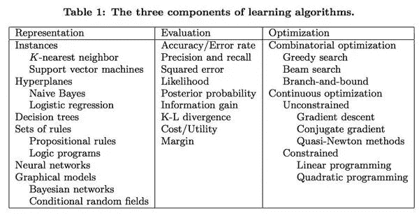

# 监督学习算法

下面是 3 个监督学习算法，以更好地解释代表，评估和优化的概念。这可能更专业一些，所以可以跳过这一步。

请注意，算法性能取决于数据类型，其中决定因素包括输入数据中的**总维数**，数据是文本、数字还是时间序列，数据是否稀疏，数据集的大小等等。

**线性回归模型** →简单回归问题

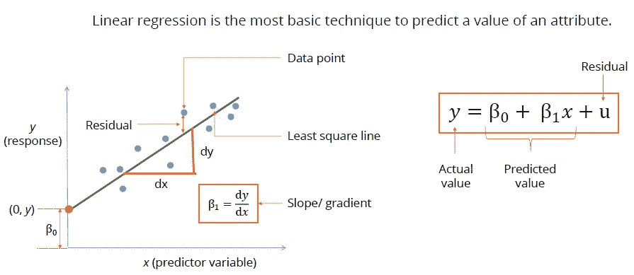

*   一般来说，一条直线可以用线性方程 y = m * X + b 来表示，其中，y 是因变量，X 是自变量，m 是斜率，b 是截距。
*   在机器学习中，我们将我们的方程改写为 y(x) = w0 + w1 * x 其中 **w 的**是模型的**参数**，x 是输入，y 是目标变量。

**简单线性回归**

*   通过拟合一条线，在**目标变量** (y)和**输入变量** (x)之间建立**关系**，称为**回归线**。

**多元线性回归**

*   **具有多个输入变量/特征的数据集**被称为多元线性回归。

**成本函数**

*   以确定某条线与数据集的吻合程度。或者，给定两条线，确定哪一条更好。
*   它测量估计值(数据集)和估计值(预测值)之间的差异
*   给定 **w 的**的特定值，成本函数测量 **y 的**与相应的 **y 真值**有多接近。也就是说，一组特定的权重对目标值(y)的预测有多好。
*   对于线性回归，我们使用**均方误差成本函数**。它是预测值 y(x)和目标值 y 真值之间的平方误差的各个数据点(xi，yi)的平均值。

**残差**

*   成本函数基于**真实目标**和**预测目标**之间的距离(样本点和回归线之间的距离)定义**成本**，也称为残差。
*   如果一条特定的线远离所有点，则残差会更高，成本函数也会更高。如果一条线靠近这些点，残差将很小，因此成本函数也将很小，这是所希望的。

仅供参考—在**线性回归**中，您如何找到直线？

从画一条随机的线开始。假设误差是直线与数据点的距离。试着重新画线来减少这个误差。这个过程叫做**梯度下降。**由于我们不想要负距离，这种减少误差的方法被称为**最小二乘法。**

## k-最近邻(KNN)

这是一种监督学习算法，可用于分类和回归。

*   不需要培训，因为数据集就是模型

**分类:**对新的数据点进行分类

*   在训练数据**中找到与它最接近的 **k 点**。最近由合适的**距离度量**(欧几里德、曼哈顿、闵可夫斯基)定义，例如欧几里德距离。**
*   **根据这 k 个点中**最常见的**类进行预测**(即我们模拟投票)。

**回归:**当目标变量为真实值时

*   我们取 K 个最近邻居的平均值。

**调节超参数 K**

*   在机器学习中，**超参数**是一个参数，其值在学习过程开始前设置为**。相比之下，其他参数的值是通过训练获得的。**
*   **k 的**小值**意味着**噪声**将对结果产生**更高的影响，而**大值**使得 a **算法的计算代价很高。**通常，我们执行交叉验证以找出最佳 k 值(或选择最适合我们的精度/速度权衡的 k 值)。如果您不想尝试 k 的多个值，经验法则是将 k 设置为等于数据点总数的平方根。****

## **决策树**

*   **一种监督学习算法，可用于分类和回归问题**
*   ****决策树**一次只看一个变量，是一种**合理可及的**(尽管是初级的)机器学习方法。**
*   **决策树类似于流程图，很容易解释。**
*   **决策树算法的工作原理是基于某个特性的值递归分割数据。每次拆分后，数据部分变得越来越相似，最终变得几乎相同。**
*   **一棵**决策树**使用 if-then 语句来定义数据中的**模式**。在 ML 中，这些语句被称为**分叉**，它们根据某个值将数据分成两个分支。**

**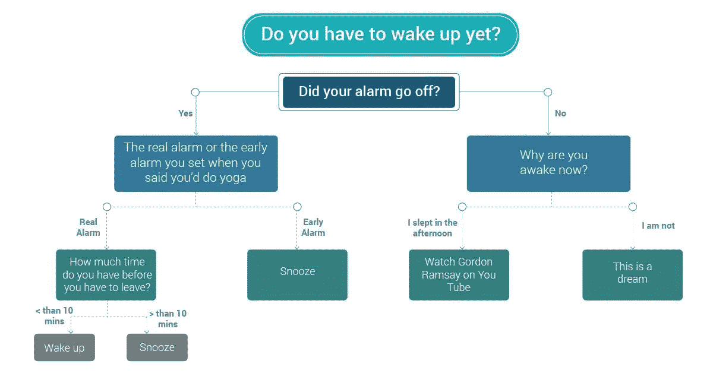**

**如何构建一个决策树？**

**假设我们有一个度量标准来定义数据集有多不纯。下面是构建决策树的伪代码:**

*   **从一个节点中的所有数据开始**
*   **根据导致**最大纯度增益(或杂质减少)的特征，将数据集分为两部分 A 和 B。****
*   **在子节点上重复这个分裂过程，直到我们得到纯节点，即它们包含单个类的样本，或者满足一些其他停止标准。**

## **原理:参数和非参数模型**

*   **在参数模型中，**我们不断更新固定数量的参数，以学习一个函数**，该函数可以在不需要训练数据的情况下对新数据点进行分类。比如——逻辑回归。**
*   **在非参数模型中，**参数的数量随着训练数据的大小而增长。**例如— K 个最近邻。**

# **重要概念**

## ****一般化****

> **模型对看不见的数据表现良好的能力被称为泛化，这是我们希望模型具有的理想特征。**

*   **概括很重要，也是根本目标**
*   **超越训练数据集的概括！**

## ****过度装配****

*   **当一个模型在训练数据(算法被训练的数据)上表现**很好，但在测试数据(新的或未知的数据)上表现不好时，我们说它对训练数据**过拟合**或者模型**过拟合。**这是因为模型**学习训练数据中存在的噪声，就好像它是一个可靠的模式。******
*   **过拟合是学习训练数据中的**随机波动**。当训练数据的准确度高而测试数据集的准确度低时，可以被识别。**
*   **相反，当模型**在训练数据**(即，它未能捕捉到训练数据中存在的模式)以及看不见的数据上表现不佳时，则称其为**欠拟合。**也就是说，模型**无法捕捉训练数据中存在的模式**。**

**过度装配的几率*增加*了:**

*   **一个*更小的*数据集——因为从噪音中分离出可靠的模式要困难得多**
*   **增加模型的*复杂度***

## ****解决过拟合 ML 问题的策略:****

## ****正规化****

> **人为的规范化*阻碍了*对世界如何运作的复杂解释(模型)。**

**即使这个模型更符合已经观察到的情况，它也不太可能很好地推广到未来。*复杂性是不好的*因为即使它可能完美地符合数据，它也可能不能很好地概括新的案例。因此，一个更简单的模型，合理地符合训练数据，对于不在样本数据中的情况会更正确。**

**正规化的类型**

*   **L1 正则化或套索回归，其中惩罚项为λ ||w||**
*   **L2 正则化或岭回归，其中我们添加与每个权重的平方成比例的惩罚**

## ****交叉验证****

**交叉验证是一种寻找模型最佳**超参数**的方法。(A **超参数**是一个参数，其值在学习过程开始前设置为**。相比之下，其他参数的值是通过训练获得的。)****

******交叉验证的维持方法******

*   ****例如，在梯度下降中，我们需要选择一个**停止标准**。最简单的停止标准是检查我们的准确性是否在训练数据集上有所提高。然而，这容易导致**过度拟合，因为模型可能会捕捉训练数据中存在的噪声作为可靠的模式。******
*   ****我们可以通过在训练模型时不使用整个训练数据来克服这个问题。相反，我们将**拿出一些数据**(一个验证数据集)，我们将**只训练剩余的数据。**例如，我们可以**将我们的训练数据集分成 70/30** ，并使用 **70%的数据进行训练，30%的数据进行验证。******
*   ****在上面的梯度下降的例子中，现在我们在训练数据上训练我们的算法，但是**检查我们的模型是否在验证数据集**上变得更好。这就是所谓的**保持方法，也是最简单的交叉验证方法之一。******
*   ****我们也可以将验证数据用于其他类型的实验。例如，如果我们想要运行多个实验，选择不同的特征来训练我们的机器学习模型。****

******K 倍交叉验证******

*   ****在 K 重交叉验证中，数据集被分成 **k 个独立的部分。** **我们重复训练过程 k 次。**每次一部分作为**验证数据，其余部分用于训练模型。**然后我们**平均误差来评估一个模型。** **注意，k 重交叉验证将训练我们的模型的计算要求增加了 k 倍。******

******优点:******

*   ****当**执行大量实验时，对于过拟合**来说，它比保持方法**更加鲁棒。******
*   ****最好在**数据集尺寸较小时使用**。这是因为当执行 k-fold 交叉验证时，我们可以使用更小的**验证分割(**比如 10%而不是 30%) **，因为我们是在 10%的数据的各种子样本上测试模型。******
*   ******留一交叉验证**是 k 重交叉验证的一个特例，其中 **k 等于数据集中的数据点数。每次，我们拿出一个单独的数据点，然后根据其余的数据训练一个模型。我们使用单个数据点来测试我们的模型。然后我们计算平均误差来评价一个模型。******

# ****重要的 ML 课程和原则****

*   ******简单并不意味着准确** →复杂度可以被认为是每个分类器的假设空间的大小。这是每个算法可以生成的可能分类器的空间。较大的空间将被较少地采样，并且所得到的分类器不太可能过适合训练数据。****
*   ****重点是 ***的问题‘目标函数是可以学习的，而不是可以表示的。’*******
*   ******关联不意味着因果关系→** 分类器只能学习关联。它们本质上是统计性的。****
*   ****将培训数据与评估/测试数据分开****
*   ****您必须使用训练错误作为测试错误的代理****
*   ****不要用测试数据污染培训过程****
*   ****对训练集使用交叉验证，并为最终验证创建一个搁置集****
*   ******不管你有多少数据都是不够的******
*   ****每个学习者都必须在给定的数据之外包含一些知识或假设，以便超越数据进行概括。****
*   ****假设会产生偏见****
*   ****限制依赖性和复杂性****

****ML 不能从无到有，它只能从少中得到多。****

****归纳→少量数据变成大量知识(归纳>演绎)例如:****

*   ****如果我们有很多关于**是什么让我们领域中的例子类似于**的知识，我们可以使用**实例方法。******
*   ****如果我们知道**概率相关性**，我们可以使用**图形模型。******
*   ****如果我们知道每个类需要什么样的**前提条件**，我们可以使用**规则集。******

****分解归纳错误:****

*   ******偏差** —学习者不断学习相同错误内容的倾向(在图像中，较高的偏差意味着与中心的距离更远)。一个**线性学习器**有很高的偏差，因为它局限于使用一个超平面来分类。****
*   ******方差** —倾向于学习与信号无关的随机事物(在图像中，高方差意味着更多分散的点)。**决策树**具有很高的方差，因为它们受训练数据中细节的影响很大。****
*   ****有时，强假假设(读取偏差)可能比弱真假设更好，这解释了为什么具有强独立性假设的朴素贝叶斯比像 C4.5 这样需要更多数据以避免过度拟合的强大决策树做得更好。****
*   *******噪音*** 不是 ***过度拟合*** 的唯一原因但它会加剧问题****

> ******直觉在高维中失效—** *维度诅咒是 ML 中的一个问题*****

*   ******一般化**正确成为**指数难度**随着**维度** **(特征数量)**成为**大**。****

****ML 算法依赖于**基于相似性的推理**，其**在高维度中分解**，因为固定大小的训练集仅覆盖**大输入空间**的一小部分。****

*   ****此外，我们来自三维空间的直觉通常不适用于高维空间。因为在高维度中，所有的例子看起来都一样。因此**维度的诅咒**可能**超过拥有更多功能的好处。******
*   ****尽管在大多数情况下，学习者受益于**非一致性**的祝福，因为数据点集中在低维流形中。这指的是来自真实世界域的观察结果通常不是均匀分布的，而是以有用/有意义的方式分组或聚集的。****

> ****不要相信理论保证是实际决策的标准，而是用它来理解和推动算法设计****

******特性工程**是关键，也是关键****

*   ****ML 是一个运行学习者，分析结果，然后修改学习者的迭代过程。****
*   ****对于学习算法，原始数据不包含足够的结构。必须为可用数据构建特征，以使算法的结构更加明显****
*   ****当所有的特征都与类相关时，学习是容易的，但是更多情况下，类是特征的复杂函数。****

> ****M **矿石数据→更好的结果******

*   ****ML 有 3 个约束→时间、金钱、训练数据。****

****大多数分类器在规模上实现相同的结果****

*   ****学习者将附近的示例分组到同一个班级。****
*   ****使用参数和术语数量较少的简单算法****
*   ****使用**多种型号**然后**合奏**它们****

****三种最流行的集成方法:****

*   ******打包**:生成不同的训练数据样本，为每个样本准备一个学习者，并使用投票将预测组合起来。****
*   ******Boosting** :在训练过程中，根据训练实例的难度对其进行加权，特别关注那些难以分类的实例。****
*   ******堆叠**:使用更高级别的分类器，学习如何最好地组合其他分类器的预测。****

****感谢阅读！我希望你学到了一些东西！如果你喜欢这篇文章，你会喜欢我的其他深潜！你也可以在 LinkedIn [这里和我联系。](https://www.linkedin.com/in/karanpinto/)****

## ****深潜系列文章:****

> ****[深潜:数字大世界](https://medium.com/@karanmjpinto/deep-dive-into-the-digital-macrocosm-e5075fc3b42a)****
> 
> ****[深潜:经济的首要原则](https://medium.com/@karanmjpinto/deep-dive-into-the-first-principles-of-the-economy-bb6665299d49)****
> 
> ****[深潜:用冥想满足正念](https://medium.com/@karanmjpinto/meeting-mindfulness-with-meditation-c0d79eb4a7cc)****