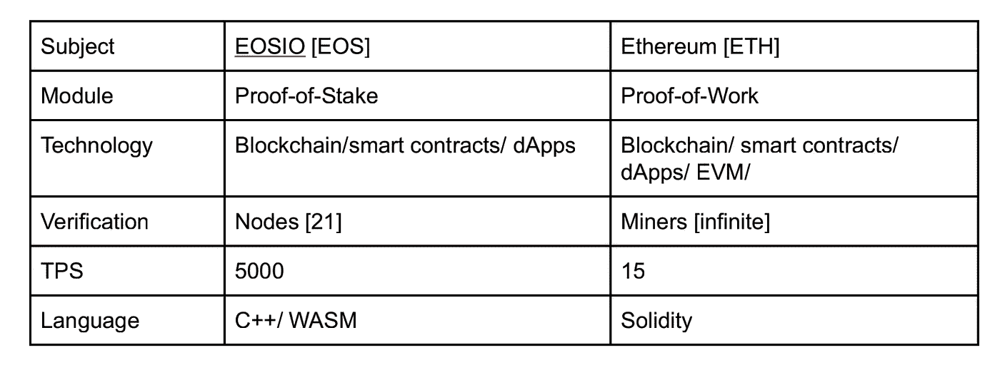

# 深入探究 EOS 及其与以太坊的比较

> 原文：<https://medium.datadriveninvestor.com/a-deep-dive-into-eos-and-how-it-compares-to-ethereum-ef16229a6175?source=collection_archive---------26----------------------->

**EOS 技术介绍**

EOS 是一个基于区块链的模块，被设计成一个分散的操作系统。该项目与区块链其他技术的不同之处在于，它“愿意”通过消除交易费用和提高每秒交易量，让用户构建工业规模的应用程序。

EOS 使用授权利益证明[PoS]以及共识机制来扩展其网络。扩展的方法使交易更快，同时也加快了块的创建，而不会危及“分散激励”策略。简而言之，EOS 使用 PoS 和共识技术来加速交易，以及在不损害其节点激励的情况下轻松增加块。共识机制在该技术中扮演着重要角色，它在模型中使用了 21 个块生产者(节点),而不是工作验证(PoW)系统中的多个矿工

**根据 EOS 的白皮书:**

“像 EOS 这样的区块链的直接用户是企业家和开发人员，他们编写实现分布式应用程序或 DApps 的合同。他们的用户是零售、金融、物流、媒体的常规客户。后一类客户不需要知道什么是区块链。”

此外，白皮书解释说，最终目标是为开发人员提供一个平台，允许通过分散的、隐藏的通信机制来构建广泛的业务。dApp 开发者被给予完全有能力的账户、许可和消息平台来表达该系统。UI[用户界面]为用户设置了类似的路径，因为他们熟悉使用平台来构建 dApps 并访问区块链。这种方法被表述为“区块链的操作系统”

智能合约平台凭借其完整的堆栈、无交易费用、更高的可扩展性和无缝使用特性与以太坊[ETH]竞争。

**EOS 和以太坊的比较特征**

*工作证明与利益证明*

以太坊将其原则设定在 PoW[工作证明]共识模型上，而 EOS 使用 PoS。以太坊拥有作为其当前模型的首批开发者之一的额外优势，该项目在加密货币市场排名第二，仅次于比特币[BTC]，并以其智能合约和分散应用[dApps]的特点而闻名。

*TPS【每秒交易量】*

以太坊的项目有很高的交易费用，并且缺乏可扩展性，这使得它的 TPS 只有 15，而根据记录，EOS 在一秒钟内完成 5000 次交易。以太坊的模型虽然有很多缺点和不足，但已经被不同的开发者用来通过它的平台构建 dApps。

*用例*

EOS 和 Ethereum 的用例非常相似，因为它们都使用智能合约来构建 dApps。EOS 是一个智能合同平台，用于构建 dApps 和分散自治公司。另一方面，以太坊使用其 EVM(以太坊虚拟机)和智能合约来部署 dApps。

**EOS 和以太坊的区别:**

*免责声明注意:本文不是对任何金融投资的建议。*