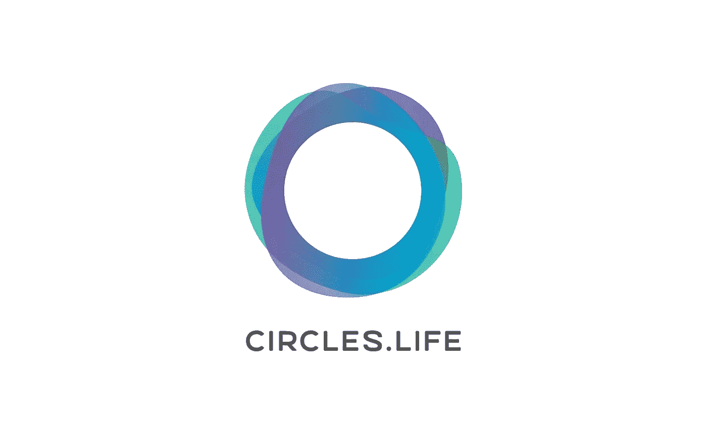
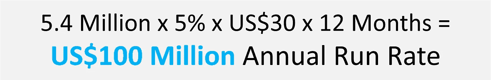
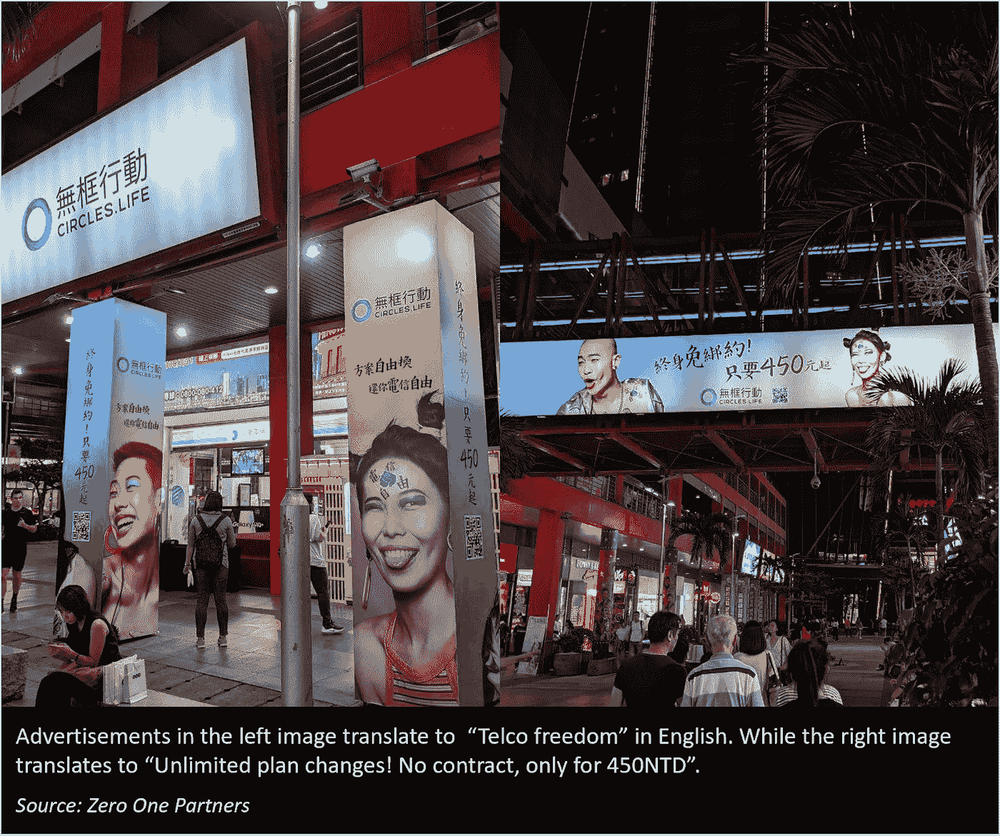
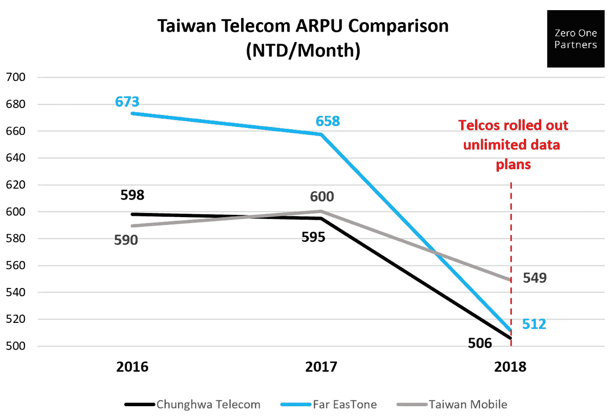
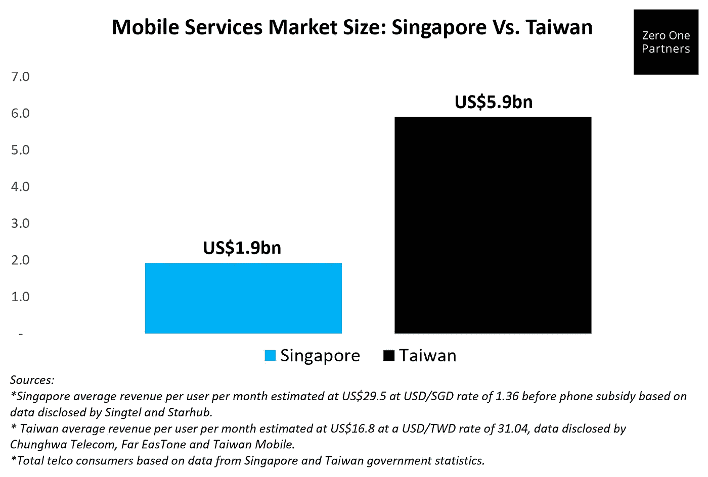
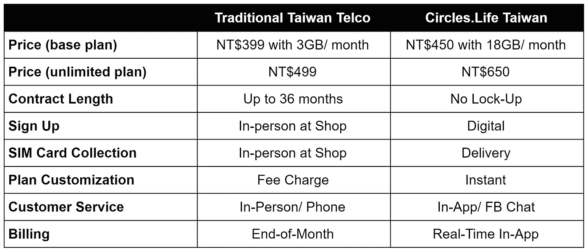
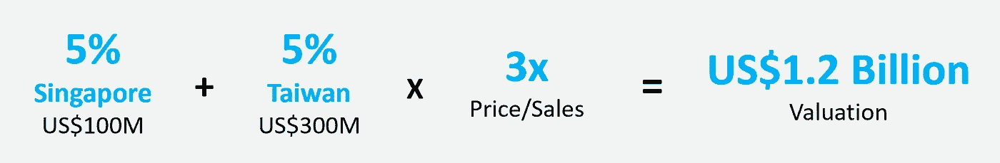
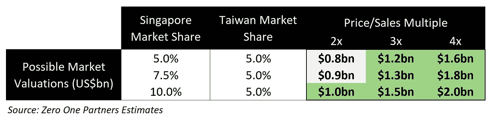

# 深入探究圈子。生活可能成为新加坡的下一个独角兽

> 原文：<https://medium.datadriveninvestor.com/a-deep-dive-into-how-circles-life-could-become-singapores-next-unicorn-4b060c09cb94?source=collection_archive---------0----------------------->

**圈子。Life 已经获得了约 5%的市场份额，并有望在年底前实现 1 亿美元的年化收入。**

自从三年前在新加坡推出商业服务以来。生活已经走过了漫长的道路。根据媒体报道，通过灵活的无合同计划和数字优先的客户体验撼动了电信市场，Circles 已经获得了超过 5%的市场份额。作为回应，新加坡电信等规模大得多的现有企业被迫大幅改变其产品，这对消费者来说是件好事。

 [## 风险投资家在给创业公司播种时会考虑什么标准？数据驱动的投资者

### 2017 年，风险投资资金攀升至十年来的最高水平。你的创业公司目前吸引风险投资的机会是…

www.datadriveninvestor.com](https://www.datadriveninvestor.com/2018/04/20/what-criteria-do-venture-capitalists-consider-when-seeding-a-startup/) 

5%的市场份额意味着新公司能赚大钱。新加坡有 540 万后付费电信用户，如果我们排除某些计划中包含的手机补贴，每个用户(ARPU)的平均收入约为每月 30 美元。这意味着圈子。Life 的年收入接近或超过 1 亿美元。

如果我们再看看许多高增长科技公司的估值，我们会发现成长型公司的交易价格往往是其年收入的许多倍。因此是圆圈。通过在新加坡占据更多市场份额或向海外扩张，人寿正逐步成为市值超过 10 亿美元的“独角兽”。

【Circles 的国际扩张，尤其是在台湾的扩张，使其市值超过 10 亿美元。生活可行。

鉴于该公司最近在台湾推出的商业服务，以及据报道即将在澳大利亚推出的服务，我们相信。在不久的将来，Life 将成为新加坡下一个独角兽创业公司的有力竞争者。

我们访问了台湾城市台北和台中，考察 Circles 在该国的开展情况。与新加坡类似，台湾客户是精通技术的数字原住民。根据国际贸易署(ITA)的 export.gov，超过 84%的台湾人口是网上购物者，其中 64%更喜欢在他们的移动设备上购物。

台湾的电信业也呈现出与新加坡类似的结构，目前由三大运营商主导——中华电信、台湾移动和远传电信，它们总共占据了 90%以上的市场份额。

正如我们在下面的照片中看到的台北信义区的广告，圆圈。Life 正在以与其新加坡战略非常相似的方式接近台湾，目标客户是喜欢数字用户体验的千禧一代。

类似于新加坡的传统移动运营商在 Circles 之前在产品上相对停滞。Life 推出后，台湾电信公司迄今为止在其服务中表现出有限的创新，而是选择主要在价格和电话补贴上竞争。如下图所示，自从台湾电信公司以低至每月新台币 499 元的“无限数据计划”开始价格战以来，每用户平均收入(ARPU)在过去几年里全面下降。

台湾的电信月费比新加坡便宜得多，因为台湾的消费者收入水平比新加坡低，平均每月约 16 美元。然而，由于台湾拥有 2930 万电信用户，而新加坡只有 540 万，因此台湾的总市场机会是新加坡的三倍。

台湾的电信市场大约是新加坡的 3 倍。

从我们看到的圆圈来看。生活的台北办公室，手机 app，还有打广告的计划，圈子。Life 正在复制其新加坡战略——提供无合同计划、即时计划定制、即时应用内客户服务、实时账单透明和当天 SIM 卡交付。

**计划比较:圈子。生活在服务和数字体验上竞争，而不是价格。**

根据圈子。自 6 月份在台湾试运行以来，该公司已经看到了强劲的业绩。据报道，该公司的净推广得分(NPS)是一个跟踪客户满意度和忠诚度的指标，约为正 35 分，而台湾同行的平均得分为负 30 分。推动这一趋势的一个因素可能是该公司的应用内实时客户服务功能，据报道，该功能在台湾的响应时间仅为 27 秒(在新加坡甚至更快，仅为 20 秒)。

**圈子。人寿在台湾仅占 5%的市场份额，就能带来 3 亿美元的额外年收入。**

千禧一代和客户服务策略与新加坡相似，市场动态也相似，这似乎是可行的。人寿可以在台湾复制新加坡的成功。如果我们考虑台湾每月平均 16 美元的电信消费和 2930 万的电信消费者，那么我们可以估算出消费圈。Life 的台湾电信总收入机会为年销售额 59 亿美元。

这意味着如果圆。人寿在台湾可以获得 5%的市场份额，就像他们在新加坡所做的那样，那么这将为公司从这个新市场中额外产生 3 亿美元的年收入。给定的圆。我们相信，与三年前相比，Life 可用于营销的资金增加了，并且从其首次推出中获得了经验。与新加坡相比，人寿可能会在更短的时间内在台湾获得 5%的市场份额。

**以目前新加坡 5%的市场份额和未来几年达到台湾电信市场 5%的潜力，Circles 可以获得“独角兽”估值。**

如果我们假设圆圈。生命人寿可以实现相当于其收入三倍的市场价值(价格与销售的倍数为 3 ),而新加坡和台湾圈的市场价值分别为 5%和 5%。人寿的市值可能达到 12 亿美元。(4 亿美元 x 3)我们注意到，许多高增长的科技公司可以从投资者那里获得接近 10 倍甚至 15 倍的市盈率，因此相对于现实世界中科技公司获得的投资者估值，3 倍甚至 4 倍的市盈率是可以实现的。

而且，如果圈子。Life 继续在新加坡占据市场份额，然后该公司证明 10 亿美元或更高的独角兽估值变得更加容易，因为该公司将有更多的收入作为任何倍数的基础。在下面的估价矩阵中，我们举例说明了如何使用 2x、3x 或 4x 倍数的圆圈。人寿的市值可能达到 10 亿美元或更高。

**若画圈圈。人寿保险公司可以在台湾获得 5%的市场份额，并在新加坡继续取得成功，那么就有许多可行的方案。生活可能成为新加坡的下一个独角兽。来自澳大利亚等新市场的任何额外收入只会加速独角兽地位。**