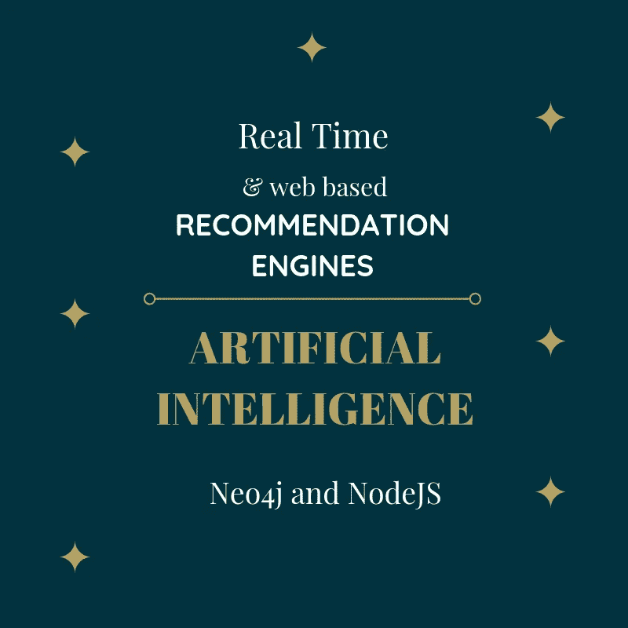
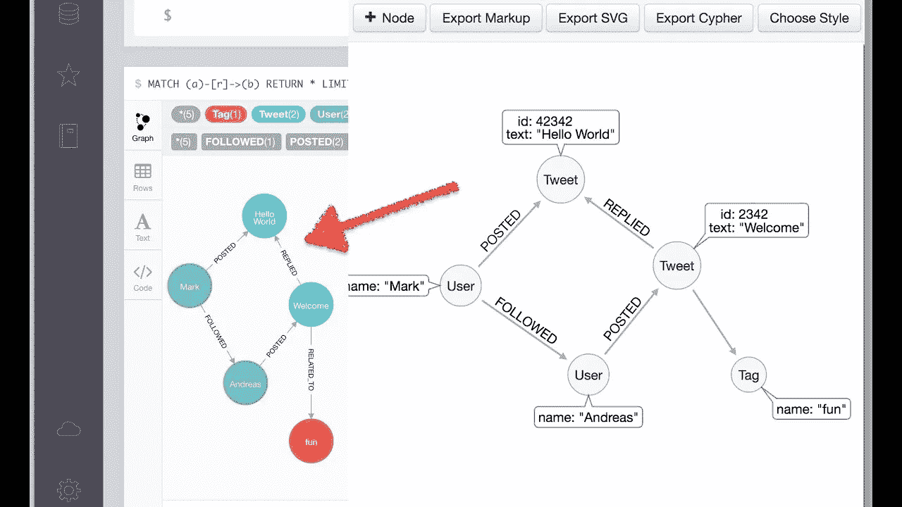
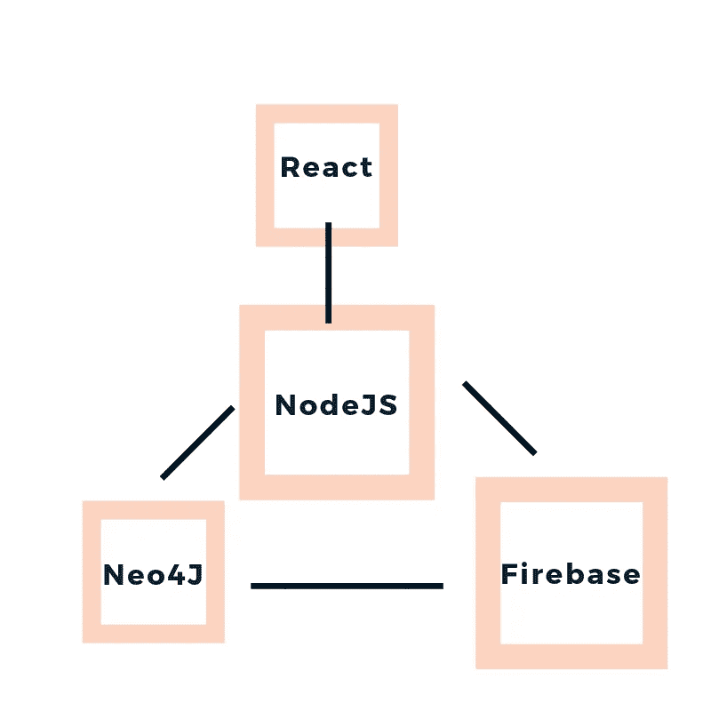

# 使用人工智能开发推荐引擎的另一种方法

> 原文：<https://medium.datadriveninvestor.com/a-different-approach-to-developing-recommendation-engines-using-a-i-3245c58c073b?source=collection_archive---------18----------------------->

作为 Myrl Tech 的首席执行官，我工作的很大一部分是分析那些带着数字产品开发需求来找我们的初创公司的需求。由于现在是 2018 年，大多数初创公司都被人工智能的错误所困扰，并希望从第一天起就将人工智能和人工智能的某些方面融入他们的产品中。

在你的产品中实现人工智能最常见的方式仍然是推荐引擎，因为它在一个产品或平台中有各种各样的应用，因为所有平台都以用户为中心，所有用户都希望能够看到更多他们喜欢的东西，因此推荐引擎也是如此。

当您的数据库中存储了大量过去的数据(如 hadoop)时，让 python 完成所有繁重工作的普通方法确实可行，特别是如果您希望离线查询所有内容，创建关系，然后将它们存储回数据库中。但是，如果你真的是一个新产品，有更少的数据要处理，如果你想建立一些特定于网络的东西，如果你想让这些推荐引擎“实时”工作(是的，你没看错，实时)，而不是发布事实(在你的会话到期后，你做的任何事情都会被存储在数据库中，得到分析，当你下次登录时，平台会为你准备一些内容，类似于你在上次会话中查看/搜索的内容)。

我们在这里谈论的是一种不同的方法。让您从一开始就定义数据之间的关系，而不是运行事后操作来连接数据。我们还在谈论能够实时访问这些关系，并根据新数据调整这些关系，为我们提供一个精简的方法，连接到我们的 web 应用/移动应用推荐引擎，该引擎使用非常少的数据，并基于预定义的数据关系，而无需在大量数据集上运行大量 python 查询，所有这一切都在一瞬间发生。那么，让我们看看这是如何工作的。

新的方法是在后端使用 Neo4j、NodeJS 和 Firebase，在前端使用 React 和 Redux。现在我们都用 Nodejs，一起反应(那是面包黄油吧？)，但是这里的 Firebase 是怎么回事，Neo4j 到底是什么？

Neo4j 是一种先进的数据库技术，超越了关系数据库(sql)和非关系/可伸缩数据库(非 SQL 数据库，如 Mariadb、Mongodb 等)。)并且以某种图形方式定义数据，其中每个数据点被称为顶点，并且能够定义数据点之间的各种复杂关系。这如何适应或有所帮助？好问题，我们已经在需要严格数据关系的应用程序中使用了 SQL，如员工数据库、患者数据库等。但是开发人员很快就开始开发超越简单的员工数据库的应用程序，并需要更大的数据转储，而这些数据转储往往不符合特定的标准，这就是为什么具有“集合”等概念的非关系数据库开始得到使用。开发人员很快意识到缩放问题和数据一致性问题现在已经解决了，但是如果您想要数据之间的一些关系呢？使用非 sql /非关系数据库很难做到这一点，因为它并不打算这样做，如果您开始使用非 sql 数据库来创建数据之间的 sql 类型关系，您显然没有抓住要点，并增加了应用程序的开发时间。

这就是 Neo4j 的用武之地。想象一下，一个数据库可以保存大量的数据，但也可以定义像 SQL 这样的关系，只是关系可以更高级一些(我们说的是数据点之间数百个复杂的关系)。请看下图，我们是如何在 neo4j 中定义结构的

Neo4j —通过由人工智能驱动的推荐引擎定义关系和数据使用

你看到了吗？很棒吧？您将在数据库层获得神经网络类型的数据表示，在发现和定义数据之间的关系后，为您节省大量时间、算法、重新排列、排序和存储数据。现在，所有关于实时改变关系的讨论是什么？这就是 firebase 的用武之地，firebase(如果你还不知道的话)是一种实时数据库技术，由谷歌创建并普及，在实时运行的应用程序中有多种用途(例如出租车预订，司机可以指示他何时值班或下班，聊天应用程序，用户可以指示他们何时离线或在线)。如果您可以在 firebase(实时数据库)中存储用户正在观看的实时搜索或视频，并使用这些关系本身来显示类似的视频(通过让 firebase 与 neo4j 交互)，并且 firebase 还可以用于记录用户在观看特定视频后正在观看的视频类型，然后将这些关系推送到 neo4j (firebase 可以运行一个脚本，该脚本可以通过编程方式推这些关系或在 neo4j 中定义更多关系)。

我们将在后端使用 NodeJS 创建 API 和 express 来帮助路由整个应用程序。NodeJS 也是将这个完整架构结合在一起的粘合剂。React 用在前端，因为它不需要页面刷新来发挥它的魔力(即，改变组件的状态并显示新数据)，从而使我们的应用程序真正实时并异步工作，而不需要页面刷新。下图为建筑参考——

Architecture for recommendation engines using A.I

注意，我们到现在还没有谈论人工智能算法或技术。既然我们已经自下而上地实现了这种结构，你就不需要很多复杂的算法来进行搜索、链接和排序操作，否则你就必须这样做。在某些情况下，默认情况下，这种结构会工作得很好，开箱即用，你甚至可能永远不需要特殊的人工智能算法来完成任何事情。

让我们总结一下——您可以使用 neo4j，这是一种非常先进的图形数据库技术来建立数据之间的关系，并且当您遇到新的用户查询时，您可以不断地向数据添加关系。对于一个特定的用户，您可以将他的信息存储在 firebase 中，并让 firebase 与 neo4j 进行交互，以确定在同一会话中根据他的搜索向他显示什么，然后您将所有这些信息进行异步反应，这将显示信息而无需重新加载，从而为应用程序提供完整的实时人工智能感觉。

本文最初写于—[http://www.designandtech.co/](http://www.designandtech.co/)

我们 Myrl Tech 为客户制造一些最复杂的数字产品。如果您有任何产品开发需求(尤其是复杂的需求)，并且您不知道从哪里开始，那么我们就是您要找的人！

请关注更多信息丰富的文章。