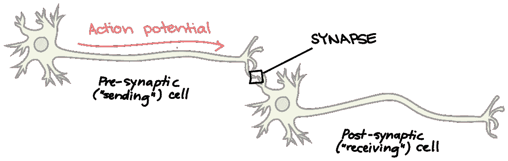
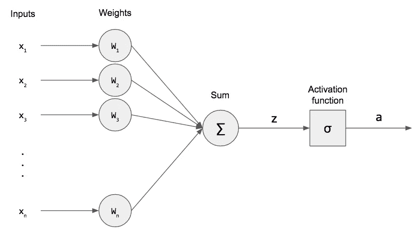
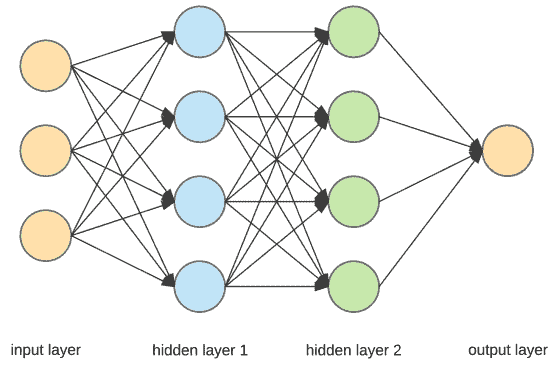
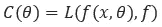
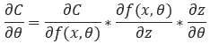
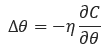

# 深入学习世界的探索

> 原文：<https://medium.datadriveninvestor.com/a-dive-into-the-world-of-deep-learning-fd2d7af4da65?source=collection_archive---------7----------------------->

如果你像我一样是深度学习领域的新手，那么你可能已经在网络上偶然发现了大量信息，并且不知道从哪里开始。这篇文章将帮助你对深度学习有一个全面的了解，而不必过多地了解技术细节。

深度学习是一种受生物智能启发的特定类型的机器学习架构。人类的大脑包含一群数十亿的神经元，这些神经元通过突触相互连接。这些突触允许不同的神经元相互交流。在深度学习架构中，人工神经网络(ANN)是一个类似的“虚拟”神经元群，它们相互连接，允许机器做出类似人类的决定，在某些情况下甚至超过人类的能力。

 [## 深度学习用 7 个步骤解释-更新|数据驱动的投资者

### 在深度学习的帮助下，自动驾驶汽车、Alexa、医学成像-小工具正在我们周围变得超级智能…

www.datadriveninvestor.com](https://www.datadriveninvestor.com/2019/01/23/deep-learning-explained-in-7-steps/) 

*The Neuron Model (Illustration by The Khan Academy)*

# 感知器模型

感知器与生物神经元同义，是人工神经网络(ANN)的基本单元，它接受一些输入并产生单个输出。权重用于决定每个输入对输出的重要性，以及一个称为偏差项的阈值参数。

*The Perceptron Model (Illustration by Zenva Academy)*

一旦输入被输入到网络中(在这种情况下是单个感知器)，其加权和被计算并被传递到激活/阶跃函数，该函数缩放输出的域并在模型中引入非线性(稍后将详细描述)。

简单地说，如果没有激活功能，感知器就是一个线性二进制分类器，它通过在数据上画一条线来将数据分成两类。

那么是什么让它如此特别呢？多个感知器相互连接形成了所谓的多层感知器(MLP)。一层中的每个感知器与后续层中的其他感知器相互连接。第一层称为输入层，最后一层称为输出层。输入层和输出层之间的任何层都称为隐藏层。一个感知器的输出作为输入传递给下一层的感知器。MLP 结构允许网络在比单层感知器更抽象的层次上做出决策。

*A Deep Neural Network Structure*

然后，网络的目标是找到(每个神经元的)权重和偏差的正确组合，以正确地对输入进行分类(即，将输入与其真正的类别标签进行匹配)。这是通过将输入馈送到网络、计算输出并将其与标签进行比较(已知先验)来迭代完成的。形式上，这个过程被称为训练神经网络。将神经网络的输出与预期输出进行比较，并使用损失函数计算网络的损失。损失函数是一种度量，用于测量网络输出和预期输出之间的距离。权重和偏差因此被重新调整以最小化网络的损耗。

这听起来可能有点复杂，但简单地说，网络在训练阶段主要做三件事:

1.  获取一些输入，通过网络向前传播，并以类标签的形式计算输出。
2.  通过将网络输出与真实类别标签(事先已知)进行比较来计算网络损耗。
3.  最后通过最小化网络的损失来重新调整每个神经元的权重和偏置。

步骤 3 正式称为反向传播。网络的参数(即，权重和偏差)以这样的方式被调整，使得网络的总损失最小化(即，网络的输出收敛到真实的类别标签)。由于损失函数是针对每个训练示例计算的，因此假设净损失可以计算为每次通过的损失函数的平均值。

# 那么我们到底如何反向传播呢？

如果你知道多元微积分的基础，反向传播是很容易理解的。为了调整网络的参数(即权重和偏差)，我们通过计算损失函数相对于网络参数的梯度来最小化损失函数。由于激活函数被应用于每个感知器的输出，我们不能直接区分关于参数的损失函数。因此，我们依靠链式法则来计算损失函数相对于网络参数的梯度，首先对损失函数相对于激活函数求微分，然后对激活函数相对于网络参数求微分。由于损失函数和激活函数都必须是可微的(为了反向传播),我们将我们的选择仅限于光滑和连续的函数。

现在让我们把这些单词放进一些基本等式里。如果我们使用符号 *θ* 来表示网络参数，那么计算单次正向传递的网络损耗的通用等式可以写成如下:

其中 *C (θ)* 是损失函数， *f (x，θ)* 是神经网络的输出， *f* 表示输出的真实值。为了最小化关于网络参数的损失函数，我们使用链式法则。

然后通过引入一个称为学习率的项来计算网络参数的最终更新。没有学习率，对参数的修正可能太大或太小。因此，这可能导致过度校正权重而导致发散，或者在小校正的情况下，网络可能收敛得非常慢。学习率通过乘以常数因子来缩放对参数的校正。

大的和小的学习速率都有其优点和缺点，应该根据网络的任务和数据的动态来选择。

总而言之，当我们反向传播时，我们所做的就是将误差/损失从网络的输出层传播到网络的起始层(因此称为反向传播)。这个过程反复执行，直到网络损耗低于某个特定的阈值。

# 激活功能

当我第一次看到神经网络的方程时，我很难理解激活函数的目的。如果我们检查感知器模型，我们会看到它是一个线性二元分类器(本质上它是一条直线的方程)。如果我们将一堆感知器堆叠在一起，形成一个多层感知器模型，那么我们将一堆线性分类器堆叠在一起，产生另一个线性分类器。因此，在没有激活函数的情况下，我们的神经网络仅限于检测不同类别之间的线性边界，这不是很有用。

激活函数通过缩放输出将非线性引入模型。这允许神经网络使用非线性边界来分离类别。有一系列可用的激活函数( *Sigmoid、整流线性单位、SoftMax 等)*但要使用的具体激活函数取决于神经网络的应用。同样，也有一系列损失函数，但要使用的确切损失函数还是取决于输出的性质和网络的应用。

当你第一次开始构建你的网络时，可能会有很多因素需要考虑(隐藏层和神经元的数量、激活函数、学习率、动量更新、批量大小、时期等*等等*)，这可能会导致极度的烦恼，但请记住，设计神经网络更像是一门艺术，而不是科学。