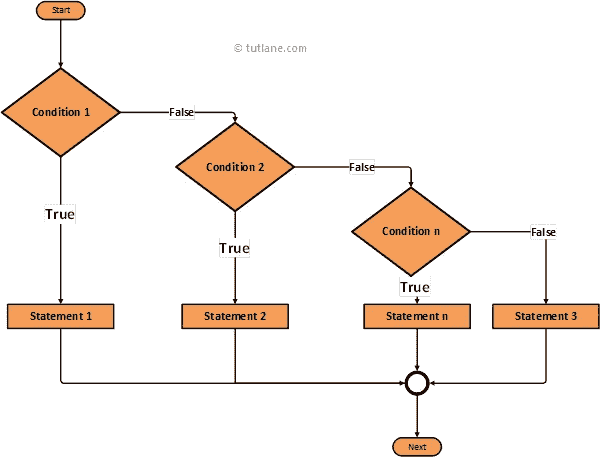
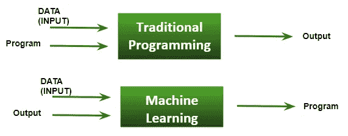

# 实施人工智能的可行性检查

> 原文：<https://medium.datadriveninvestor.com/a-feasibility-check-for-implementing-ai-306d4a775d04?source=collection_archive---------6----------------------->

在阅读这篇文章之前，请查看之前的文章[关于人工智能解码的神话](https://medium.com/datadriveninvestor/myths-about-ai-decoded-c0b9719245f?source=friends_link&sk=0635333fa46edbdef5843542a0c37bc9)。

**是什么导致了人工智能的流行？**

需要是发明之母。以下产品的出现导致了人工智能的飞速发展:

**海量数据**

几年前的数据较少且结构化。如今的数据大多是巨大的和非结构化的。

 [## 挑战你对人工智能和社会的看法的 4 本书——数据驱动的投资者

### 深度学习、像人类一样思考的机器人、人工智能、神经网络——这些技术引发了…

www.datadriveninvestor.com](https://www.datadriveninvestor.com/2019/02/28/4-books-on-ai/) 

**云和大数据存储**

AWS、谷歌云和微软 Azure 已经提供了巨大的能力，而不需要笨重的硬件

**开源算法代码**

开源代码意味着全世界的人都可以为开发做出贡献。这也意味着更容易获得已经编写好的代码。这大多是以 API 的形式。

**框架和库**

有许多开源和专有的框架，使得用更少的代码来完成各种人工智能相关的任务变得更加容易。

**具有强大处理能力的 GPU**

英特尔硬件为世界上大多数系统提供动力，因此它正在用必要的人工智能软件补充其 GPU。

**什么样的工作会受到 AI 的威胁？**

虽然数据科学和数据分析领域将创造就业机会，但它可能会吞噬现有的工作，这些工作的任务可以被机器取代。让我们看一个例子。

考虑 BPO 的呼叫中心。他们会录下所有通话。开发一个机器学习模型，并将数据输入其中。它分析所有数据，并以有意义的方式存储处理过的数据，以回答查询。如果可以，您可以添加聊天记录。添加知识库和常见问题中的数据有助于提高准确性。您提供的数据量越大，它处理各种查询的能力就越强。现在开发一个聊天机器人，使客户能够使用这一点。如果客户有类似之前询问的问题，答案已经存在，否则通过聊天或电话解决问题。实际上，呼叫中心是脆弱的。

它可以进一步调整为一个预测模型，可以诊断和预测结果。这个过程可以不考虑所使用的语言，因为即使是英语，你也需要教它。机器不理解任何人类语言，因为它只直接识别 0 和 1 的比特。当呼叫中心与 Google Duplex 并驾齐驱时，它可能会完全取代呼叫中心。

接受外包工作的公司很容易被人工智能抢走部分业务。人工智能可以消除冗余和重复的任务，减少出错的机会，提高生产率，因此如果这些公司在为客户提供服务时利用人工智能，也会受益。人工智能是基于服务的公司的朋友和竞争对手。

你的公司需要人工智能吗？

让我们来看看关键的决定因素:

**编程**

else if flow — Image from tutlane.com

传统的编程涉及大量代码——例如，它可能包括大量的 *if 条件*来覆盖各个方面。但是，如果除此之外还有其他需要，那么人工智能就会来帮忙。与传统程序相比，它的优点是代码更少，复杂性更低。

**数学因素**

在基础层面，所有的算法都是基于数学的。在处理数据时，概率和统计很重要。

**数据的可用性**

如果公司已经存在了很长一段时间，它肯定会有足够的过去的数据来帮助改善公司和客户的未来。即使数据不可用，你也可以从网上搜集或获取。

这些数据需要大量清理和结构化，以使其更加准确。

**将业务逻辑与技术需求联系起来**

任何技术和实现技术的需求之间的差距应该最小，以确保最佳结果。

**不断变化的世界需求**

如今，大多数客户更喜欢基于人工智能的工具和编程。数据分析和商业智能推动关键决策。

你应该外包人工智能的工作吗？

如果一家公司的核心产品或服务需要人工智能，那么最好在内部招聘人工智能员工。如果需要，也可以进行再培训。

如果你不想在人工智能上投入太多资源，你可以在 AWS、谷歌云或微软 Azure 上使用任何现有的专有人工智能平台。还有像 [H2O.ai](https://www.h2o.ai/) 这样的平台，可以在你的工作空间中启用 ai。

如果人工智能是你的产品或服务的一个依赖，你可以外包它以获得更好的生产力。

你可以问你的问题，并通过向下滚动到回复来提供反馈，以帮助我写出更好的文章。

你也可以在 LinkedIn 上和我联系。