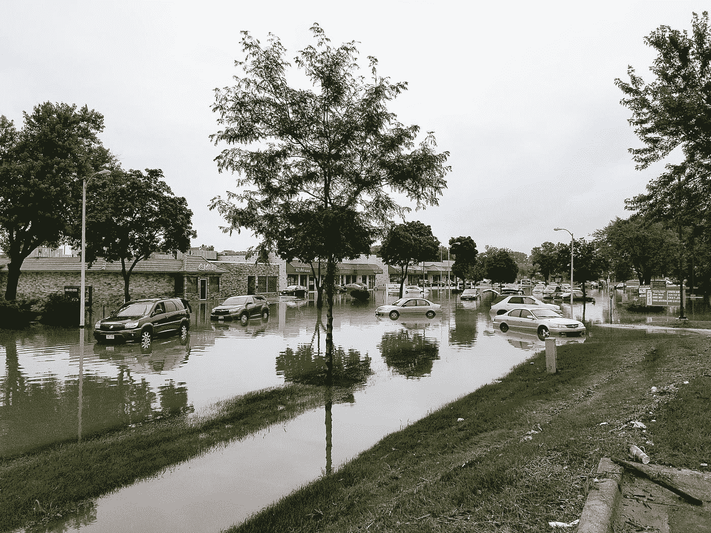

# 一个破碎的品牌承诺。或者说，谁在罩着你？

> 原文：<https://medium.datadriveninvestor.com/a-few-days-ago-i-got-an-offensive-mailer-from-allstate-which-as-has-been-reported-in-plenty-of-7457a2bc2685?source=collection_archive---------11----------------------->

Photo by [jim gade](https://unsplash.com/@jimgade?utm_source=medium&utm_medium=referral) on [Unsplash](https://unsplash.com?utm_source=medium&utm_medium=referral)

几天前，我收到一封来自好事达的攻击性邮件，正如许多地方报道的那样，包括这里的 https://law . free advice . com/insurance _ law/insurers _ bad _ faith/ten-worst-insurance-companies . htm。

是美国最差的保险公司。我可以证明。我现在正在和他们斗气。

看着保险代理人在被告知撒谎、欺骗、偷窃并尽一切可能攫取你的业务，同时拒绝为最需要保险的人提供保险，这一切都是以全能股东的名义进行的，这是一件非常有趣的事情。

让我们坦率地说。我严重怀疑全能股东从好事达购买。就像几乎没有医生会死在医院里一样，因为他们确切地知道他们将会受到怎样的治疗。但是我跑题了。

在过去的几个星期里，不仅是科罗拉多州利特尔顿的一名千禧代理人给我发了一封邮件，立即让我发疯，而且我还受到了另外两名好事达代理人的猛烈抨击。所有的报价对我的房屋价值的评估大相径庭(而且绝对不切实际),年率也不可持续。请看[https://medium . com/@ jhubbel/stupid-sales-tricks-how-to-anger-asury-and-make-an-entire-generation-dangers-BDB D8 e 191056](https://medium.com/@jhubbel/stupid-sales-tricks-how-to-anger-annoy-and-make-enemies-of-an-entire-generation-bdbd8e191056)。

误导。除此之外，我把我愤怒的文章发给了公司的首席执行官，他说(见上面的文章):*根据首席执行官 Thomas Wilson 的说法，好事达的使命很明确:“我们的义务是为股东赚取回报。”*

当然，他为此收获颇丰:[https://www . Chicago business . com/article/2018 03 29/news 01/180329844/allstate-CEO-Tom-Wilson-pay-hits-11 年高点](https://www.chicagobusiness.com/article/20180329/NEWS01/180329844/allstate-ceo-tom-wilson-pay-hits-11-year-high)。坦白说，亲爱的，他一点也不在乎。

这位年轻的女士回击了一个相当粗鲁的回答，其中包括:“我们的许多客户喜欢这个独特的邮件。”

让我们回放一下。换句话说，笨蛋，你不同意我们其他客户的意见。换句话说，笨蛋，别人懂了，而你显然不懂。换句话说，笨蛋，你的经历没有意义，没有价值。

Photo by [Dmitriy Ilkevich](https://unsplash.com/@ilkvch?utm_source=medium&utm_medium=referral) on [Unsplash](https://unsplash.com?utm_source=medium&utm_medium=referral)

对一个获奖的记者和一个为 60 岁以上女性市场写文章的人来说，这是一件愚蠢的事情，这位梅勒走遍了整个城市。对于一个喜欢用真实生活故事来讲述混蛋如何违背品牌承诺和激怒潜在客户的专业演讲者来说，这是一件愚蠢的事情。

显然，在这种情况下，它从顶部开始。威尔逊先生是这里的第一个冒犯者，因为他说股东利益高于客户需求。在一个越来越受气候变化影响的世界里，威尔逊的公司拒绝提供至关重要的必要服务，造成了一种自相残杀的环境，这意味着你、我和邻居家的狮子狗将会经常受到打击。不能诚信做生意？撒谎。偷偷摸摸。挖掘与你无关的记录。

在我的记忆中，好事达的传统品牌承诺可以追溯到:“你会得到很好的照顾。”

好事达使命宣言:“成为最好的……通过我们在管理客户面临的风险方面的合作，让客户安心并丰富他们的生活质量，从而服务于我们的客户。”

我的几个同样年代的朋友，女性房主，她们对侵犯她们的隐私感到非常生气，所有人对邮件的反应都一样，嗯，地狱的钟声。如果我漫步在我的莱克伍德乡村社区，我会发现我们并不孤单。

好事达已经变得咄咄逼人，敲开了我们这些人毫无戒心的大门，这些人经常被像 USAA 这样的人愉快地保护着(善意地说，它不在美国最差的保险公司名单上，我很高兴为这种可靠的服务付费，因为我已经这样做了近 50 年)。

以下是他们的支出:*仅财产/意外险行业在 2015 年的广告支出就达 65 亿美元，GEICO 是唯一一个超过 10 亿美元大关的品牌，支出 13 亿美元。*[https://www . insurance journal . com/news/national/2017/06/19/454947 . htm](https://www.insurancejournal.com/news/national/2017/06/19/454947.htm)。

嘿，也许只是我，但保险代理人曾经是那些融入社区，建立信任，并在我们陷入困境时帮助我们的人。

然而，像威尔逊先生这样的好人不愿意放弃那数百万美元的薪水，所以让我们明确一点，那将来自服务和无偿的合法报酬，因为好事达和农民关闭了对需要它的地方(飓风巷，龙卷风巷)的迫切需要的覆盖面。你可以放心，他们不会放过你我的。伸出爪子。我在看我的邮箱，它是一个马戏团。

他们不会支付我们的许多合法索赔。任何皮克斯的粉丝都知道超能先生被他的斯蒂芬·金模样的迷你米痛骂的场景，股东比顾客重要得多。

Photo by [Dawn Armfield](https://unsplash.com/@darmfield?utm_source=medium&utm_medium=referral) on [Unsplash](https://unsplash.com?utm_source=medium&utm_medium=referral)

谁他妈的付给这些白痴他们骇人听闻的薪水。

当然，这些人中的许多人来自否认气候变化的政党。当然，最近都搞得跟土匪似的。[https://www.healthleadersmedia.com/welcome-ad?toURL =/finance/Republican-health care-plan-includes-tax-break-insurance-CEOs](https://www.healthleadersmedia.com/welcome-ad?toURL=/finance/republican-healthcare-plan-includes-tax-break-insurance-ceos)。

我不能代表其他任何人，但保险公司在广告上投入的资金越多，我就越不信任他们。你所要做的就是看着他们离开那些支付了他们几十年的人，让脆弱的人更加脆弱。

然后，他们跟着我们其他人，从我们的钱包里掏出更多的钱，并承诺支付索赔，他们绝对会尽一切努力避免支付。

*“你会得到很好的照顾。”*

我很少听到比 T4 更露骨的谎言了。

有时候我感谢我的幸运星，我为我的国家服务。USAA 可不便宜。但是我可以依靠他们。其他的就不能这么说了。他们的集体座右铭应该是:

感谢利润。我们现在要买第二艘游艇。顺便说一句，你只能靠自己了。抱歉。